# 使用 GPyTorch 的批量多维高斯过程回归

> 原文：<https://towardsdatascience.com/batched-multi-dimensional-gaussian-process-regression-with-gpytorch-3a6425185109?source=collection_archive---------16----------------------->

## [实践教程](https://towardsdatascience.com/tagged/hands-on-tutorials)

**克里金法[1]** ，更普遍的说法是**高斯过程回归(GPR)，**是一种强大的非参数贝叶斯回归技术，可用于从时间序列预测到插值的应用。

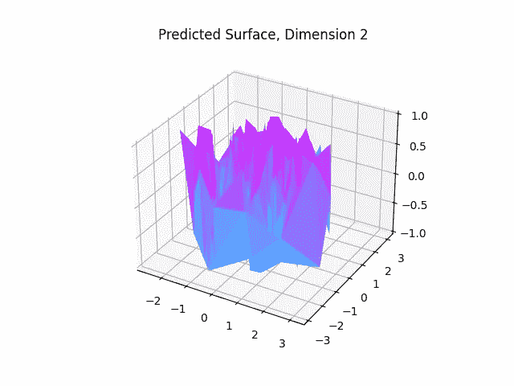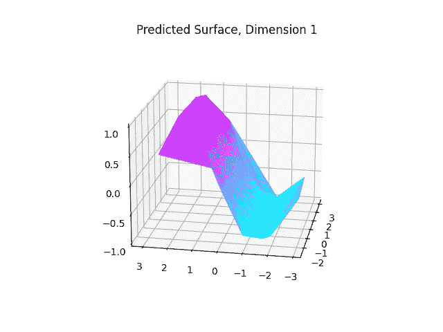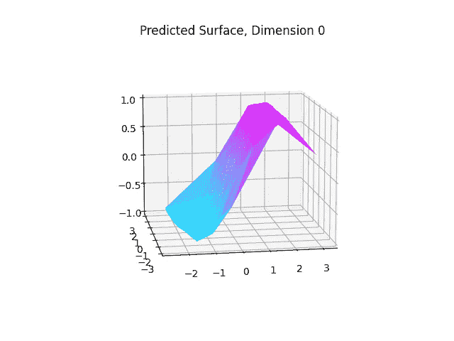

本演示中的 fit GPR 模型示例。高维高斯过程回归/克里金模型在许多不同领域都很有用，例如插值。图片来源:作者。

**GPyTorch [2]** ，一个为高斯流程设计的包，通过 **PyTorch 后端、批量训练和推理、**和**CUDA 硬件加速，充分利用了硬件加速方面的重大进步。**

在本文中，我们研究 GPyTorch 的一个具体应用:为**分批**、**多维**插值拟合高斯过程回归模型。

# 进口和要求

在我们开始之前，让我们确保所有的包都已安装并导入。

## 安装块

要使用 GPyTorch 进行推理，您需要安装`gpytorch`和`pytorch`:

```
# Alternatively, you can install pytorch with conda
pip install gyptorch pytorch numpy matplotlib scikit-learn 
```

## 导入块

一旦我们的软件包安装完毕，我们就可以导入所有需要的软件包:

```
# GPyTorch Imports
import gpytorch
from gpytorch.models import ExactGP, IndependentModelList
from gpytorch.means import ConstantMean, MultitaskMean
from gpytorch.kernels import ScaleKernel, MultitaskKernelfrom gpytorch.kernels import RBFKernel, RBFKernel, ProductKernel
from gpytorch.likelihoods import GaussianLikelihood, LikelihoodList, MultitaskGaussianLikelihood
from gpytorch.mlls import SumMarginalLogLikelihood, ExactMarginalLogLikelihood
from gpytorch.distributions import MultivariateNormal, MultitaskMultivariateNormal

# PyTorch
import torch

# Math, avoiding memory leak, and timing
import math
import gc
import math
```

# **创建一个批量 GPyTorch 模型**

为了创建一个批处理模型，更一般地说，是 GPyTorch 中的任何模型，我们**子类化**的`gpytorch.models.ExactGP`类。像标准 PyTorch 模型一样，我们只需要为这个类定义构造函数和`forward`方法。对于这个演示，我们考虑两个类，一个在我们的整个输入空间上有一个**内核**，另一个在我们的不同输入上有一个**分解的内核**【5】。

**全输入，批量模式:**

该模型使用包装有输出比例超参数的 RBF/平方指数核来计算输入的所有维度之间的核。此外，您可以选择使用自动相关性确定(ARD) [2]为每个特征维度创建一个长度比例参数。

**分解后的内核模型:**

该模型使用 RBF/平方指数核的乘积计算输入的所有维度之间的分解核，每个核考虑特征空间的单独维度。然后，用 outputscale 超参数包装这个分解后的产品内核。此外，您可以选择使用自动相关性确定(ARD) [2]为两个 RBF 核中的每个特征维度创建一个长度尺度参数。

# 预处理数据

为了准备拟合高斯过程回归的数据，考虑如何拟合我们的模型是有帮助的。为了利用 PyTorch [3]和 CUDA [4]的硬件加速和批处理，我们将我们预测的变量集的每个结果建模为独立的。

因此，如果我们有需要拟合插值的 **B** 批数据，每一批都有 **N** 个样本，X 维度为**C**Y 维度为 **D** ，那么我们将数据集映射到以下维度:

1.  **X 数据:(B，N，C) → (B * D，N，C)……**这是通过**平铺完成的。**
2.  **Y 数据:(B，N，D) →(B * D，N)……**这是通过**堆叠完成的。**

在某种意义上，我们平铺我们的 X 维数据，使得对于我们的向量值 **Y** 取的每个值，特征重复 **D** 次。这意味着我们的批量模型集中的每个模型将负责学习一批 X 的特征**和同一批 Y** 、**、**中的单个输出特征**之间的映射，从而导致我们的批量模型中总共有 **B * D** 个模型。这种预处理(平铺和堆叠)是通过以下代码块完成的:**

```
# Preprocess batch data
B, N, XD = Zs.shape
YD = Ys.shape[-1]
batch_shape = B * YD

if use_cuda:  # If GPU available
    output_device = torch.device('cuda:0')  # GPU

# Format the training features - tile and reshape
train_x = torch.tensor(Zs, device=output_device)
train_x = train_x.repeat((YD, 1, 1))

# Format the training labels - reshape
train_y = torch.vstack(
    [torch.tensor(Ys, device=output_device)[..., i] for i in range(YD)])# train_x.shape
# --> (B*D, N, C)
# train_y.shape
# --> (B*D, N)
```

我们执行这些转换是因为尽管 GPyTorch 拥有为**批量模型**和**多维模型**(在包文档中表示为**多任务**)设计的框架，不幸的是(据我所知)GPyTorch 还不支持**批量多维模型。**由于**批处理**和**硬件加速**，上述代码无法对 **Y** 的不同维度之间的相关性进行建模，从而大幅提高运行时间。

## **训练批量、多维 GPR 模型！**

现在，随着模型的创建和数据的预处理，我们已经准备好训练了！下面的脚本使用 **PyTorch 的**自动微分框架执行优化超参数的训练。在这种情况下，优化了以下批量超参数:

1.  **长度刻度**
2.  **输出规模**
3.  **协方差噪声(原始和受限)**

请查看[本页](https://www.cs.toronto.edu/~duvenaud/cookbook/) [5],了解关于每个超参数的作用的更多信息。

该培训功能如下所示:

# **运行推断**

现在，我们已经在训练数据上训练了一组**批量多维**高斯过程回归模型，我们现在准备运行推断，在这种情况下，用于插值。

为了证明这种拟合的有效性，我们将训练一个批量多维模型，并将其预测与根据随机生成的数据评估的**解析正弦函数**进行比较，即

**X = {xi}，xi ~ N(0_d，I_d)，i.i.d.**

**Y = sin(X)，逐元素，即 yi = sin(xi)对于所有 i**

(其中 **0_d** 和 **I_d** 指 d 维零向量(零均值)和 d 维单位矩阵(单位协方差)。上面的 **X** 和 **Y** 将作为我们的测试数据。

为了评估这些预测的质量，我们将计算结果预测的**均方根误差(RMSE)** 与 **Y** 的真实分析值进行比较。为此，我们将每批抽取一个测试点( **X** 中的 **C** 尺寸，以及 **Y** 中的 **D** 尺寸)，即我们在批量 GPR 模型中拟合的每个 GPR 模型将预测单一结果。将对所有批次的预测样本计算 RMSE。

# 结果

上述实验导致各批次的平均 RMSE 约为 **0.01。**自己试试！

下面是从上面的脚本生成的结果，显示了 **X** 和 **Y:** 中每个维度的预测值和真实值

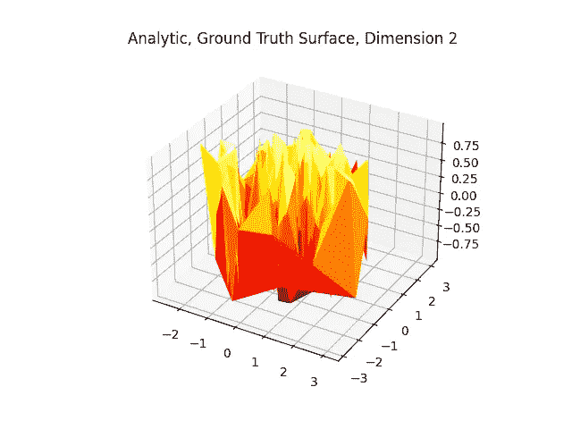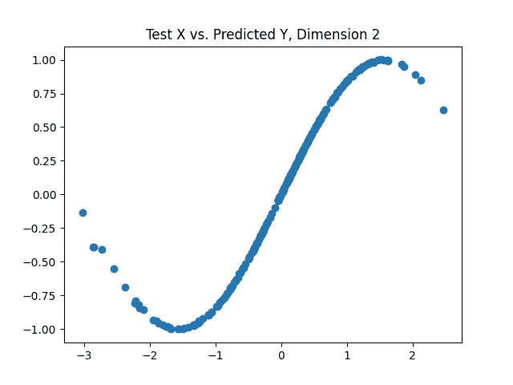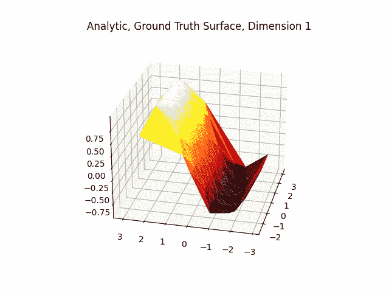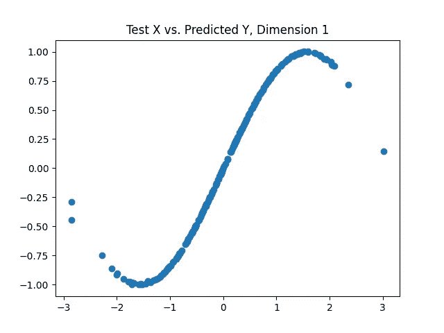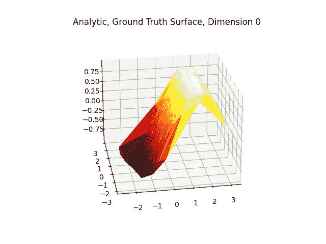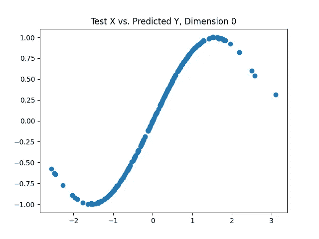

将我们的预测值与真实分析值进行比较的结果。第一列显示 **X** 的前两个维度与 **Y.** 的给定**预测**维度的关系第二列显示 **X** 的前两个维度与 **Y.** 的给定**真解析**维度的关系最后一列显示 **X** 的给定维度与 **Y.** 的相同预测维度的关系图片来源:作者。

下表列出了基础数据分布不同方差程度的 10 次迭代的平均 RMSE 值:

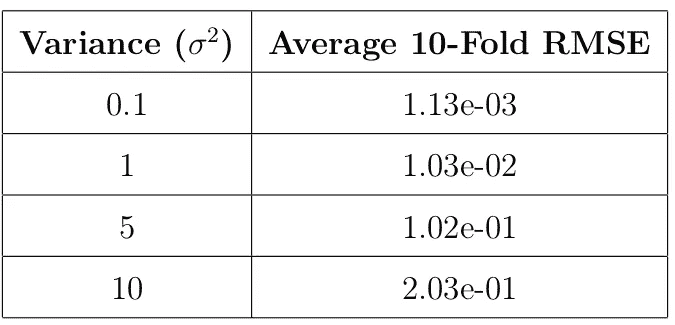

在我们的批量多维高斯过程回归模型的测试集上，基础正态分布与平均 RMSE 的方差。图片来源:作者。

# **总结**

在本文中，我们看到我们可以使用 **GPyTorch、**创建**批处理、多维度**高斯过程回归模型，这是一个最先进的库，在其后端利用 **PyTorch** 进行**加速推理**和**优化**。

我们使用解析正弦波实验评估了这种**批量多维**高斯过程回归模型，并发现在对多元(即独立数据)标准正常生成的数据进行回归时，我们能够实现约为 **0.01** 的 **RMSE** ，这表明这些模型的非参数功效非常适合各种函数近似和回归任务。

敬请关注完整的 GitHub 资源库！

这里有更多的可视化！请注意，下面的模型利用的批量大小为 1，但与上面的模型来自同一个类，并为每个输出维学习一维高斯过程回归量。

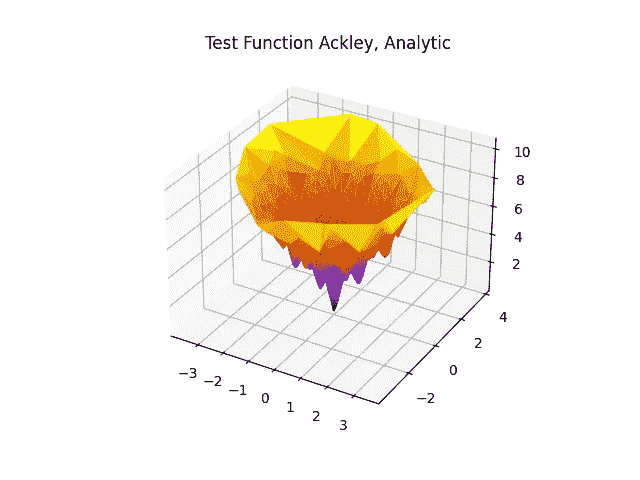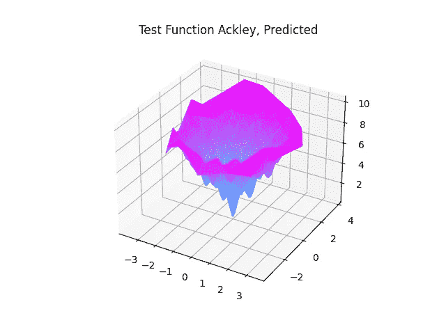

将 GPR 拟合到 Ackley 测试函数。图片来源:作者。

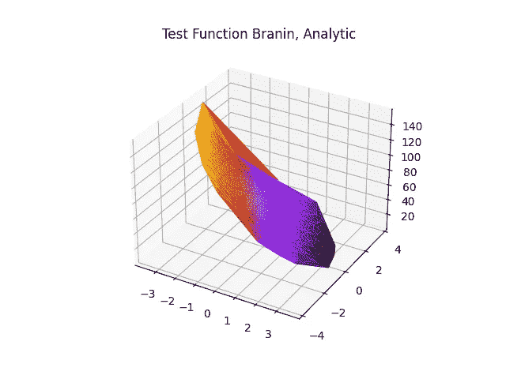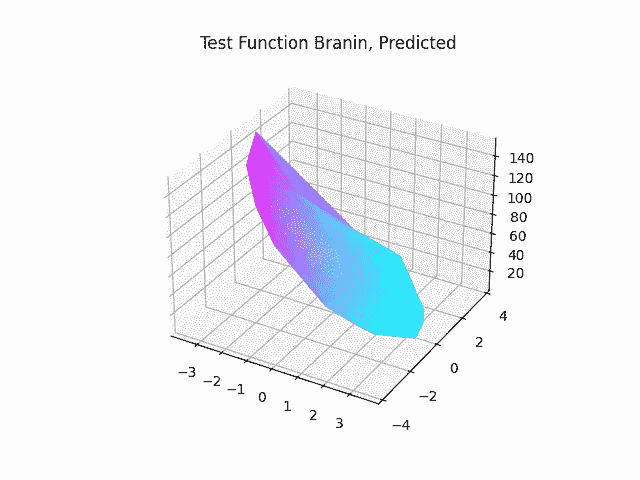

将 GPR 拟合到 Branin 测试函数。图片来源:作者。

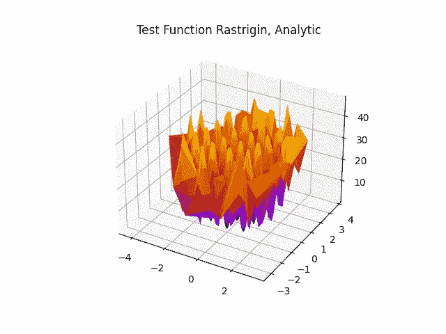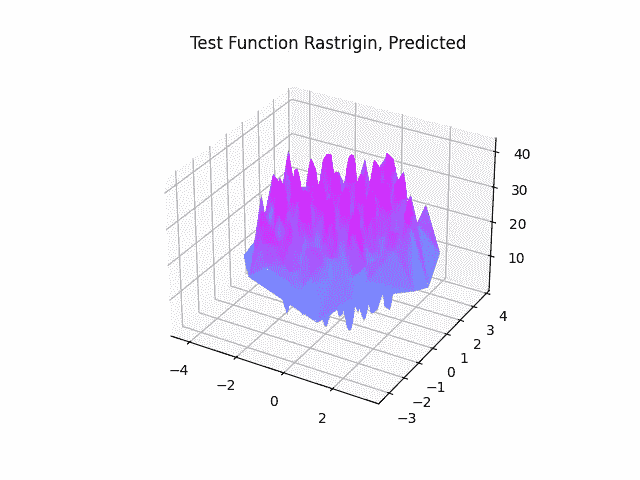

将 GPR 拟合到 Rastrigin 测试函数。图片来源:作者。

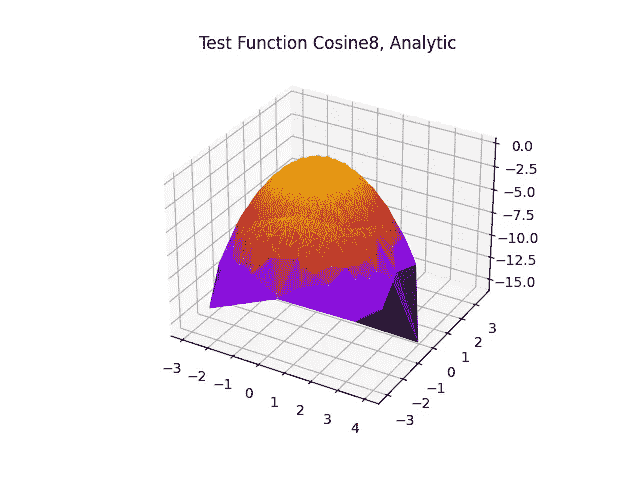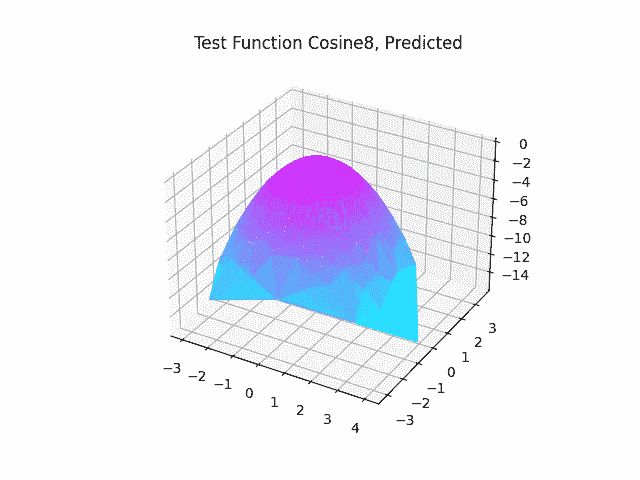

用余弦 8 测试函数拟合探地雷达。图片来源:作者。

# 参考

[1]奥利弗，玛格丽特和理查德·韦伯斯特。"克里金法:地理信息系统的一种插值方法."《国际地理信息系统杂志》4.3(1990):313–332。

[2] Gardner，Jacob R .等，“Gpytorch:带 gpu 加速的黑盒矩阵-矩阵高斯过程推断。” *arXiv 预印本 arXiv:1809.11165* (2018)。

[3]亚当·帕兹克、萨姆·格罗斯、弗朗西斯科·马萨、亚当·莱勒尔、詹姆斯·布拉德伯里、格雷戈里·查南、特雷弗·基林、林泽铭、娜塔莉亚·吉梅尔斯海因、卢卡·安提加、阿尔班·德斯迈松、安德烈亚斯·科普夫、、扎卡里·德维托、马丁·赖森、阿利汗·特贾尼、萨桑克·奇拉姆库尔蒂、伯努瓦·施泰纳、、、、接君·巴伊和苏史密斯·钦塔拉。Pytorch:命令式风格，高性能深度学习库。在 H. Wallach、H. Larochelle、A. Beygelzimer、f .达尔凯-Buc、E. Fox 和 R. Garnett 编辑的《神经信息处理系统的进展》第 32 卷第 8024-8035 页中。柯伦联合公司，2019。

[4] NVIDIA，Vingelmann，p .和 Fitzek，F. H. P. (2020 年)。 *CUDA，发布时间:10.2.89* 。从 https://developer.nvidia.com/cuda-toolkit[取回](https://developer.nvidia.com/cuda-toolkit)。

[5]仁食谱，【https://www.cs.toronto.edu/~duvenaud/cookbook/】[。](https://www.cs.toronto.edu/~duvenaud/cookbook/)