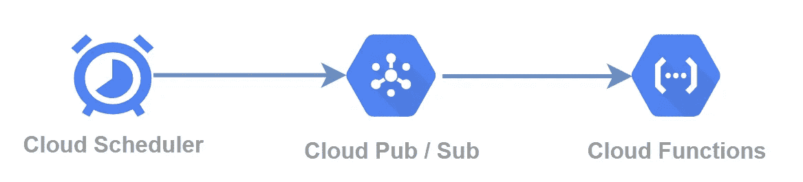
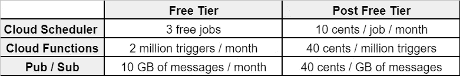
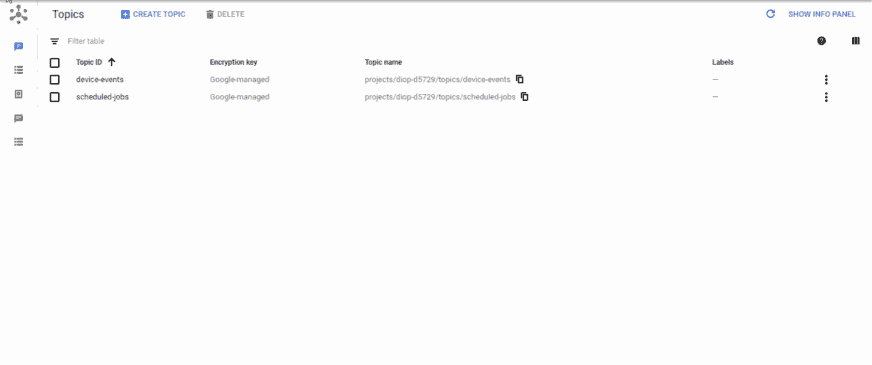
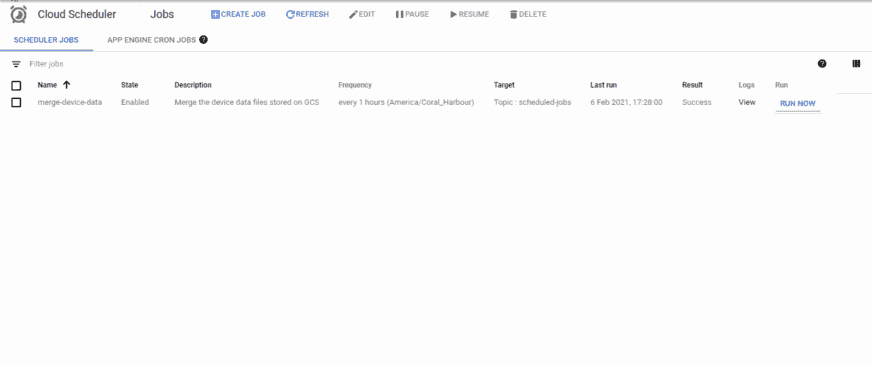
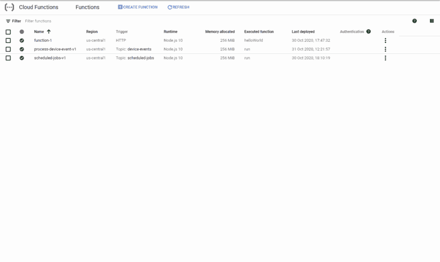
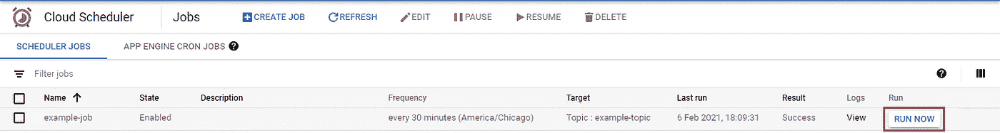
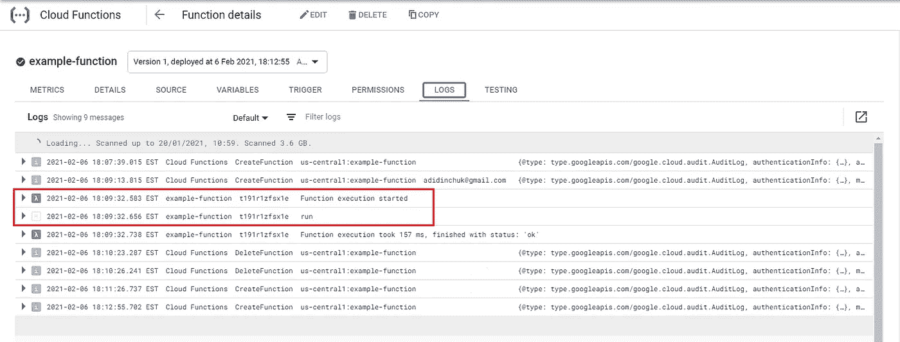

# 使用云调度程序和函数在 GCP 批处理作业

> 原文：<https://towardsdatascience.com/batching-jobs-in-gcp-using-the-cloud-scheduler-and-functions-2d542410c11d?source=collection_archive---------22----------------------->

## 演示如何使用云调度程序、发布/订阅和云功能在 GCP 平台中设置无服务器批处理作业。

卢卡斯·布拉塞克在 [Unsplash](https://unsplash.com/s/photos/alarm?utm_source=unsplash&utm_medium=referral&utm_content=creditCopyText) 上的照片

在设计和实现解决方案时，我经常面临围绕数据存储和处理设置循环批处理作业的需求。最近，我一直在努力让我的基础设施尽可能保持[无服务器](https://en.wikipedia.org/wiki/Serverless_computing)，所以在这篇文章中，我将向你展示如何利用谷歌云平台来免费运行你的项目可能需要的几乎任何批处理作业**。**

# **用例**

**对我来说，当涉及到数据处理、协调和清理时，这个批处理模式是最有用的。这是一个涉及数据聚合的示例…**

> ***存储桶可以是一个有效的流数据存储库，但是如果您的有效负载很小并且很频繁，那么如果您必须频繁读取，为每个有效负载创建一个文件会非常昂贵。我通过运行一个批处理作业来解决这个问题，将单独的有效负载合并到每小时或每天的文件中，这是一个更具成本效益的解决方案。***

**或者数据库清理怎么样…**

> ***如果您有一个包含大型时间序列数据集的 SQL 数据库，定期清除对性能至关重要。您可以将一个重复的作业压缩到一个 web 应用程序或 ETL 系统中，该系统将数据加载到您的表中，但是我使用这种无服务器批处理方法来解耦解决方案并简化维护。***

# **体系结构**

**我们将使用 3 个 GCP 服务来实现我们的无服务器批处理解决方案。[云调度器](https://cloud.google.com/scheduler)将触发我们的批处理事件，[发布/订阅](https://cloud.google.com/pubsub)将用于将事件传输到[云函数](https://cloud.google.com/functions)，云函数将执行所需的批处理操作。**

****

**作者图表**

# **定价**

**GCP 提供了一个非常慷慨的免费层，我在下面为我们需要调度和运行批处理作业的三个服务做了一个简化的成本表。每 5 分钟运行一次的批处理作业将使用 1 个云调度程序作业、大约 9，000 次云功能执行和大约 9MB 的发布/订阅吞吐量。**

****

**作者图表**

**如果你的项目需要 3 个以上的工作，你将被收取每月 10 美分的额外工作。**

# **配置**

## **发布/订阅**

**首先，让我们配置一个发布/订阅主题，因为在我们设置调度程序和无服务器功能时都需要它。主题可以在 GCP 控制台的[这里](https://console.cloud.google.com/cloudpubsub/topic/list)进行配置。**

****

**作者图表**

*   **正如你所看到的，我们需要配置的只是主题名称——我使用的是`example-topic`**

## **云调度程序**

**接下来，我们将云调度器配置为我们的批处理触发器。点击[这里](https://console.cloud.google.com/cloudscheduler)并创建您的调度作业。**

****

**作者图表**

*   **在我的示例中，我将调度程序配置为每 30 分钟运行一次，但是您可以根据需要设置任何时间段**
*   **指定我们在上一步中创建的主题—我使用的是`example-topic`**
*   **我们的云函数不需要任何东西，除了来自调度器的触发器，所以有效载荷值并不重要，你可以输入任何值——我用的是`run`**

## **云函数**

**我们差不多完成了，最后一步是创建一个云函数，当调度程序触发一个事件时，这个云函数就会被触发。这里可以找到云功能配置[。](https://console.cloud.google.com/functions/list)**

****

**作者图表**

*   **选择云发布/订阅作为触发类型**
*   **选择在第一步中创建的主题**
*   **继续进行代码配置—我将使用现成的 Node.js 函数。该函数只是记录发布/订阅有效负载的内容。**

**该功能可能需要一分钟才能完全部署。**

> ***请记住，在这一步中，您可以使用任何可用的编程语言。***

## **测试**

**为了测试我们的配置，我们需要查看[云调度器](https://console.cloud.google.com/cloudpubsub/topic/list)列表，并使用`RUN NOW`选项手动触发我们的调度器。**

****

**作者图表**

**为了确保我们的功能成功触发，我们可以前往我们的[云功能](https://console.cloud.google.com/functions/list)列表，选择您之前配置的功能并查看`Logs`选项卡。**

****

**作者图表**

**您应该看到日志输出，表明您的函数已经运行，并且还应该显示您为云调度程序配置的有效负载消息。**

****成功了！****

# **结论**

**现在，在 5 分钟内，我们配置了一个 100%免费的解决方案，您可以使用它来运行各种类型的批处理作业。如果您发现自己需要快速设置一个高度解耦的解决方案来启动或运行批处理作业，那么现在您可以使用 GCP 快速简便地完成它。**

****祝好运，编码快乐！****

***原载于 2021 年 2 月 7 日*[*【http://www.theappliedarchitect.com】*](https://www.theappliedarchitect.com/batching-jobs-in-gcp-using-the-cloud-scheduler-and-functions/)*。***