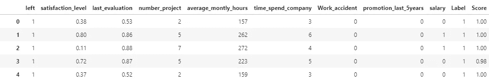

# 面向人员分析应用的自动 ML 巨头之战

> 原文：<https://towardsdatascience.com/battle-of-the-auto-ml-titans-for-people-analytics-application-1dc6eed9b5eb?source=collection_archive---------35----------------------->

## 评估用于员工流失预测的 Tpot & Pycaret 自动机器学习库

[GR Stocks](https://unsplash.com/@grstocks) 在 [Unsplash](https://unsplash.com/) 上拍照

展望未来并预测将要发生的事情有多强大？在数据科学中，机器学习实现了这一点！巧妙的，通过从过去发生的事情中学习来预测未来可能发生的事情。我们可以想象，这种技术的应用在人员分析中可能是革命性的，一个经典的用例是预测员工辞职。

自出现以来，ML 已经成熟了很多，并且今天处于这样一个阶段:初涉概念并且通常被预测分析的想法吓倒的数据科学家也可以投入到探索 ML 中，并缩短解决问题的时间。Auto ML 正是实现这一点的途径—为您的数据集评估和应用最佳 ML 管道来执行预测分析。因此，我强烈鼓励人员分析师(具有编程知识)采取这些令人放心的步骤进入预测分析的世界。在本文中，我们将在开源数据集上评估两个强大的 auto ML 库— Tpot 和 Pycaret，以根据一些已知的特征信息预测流失—某人是留下还是离开。

## 为什么是自动 ML？

对我来说，选择 auto ML 而不是传统 ML 是一个很容易的决定，因为前者可以缩短从数据准备到预测的求解时间。因为当你试图按照下图中概述的步骤顺序，一次对一个 ML 模型进行优化，使其对你的数据集具有最佳预测能力时，会浪费很多时间。而在 auto ML 中，一般来说，所有这些步骤，包括超参数调整、对单个模型进行分组以产生整体最佳组合预测模型，都被配置为在其母公司的保护下发生，用户的**干预最少甚至没有**。

作者图片

## 了解基础知识

下一部分将说明正在评估的两个 auto ML 库如何在开源 [HR 流失 Kaggle 数据集](https://www.kaggle.com/mahapatran/hr-attrition)上预测流失。在此之前，我们需要熟悉下图中捕获的一些关键指标— **混淆矩阵、精确度、召回率、F1** ，以选择获胜的 ML 模型。请注意，这并不是评估任何机器学习模型的所有指标的详尽列表，而是与手头的任务最相关的，并且已经结合这个特定的 ML 任务进行了解释。

作者图片

在看了上面的关键因素之后，我还建议看一下 **AUC** (曲线下面积)分数，简单地说，它衡量真正积极预测与随机猜测的准确性。**准确性**度量是所有观测值的所有真实预测(包括正面的&负面的)的度量，与精确度和召回率相比，它在这种情况下并不是一个非常具有指示性的度量，因为一个模型可以基于它对留下的群体(真实的负面)的正确预测而高度准确，但是它对离开的群体(真实的正面)的预测可能完全错误，这是我们情况下的目标。

值得注意的是，本文中考虑的示例是监督(二元)**分类**机器学习模型——分类，因为响应变量是分类的，保存表示员工离开或留下的值。因此，这些指标实际上是以一种简化的方式根据案例研究进行解释的。

## 评估自动 ML 库

有许多介绍评估模型的在线资源；本文下面的参考资料部分包含了一些有用的链接，供进一步阅读。本文将着重于通过理解给定的数据集，将 Pycaret 和 Tpot auto ML 库应用于预测辞职员工的业务任务。

第一步是在命令提示符窗口中使用`pip install tpot`和`pip install pycaret`安装我们正在评估的 auto ML 库。安装完成后，下一步是打开 Jupyter 环境进行编码(本文使用 JupyterLab 作为编码平台)。

让我们从库和数据集的导入开始。

作者图片

打印数据集的形状(或者更具体地说，pandas 数据框)显示有 14，999 行和 9 列。head()函数输出数据集中的前 5 行，让我们对正在处理的信息有所了解。

作者图片

很明显，标有“左”的列表示流失，“1”表示离开的人，“0”表示继续留下的人。这是我们的**回应**栏目。剩余的列是**特征**，我们将把它们提供给 ML 模型，以解释与响应的关系，然后基于这些解释进行预测。

我们可以进一步推断，所有的特征列都是数值型的，仅仅是因为它们保存的值不是离散的(就像性别—男性，女性是离散值)。这也适用于“薪金”列，该列包含“低”、“中”和“高”的值，因此清楚地展示了这些值之间的内在关系，即高薪金>中薪金>低薪金。在我们评估 auto ML 模型之前，使用下面的代码进行一个简单的检查，确认是否有任何列包含丢失的值，但是幸运的是，对于这个数据集，没有丢失的值，代码只是返回 0。在您可能正在处理的真实业务案例数据集中，决定您希望如何处理任何缺失值(删除它们或估算平均值等)至关重要。通常，auto ML 库在建模中配置了某种程度的缺失值插补，以满足大多数情况。

作者图片

## **1。Pycaret**

让我们从设置 Pycaret 分类模块开始。这一步必须通过的元素是“数据”中的数据框和“目标”参数中的响应列。还有更多的参数可以使用，并进一步增强 setup()函数的用法；然而，对于这个示例，我们将退回到依赖配置默认值。在缺省值中需要指出的是，训练测试分割是 70–30 %,除非在调用 setup()函数时进行了调整。

作者图片

从下面执行 setup()函数的输出中可以看出，Pycaret 将大多数特性列解释为 categorical。

作者图片

我们可以使用“numeric_features”参数传递我们想要将数据类型更改为数字的列，因此更新后的代码如下所示。

作者图片

执行这个更新的设置代码现在显示了作为列表传递给“numeric_features”参数的特性列，所有这些特性列都反映为数字数据类型。

作者图片

我们仍然需要处理“salary”列，将其从当前的分类数据类型转换为“Numeric”因为列中的值是字符串类型，所以一种转换方法是为这些字符串值分配数字，以保持高>中>低:2>1>0 的关系。这种改变可以在评估 ML 模型之前作为数据准备的一部分来完成，因为它也是评估 Tpot 的通用改变。

作者图片

现在我们可以看到,“salary”列中的值已经被转换为代表以前的低、中和高字符串值的数字。随后，执行 Pycaret 分类 setup()并在列表中为“numeric_features”参数传递“salary ”,可以将所有功能列反映为数字数据类型。

作者图片

作者图片

然后，根据 setup()函数的提示，我们可以按“enter”键来初始化模型，并开始可视化 auto ML 可以带来的神奇效果这一激动人心的部分。通过调用下面的 compare_models()函数，我们将在代码环境中看到 Pycaret 对训练分割运行 10 重交叉验证，以对特征与响应的关系做出最佳解释，从而实现对测试分割或未来未知数据的最佳预测。默认结果排序是通过**准确度**度量，因此被称为通过 **F1** 度量排序的参数，以查看此处用例的最佳精度-召回平衡模型。

作者图片

作者图片

具有最佳度量分数的 ML 模型方便地用黄色突出显示，以便缩小和简化我们的选择过程。在执行 compare_models()函数之后，变量“best_model”保存这种情况下的随机森林分类器。对于给定的数据集，我们可以简单地使用随机森林分类器模型，因为这个 ML 模型显示了最有希望的整体度量分数。没有比这更简单的了！

需要注意的是，作为 compare_models()函数输出的指标是 10 次交叉验证的平均值。现在让我们看看测试分割的**混淆矩阵**，以揭示预测与实际相比有多准确。

作者图片

作者图片

我们可以看到，与真实阴性和真实阳性中反映的绝大多数准确预测相比，假阴性和假阳性中反映的失误相当小，因此解释了> 95%的平均指标。

绘图模型还有其他基本绘图套件，您可以通过更改“plot”参数来指定其他值，如“pr”来绘制精度-召回曲线，“auc”来绘制 ROC 曲线并确认 AUC，等等。

预测的最后一步非常简单，只需调用 predict_model()函数并传递所选的 ML 模型和数据集来进行预测。对于此图，初始数据集已被重新使用，但可以很容易地调整为一个新的数据集，其中包含模型的未知数据，以便进行新的预测。

作者图片

正如我们在下面看到的，predict_model()函数输出提供了额外的列—“Label”反映了 ML 模型对数据集中每个行项目的预测，而“Score”反映了“Label”中预测的概率百分比这就是我们所需要的，让我们的商业利益相关者对那些可能离开的人有所预见，以便采取适当的行动来留住他们。

作者图片

## 2. **TPOT**

与 Pycaret 相比，Tpot 在执行方面有所不同。首先，我们需要分割整个数据集，以清楚地定义“X”和“y”中的特征和响应，并进一步定义与 Pycaret 保持一致的 70–30%的训练测试分割。形状函数输出确认分割。

作者图片

作者图片

类似地，在准备训练 Tpot 分类器模型时，将“n_splits”参数设置为 10，以匹配与 Pycaret 一致的 10 重交叉验证。针对此用例调整的其他参数与您将在下面的参考资料链接中找到的参数相比，是“计分”从准确性更改为 f1，类似于在 Pycaret 中基于相同的精度-召回平衡指标选择排名最佳的模型，以及“n_jobs”从-1 更改为 6，这影响了 Tpot 构建 ML 管道所用的系统内核数量(数字越大，使用越少，因为-1 会用完所有内核)。

作者图片

Pycaret 与 Tpot 的一个重要区别是，后者需要将近 2 个小时来拟合最佳 ML 模型，而前者只需不到 2 分钟。2 小时后，这是 Tpot 在拟合了列车特征-响应后的输出。对于给定的数据集，性能最好的 ML 管道获得了大约 97.2%的平均 F1 分数，这与我们从 Pycaret 的 compare_models()函数输出中获得的结果没有太大的不同。我们还看到，顶级模型本身是 KNeighbours 和决策树分类器的组合，因此这也不同于 Pycaret 的最佳模型输出。

作者图片

太好了！既然我们已经走了这么远，让我们最终使用训练过的 Tpot 模型来访问测试集上的预测，并看看我们是否真的取得了优于 Pycaret 的结果。要执行预测，我们只需调用函数`plot_metrics(X_test, y_test, model)`，其中 plot_metrics()是一个自定义函数，它被定义为使用传统的 matplotlib 和 seaborn 库来获得下面的图(代码细节请参考参考资料中提供的 GitHub gist 链接)。

作者图片

## 结论

我们上面看到的结果表明，对于这个给定的数据集，通过最少的干预和时间，我们可以缩小范围并可能“生产化”的最佳自动 ML 将是 Pycaret。很重要的一点是，用实际业务数据最终确定 ML 模型可能需要比依赖默认值更多的实验(如超参数调整、堆叠、混合模型、特征缩放等)。)即使使用 auto ML，也要在初始缩小部分做大量繁重的工作。愉快地探索您的业务数据！

*   *延伸阅读资源* —

1.  [Pycaret 分类教程](https://github.com/pycaret/pycaret/blob/master/tutorials/Binary%20Classification%20Tutorial%20Level%20Beginner%20-%20%20CLF101.ipynb)
2.  [Tpot 分类教程](https://machinelearningmastery.com/tpot-for-automated-machine-learning-in-python/)
3.  [GitHub 要点链接到代码](https://gist.github.com/shilpaleo/ec207f02fdc13f6740f0991c412f6cf7)