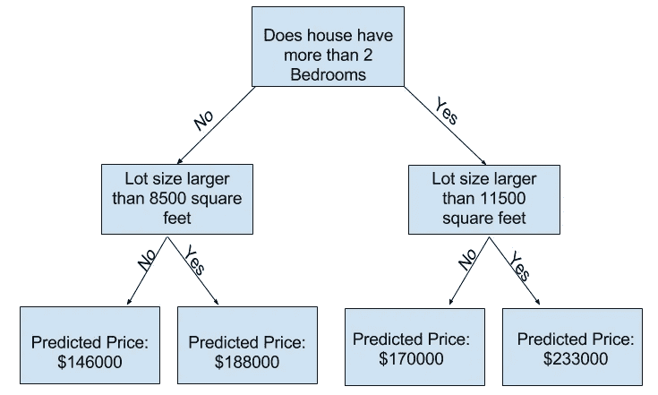
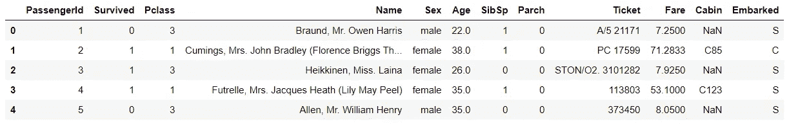
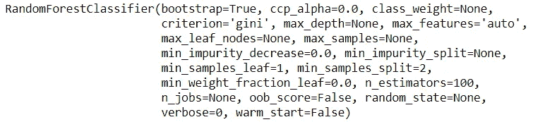
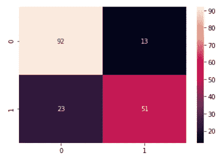
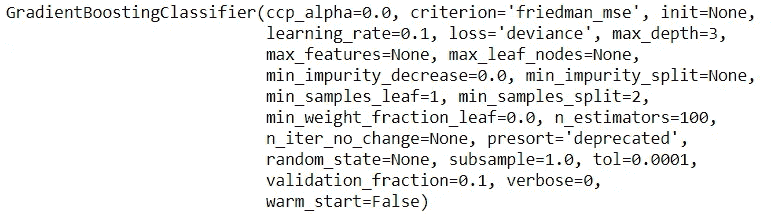
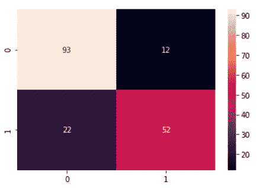

# 整体之战——随机森林 vs 梯度推进

> 原文：<https://towardsdatascience.com/battle-of-the-ensemble-random-forest-vs-gradient-boosting-6fbfed14cb7?source=collection_archive---------10----------------------->

## 机器学习领域最流行的两种算法，谁会赢？


Geran de Klerk 在 [Unsplash](https://unsplash.com?utm_source=medium&utm_medium=referral) 上拍摄的照片

如果你在机器学习领域呆过一段时间，你肯定听说过一个叫做偏差-方差权衡的概念。这是任何机器学习实践者都应该学习和意识到的最重要的概念之一。

本质上，偏差-方差权衡是机器学习中的一个难题，即具有低偏差的模型通常具有高方差，反之亦然。

偏差是模型预测的实际值和期望值之间的差异。结果，一个高偏差的模型被认为是过于简单，数据拟合不足。

另一方面，方差表示模型对训练数据中微小波动的敏感性。具有高方差的模型对噪声敏感，因此会过度拟合数据。换句话说，该模型非常适合训练数据，但不能概括看不见的(测试)数据。

考虑到这一点，在本文中，我想分享几种平衡偏倚和方差的技术之一:集成方法。

首先，什么是合奏法？

> 集成方法涉及聚合多个机器学习模型，目的是减少偏差和方差。理想情况下，集成方法的结果将优于任何单独的机器学习模型。

有 3 种主要的集合方法:

*   制袋材料
*   助推
*   堆垛

出于本文的目的，我们将只关注前两个:打包和提升。具体来说，我们将检查和对比两种机器学习模型:**随机森林**和**梯度增强**，它们分别利用了打包和增强技术。

此外，我们将在本文的后半部分应用这两个算法来解决泰坦尼克号生存预测竞赛，以了解它们在实践中是如何工作的。

<https://www.kaggle.com/c/titanic>  

# 决策图表

在我们开始之前，重要的是我们首先理解什么是决策树，因为它是随机森林和梯度推进的基础算法。

> 决策树是一种监督学习算法，它为任何基于树的模型(如随机森林和梯度推进)奠定了基础。决策树可用于分类和回归问题。

树的每个节点代表一个变量和该变量上的一个分割点(假设该变量是数值型的)。树的叶节点包含树用来进行预测的输出变量。

让我们以 Kaggle 房价预测[比赛](https://www.kaggle.com/c/house-prices-advanced-regression-techniques)为例。

假设我们正在构建一个决策树模型，该模型将考虑一所房子的各种特征，例如卧室数量、地段大小、邻居位置等，以便对其最终销售价格进行预测。

为简单起见，假设我们模型的最终结果看起来像这样:



图片来源[丹·贝克尔，卡格尔](https://www.kaggle.com/dansbecker/how-models-work)

给定一个随机房屋，我们的模型现在能够从决策树的最顶端(根节点)向下遍历到树的底部(叶节点),并给出该特定房屋的预测价格。

更具体地说，基于这个模型，一栋拥有两个以上卧室、面积大于 11，500 平方英尺的房子的预测价格为 233，000 美元，以此类推。

当然，决策树可以变得比上面显示的更加复杂和精密，具有更大的深度和更多的节点，这反过来将使树能够捕捉预测器和目标变量之间更详细的关系。

# 随机森林(装袋)

既然我们已经了解了什么是决策树以及它是如何工作的，让我们来检查一下我们的第一个集成方法，bagging。

> Bagging 也称为 bootstrap aggregating，是指使用不同的训练数据子集(引导数据集)创建和合并独立、并行决策树集合的过程。

密切注意的话，*独立*和*平行。*使用随机森林构建的决策树对模型中的其他树没有任何知识和影响。这是装袋的一个关键特征。

一旦构建了所有的树，模型将选择由单个决策树做出的所有预测的模式(多数投票),并将结果作为最终预测返回。

我希望现在已经很清楚，装袋通过在多棵树上分散错误的风险来减少对单棵树的依赖，这也间接减少了过度拟合的风险。

显然，随机森林并不是没有缺陷和不足。以下是一些应该和不应该使用随机森林的情况:

## 何时使用随机森林

*   它可用于分类( [RandomForestClassifier](http://scikit-learn.org/stable/modules/generated/sklearn.ensemble.RandomForestClassifier.html) )和回归( [RandomForestRegressor](http://scikit-learn.org/stable/modules/generated/sklearn.ensemble.RandomForestRegressor.html) )问题
*   您对预测值的重要性(特征重要性)感兴趣
*   您需要一个快速的基准模型，因为随机森林可以快速训练，并且需要最少的预处理，例如特征缩放
*   如果您有杂乱的数据，例如缺失数据、异常值等

## 何时不使用随机森林

*   如果你正在解决一个复杂、新奇的问题
*   透明度很重要
*   预测时间很重要，因为模型需要时间来聚合来自多个决策树的结果，然后才能得出最终预测

总结一下随机森林，这里有一些要考虑的关键超参数:

*   **n_estimators:** 控制将建立多少个单独的决策树
*   **max_depth:** 控制每个单独的决策树可以有多深

# 梯度推进(推进)

> 另一方面，Boosting 采用迭代方法，通过关注先前迭代中的错误，将多个弱的顺序模型组合起来，创建一个强模型。

弱模型是仅比随机猜测稍好的模型，而强模型是与真实分类强相关的模型。

boosting 不同于 bagging 的一个重要区别是，boosting 下的决策树不是独立构建的，而是以连续的方式构建的，其中每棵树都有效地从之前的错误中学习错误。

还值得注意的是，还有其他的增强变体，例如 [AdaBoost](https://www.youtube.com/watch?v=LsK-xG1cLYA) (自适应增强) [XGBoost](https://xgboost.readthedocs.io/en/latest/) (极端梯度增强)和 [LightGBM](https://lightgbm.readthedocs.io/en/latest/) (轻度梯度增强)，但是对于本文的目的，我们将只关注梯度增强。

与上一节类似，以下是一些应该和不应该使用梯度增强的情况:

## 何时使用梯度增强

*   它可用于分类([GradientBoostingClassifier](http://scikit-learn.org/stable/modules/generated/sklearn.ensemble.GradientBoostingClassifier.html))和回归([GradientBoostingRegressor](http://scikit-learn.org/stable/modules/generated/sklearn.ensemble.GradientBoostingRegressor.html))问题
*   您对预测值的重要性(特征重要性)感兴趣
*   预测时间很重要，因为与随机森林不同，梯度推进下的决策树不能并行构建，因此构建连续树的过程需要一些时间

## 何时不使用梯度增强

*   透明度很重要
*   培训时间很重要，或者当您的计算能力有限时
*   您的数据非常嘈杂，因为梯度增强往往会强调甚至最小的误差，因此，它可能会过度适应数据中的噪声

此外，以下是梯度增强需要考虑的一些关键超参数:

*   **learning_rate:** 促进了算法找到最优解的速度和速度
*   **max_depth:** 控制将建立多少个单独的决策树(梯度推进下的树通常比随机森林下的树浅)
*   **n_estimators:** 控制要建立多少棵连续的树(梯度推进下的树的数量通常比随机森林多)

# 泰坦尼克号案例研究

正如所承诺的，现在让我们在一个实际的项目中应用随机森林和梯度推进，泰坦尼克号生存预测竞赛，以加强我们在本文中已经覆盖的内容。

如果你想继续，请点击这里查看我的 GitHub 上的完整笔记本。

让我们先来看看数据集的前 5 行。



现在，我们将执行一些特征工程和数据预处理，以便为建模准备好数据。具体来说，我们将执行以下操作:

*   在年龄栏中填入乘客的平均年龄
*   将 SibSp 和 Parch 特性组合成一个特性:family_size
*   创建一个新特征 cabin_missing，它作为 cabin 列中缺失数据的指示器
*   对性别列进行编码，将 0 分配给男性乘客，1 分配给女性乘客
*   训练测试分割(80%训练集和 20%测试集)

我将在本文中省略细节，但是如果您对这些步骤背后的基本原理和实际代码感兴趣，请参考我的[笔记本](https://github.com/chongjason914/bagging-vs-boosting)。


我们的数据现在可以用于建模了！

## 随机森林分类器

要查看该模型的默认超参数:

```
# Default hyperparameters for RandomForestClassifier 
print(RandomForestClassifier())
```



在我们将模型拟合到训练数据之前，我们可以使用 [GridSearchCV](http://scikit-learn.org/stable/modules/generated/sklearn.model_selection.GridSearchCV.html) 来找到超参数的最优集合。

```
# Set up GridSearchCV
rf = RandomForestClassifier(n_jobs = -1, random_state = 10)
params = {
    'n_estimators': [5, 50, 250],
    'max_depth': [2, 4, 8, 16, 32, None]
}
cv = GridSearchCV(rf, params, cv = 5, n_jobs = -1)# Fit GridSearchCV to training set 
cv.fit(X_train, Y_train)# Best parameters
cv.best_params_
```

*   **最大深度:** 4
*   **n _ 估计量:** 50

换句话说，这个训练集的最理想的随机森林模型包含 50 个最大深度为 4 的决策树。

最后，我们可以继续使用这组超参数来拟合我们的模型，并随后评估它在测试集上的性能。

```
# Instantiate RandomForestClassifier with best hyperparameters 
rf = RandomForestClassifier(n_estimators = 50, max_depth = 4, n_jobs = -1, random_state = 42)# Fit model
start = time.time()
rf_model = rf.fit(X_train, Y_train)
end = time.time()
fit_time = end - start# Predict 
start = time.time()
Y_pred = rf_model.predict(X_test)
end = time.time()
pred_time = end - start# Time and prediction results
precision, recall, fscore, support = score(Y_test, Y_pred, average = 'binary')
print(f"Fit time: {round(fit_time, 3)} / Predict time: {round(pred_time, 3)}")
print(f"Precision: {round(precision, 3)} / Recall: {round(recall, 3)} / Accuracy: {round((Y_pred==Y_test).sum() / len(Y_pred), 3)}")
```

*   **拟合时间:** 0.469
*   **预测时间:** 0.141
*   **精度:** 0.797
*   **召回:** 0.689
*   **精度:** 0.799

```
# Confusion matrix for RandomForestClassifier
matrix = confusion_matrix(Y_test, Y_pred)
sns.heatmap(matrix, annot = True, fmt = 'd')
```



作者图片:随机森林的混淆矩阵

## 梯度推进分级机

现在，让我们来看看梯度增强如何对抗随机森林。

类似地，要查看该模型的默认超参数:

```
# Default hyperparameters for GradientBoostingClassifier
print(GradientBoostingClassifier())
```



使用 GridSearchCV 查找最佳超参数。

```
# Set up GridSearchCV
gb = GradientBoostingClassifier(random_state = 10)
params = {
    'n_estimators': [5, 50, 250, 500],
    'max_depth': [1, 3, 5, 7, 9],
    'learning_rate': [0.01, 0.1, 1, 10, 100]
}cv = GridSearchCV(gb, params, cv = 5, n_jobs = -1)# Fit GridSearchCV to training set
cv.fit(X_train, Y_train)# Best parameters
cv.best_params_
```

*   **学习率:** 0.01
*   **最大深度:** 3
*   **n _ 估计数:** 250

正如我们所看到的，使用梯度推进构建的树比使用随机森林构建的树更浅，但更重要的是两种模型之间估计量的差异。梯度增强比随机森林有更多的树。

这证实了我们之前讨论的随机森林和梯度增强的结构以及它们的工作方式。

接下来，让我们将我们的梯度推进模型拟合到训练数据。

```
# Instantiate GradientBoostingClassifier with best hyperparameters 
rf = GradientBoostingClassifier(n_estimators = 250, max_depth = 3, learning_rate = 0.01, random_state = 42)# Fit model
start = time.time()
rf_model = rf.fit(X_train, Y_train)
end = time.time()
fit_time = end - start# Predict 
start = time.time()
Y_pred = rf_model.predict(X_test)
end = time.time()
pred_time = end - start# Time and prediction results
precision, recall, fscore, support = score(Y_test, Y_pred, average = 'binary')
print(f"Fit time: {round(fit_time, 3)} / Predict time: {round(pred_time, 3)}")
print(f"Precision: {round(precision, 3)} / Recall: {round(recall, 3)} / Accuracy: {round((Y_pred==Y_test).sum() / len(Y_pred), 3)}")
```

*   **适合时间:** 1.112
*   预测时间: 0.006
*   **精度:** 0.812
*   **召回:** 0.703
*   **精度:** 0.81

```
# Confusion matrix for GradientBoostingClassifier
matrix = confusion_matrix(Y_test, Y_pred)
sns.heatmap(matrix, annot = True, fmt = 'd')
```



图片由作者提供:渐变增强的混淆矩阵

这里，我们观察到，与随机森林相比，梯度增强具有更长的拟合时间，但是预测时间要短得多。

同样，这与我们最初的预期一致，因为训练是在梯度增强下迭代完成的，这解释了更长的拟合时间。但是，一旦模型准备就绪，与随机森林相比，梯度增强进行预测所需的时间要短得多。

概括一下，**随机森林**:

*   创建独立、并行的决策树
*   使用一些深度决策树可以更好地工作
*   拟合时间短，但预测时间长

相比之下，**梯度增强**:

*   以连续的方式构建树，其中每一棵树都在前一棵树所犯错误的基础上进行改进
*   与多个浅层决策树一起使用效果更好
*   拟合时间长，但预测时间短

感谢您的阅读。请随意查看我下面的其他文章！

<https://medium.com/geekculture/70-data-science-interview-questions-you-need-to-know-before-your-next-technical-interview-ccfbd37a37b3>  <https://chongjason.medium.com/i-finally-got-a-data-science-job-39f58774785> 