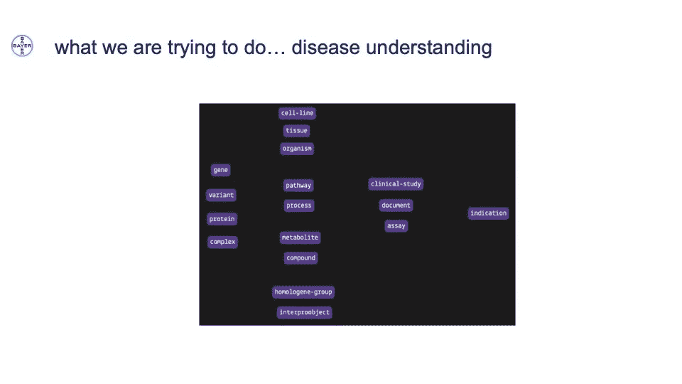
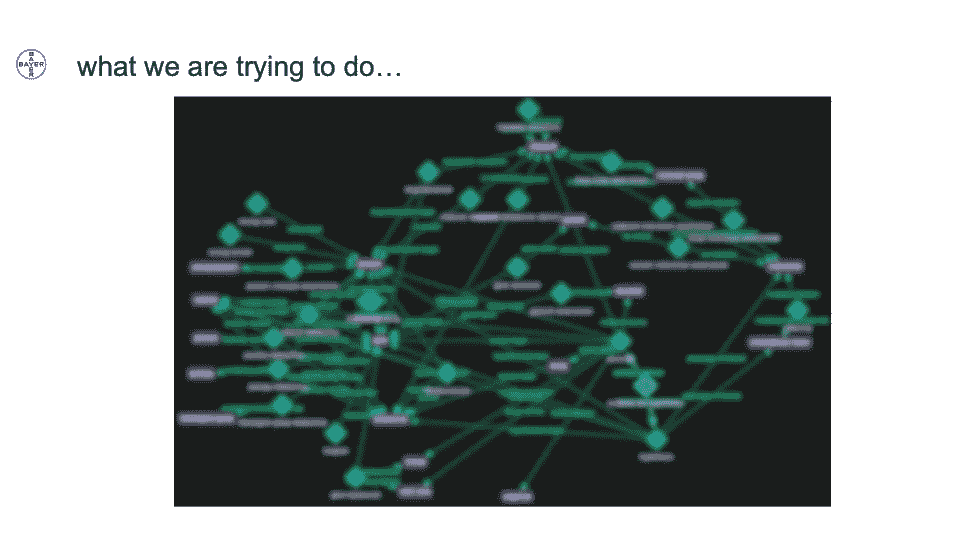
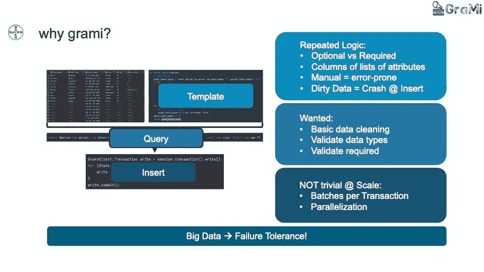
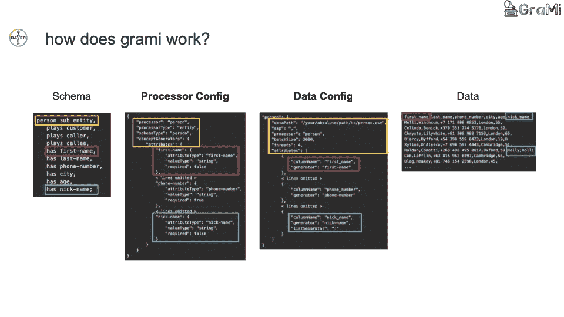
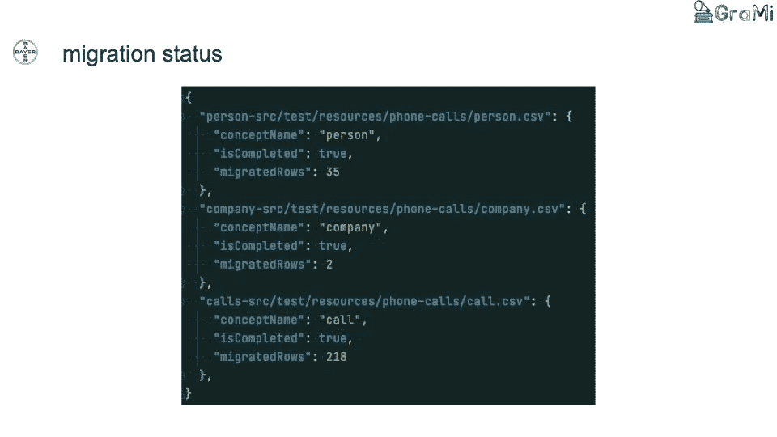
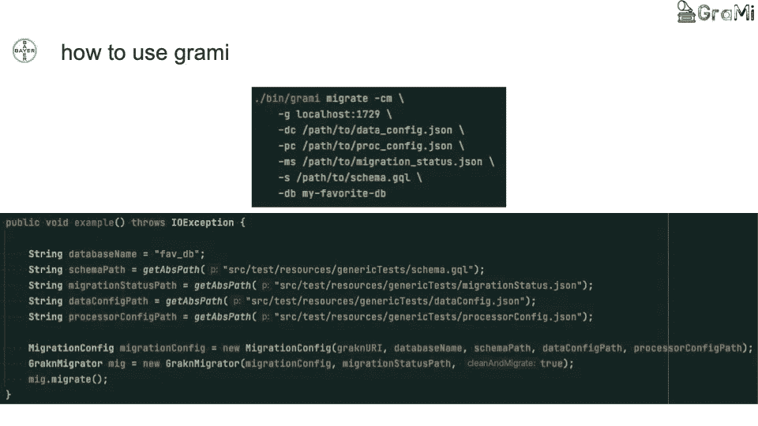

# 拜耳大规模建模和加载数据的方法

> 原文：<https://towardsdatascience.com/bayers-approach-to-modelling-and-loading-data-at-scale-abe83e2f460e?source=collection_archive---------40----------------------->

早在 4 月份，我们就为我们的社区举办了一次在线会议，名为 [Orbit 2021](https://youtube.com/c/vaticle) ，通过聆听来自拜耳医药公司的 Henning Kuich、Dan Plischke 和 Joren Retel，我们的社区得以一窥拜耳医药公司的一个团队如何使用 [TypeDB](https://github.com/vaticle/typedb) 来加速他们的药物研发渠道。

# 目标

拜耳的团队从根本上想要更好地了解疾病，以便他们能够创造更好的治疗干预措施。对疾病的更深入了解使得能够识别和开发具有很少或没有副作用的新治疗干预。

为了实现这一点，他们需要建立一个模型，准确地表示疾病的生物系统，并将其映射到他们可用的大型生物医学数据集。

# 挑战

## 描述疾病—数据模型

为了在 TypeDB 中模拟疾病，他们从可以调整的概念开始。将它们建模为 TypeDB 模式中的实体，如下所示:

```
define
gene sub entity;
variant sub entity;
protein sub entity;
complex sub entity;
indication sub entity;
```

这里，`gene`、`variant`、`protein`和`complex`被选为实体，因为它们可以以某种形式与疾病相关联。通过实体`indication`对感兴趣的疾病进行建模。在实践中，他们需要捕捉生物系统内部的内在相互关系，而生物是复杂的！当然，这意味着我们需要担心生物系统中大量的其他事情。



比如`genes`在`cells`中表示，`cells`是`tissues`的一部分，而`tissues`在一个`organisam`中。这些数据可以来自临床研究中的分析和实验。将所有这些放在一起，并建立正确的关系模型，可能会得出如下结果:



请注意，由于拜耳所做工作的性质，他们无法展示模型的全部细节

# 为什么是强类型数据库？

为什么 Bayer 团队选择使用 TypeDB 作为这类建模的数据库？

生物学中的一切都是极其相关和依赖于上下文的，这使得在传统的关系数据库中表示数据非常困难。正因为如此，Henning 和他的团队认为 TypeDB 的类型系统是一种更自然的生物学建模方式。

生物医学实验是高度特定于环境的，因此在构建生物医学知识图时，您希望能够快速询问使用了哪些参数，实际的化验是什么，是在体外还是在细胞中？这需要一个能够捕捉这种复杂程度的数据库，以及一种允许我们轻松地对这些数据提出复杂问题的查询语言。有了 TypeDB，Henning 的团队就能做到这一点。

Bayer 还利用了 TypeDB 中本机推理引擎的优势。推理可以为拥有类似复杂生物医学数据的团队做很多事情。例如，Henning 和他的团队使用 TypeDB 的推理引擎，根据它们在染色体上的位置来推断`variant`到`gene`的连接。

基因本质上只是基因组中的序列，实际上是沿着一长串其他位置的位置。变体是这些序列的变体，也沿着相同的数字和位置延伸。使用 type QL(TypeDB 的查询语言)，该团队能够根据重叠位置将变异映射到基因，而不是依赖于其他需要他们导入变异和基因之间关系的数据库。重要的是，这避免了维护其他数据库的需要，因为定期更新和迁移这些数据库需要很长时间。所有这些都可以通过使用 TypeDB 的推理引擎来避免。

TypeDB 还允许您在数据库生命周期中的任何时间点重新定义模式。例如，我们可以添加一个新的定义，根据基因的位置来定义与基因相关的变异。这很重要，尤其是当我们添加新的数据集时。所有这些都使 Henning 的团队能够更有效地运作，并加速他们的药物发现过程。

通过 [github](https://github.com/vaticle/biograkn-covid/blob/master/Schema/biograkn-covid.gql) 上的 BioGrakn-Covid repo，你可以看到一个在生物学领域完全充实的模式的例子。

# 加载数据和开源的 TypeDB 加载器

既然有了一个模式来表示我们正在使用的系统，那么大规模加载数据就成了下一个挑战。为了以拜耳想要的方式做到这一点，亨宁和他的团队构建并开源了 [TypeDB Loader](https://github.com/bayer-science-for-a-better-life/grami) (以前的 GraMi)，这是一个用于 TypeDB 的数据迁移工具。在这里，我们描述它是如何工作的，以及拜耳团队是如何使用它的。

Henning 的团队决定构建他们自己的定制加载器的原因是，他们想要一种更好、更具可伸缩性的方式来将大量数据加载到 TypeDB 中。为了加载数据，最初的 TypeDB 文档建议构建一个读入文件(例如以表格格式)的函数，并构建一个生成插入查询的模板函数。然后，我们可以使用其中一个客户端驱动程序将其插入到 TypeDB 数据库中。但是，在大规模这样做时，会引入 TypeDB Loader 试图解决的许多挑战:

*   处理所需模板函数的重复逻辑
*   注意潜在的脏数据，防止插入过程中的错误
*   每个事务的插入查询的并行化和批处理
*   大数据容错



## **TypeDB Loader 是如何工作的？**



使用已定义的 TypeDB 模式，我们的第一步是将数据映射到模式。这在两个配置文件中处理。第一个是[处理器配置](https://github.com/bayer-science-for-a-better-life/grami/blob/master/src/main/java/configuration/ProcessorConfigEntry.java)，它包含数据和模式之间的逻辑；例如，必须为每种类型生成哪些属性。这决定了某些属性是否是必需的，并确保获取的数据产生正确类型的正确属性。

第二个配置文件是[数据配置](https://github.com/bayer-science-for-a-better-life/grami/blob/master/src/main/java/configuration/DataConfigEntry.java)文件。在这里，我们可以指定正在读取哪个数据文件，它是什么类型的文件，在处理器配置中使用什么类型的处理器，然后将数据中的列映射到处理器配置中的实际处理器。这确保了所有内容都被正确插入。



拜耳团队还希望能够在数据迁移发生时对其进行监控。插入了什么，哪里可能发生了错误，以及由于什么原因在哪里停止了。这允许您从停止的确切位置重新开始迁移，消除了复制或丢失数据的风险。

## **现在如何使用 TypeDB Loader？**

TypeDB Loader 是一个 Java 应用程序和库，使您能够将其用作 CLI 工具或在自己的 Java 项目中使用。一旦决定了使用这两种方法中的哪一种，就可以指定正在与哪个 TypeDB 实例进行对话以及正在写入哪个数据库。然后提供您的数据配置、处理器配置、TypeDB 模式，然后确定您希望在哪里跟踪迁移状态。这可以像一个 JSON 文件一样简单。



就是这里，TypeDB Loader 从这里开始。Henning 和他的团队正在继续发布更新，并鼓励任何感兴趣的人关注#typedb-loader 频道中关于 [Discord](https://vaticle.com/discord) 的进展。

## TypeDB Loader 的最新版本(GraMi 0.1.1)增加了哪些特性？

*   将带有属性的嵌套关系作为角色扮演者导入
*   将属性追加到现有类型
*   向现有数据追加或插入数据
*   更新模式，包括更新规则
*   对数据插入进行大量测试，以防止数据丢失或错误
*   在迁移开始前捕捉错误的处理器和数据配置验证
*   为快速入门自动生成处理器配置框架

## **TypeDB 装载机路线图的下一步是什么？**

*   改进数据警告日志记录，这是一个更易于理解和解析的整合输出
*   规则管理，使应用和定义或未定义的规则变得更容易
*   直接从 SQL 表中读取，而不仅仅是文件
*   构建 Kafka 连接器，使其成为更大的数据处理基础设施的一部分