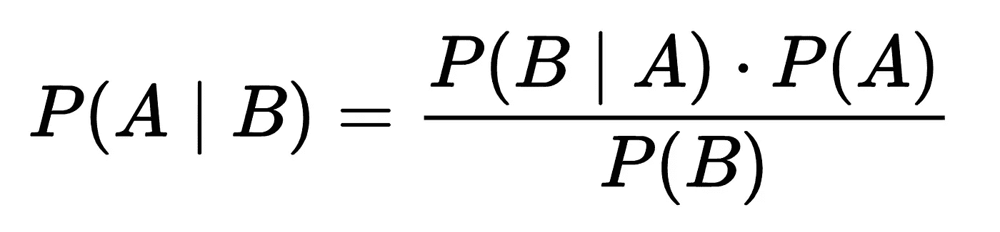
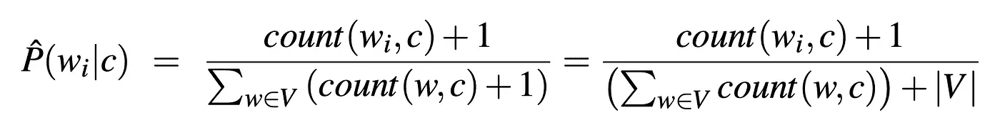

# 理解贝叶斯定理的 3 种方式将提高您的数据科学

> 原文：<https://towardsdatascience.com/bayes-theorem-abc1795af097?source=collection_archive---------25----------------------->

## [入门](https://towardsdatascience.com/tagged/getting-started)

## 掌握这个直观的统计概念将提高你作为决策者的可信度。

照片由[艾拉·奥尔森](https://www.pexels.com/@ella-olsson-572949?utm_content=attributionCopyText&utm_medium=referral&utm_source=pexels)从[派克斯](https://www.pexels.com/photo/vegetable-salad-3026808/?utm_content=attributionCopyText&utm_medium=referral&utm_source=pexels)拍摄

贝叶斯定理为我们提供了一种根据新证据更新信念的方法，它考虑了我们先前信念的强度。运用贝叶斯定理，你试图回答这个问题:**根据新的证据，我的假设的可能性有多大？**

在本文中，我们将讨论贝叶斯定理可以改进您的数据科学实践的三种方式:

1.  [更新](#df30)
2.  [通信](#fa06)
3.  [分类](#cb13)

最后，你会对基本概念有深刻的理解。

# #1 —更新

贝叶斯定理提供了一个检验假设的结构，考虑了先前假设的强度和新的证据。这个过程被称为贝叶斯更新。

贝叶斯定理，其中 A 代表假设，B 代表与假设相关的新证据。

换句话说，这个公式就是“给定 B 的可能性 ***等于*** ( *开括号*)给定 B 的可能性 ***乘以***A 的可能性(*闭括号* ) ***除以***B 的可能性”

让我们再看一遍公式，这次是变量的定义:

“根据新证据提出假设的可能性 ***等于*** 新证据为真的可能性假设假设假设也为真 ***乘以*** 观察到新证据之前假设的可能性，除以( ***除以*【T41)**新证据的可能性。”****

**这可以进一步缩短:**

**“后验概率 ***等于*** 可能性 ***乘以*** 先验概率 ***除以 b* y** 边际可能性。”**

**不管贝叶斯定理现在听起来是否直观，我保证你一直都在使用它。**

## **真实世界的例子**

**假设你的朋友打电话告诉你，她很抱歉，但她今晚不能来吃饭了。她最近收养了一只患了流鼻涕的宠物考拉。她真的需要呆在家里监控情况。**

**你的假设是你的朋友不会无缘无故地抛弃你。(毕竟，你做了一个卑鄙的 phở，你的朋友会疯狂地跳过它。)根据她新宠物的最新证据，你的假设为真的可能性有多大？**

****

**照片由[瓦莱丽娅·米勒](https://www.pexels.com/@valeriiamiller?utm_content=attributionCopyText&utm_medium=referral&utm_source=pexels)从[派克斯](https://www.pexels.com/photo/wood-people-hand-animal-5403361/?utm_content=attributionCopyText&utm_medium=referral&utm_source=pexels)拍摄**

**为了评估我们的朋友因为照顾考拉而不去吃饭的**后验概率**，我们需要考虑你的朋友需要和考拉呆在家里的**可能性**，假设你的朋友是一个正直的人，没有好的理由不会放弃晚餐计划。你可能会得出这样的结论:通常负责任的好朋友很有可能会呆在家里照看宠物。**

**接下来，我们将可能性乘以先前的****概率**。在你的朋友打电话之前，你对她的晚餐计划的信心有多强？如果你认为你的朋友坚如磐石，通常不愿意在最后一刻改变计划，那么你的先验概率很大，不管有没有新的证据，你都不太可能改变这一观点。另一方面，如果你的朋友很古怪，你已经在想她是否会打电话取消约会，你的先验概率很低，这也可能会质疑她关于和考拉呆在家里的说法。****

****最后，我们用考拉所有权的边际可能性除以上面的计算🐨****

****贝叶斯推理是建立在这种灵活的、常识性的方式上的，这种方式基于**我们先验的力量**和**新证据的可能性**来更新我们关于世界的模型。事实上，[贝叶斯定理最初的应用是评估上帝](https://qz.com/1315731/the-most-important-formula-in-data-science-was-first-used-to-prove-the-existence-of-god/)的存在。****

****当涉及到生活和数据科学的关键问题时，作为评估信念如何随时间变化的直观方法，贝叶斯定理是最棒的。****

# ****#2 —沟通****

****正如贝叶斯定理可以帮助你理解和阐明面对新的证据你如何更新你的理论，贝叶斯也可以让你成为一个更强的数据科学传播者。****

****数据科学从根本上讲就是应用数据来改进决策。****

> ****决定你生活结果的只有两件事:运气和你决定的质量。你只能控制这两样东西中的一个。—安妮·杜克，扑克冠军和作家****

****提高决策质量通常意味着说服决策者。正如每个人的情况一样，您组织中的决策者正在参与对话****

## ****真实世界的例子****

****我曾经是一家热气球制造商的顾问。我的任务是帮助建立一个数据库，提高客户对其供应链、制造流程和销售的端到端理解。****

****第一天，工厂经理带我们参观了车间，他自豪地描述了一份新的更轻、更便宜的原材料供应商合同。****

****但是有一个问题。当我的团队将企业内不同数据源的数据表连接起来时，我们发现了新供应商的材料和 2.5%的废品增长之间的联系。****

********

****由[达伦·李](https://unsplash.com/@darrenleejw?utm_source=medium&utm_medium=referral)在 [Unsplash](https://unsplash.com?utm_source=medium&utm_medium=referral) 上拍摄的照片****

****工厂经理有很强的预感，新的供应商对他的业务是一个净积极因素。我们有一些相反的证据。我们也有贝叶斯定理。我们明白这个事实:****

> ****先验越强，改变它需要的证据就越多。****

****在带着我们的发现去找工厂经理之前，我们需要收集额外的证据，证明不存在其他因素，(例如，磨损的机器、新员工、环境条件等)。)导致不同的废料水平。****

****最终，我们带着更多的证据找到了经理，并帮助他重新谈判供应商合同。****

# ****#3 —分类****

****贝叶斯定理可以应用于文本分析用例，这种技术被称为**朴素贝叶斯**，因为它天真地假设数据集中每个输入变量(在这种情况下，每个单词)的独立性。****

## ****真实世界的例子****

****假设你发现了一堆你祖父母写的信。他们有一段混乱的关系，有足够的戏剧来证明洛基的浪漫并不局限于真人秀中的年轻人。****

********

****来自 [Pexels](https://www.pexels.com/photo/elderly-couple-standing-beside-a-glass-window-5637562/?utm_content=attributionCopyText&utm_medium=referral&utm_source=pexels) 的 [RODNAE Productions](https://www.pexels.com/@rodnae-prod?utm_content=attributionCopyText&utm_medium=referral&utm_source=pexels) 摄影****

****您希望构建一个情感分类器来确定大多数内容是正面的还是负面的。一种方法是利用朴素贝叶斯。****

****像朴素贝叶斯这样的**生成分类器**将建立一个模型，说明一个类(在本例中，正或负)如何生成一些输入数据。给定一个观察(来自我们的 letters 测试语料库的一个新句子)，它返回最有可能生成该观察的类。这与学习输入特征的预测能力的判别分类器如逻辑回归形成对比。****

****朴素贝叶斯建立在单词袋技术的基础上——基本上是将文档转换成直方图，记录每个单词被使用的次数。****

****您可以使用我们在第 1 部分中学习的贝叶斯推理公式的稍加修改的版本来计算每个观察的最可能类。稍微修改的是朴素贝叶斯的*朴素*部分:假设每个单词的概率在给定的类中是独立的，因此你可以将它们相乘来产生句子与类一起的概率。****

********

****via [*语音和语言处理*](https://web.stanford.edu/~jurafsky/slp3/4.pdf) *作者*丹尼尔·茹拉夫斯基&詹姆斯·马丁****

****在上面的公式中， *wᵢ* 表示文档中一个单词的计数 *c.* 公式的分母是单词落入给定类别的条件概率之和。****

****公式中的+1 防止了在一个类中没有观察到单词的情况下乘以零的任何机会。这种加一的技术叫做**拉普拉斯平滑。******

****最后，|V|由所有类中所有单词的并集组成。****

## ****贝叶斯定理词汇****

*   ******后验概率**:根据新证据假设的可能性****
*   ******可能性**:假设假设假设为真，证据为真的可能性****
*   ****先验概率:在新的证据出现之前，你相信假设是正确的力量****
*   ****边际可能性:证据****
*   ****朴素贝叶斯(Naive Bayes):一种分类算法，假设数据集特征之间的朴素独立性****
*   ******生成分类器**:模拟一个特定的类如何生成输入数据****
*   ******单词袋**:将文档转换成直方图的文本的简化表示****
*   ******拉普拉斯平滑**:避免乘以零的简单加法平滑技术****

## ****摘要****

****我坚信贝叶斯定理对数据科学家是有用的，但我会根据你在评论中给我的反馈更新后验概率。期待听听大家如何在生活和工作中运用贝叶斯定理。****

## ****更多文章促进您的数据科学****

****</normal-distribution-160a93939248>  </neighborhood-explorer-a7f374e8527d>  </data-science-new-normal-ca34bcbad8f0>  </10-python-skills-419e5e4c4d66>  </supercharge-data-science-562d891ef7f9>  </data-science-tools-f16ecd91c95d> ****