# 贝叶斯定理，用可视化清晰地解释

> 原文：<https://towardsdatascience.com/bayes-theorem-clearly-explained-with-visualization-5083ea5e9b14?source=collection_archive---------1----------------------->

## 如果您的 COVID 检测呈阳性，那么您实际上患有 COVID 的几率有多大？

# 动机

想象一下你来医院检测有没有 COVID。您收到了坏消息:您的 COVID 检测呈阳性！然而，你认为结果有可能是错误的。

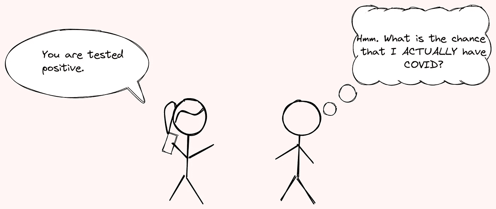

作者图片

通过在互联网上做一些研究，你知道三条信息:

*   假定一个人是健康的，那么这个人具有阳性测试结果的概率是 0.01
*   假设患者患有 COVID，则患者检测结果为阳性的概率为 0.98
*   患者患有 COVID 的概率为 0.01。

注意:这些数字不是真实的，是为了教学目的而编造的。

如果患者的 COVID 检测呈阳性，那么他患 COVID 的概率是多少？

这个测试似乎有很高的准确性。检测阳性后，你得 COVID 的概率应该很高吧？

在解决这个猜测之前，让我们用贝叶斯定理来回答这个问题。

# 贝叶斯定理是什么？

贝叶斯定理是一个简单的数学公式，用于计算条件概率。这个定理表明:

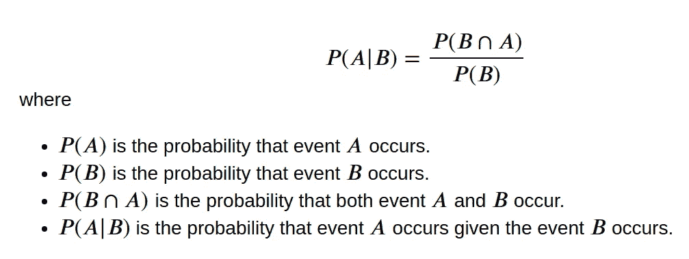

作者图片

一般来说，贝叶斯定理使用与事件相关的新信息来更新事件的概率。

让我们试着用一个例子来理解这个定理。想象有 **8** 人**用 COVID 检测出阴性**人和 **6** 人**用 COVID 检测出阳性**。在测试呈阳性的 6 人中，只有 **4 人确实患有 COVID。**

我们表示:

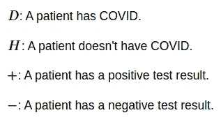

作者图片

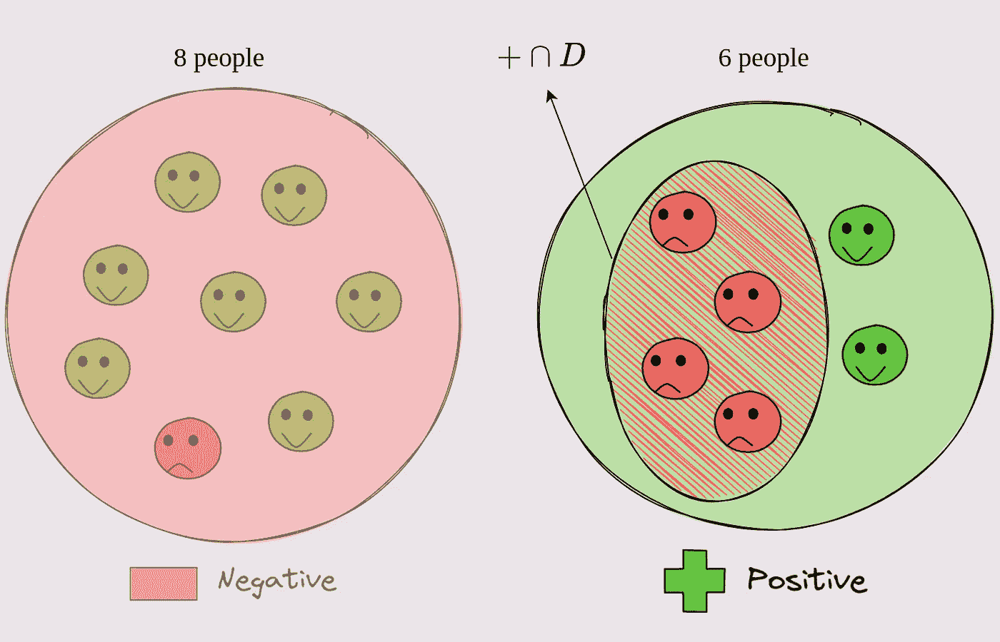

作者图片

要获得随机选择的 COVID 和检测阳性的人的概率，我们只需将 COVID **和检测阳性**的**人数除以**接受检测的总人数**。**

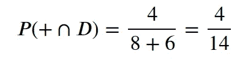

作者图片

为了得到一个随机选择的人患有 COVID 的概率，假设该人测试结果为阳性，我们将患有 COVID 且测试结果为阳性的人数除以**测试结果为阳性的**人数。

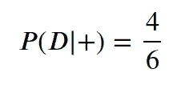

作者图片

请注意，P(+和 D)与 P(D|+)之间的唯一区别在于

*   P(+和 D)的样本空间由**所有测试**的人组成
*   P(D|+)的样本空间仅由测试为阳性的人组成。

请注意，这个等式:

作者图片

类似于等式:

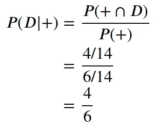

作者图片

因此，我们可以说

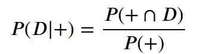

作者图片

酷！现在我们了解了贝叶斯定理，让我们用它来解决文章开头提到的问题。

# 问题

一个人有 COVID 的概率是:

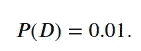

作者图片

这意味着，如果从一组人中随机选择一个人，这个人有 1%的几率患有 COVID。

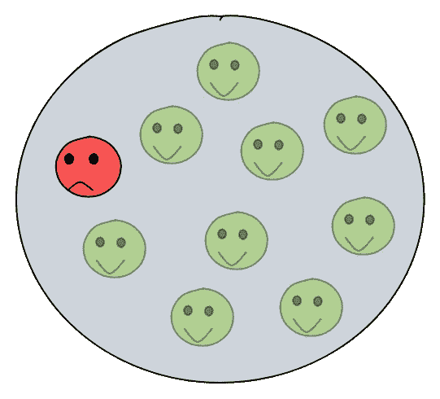

作者图片

假设一个人是健康的，那么这个人检测结果为阳性的概率是

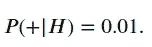

作者图片

这意味着，如果从一群健康人中随机选择一个人，这个人被检测为阳性的概率是 1%。

作者图片

假设一个人有 COVID，则他的检测结果为阳性的概率为

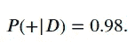

这意味着，如果从一群患有 COVID 的人中随机选择一个人，这个人被检测为阳性的概率是 98%。

作者图片

# 问题

如果一个随机选择的人 COVID 检测呈阳性，那么这个人有 COVID 的概率是多少？

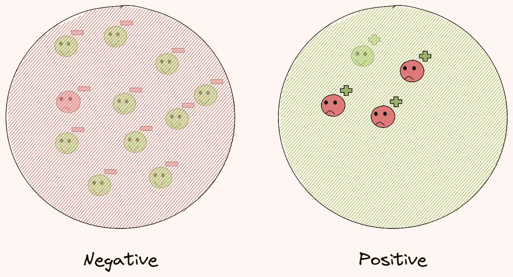

作者图片

基于贝叶斯定理，该概率可以通过以下等式来计算:

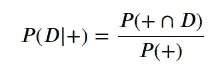

作者图片

因为

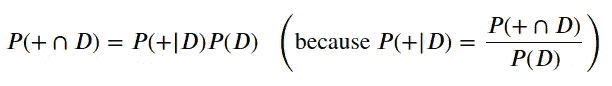

作者图片

我们有:

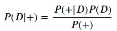

作者图片

因为我们已经知道 P(+|D)和 P(D)，我们只需要找到 P(+)。

# 查找 P(+)

P(+)是随机选择的人检测为阳性的概率。我们可以用下面的等式求出 P(+):

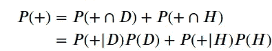

作者图片

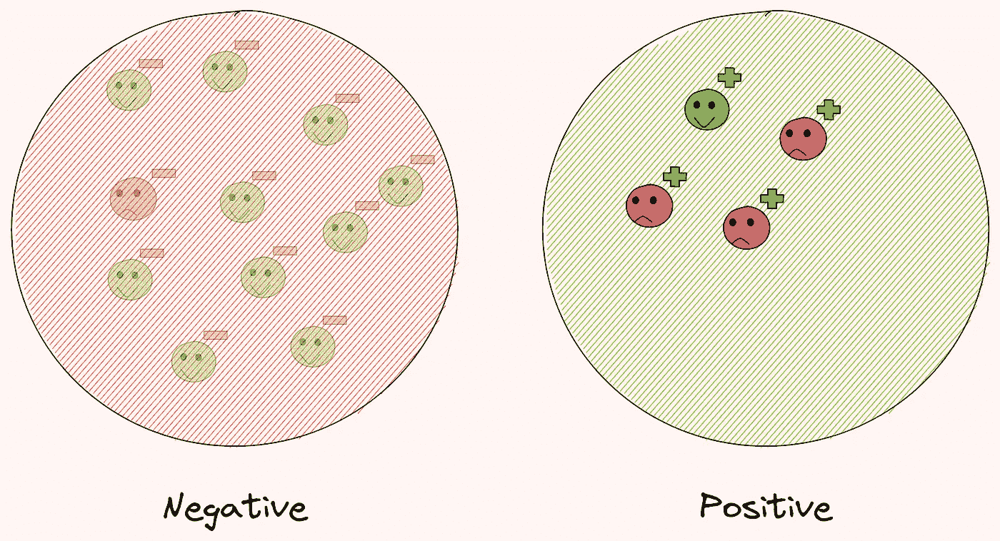

作者图片

我们已经知道 P(+|D)，P(D)和 P(+|H)，所以我们只需要找到 P(H)。

P(H)可以通过用 P(D)减去 1 得到:

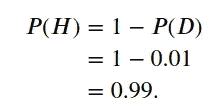

作者图片

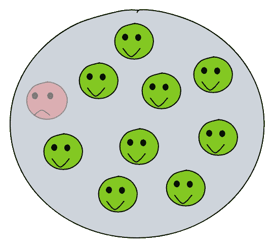

作者图片

因此，P(+)是

作者图片

# 求 P(D|+)

现在我们可以用之前找到的 P(+)的值来找到 P(D|+)。

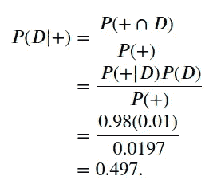

作者图片

如果一个人的 COVID 检测呈阳性，那么他患 COVID 的概率只有 49.7%！这意味着有超过 50%的几率**你**没有感染 COVID** ，即使你**的 COVID** 检测呈阳性。**

**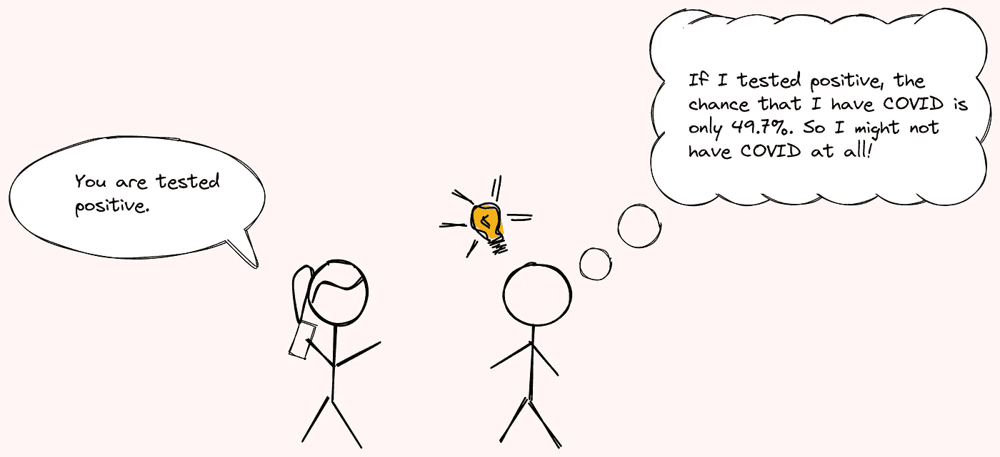**

**作者图片**

# **等等！这听起来不对劲**

**这里一定有问题！毕竟，我们得到的**初始统计数据**表明测试具有**非常高的精确度**。**

**请记住，假设一个人是健康的，这项测试在 99%的情况下都能正确预测这个人的状况。**

**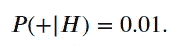**

**作者图片**

**假设一个人患有 COVID，该测试在 98%的情况下都能正确预测该人的状况。**

**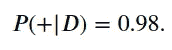**

**作者图片**

**为什么如果一个人测试呈阳性，那么这个人确实患有 COVID 的概率小于 50%？因为患 COVID 的人只占 1%。**

**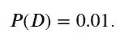**

**作者图片**

**因此，即使测试非常准确，如果您用 COVID 测试为阳性，您也很有可能没有 COVID，因为**出现 COVID 的情况非常罕见。****

**有了贝叶斯定理，我们可以根据新的信息更新我们的信念。很酷，不是吗？**

# **怎么做才能增加 P(D|+)？**

**提高 P(D|+)的一个方法是提高测试的准确性。然而，由于测试已经非常准确，很难让它更加准确。**

**另一个增加 P(D|+)的方法是测试两次。如果随机选择的一个人**在**的两次检测申请**中的每一次检测结果为阳性**，那么这个人实际患病的概率是 **99%** ！**

**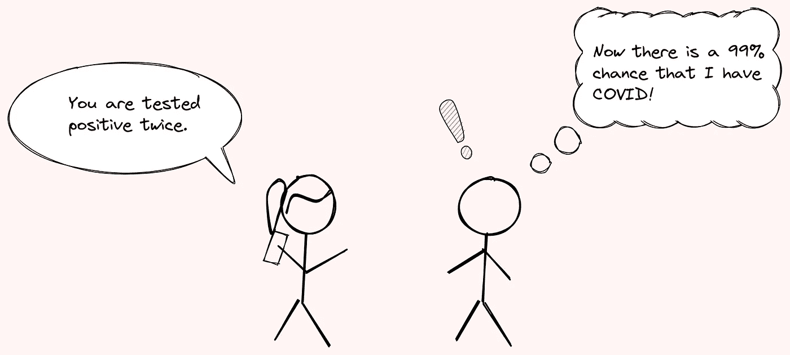**

**作者图片**

**你可以在这里找到这个概率是如何计算出来的[。](https://github.com/khuyentran1401/Data-science/blob/master/statistics/bayesian_theorem.ipynb)**

# **模拟贝叶斯定理**

**为了更好地理解贝叶斯定理，我们可以使用 [Seeing Theory](https://seeing-theory.brown.edu/index.html) ，这是由 [Daniel Kunin](http://daniel-kunin.com/) 创建的一个网站，用于可视化概率和统计。**

**下面的 GIF 展示了我用视觉理论模拟上面提到的问题。**

**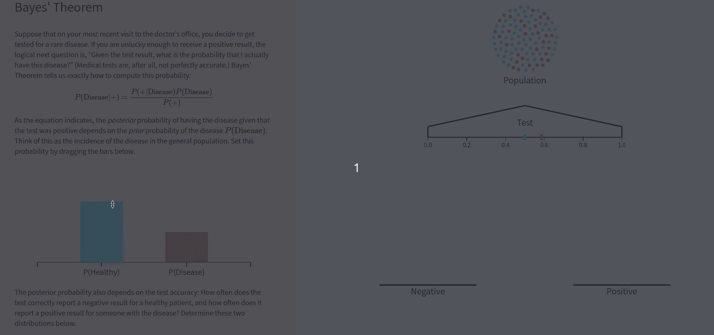**

**作者 GIF**

**你可以试试上面的模拟[这里](https://seeing-theory.brown.edu/bayesian-inference/index.html#section1)。**

**右栏的 9 个球是测试呈阳性的人。在这些人中，6 人患有 COVID，3 人健康。**

**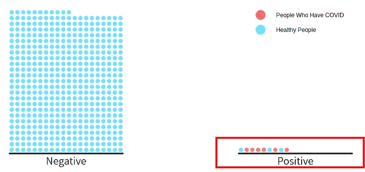**

**作者图片**

**我们可以看到这个模拟中的 P(D|+)是 6/9=0.67，和我们之前发现的 0.497 的结果不一样。这是因为我们只模拟了 500 人的实验。**

**如果我们用非常多的人，P(D|+)会非常接近 0.497。**

# **结论**

**恭喜你！您刚刚学习了什么是贝叶斯定理，以及如何使用它来解决现实世界中的问题。如果你仔细观察你周围的问题，你会发现贝叶斯定理可以用来解决许多现实世界的问题。**

**当你想根据一条新信息更新概率时，贝叶斯定理可能会派上用场。**

**我喜欢写一些基本的数据科学概念，并尝试不同的算法和数据科学工具。你可以在 LinkedIn 和 Twitter 上与我联系。**

**如果你想查看我写的所有文章的代码，请点击这里。在 Medium 上关注我，了解我的最新数据科学文章，例如:**

** [## 使用 Python 观察脸书数据中的朋友悖论

### 平均来说，你的朋友比你的朋友多吗？

towardsdatascience.com](/observe-the-friend-paradox-in-facebook-data-using-python-314c23fd49e4)  [## 如何使用 Python 创建类似 3Blue1Brown 的数学动画

### 利用您的 Python 技能创建美丽的数学动画

towardsdatascience.com](/how-to-create-mathematical-animations-like-3blue1brown-using-python-f571fb9da3d1)  [## SHAP:用 Python 解释任何机器学习模型

### SHAP 和沙普利价值观综合指南

towardsdatascience.com](/shap-explain-any-machine-learning-model-in-python-24207127cad7)  [## 人类学习:通过绘图创建人类学习模型

### 使用您的领域知识来标记您的数据

towardsdatascience.com](/human-learn-create-rules-by-drawing-on-the-dataset-bcbca229f00)**