# 解释贝叶斯定理

> 原文：<https://towardsdatascience.com/bayes-theorem-explained-1b501d52ae37?source=collection_archive---------5----------------------->

## 数据科学基础

## 贝叶斯统计简介

贝叶斯定理提供了一种在有新信息时计算事件更新概率的方法。简单来说就是条件概率的一种计算方式。在这篇文章中，我们将看看贝叶斯定理的概述，然后我们将把这个定理应用到一个简单的问题上。

[davisuko](https://unsplash.com/@davisuko?utm_source=medium&utm_medium=referral) 在 [Unsplash](https://unsplash.com?utm_source=medium&utm_medium=referral) 上拍摄的照片

# 1.贝叶斯定理概述

我们可以使用贝叶斯定理通过以下公式找到条件概率:

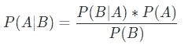

贝叶斯定理公式

这些组件有特殊的名称:

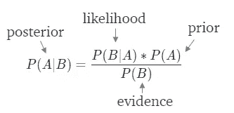

*‘一’*是利益的事件。作为起点，P(A)代表我们的*先验信念*:事件 A 发生的概率。利用*新证据* B，将*后验置信*或更新的概率表示为 P(A|B):给定证据 B 的事件 A 已经发生的概率。

我们可以从更常见的条件概率公式中自己推导出这个公式。*事件 A 的概率给定事件 B* 由下式得出:

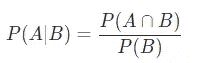

等式 1

使用相同的公式，让我们看看给定 A 的 B 的逆*概率:*

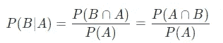

等式 2

如果我们重新排列这个等式，我们会看到:

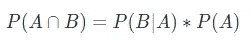

重新排列的等式 2

现在，如果我们用重新排列的等式 2 替换第一个等式的分子，我们就得到贝叶斯定理的公式。

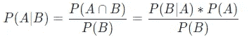

有些问题我们不会知道 P(B)。这意味着我们需要在求解 P(A|B)之前找到 P(B)。在这种情况下，公式可以扩展为:

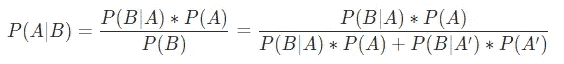

现在，让我们看一个应用定理的例子。

# 2.例子

让我们假设有一种疾病，在一个村庄的 33%的人口中发现。诊断测试具有 86%的敏感性和 79%的特异性。我们想知道如果一个病人检测结果呈阳性，他患病的概率。

## 2.1.直观地解决它

首先，让我们用直觉来解决这个问题。在这样做的同时，我们希望将概率转化为计数。首先，让我们假设这个村庄有 21 个居民。为什么是 21？因为一幅图像中的 21 只熊猫看起来很合适。任何数字都可以。一般来说，10 的倍数如 100 或 1000 是好的。

> ***📍我们知道的第一条信息是:*** “有一种疾病，在一个村庄 33%的人口中发现”

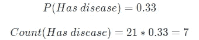

有 7 个居民得了这种病。所以剩下的 14 个居民没有患病。让我们想象一下居民们:

全村居民|作者图片

*在这里，这两种熊猫代表了某人是否得了这种病:*

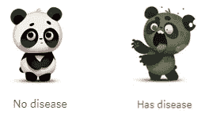

> ***📍我们知道的第二条信息是:*** “一个诊断测试有 86%的灵敏度”

这意味着 86%的患病者得到了阳性结果。

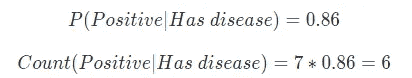

患病的 7 名居民中，有 6 人检测呈阳性。所以剩下的一个居民被错误地检测为阴性。

疾病患者|作者图片

*在这里，绿光代表阴性测试结果，而红光代表阳性测试结果。*

> ***📍我们知道的最后一条信息是:*** “一个诊断测试有 79%的特异性。

这意味着 79%没有患病的人得到了阴性结果。

在 14 名未患病的居民中，有 11 人检测结果呈阴性。所以剩下的三个居民被错误地检测为阳性。

无病者|作者图片

我们试图回答的问题是:

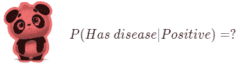

如果我们观察人群中被检测为阳性的子集，答案就显而易见了:

那些测试过的正面|作者图片

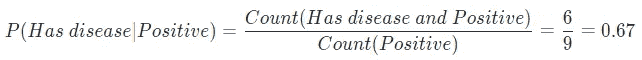

因此，如果测试结果呈阳性，一个人有 67%的概率患有这种疾病。换句话说，虽然一个人一般有 33% **(先验)**的患病几率，但一旦检测出阳性**(证据)**，患病的概率就会增加到 67% **(后验)**。说一个人即使被检测为阳性，仍有 33%的机会患病是愚蠢的。

## 2.1.用贝叶斯定理解决它

现在，让我们用贝叶斯定理公式来解决它:

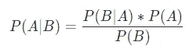

由于我们想知道在检测结果为阳性的情况下，患某种疾病的概率，我们可以将事件定义如下:
◼️ **事件 A:** 患病
◼️ **事件 B:** 检测结果为阳性

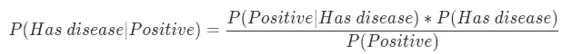

虽然我们知道分子中的值，P(正):得到阳性检验的概率并不容易提供给我们。所以我们可以使用扩展公式:

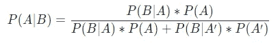

这意味着:

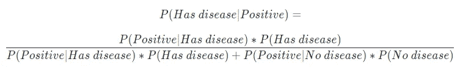

我们知道以下情况:

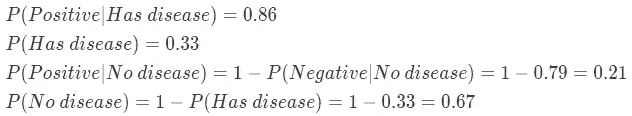

现在，我们可以将这些值代入公式:

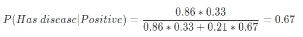

我们得到了同样的答案，但是以一种更简洁的方式。

卢卡斯·乔治·温迪特在 [Unsplash](https://unsplash.com?utm_source=medium&utm_medium=referral) 上拍摄的照片

您想要访问更多这样的内容吗？媒体会员可以无限制地访问媒体上的任何文章。如果你使用 [*我的推荐链接*](https://zluvsand.medium.com/membership) ，*成为会员，你的一部分会费会直接去支持我。*

希望你已经对贝叶斯定理有了一些直觉。感谢您阅读我的文章。如果你感兴趣，这里有我其他一些帖子的链接:
◼️️ [比较随机森林和梯度推进](/comparing-random-forest-and-gradient-boosting-d7236b429c15)
◼️️ [决策树是如何建立的？](/how-are-decision-trees-built-a8e5af57ce8?source=your_stories_page-------------------------------------)
◼️️ [管道，ColumnTransformer 和 FeatureUnion 说明](/pipeline-columntransformer-and-featureunion-explained-f5491f815f?source=your_stories_page-------------------------------------)
◼️️ [FeatureUnion，ColumnTransformer &管道用于预处理文本数据](/featureunion-columntransformer-pipeline-for-preprocessing-text-data-9dcb233dbcb6)

再见🏃 💨