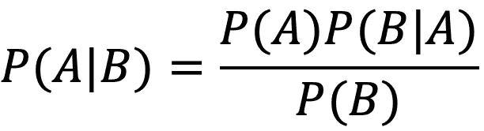
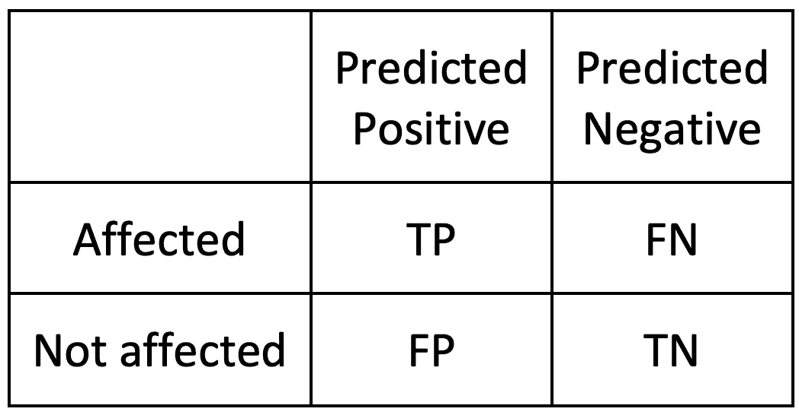
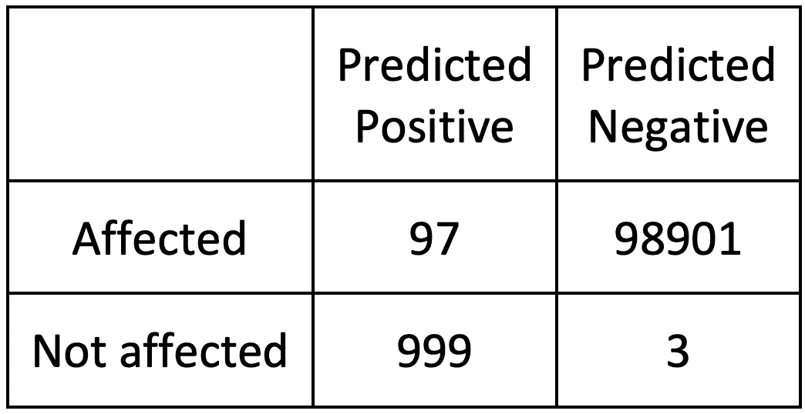
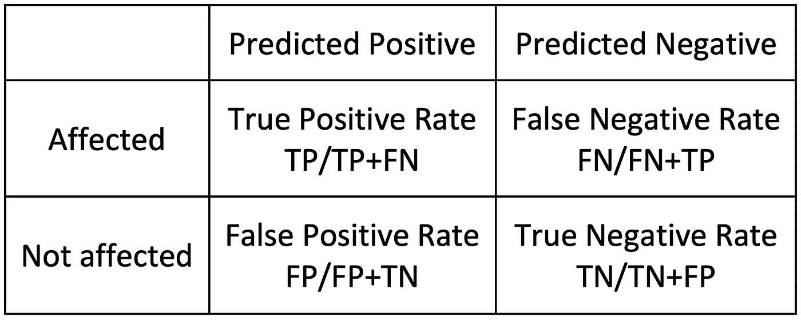
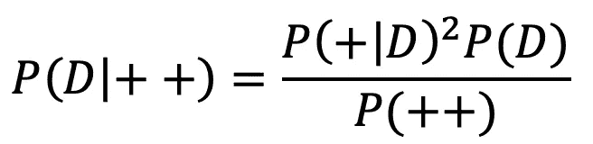

# 医学检验的贝叶斯定理

> 原文：<https://towardsdatascience.com/bayes-theorem-for-medical-test-f1fb12b579c6?source=collection_archive---------9----------------------->

## 理解医学检验的贝叶斯定理。解释结果和更多测试的组合

照片由 [Testalize.me](https://unsplash.com/@testalizeme?utm_source=unsplash&utm_medium=referral&utm_content=creditCopyText) 在 [Unsplash](https://unsplash.com/?utm_source=unsplash&utm_medium=referral&utm_content=creditCopyText) 上拍摄

B 阿耶斯定理是统计学中的主要定理之一，也是科学中应用最广泛的公式之一。

直到上世纪中叶，它的重要性一直在稳步增长。现在，它被认为是所有统计学课程的基础，应用于几乎所有的研究领域，而不是工业领域。

乍一看，贝叶斯定理似乎令人困惑，并且常常难以理解，而这在本质上并不容易的统计学领域已经存在。

然而，如果我们分析引导贝叶斯得出他的定理的思维过程，我们会看到这些是自然的和逻辑的思维方式。

## 定理

贝叶斯定理是以托马斯·贝叶斯牧师的名字命名的。大约在 1740 年，贝氏进行了一项思维实验:他想象自己背靠一张平的方形桌子，把一个球发射到桌子上，但不知道球会落在哪里。

然后，他想到发射第二个球，这次问他的助手球是落在第一个球的左边、右边、前面还是后面。使用这个系统，他能够缩小每次新发射的第一个球的位置。

使用这种系统不可能准确地知道第一个球落在哪里；但是它创造了一种方法，或者说一种思维方式，通过这种方法，每一个新的证据都可以提高估计值。这是他的定理创造的最有趣的范式转变之一

贝叶斯从未发表过他的想法。在他 1761 年去世后，他的朋友理查德·普莱斯发现了他的笔记并扩展了它们。通过应用现代标准，我们应该把这个定理称为贝叶斯价格定理。然而，尽管普莱斯做了工作，这个定理仍然不为人知，直到被皮埃尔·西蒙·拉普拉斯重新发现。他重新陈述了定理给出了“*(给定一个事件)原因的概率与事件(给定其原因)的概率成正比*”。

用更现代的话来说:贝叶斯定理描述了一个事件发生的可能性，基于可能与该事件相关的条件的先验知识。

# 经典表示

该公式最经典的表示如下:

贝叶斯定理(作者图片)

其中 A 和 B 是我们想要分析的两个事件，并且:

*   P(A)和 P(B)是事件 A 和事件 B 的不同且独立的概率。A 是假设为真的概率。 **P(A)是前面的***。*
*   ***P(B)** 是看到证据的概率。这个元素叫做*。**
*   ****P(A|B)** (读作:A 的 P 使得给定 B 的 P 的 B)是条件概率，因此，事件 A 的概率，给定事件 B 已经发生(为真)。这被称为****概率**** *或*条件*概率。***
*   **反之亦然， **P(B∣A)** 是 b 给定 a 的概率.假设为真时看到证据的概率。这种可能性被命名为*。***

***因此，该公式将先验概率与后验概率联系起来，并有可能将新的观察结果整合到基于先前观察结果的已建立模型中。***

# ***典型的例子***

***让我们从一个简单的例子开始，看看当我们拥有所有需要的信息时，贝叶斯定理是如何工作的。***

***让我们考虑一所由 60%的男生(B)和 40%的女生(G)组成的学校，其中所有的男生都留着短发，而留长发的女生(L)和留短发的女生的比例相等(50/50)。***

> ***我们遇到了一个剪短发的学生。 ***学生是女生的概率有多大？******

***发型事件与学生的性别有关，因此这些是我们的因变量。学生的性别是自变量。***

*   ***考虑到整个学校，学生剪短发(事件 S)的概率是所有男生加上一半女生:P(S)=60%+(40/2)%=80%***
*   ***假设学生是女生，留短发的学生的相关概率为:P(S∣G) = 50%
    这是因为女生在长发和短发之间平分秋色。***
*   ***假设学生是男生，留短发的学生的相关概率是:P(S∣B)=100%
    因为所有男生都留短发。***

***我们现在可以应用公式来计算**条件概率**:***

***p(g∣s)= p(g)p(s∣g)/p(s)= 0.4×0.5/0.8 = 0.25→25%***

***综上，留短发的学生是女生的概率是 16%。***

# ***理解医学测试的贝叶斯定理***

***为了评估诊断测试的性能，我们需要使用通常所说的混淆矩阵。这是一个简单的 2 乘 2 表格网格，其中计算了测试的预测与患者的真实情况。***

******

***混乱矩阵(图片由作者提供)***

***如果患者被预测为阳性，并且确实受到疾病的影响，则称之为**真阳性**。***

***与之相反的是**真阴性**，患者是健康的，并且预测如此。***

***剩下的元素是夫妇**假阳性**，被认为受影响但健康的人和**假阴性**，被认为健康但患病。***

***很容易看出最后两种在医学上是最危险的。一个假阳性的个体最好的情况是受到惊吓，最坏的情况是不需要治疗。假阴性反而会推迟必要的治疗。***

## ***医学悖论***

***让我们看一个医学测试和逻辑错误的例子，这种逻辑错误经常被称为医学悖论，尽管这种说法并不恰当。***

***让我们假设我们有一个医学测试，它被宣传有 99%的准确率，对于一种影响 0.1%人口的疾病。如果在 10 万人身上进行。该测试有以下结果:***

******

***对 10 万人的测试结果(图片由作者提供)***

***我们想了解:***

> ***测试 P(+)结果为阳性，以及受疾病 P(D|+)影响的概率是多少？***

***给定 99%的测试准确度，我们可能认为有 99%的测试是准确的。但是贝叶斯定理告诉我们一些其他的东西。让我们看看如何:***

***让我们找到贝叶斯定理的所有元素:***

*   ***被疾病感染的概率(D)，未经检验等于它在人群中的传播，这是*先验*假设: *P(D) = 0.1%。****
*   **与之相反，不患此病的是: *P( D) = 1-P(D) = 99.9%***
*   **测试结果为阳性的概率是所有阳性结果的总和除以品尝的总人数:(97+999)/100，000 = *P(+) = 1.096%***
*   **与之相反的是 *P(-) = 1-P(+) = 98.904%***

**使用混淆矩阵，我们可以构建另一个矩阵来帮助我们解决问题:**

****

**(图片由作者提供)**

**如果我们计算一下，这相当于:**

*   **TPR 通常被称为*灵敏度*，代表 P(+|D)，等于 97%。**
*   **TNR 或更一般的*特异性*，因此 P(-| D)等于 99%。**
*   **FNR 也称为*遗漏率*，P(-|D)等于 3%。**
*   **FPR 已知*虚警* P(+| D)的概率为 1%**

**在这些指标中，灵敏度*和特异性*是与医学测试最相关的指标，通常最好有一项测试能预测更多的 FP 而不是 FN，因为通常会进行第二次测试来确认疾病，而几乎没有人想再次检查他们是否没事。****

*回到我们的问题，看看在测试呈阳性时感染该疾病的概率是多少，我们可以在以下公式中看到所有结果:*

*   *P(D|+)= P(+|D) P(D)/P(+) → 8.9%*
*   *P( D|+) = P(+| D) P( D) /P(+) → 91.1%*
*   *P(D|-) = P(-|D) P(D)/P(-) → 0%*
*   *P( D|-) = P(-| D) P( D)/P(-) → 91.1%*

> *我们可以看到，如果我们以 99%的准确度测试阳性，我们仍然有 91%的概率 P( D|+)健康，只有 9%的概率 P(D|+)患病。这比 99%更不可怕。*

*鉴于我们的测试和疾病的传播，有 1.1%的人测试呈阳性，只有 9%的人在测试中实际患病。*

# *给定两个阳性测试的患病概率*

*然而，让我们想象我们想要使用相同的程序做第二个测试。*

> *鉴于**两次**阳性检测，受影响的概率有多大？*

*首先，我们需要计算两次结果为正的概率。应该是:*

*P(++) = P(+│D) P(D)+P(+│ D) P( D)*

*如果我们计算一下，结果会是:0.0010408*

*现在，为了计算 P(D|++ ),我们将使用以下公式:*

**

*给定两个阳性和相等测试的患病概率(图片由作者提供)*

*现在的结果是:90.4%*

*这意味着我们几乎可以肯定，如果进行第二次阳性测试，结果是正确的。我们可以通过增加第三个测试等等来尝试。*

*贝叶斯测试的美妙之处在于，我们可以根据新的测试来更新我们的信念。*