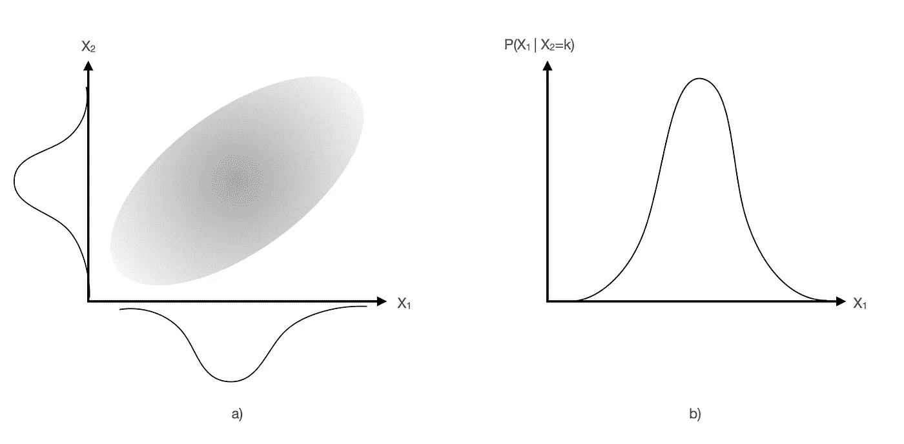

# 简单解释的贝叶斯定理

> 原文：<https://towardsdatascience.com/bayes-theorem-simply-explained-17217ebc39ff?source=collection_archive---------27----------------------->

## 如果无知是福，知道如何处理不完整的知识是关键。贝叶斯定理将所有这些形式化。

[贝叶斯定理](https://en.wikipedia.org/wiki/Bayes%27_theorem)形式化地描述了在我们对影响事件实现的其他因素的不完全了解以及我们预先存在的信念的情况下，如何计算事件发生的概率。比如今天天阴的话会下雨吗？

让我们从一些基本定义开始。事件 *A* 发生的概率是一个介于 0 和 1(或 0%和 100%)之间的数字，在数学上由某个函数 P(A)表示，称为*边际概率*，*即*，与其他事件无关。如果我们同时考虑两个事件 *A* 和 *B* ，那么这个概率就是一个二维函数 P(A，B)称为[联合概率](https://en.wikipedia.org/wiki/Joint_probability_distribution)。值得注意的是，它是对称的，意味着 P(A，B) = P(B，A)。如果这两个事件完全不相关，那么它分解为 P(A，B) = P(A)*P(B)。

接下来我们可能想知道的是，在已知 B 已经发生的情况下，事件 A 发生的概率是多少。这叫做*条件概率*，用一个函数 P(A|B)来描述。统计学中有一个著名的原理叫做[乘积法则](https://en.wikipedia.org/wiki/Chain_rule_(probability))告诉你如何从条件事件的联合概率 P(A，B)和边际概率*即* P(B)推导出条件概率 P(A|B)。这其实很简单:

```
P(A|B) = P(A,B) / P(B)
```

除以 P(B)确保概率在 0 和 1 之间。值得注意的是，条件概率是*而不是*对称的，这意味着通常 P(A|B) ≠ P(B|A)。例如，阴天下雨的可能性(*例如* 30%)比下雨时阴天下雨的可能性(*例如* 99%)要小。

这些关系很容易颠倒过来:

```
P(A,B) = P(A|B) * P(B)
P(B,A) = P(B|A) * P(A)
```

这基本上说明了联合概率是掌握系统完整信息的关键。

问题是，在大多数情况下，我们对某个过程的知识是不完整的，这意味着我们无法获得联合概率 P(A，B)！另一方面，在假设事件 *B* 为真的情况下，我们通常对事件 *A* 的发生有一些了解，并且我们可能对事件 *A* 总体发生的可能性有一些预先存在的想法。然后，由德高望重的托马斯·贝叶斯设计的一个定理来拯救我们，告诉我们如何在两个条件概率之间“切换”，即*:*

```
P(B|A) = P(A|B) * P(B) / P(A)
```

这很容易通过认识到以下几点得出:

```
P(A|B) * P(B) = P(A,B) 
P(B|A) * P(A) = P(B,A) = P(A,B)
=>
P(A|B) * P(B) = P(B|A) * P(A)
=>
P(B|A) = P(A|B) * P(B) / P(A)
```

在贝叶斯统计行话中，P(B|A)是*后验概率*(我们要计算的)，P(A|B)称为*似然*，P(B)称为*先验*概率，归一化因子 P(A)是*边际似然*或*模型证据*。简单地说，可能性编码了事件 *A* 在一些假设 *B* 下可能发生的概率，先验是我们相信 *B* 实际上是可能的。稍微延伸一下:假设我们已经观察到了看起来像是奇迹的东西，并且我们相信不管上帝是否存在，奇迹都会发生，那么上帝存在的概率是多少？也许这就是托马斯·贝叶斯在考虑的事情。

总结一下:

*   联合概率:P(A 和 B) = P(A，B) = P(B，A)
*   条件概率:P(给定 B)= P(A|B)
*   乘积法则:P(A|B) = P(A，B) / P(B)
*   P(A|B) * P(B) = P(A，B) = P(B，A) = P(B|A) * P(A)
*   P(B|A)= P(A|B)*P(B) / P(A)(贝叶斯定理)



两个变量之间的联合概率分布示例及其沿 *x* -和 y 轴绘制的相应裕量概率分布(左)，以及 X2 固定为给定值时 X1 的条件概率分布示例(右)。图片作者。

如果你正在阅读这篇文章，可能是因为你听说过[朴素贝叶斯分类器](https://www.geeksforgeeks.org/naive-bayes-classifiers/)及其在拒绝不需要的电子邮件方面的成功。它是如何工作的，为什么它是“天真”的？

首先，我们在谈论一个分类器，它是一个统计模型，根据一些特征向量 *X* 的值将实例分成不同的(通常是互斥的)类别。在上面提到的例子中，特征可以是是否下雨，类别可以是是否应该带伞。贝叶斯定理的完全应用将需要相当多的计算，例如归一化因子 P(X)的计算，这通常意味着在多维特征空间上运行[马尔可夫链](https://en.wikipedia.org/wiki/Markov_chain) [蒙特卡罗积分](https://en.wikipedia.org/wiki/Monte_Carlo_integration)。然而，在大多数应用中，我们只想知道类别，而不是(归一化的)概率。这样，定理可以简化为:

```
P(umbrella | X ) ∝ P(X | umbrella) * P(umbrella)
```

另一个大问题是特性 *X* 之间的相关性。在现实生活中，湿度、温度和一天中的时间之间存在相关性，分类器应该在优化步骤中考虑这一事实。例如，湿度的增加可能与温度的增加相关。然而，在实践中，经常会出现这样的情况，即输入要素被处理或设计成其相关性实际上非常小或可以忽略不计。如果是这样，那么可能性(记住这是一个*条件概率*！)分解为:

```
P(X|umbrella) = P(rainy|umbrella) * P(cloudy|umbrella) * P(humid|umbrella) * P(hour|umbrella)
```

因此，对于特征向量的给定实例 *X* = ( *X* _1， *X* _2， *X* _3， *X* _4)，算法只需找到 P(雨天=*X*_ 1 |雨伞)、P(多云= X _ 2 |雨伞)等的最大值..然后将这些因素相乘:

```
umbrella = argmax_j P(umbrella_j) * Prod_i[ P(X_i|umbrella_j) ] = max{
P(Y) * P(X_1|Y) * P(X_2|Y) * P(X_3|Y) * P(X_4|Y),
P(N) * P(X_1|N) * P(X_2|N) * P(X_3|N) * P(X_4|N)
}
```

在许多情况下，处理一个可能有上百个特性的产品会导致数值不稳定或内存溢出。然后，通常采用产品的负对数，而不是最小化函数:

```
-logP(X|umbrella) = -logP(umbrella) - log(P(X_1|umbrella) - log(P(X_2|umbrella) - log(P(X_3|umbrella) - log(P(X_4|umbrella)
```

总之，贝叶斯定理是一种计算给定事件 *A* 的概率的正式方法，这种方法基于对其与其他事件 *B* _1、 *B* _2、……以及我们先前的信念的不完全了解。它在统计学中的重要性不能被夸大，它的应用无处不在。我们在这里讨论了朴素贝叶斯分类器，这是一种流行的方法，例如在 [scikit-learn 库中实现的方法。](https://scikit-learn.org/stable/modules/naive_bayes.html)我在之前的[文章](/neural-networks-should-learn-how-to-say-im-not-sure-a430d665fa7d)中也讨论过如何用贝叶斯优化来训练神经网络。