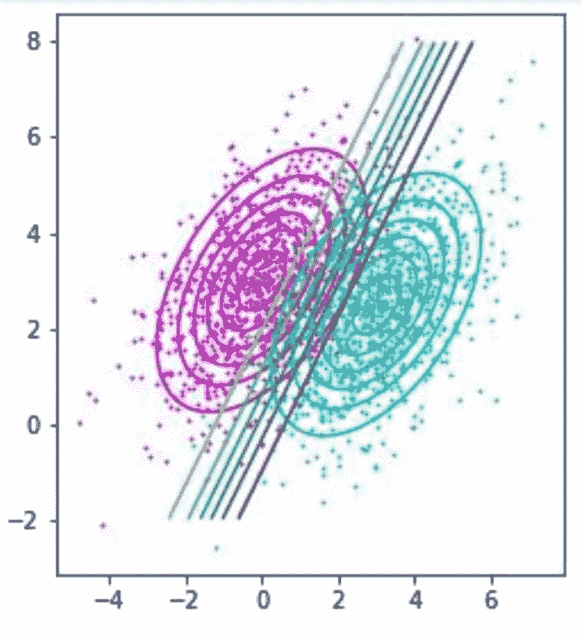
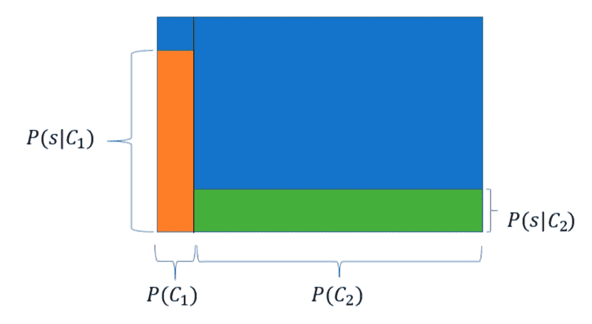
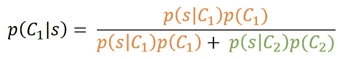
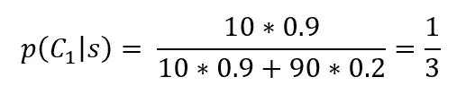

# 贝叶斯定理——机器学习的核心

> 原文：<https://towardsdatascience.com/bayes-theorem-the-core-of-machine-learning-69f5703e511f?source=collection_archive---------21----------------------->

## 机器学习基础

## 贝叶斯定理的一个例子及其重要性

作者形象

许多机器学习模型试图以某种方式估计后验概率。**监督机器学习模型的训练可以被认为是利用所接收的每个数据点来更新估计的后验。**这句话是理解机器学习的关键，要想完全理解它的意义，首先必须理解贝叶斯定理。

贝叶斯定理在数据科学中应用广泛。它构成了机器学习文献的基础。这篇文章形象化了一个小例子，以帮助形成对定理的直观理解。

# **贝叶斯推断**

贝叶斯推断是基于新信息更新结果概率的过程。在收到此信息之前，我们可能预先相信某个事件正在发生。然而，一旦我们收到新的信息，结果的概率可能会改变。正确更新结果概率的方法是通过贝叶斯推断。

贝叶斯定理指出，后验概率(给定所接收的新信息的事件概率)与看到新信息的可能性乘以先前的信念成比例。在机器学习领域，后验概率和先验概率之间的这种比例关系是反复出现的。

# **贝叶斯推理示例**

假设你在面试时被问到以下问题:

乔是一名大学工科学生。试着从下面的陈述中猜测他是否会在他的学士课程中获得一等奖:

“乔最近的一次任务刚得了第一名。乔是个好学生，工作努力”

大多数人可能会认为，乔更有可能获得第一名。让我们编一些数字，应用贝叶斯定理。

*   乔的班上有 100 名学生
*   10 末会得到第一个学士
*   在总共 10 名将获得第一名的学生中，90%符合上述说法
*   在这 90 位没有获得第一的人中，只有 20%符合上面的说法

作者形象

在上图中，底部是随机学生获得第一名的概率。如前所述，这是 10%，并显示为 P(C1)。在这些学生中，90%的人符合这一说法，他们是 P(s|C1)。在没有获得第一名的人中，只有 20%的人符合这个标准，P(s|C2)。

橙色区域是将获得第一个并符合陈述的人员。在“绿色区域”中的是不会获得第一个总体评分但也符合该陈述的学生。

我们知道乔符合这种说法，所以他要么处于有利地位，要么处于不利地位。Joe 出现在橙色区域的概率就是用橙色区域除以橙色和绿色区域之和:

后验概率与似然性乘以先验概率成正比。给定陈述，乔获得第一名的概率是符合陈述的学生获得第一名的概率，除以符合陈述的学生人数。

在实践中，分母通常称为 P(s)，即该陈述为真的学生数。然而，人们几乎总是最终将分母扩展成上面看到的形式。

我们可以把数字代入，看看乔是否会得第一名:

因此，在给出的陈述中，乔获得学士学位的概率只有 33%。即使这句话对得第一名的人来说是正确的 4 倍多，因为只有少数学生得第一名，乔得不到第一名的可能性仍然更大。显然，这是一个愚蠢的例子，我编造了这些数字，但你会明白为什么这种问题可能是反直觉的，为什么贝叶斯推理是如此有用。

# **结论**

现在你可以去看看这篇文章的最初陈述，希望它能给你一个关于机器学习的新视角。

贝叶斯推理、贝叶斯分类器和估计后验概率很容易成为我在机器学习中最喜欢的话题。要理解更复杂的算法，理解这个简单的规则是极其重要的。如果你想了解这个话题的更多内容，可以去 youtube 上的 3Blues1Brown 看看，他对贝叶斯定理有很好的解释，并给出了自己的例子。

## 支持我

希望这对你有帮助，如果你喜欢它，你可以 [**跟我来！**](https://medium.com/@diegounzuetaruedas)

您也可以成为 [**中级会员**](https://diegounzuetaruedas.medium.com/membership) 使用我的推荐链接，访问我的所有文章和更多:[https://diegounzuetaruedas.medium.com/membership](https://diegounzuetaruedas.medium.com/membership)

## 你可能喜欢的其他文章

[可微发电机网络:简介](/differentiable-generator-networks-an-introduction-5a9650a24823)

[傅立叶变换:直观的可视化](/fourier-transforms-an-intuitive-visualisation-ba186c7380ee)