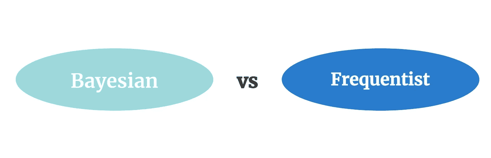
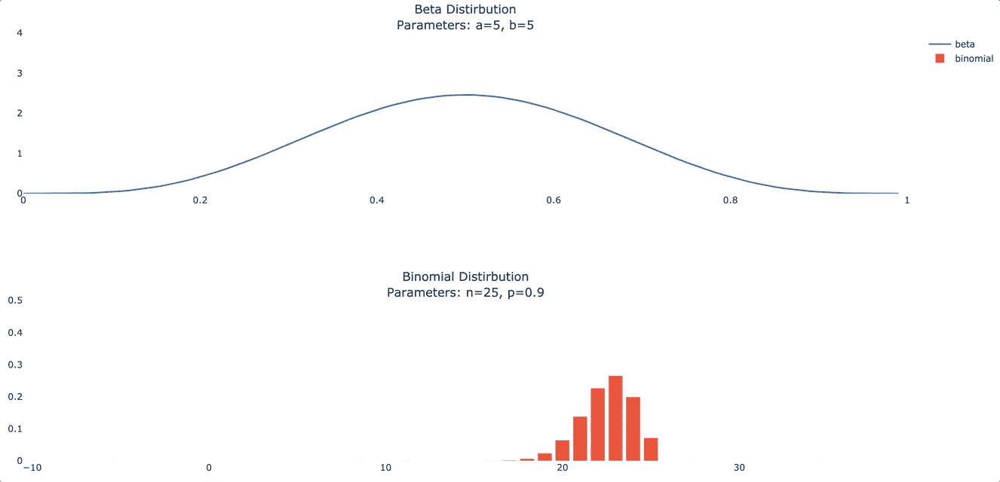

# 贝叶斯 A/B 测试在 5 分钟内完成

> 原文：<https://towardsdatascience.com/bayesian-a-b-testing-and-its-benefits-a7bbe5cb5103?source=collection_archive---------2----------------------->

## 什么是贝叶斯 A/B 测试，什么时候应该使用它？



A/B 测试的困境。图片作者。

最近，[贝叶斯 A/B 测试](https://medium.com/r?url=https%3A%2F%2Farxiv.org%2Fpdf%2F2003.02769.pdf)得到了大量的宣传，因为它的方法易于理解，并允许有用的计算，如治疗优于控制的概率。贝叶斯推理在小样本上也表现得更好；根据 [2019 中期帖子](/exploring-bayesian-a-b-testing-with-simulations-7500b4fc55bc)，贝叶斯 A/B 测试可以减少 75%的所需样本量。

虽然这些方法在计算上比传统的 frequentist 方法更昂贵，但是它们是离线计算的，这降低了性能要求。主要的挑战是选择有效的分布来支持推理。

任何拥有实验管道和计算机的人都可以利用贝叶斯 A/B 测试技术。以下是如何…

# 贝叶斯 A/B 测试的步骤

1.  **根据您的兴趣选择您的发行版。**这里，我们讨论二项式、多项式和指数分布。它们涵盖了大多数业务用例。
2.  **计算你的先验。**基于上面选择的分布，我们接下来选择一个[共轭先验](https://en.wikipedia.org/wiki/Conjugate_prior)，并选择最能反映我们预实验数据的分布参数。分布参数可手动选择或使用[库](/finding-the-best-distribution-that-fits-your-data-using-pythons-fitter-library-319a5a0972e9)选择。
3.  **运行实验。**
4.  **使用蒙特卡罗模拟计算三个关键指标。**这些指标是提升百分比、最佳概率和预期损失。

# 但是，到底是怎么回事呢？

好了，让我们慢下来，了解一下到底发生了什么。

## 贝叶斯统计

从第一格开始，我们来说说[贝叶斯推断](/a-gentle-introduction-to-bayesian-inference-6a7552e313cb)是什么。一句话，贝叶斯推理利用条件概率来帮助我们理解数据如何影响我们的信念。


贝叶斯方法。图片作者。

假设我们从天空是红色的先验信念开始。看了一些数据后，我们很快就会意识到这种先前的想法是错误的。因此，我们执行*贝叶斯更新*来改进我们关于天空颜色的不正确模型，最终得到一个更准确的后验信念。

## 似然分布和共轭先验

我们信念的一个关键组成部分是我们数据的结构。我们经常通过分布来描述这种结构。例如，在我们的天空例子中，假设有各种颜色(红色、白色、蓝色等。)，我们的分布将是[多项式](https://en.wikipedia.org/wiki/Multinomial_distribution#:~:text=In%20probability%20theory%2C%20the%20multinomial,sided%20die%20rolled%20n%20times.&text=When%20k%20is%202%20and%20n%20is%20bigger%20than,it%20is%20the%20binomial%20distribution.)。如果我们看一组数字，我们的分布可能是[正态](https://en.wikipedia.org/wiki/Normal_distribution)。如果数据是真/假值，它将是[二项式](https://en.wikipedia.org/wiki/Binomial_distribution)，等等。

这些分布被称为似然分布，因为它们显示了我们的数据呈现某个值的可能性。

对于我们的天空例子，我们正在处理一个多项式分布，但是还有一个分布我们需要考虑。当执行贝叶斯更新时，我们必须考虑概率分布的*共轭先验*分布。共轭是来自同一个家族的分布。对于我们的情况，多项式分布的共轭先验是[狄利克雷](https://en.wikipedia.org/wiki/Dirichlet_distribution)分布。

**共轭先验是我们数据的可能性分布的来源。**例如，如果我们正在抛硬币，那么[二项式](https://en.wikipedia.org/wiki/Binomial_distribution)分布显示了抛硬币的次数 *n* 看起来像是正面的概率 *p* 。但是，往往 *p* 本身就有分布。 *p* 的分布是共轭先验分布。

好吧，那是很多，但是如果你想继续学习共轭先验，这里有一个来自麻省理工学院的很好的资源。

让我们继续将这些发行版用于不同的业务应用程序。

## 商业中常见的分配

通常，我们可以在业务环境中观察到三种主要类型的数据(尽管其他分布也是有用的):

1.  **二进制**:用户有一个选项可以选择的数据。
2.  **分类**:用户有一组选项可供选择的数据。
3.  **连续**:用户有一组选项可以选择的数据，但是我们只观察这些选项的集合。

对于二进制数据，让我们举一个在线 ML 教科书商店转换的具体例子。 *Conversion=1* 表示用户购买了一本书，而 *conversion=0* 表示他们没有购买。

在这个场景中，[二项式](https://en.wikipedia.org/wiki/Binomial_distribution)分布描述了我们的数据。二项式的共轭先验是 [beta](https://en.wikipedia.org/wiki/Beta_distribution) 分布，下面可以看到这两个分布。



具有不同超参数值的贝塔(上)和二项式(下)。图片作者。

转到我们的第二类数据，分类数据的似然分布是[多项式](https://en.wikipedia.org/wiki/Multinomial_distribution#:~:text=In%20probability%20theory%2C%20the%20multinomial,sided%20die%20rolled%20n%20times.&text=When%20k%20is%202%20and%20n%20is%20bigger%20than,it%20is%20the%20binomial%20distribution.)，它的共轭先验是[狄利克雷](https://en.wikipedia.org/wiki/Dirichlet_distribution)。因为这些图通常是高维的，所以我们不打算展示可视化。

最后，对于连续数据，我们使用带有[伽玛](https://en.wikipedia.org/wiki/Gamma_distribution)共轭先验的[指数](https://en.wikipedia.org/wiki/Exponential_distribution)分布。如果你想知道它们长什么样，可以看看这些链接。

很简单，对吧？根据数据类型，只需应用这些分布就可以了。

# 贝叶斯统计计算

现在我们已经了解了如何为我们的实验选择一个分布，让我们学习如何确定实验影响。我们通过计算三个统计数据来做到这一点:

1.  治疗电梯
2.  成为最佳的可能性
3.  预期损失

对于我们的第一个计算，治疗提升仅仅是我们的治疗和控制之间的百分比变化。这是我们的治疗效果，可以用下面的公式计算。为了简单起见，让我们假设只有一种治疗和一种对照。

```
treatment_lift = (treatment - control) / control
```

对于我们的第二次和第三次计算，我们需要开发一个蒙特卡罗模拟。为什么你会问？因为我们只有一个数据样本，所以我们无法计算任何概率——我们不知道数据在其他样本中会是什么样子。因此，为了生成更多的数据，我们利用了关于我们的数据生成机制(后验分布)的知识和来自该机制的样本。10，000 个样本是一个很好的经验法则。

对于我们的第二个统计数据，即最佳概率，我们只需查看所有模拟样本，并计算我们的处理优于我们的控制的时间百分比。这个比例成为我们的最佳治疗的*概率*。查看下面的 pythonic 伪代码。

```
# probability best of treatment
samp_treatment = sample_from_distribution(treatment_dist, n=10000)
samp_control = sample_from_distribution(control_dist, n=10000)probability_best = mean(int(samp_treatment > samp_control))
```

最后，对于我们的第三个统计，我们希望计算*预期损失*，即我们为实施不正确的治疗所付出的代价。为了计算预期损失，我们迭代样本并计算 *max(treat - control，0)* 。然后，我们取这些零界值的平均值来确定我们的*预期损失*。

```
# pythonic pseudo code - expected lossloss = mean(max(samp_control - samp_treatment, 0))
```

*预期损失*和*最佳概率*是贝叶斯实验的两个主要卖点。Frequentist 方法不提供任何值。

有关这些计算的详细信息，请查看这篇[帖子](/bayesian-ab-testing-part-i-conversions-ac2635f878ec)。

现在你知道了！

# 实施说明

*   如果你选择一个有效的先验，贝叶斯 A/B 测试需要一个较小的样本量，这样你可以更快地得到结果。
*   贝叶斯方法比频率主义方法计算量更大。
*   当选择先验时，偏向弱先验，即较小的超参数值。

*感谢阅读！我将再写 46 篇文章，将“学术”研究引入 DS 行业。查看我对贝叶斯 A/B 测试的链接/想法的评论。*