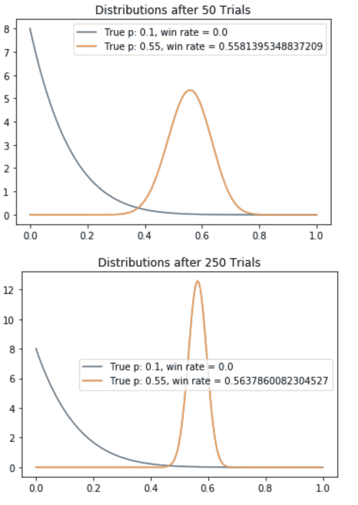
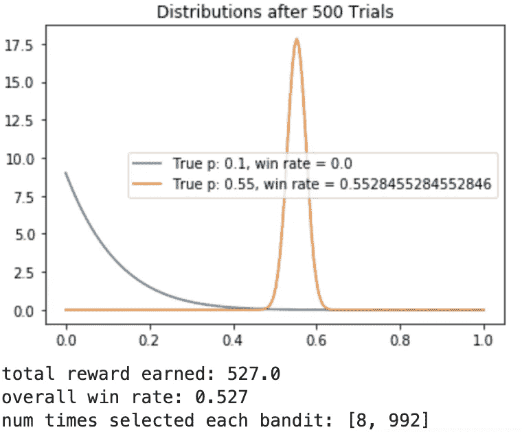

# 贝叶斯 A/B 测试解释

> 原文：<https://towardsdatascience.com/bayesian-a-b-testing-explained-344a6df88c1a?source=collection_archive---------10----------------------->

## 用 Python 实现解释贝叶斯 A/B 测试


来自[水花](https://unsplash.com/photos/Tq39UmwQ6U8)的图片由[亚历山德罗·克罗斯托](https://unsplash.com/@alecros)

A/B 测试在各个行业都有很多应用。从试图确定最佳市场群体到医疗药物测试，它有各种应用，并允许企业根据结果做出决策。有两种常用的方法来进行 A/B 测试，频率主义方法和贝叶斯方法，这两种方法都是从假设测试的基础开始的。在本文中，我将介绍贝叶斯方法在 A/B 测试中的解释和实现。这篇文章假设你对实践中的 A/B 测试有一个很好的理解，如果没有，你可以在这里了解更多关于它和频率主义方法[。](/frequentist-a-b-testing-explained-90b9ce8c28b9)

</frequentist-a-b-testing-explained-90b9ce8c28b9>  

**目录**

*   贝叶斯方法
    -贝叶斯机器学习
*   贝叶斯 A/B 测试
    -探索漏洞利用困境
*   问题陈述
*   贝叶斯班迪特/汤普森采样
    -贝叶斯定理
    -贝塔分布
*   履行
*   结束语
*   资源

# **贝叶斯方法**

贝叶斯方法源于一个主要规则，即一切都是随机变量。例如，如果给定某个数据集，并要求您查找数据的平均值和方差，您的输出将只是一个映射到平均值的数值和一个映射到方差的数值。然而，在贝叶斯方法中，你不再寻找一个数字，而是一个分布。

```
When trying to identify the mean, you can see the difference of approaches below : 
Frequentist : ῦ
Bayesian    : p(ῦ | data)
```

**贝叶斯机器学习**

如果你从机器学习的角度来考虑这个问题，那么你可以看到 A/B 测试在直觉上与强化学习非常相似。强化学习指的是允许代理在一个环境中采取行动，以最大化奖励的概念。A/B 测试可以被视为一组随机实验，随机划分用户，以最大化某些回报。

例如，如果我们要用 A/B 测试对网站上两个按钮的点击率进行建模，不同按钮的不同布局可以被定义为一个动作，点击率的增加可以作为一种奖励。我们想选择一个布局，将最大限度地提高点击率。

# 贝叶斯 A/B 测试

给定一些数据，贝叶斯程序可以概述为以下步骤[1]:

1.  确定先验分布(高斯、泊松、贝塔等。)，这表达了我们在看到任何数据之前对参数(例如ῦ)的初步理解
2.  选择一个统计模型(马尔可夫链，贝叶斯土匪等。)这反映了我们对给定ῦ的 x 的信念
3.  在观察一些数据后，更新我们的信念并计算后验分布 p(ῦ | x)。后验分布是一种概率分布，它描绘了在观察数据后您对参数的更新信念。

可以想象，观察次数(N)越大，你的后验分布的近似值就越好。然而，如果你的观察次数太多，你会失去很多可以为你的网站带来收入的印象。例如，如果你正在为你的网站运行 A/B 测试，以确定哪个(两个)登陆页面产生非常高的点击率，那么你做的样本越多，你接触到的登陆页面的人就越多，这将减少你可能获得的点击次数。因此，样本大小既不太大也不太小是理想的。

**探索漏洞利用困境**

在强化学习中，当代理通过评估可能导致积极结果的场景来收集信息时，被称为**探索。**在探索之后，人们学习在给定当前已知信息的情况下具有最高可能结果的最优决策，这被称为**开发。**最好是平衡剥削，和剥削。

# 问题陈述

假设您想要测试在您的平台上创建用户的两个不同的位置。你的位置 1 位于网站的左上角，而位置 2 位于右上角。两个登录页面之间唯一的区别是注册按钮在两个不同的位置，其他都是一样的，我们的实验是 [*iid*](https://en.wikipedia.org/wiki/Independent_and_identically_distributed_random_variables) *。*

# 贝叶斯土匪/汤普森抽样

在我们探索贝叶斯强盗算法之前，我们需要对贝叶斯定理和贝塔分布做一点回顾。

**贝叶斯定理**


图片由 [Tirthajyoti Sarkar](https://medium.com/@tirthajyoti) 提供从[这里](/bayes-rule-with-a-simple-and-practical-example-2bce3d0f4ad0)

本质上，后验~似然*先验

**贝塔分布**

这是一个以区间[0，1]为界的连续概率分布，取决于两个参数 *α* 和 *β。*两个 *α* 和 *β* 都必须为正。在不涉及算法的情况下，贝塔分布的概率密度函数可以用下面的公式来模拟:


图片由作者提供

要获得更详细的解释和推导，请访问维基百科的测试版页面[这里](https://en.wikipedia.org/wiki/Beta_distribution)。


该动画展示了β分布如何随着其参数α和β的不同值而变化。来源: [Pabloparsil](https://commons.wikimedia.org/w/index.php?title=User:Pabloparsil&action=edit&redlink=1) 来自[维基百科](https://en.wikipedia.org/wiki/Beta_distribution)

现在我们可以探索贝叶斯土匪/汤普森采样算法。为了这个实验的目的，让我们假设我们知道位置 1 和位置 2 的点击率概率。当然，在现实世界的例子中，这不会发生，但为了评估我们的算法在这种情况下的表现，让我们说`p(pos1) = 0.1`和`p(pos2) = 0.55`

既然我们没有任何现存的观察，我们就不可能有任何先验的信念。为了模拟我们的先验概率，我们可以使用α = 1 和β=1 的β分布。这将是[0，1]域上的均匀分布。我们选择均匀分布，因为我们不知道结果可能是什么，因此我们给每一个可能的值相等的概率。注意，对于行业场景，如果您有可用的先验知识，那么您应该在您的实现中使用这些先验知识。

对于这种方法，一步中的后验成为下一步中的先验，我们的后验和先验都可以通过 beta 建模。

```
 ** Beta * Data = Beta**
                         |____|        |____|
                         prior         posterior
```

# **实施**

请注意，由于分布的随机抽样，您的实现可能会有稍微不同的结果。



如你所见，该算法很快收敛到最佳分布。根据这个实验的结果，很明显位置 2 比位置 1 更好，应该是你网站上注册按钮的位置。

# 结束语

频率主义者和贝叶斯方法的主要区别在于贝叶斯认为参数是随机变量。进行 A/B 测试的步骤贝叶斯方法是确定你的先验分布，选择一个统计模型，并计算和更新你的后验分布。一般来说，贝叶斯方法比其他传统的 A/B 测试收敛得更快。这意味着需要更小的样本才能得出结论。

# **资源**

*   [1]http://www.stat.cmu.edu/~larry/=sml/Bayes.pdf
*   [2][https://jamesmccaffrey . WordPress . com/2017/11/30/the-epsilon-greedy-algorithm/#:~:text = In % 20 short % 2C % 20 epsilon % 2d greedy % 20 means，the % 20 multi % 2d armed % 20 bandit % 20 problem](https://jamesmccaffrey.wordpress.com/2017/11/30/the-epsilon-greedy-algorithm/#:~:text=In%20short%2C%20epsilon%2Dgreedy%20means,the%20multi%2Darmed%20bandit%20problem)。
*   [3][https://www . dynamic field . com/lesson/Bayesian-approach-to-ab-testing/](https://www.dynamicyield.com/lesson/bayesian-approach-to-ab-testing/)
*   [4][https://towards data science . com/intro-to-reinforcement-learning-the-explore-exploit-dilemma-463 CEB 004989](/intro-to-reinforcement-learning-the-explore-exploit-dilemma-463ceb004989)
*   [https://web.stanford.edu/~bvr/pubs/TS_Tutorial.pdf](https://web.stanford.edu/~bvr/pubs/TS_Tutorial.pdf)
*   [6][https://github . com/lazy programmer/machine _ learning _ examples/tree/master/ab _ testing](https://github.com/lazyprogrammer/machine_learning_examples/tree/master/ab_testing)

如果您喜欢这篇文章，您可能也会感兴趣:

</monte-carlo-method-explained-8635edf2cf58>  </markov-chain-explained-210581d7a4a9>  </random-walks-with-restart-explained-77c3fe216bca> 