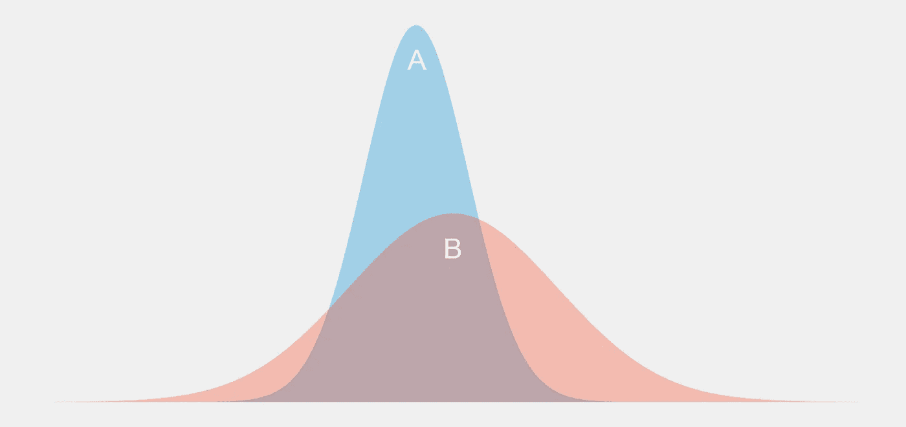
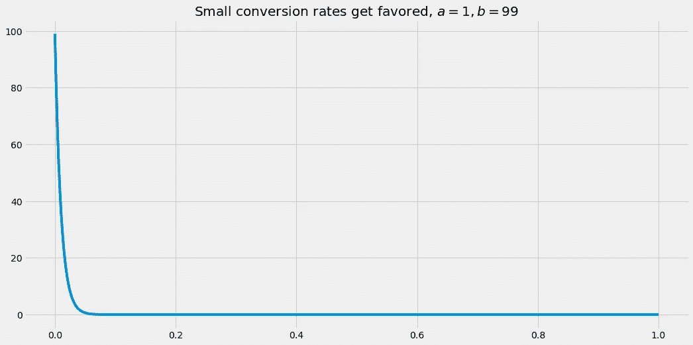
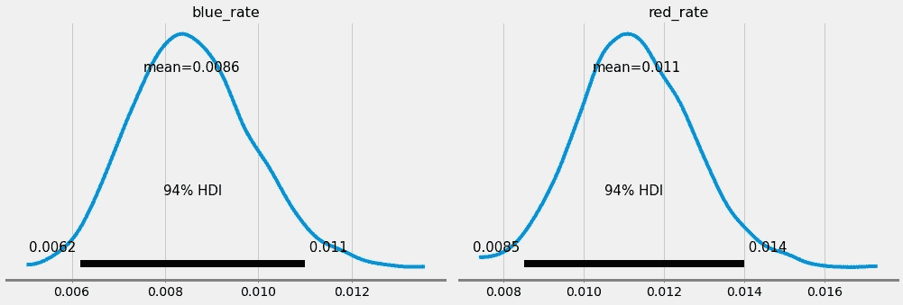

# PyMC3 中的贝叶斯 A/B 测试

> 原文：<https://towardsdatascience.com/bayesian-a-b-testing-in-pymc3-54dceb87af74?source=collection_archive---------5----------------------->

## [贝叶斯统计](https://medium.com/tag/bayesian-statistics)

## 抛弃 p 值，拥抱更直观的概率


由 [OpticalNomad](https://unsplash.com/@opticalnomad?utm_source=medium&utm_medium=referral) 在 [Unsplash](https://unsplash.com?utm_source=medium&utm_medium=referral) 上拍摄的照片

有时，你不得不在两个选项中做出选择。这可能是在完全不知情的情况下，你只有 50%的可能性做出更好的选择。在一些不知情的情况下，你甚至可以用一个简单的技巧来提高这个概率，正如我在另一篇文章中所展示的。

然而，通常情况下，你能够**收集一些信息**帮助你选择更好的选项。一个简单而聪明的方法是 *A/B 测试*，你可能已经听说过或者已经使用过了。



两个实验的结果。是 A 还是 B 产生的价值更高？你对此有多确定？图片由作者提供。

在本文中，我将简要解释 A/B 测试背后的动机，并概述其背后的逻辑。这种方法的问题在于它使用了容易被误解的 p 值。

因此，我们将花时间用少许*贝叶斯*魔法来改进这种方法，产生**贝叶斯 A/B 测试**。最重要的是，我们将使用 Python 中出色的 PyMC3 库实现一个简单的贝叶斯 A/B 测试。

> 如果您不完全确定什么是贝叶斯统计，或者您以前从未使用过 PyMC3，请查看我关于这个主题的入门级文章:

[](/a-gentle-introduction-to-bayesian-inference-6a7552e313cb) [## 贝叶斯推理的简明介绍

### 了解频率主义者和贝叶斯推理方法之间的区别

towardsdatascience.com](/a-gentle-introduction-to-bayesian-inference-6a7552e313cb) [](/conducting-bayesian-inference-in-python-using-pymc3-d407f8d934a5) [## 使用 PyMC3 在 Python 中进行贝叶斯推理

### 重温硬币的例子，并使用 PyMC3 计算解决它。

towardsdatascience.com](/conducting-bayesian-inference-in-python-using-pymc3-d407f8d934a5) 

# A/B 测试动机

假设您经营着一家相当成功的在线商店，每天有大约 10，000 名访问者。这 10000 人中大约有 100 人实际上在你的店里买了东西——你所谓的*转化率*大约是 100/10000 = 1%，相当小。

> 大多数网上商店的转化率在 1-3%左右，亚马逊甚至超过 10%。

因为无论如何都会有很多人光顾你的店铺，但只有很少一部分人成为顾客，所以你决定提高你的店铺的转化率，因为这是提高收入的最大杠杆。你认为:

> 是什么让人们不买我的好产品？

你想不出一个好的解释，所以你向一些朋友寻求灵感。他们告诉你，他们不喜欢你购买按钮的蓝色。也许红色会更吸引人？这是你可以测试的东西！


让战斗开始吧！图片由作者提供。

方法如下:

> 以 50%的概率随机将新访客分配到蓝队或红队。蓝队的人会看到蓝色按钮，红队会看到红色按钮。在运行这个过程一段时间后，您检查哪个团队实现了更高的转化率。

> *术语:*你称蓝队**对照组**，红队**治疗组或试验组**。对照组给你一个指示，如果你让一切保持原样会发生什么，治疗组告诉你如果你做某种干预会发生什么，比如改变按钮的颜色。

请注意，如果您想轻松评估实验，这种随机化很重要。你应该**而不是**做的事情包括:

*   **将所有男性分配到红色团队，将所有女性分配到蓝色团队**，因为即使一个团队的转化率高得多，你也无法知道这是因为按钮的颜色还是仅仅因为性别。
*   **本周将每个人分配到红色团队，下周分配到蓝色团队**，因为即使一个团队的转换率很高，你也无法知道这是因为按钮的颜色，还是因为人们在一周内购买了更多的东西，而不考虑颜色。也许其中一周包括像黑色星期五或圣诞节这样的节日，或者其他更微妙的季节模式。
*   …

你明白了。为了提取**按钮颜色效果** *，*应该没有其他**混淆**效果可以解释两个团队的不同转换率。

# 准备 A/B 测试

让我们假设您为您的 A/B 测试进行了一天的适当的数据收集，并最终获得了一些数据。你有 10，000 名访客，你将他们随机分为蓝队(对照组)和红队(治疗组)。你记下这位游客是否买了东西(编码为 **1** )或没有买(编码为 **0** )。

我们使用以下代码模拟结果:

```
import numpy as np

np.random.seed(0)

blue_conversions = np.random.binomial(1, 0.01, size=4800)
red_conversions = np.random.binomial(1, 0.012, size=5200)
```

你可以看到我把 1%作为对照组转化率，1.2%作为治疗组转化率。**所以你已经知道，如果采样没有做什么奇怪的事情，红色按钮应该表现得更好**！但让我们从现在开始假装我们不知道这些数据是如何产生的，因为这是我们在现实中经常面临的问题。

> 另外，请注意，这些组有不同的大小，这通常是随机分配的结果。他们在 10000/2 = 5000 左右，但不太可能得到如此完美的 50:50 分成。然而，这很好。

两个 NumPy 数组都由 1 和 0 组成，大多数条目都是 0。

```
print(blue_conversions)
# output: [0 0 0 ... 0 0 0]
```

```
print(red_conversions)
# output: [0 0 0 ... 0 0 0]
```

接下来，我们可以检查的是 one(即购买了某些东西的访问者)的份额。

```
print(f'Blue: {blue_conversions.mean():.3%}')
print(f'Red: {red_conversions.mean():.3%}')
# output: Blue: 0.854%, Red: 1.135%
```

这表明红色按钮的性能可能会更好，但我们现在还不能确定。即使不同组之间的转化率完全相同，一组最终的转化率也很可能比另一组高。

我们仍然必须排除这仅仅是由于偶然而发生的，这正是 A/B 测试的目的。

# 进行 A/B 测试

现在让我们看看我们如何能对正在发生的事情提出一个更好的解释。蓝色按钮好还是红色按钮好？首先，我们将再现传统的方式，然后，我们将做贝叶斯风格。

## 传统的方式

我不会在这里深入探讨，因为有大量的资源可以完美地解释如何进行一个普通的 A/B 测试。你想知道以下两个假设哪个是正确的:


图片由作者提供。

基本上，你计算某种测试统计，例如在费希尔精确测试或 T2 韦尔奇的 t-测试中。然后计算一个 p 值，并检查它是否在某个任意范围内，比如 5%。让我们来看看**韦尔奇的** **t 测试**。

```
from scipy.stats import ttest_ind

print(f'p-value: {ttest_ind(blue_conversions, red_conversions, equal_var=False, alternative="less").pvalue:.1%}')
# output: p-value: 7.8%
```

因为有些人纠结于 p 值，你可以这样解读:

> 假设₀是真实的，我们得到我们观察到的或者更极端的结果的几率最多是 7.8%。

由于 7.8% > 5%，我们保持原假设。没有证据表明红色按钮明显比蓝色按钮好，所以我们只保留蓝色按钮。

我认为 p 值的定义相当不直观——每个曲解过 p 值的人都证明了这一点。最常见的**误解**如下:

> 蓝色更好的概率是 7.8%。(错！！！)

虽然这是 p 值告诉你的**而不是**，但是能够表达出这样一个清晰而简短的陈述是可取的，不是吗？好吧，那么，贝氏拯救。

## 贝叶斯方法

贝叶斯 A/B 测试有以下优点:

1.  它使您能够以一定的概率做出一个版本比另一个版本更好的陈述。正是我们想要的。
2.  你不需要知道所有的统计测试。您只需构建一个合适的生成模型，然后按下贝叶斯推理按钮。

> 我假设你现在已经有一些关于使用 PyMC3 的先验知识，否则，检查我上面的链接文章。

为了更清楚地说明这些优点，让我们借助 PyMC3 用贝叶斯方法来分析我们的问题。首先，我们需要考虑要推断哪些参数。这很容易，有两个未知参数:

*   蓝色按钮的转换率
*   红色按钮的转换率。

我们现在需要决定两个参数的先验分布。由于转换率可以在 0 到 1 之间，所以[贝塔分布](https://en.wikipedia.org/wiki/Beta_distribution)是有意义的。Beta 分布有两个参数 *a* 和 *b，*，你可以通过改变它们来创建不同的分布。


图片由作者提供。

因为我们知道转换率相当小，例如，两者的良好先验都是β(1，99)。



图片由作者提供。

现在，我们必须模拟我们观察到的结果(包含 0 和 1 的数组)是如何与这些参数联系起来的。最直接的方法是使用[伯努利变量](https://en.wikipedia.org/wiki/Bernoulli_distribution)，因为它们只能取值 0 和 1，并使用单个概率参数。

长话短说，我们可以写下面的小程序:

```
import pymc3 as pm

with pm.Model():
    blue_rate = pm.Beta('blue_rate', 1, 99)
    red_rate = pm.Beta('red_rate', 1, 99)

    blue_obs = pm.Bernoulli('blue_obs', blue_rate, observed=blue_conversions)
    red_obs = pm.Bernoulli('red_obs', red_rate, observed=red_conversions)

    trace = pm.sample(return_inferencedata=True)
```

加上解释，这个程序应该对你有意义。在模型的前两行，我们定义了先验知识。之后，我们设计模型的输出(伯努利变量),并使用`observed`参数额外给出来自 A/B 测试准备的观察结果。最后一行是著名的贝叶斯推理按钮的 PyMC3 版本。

在`trace`对象的帮助下，你可以重建转换率的后验分布。

```
import arviz as az

az.plot_posterior(trace)
```



图片由作者提供。

我们发现，蓝色的转化率约为 0.854%，红色的转化率约为 1.135%，这与我们的最大似然估计值非常接近，甚至还有一个可信的估计区间。比如蓝率在 0.62%到 1.1%之间，有 94%的概率。

整洁，对不对？但这并没有回答我们的问题。红色按钮的转化率比蓝色按钮的转化率高的概率有多大？为了回答这个问题，我们可以对两个后验分布进行采样，看看红色比率高于蓝色比率的频率。幸运的是，样本已经存储在`trace`对象中。我们只需了解红色速率样本比蓝色速率样本大的频率。

```
blue_rate_samples = trace.posterior['blue_rate'].values
red_rate_samples = trace.posterior['red_rate'].values

print(f'Probability that red is better: {(red_rate_samples > blue_rate_samples).mean():.1%}.')

# Output (for me):
# Probability that red is better: 91.7%.
```

这是我们可以合作的事情！这对我们来说很容易理解，但对其他所有人来说也很容易理解，我特别关注业务部门。红色按钮更好，概率在 92%左右。

*完美！*”，你想着和你店里的红版，希望它能提高你的转化率。


Uaaa，uaaa，uaaa。图片由作者提供。

现在想象一下:这只是一个微小的变化，却有可能增加你的销售额。可能有各种各样的或大或小的东西你可以修补，让你的商店更好。比赛刚刚开始。

# 结论

在许多情况下，我们不得不在两个选项中做出选择。这可以只是一个按钮的颜色，也可以是一个对象在网站上的位置，按钮或图像上的文本，或者任何可能被改变的东西。

在两个版本之间进行选择的一种方法是运行 A/B 测试。这个想法很简单:**你把你的顾客分成两组，唯一不同的是你想改变的东西**，也就是一个按钮的颜色。这样你就可以确定只有你改变的事情导致了结果的改变，其他的都没有。不是人们的年龄或性别，也不是你收集数据的工作日。

通常，人们使用 p 值进行经典的 A/B 测试。虽然这对于统计学家来说是一个熟悉的概念，但普通人经常会对涉及 p 值的陈述感到困惑。这就是为什么我们转向贝叶斯 A/B 测试，它允许每个人都可以很容易地掌握结果。最后，我们甚至可以用 PyMC3 不用太多代码就能得出这样的结果。

我希望你今天学到了新的、有趣的、有用的东西。感谢阅读！

**作为最后一点，如果你**

1.  **想支持我多写点机器学习和**
2.  **无论如何都要计划获得中等订阅量，**

**为什么不通过此链接**[](https://dr-robert-kuebler.medium.com/membership)****？这将对我帮助很大！😊****

***说白了，给你的价格不变，但大约一半的订阅费直接归我。***

**非常感谢，如果你考虑支持我的话！**

> ***有问题就在*[*LinkedIn*](https://www.linkedin.com/in/dr-robert-k%C3%BCbler-983859150/)*上写我！***