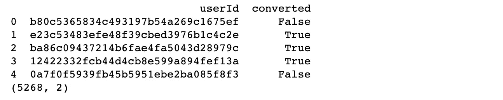
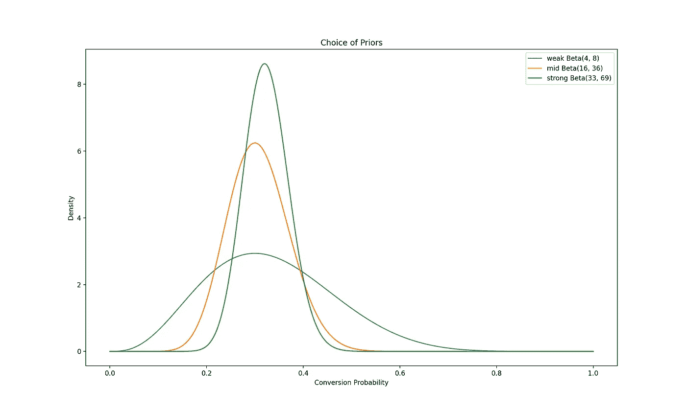
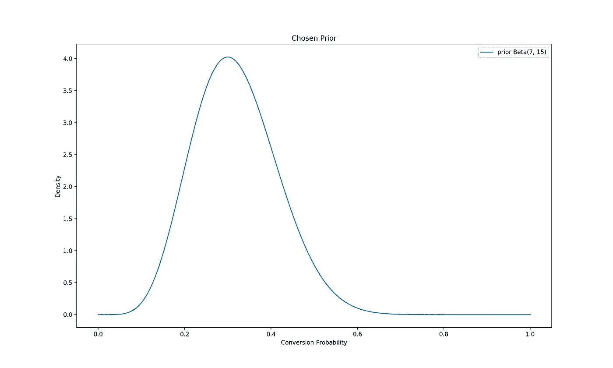
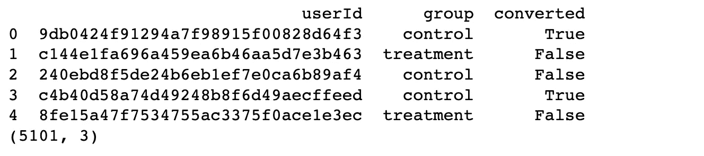
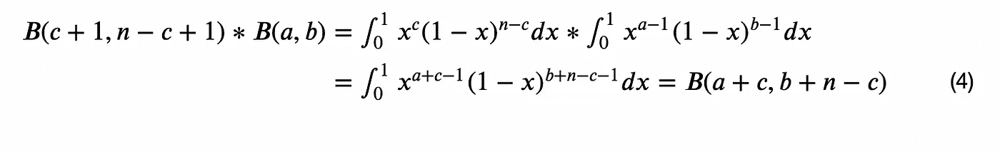
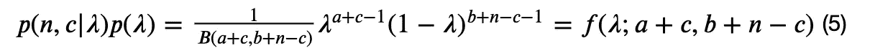
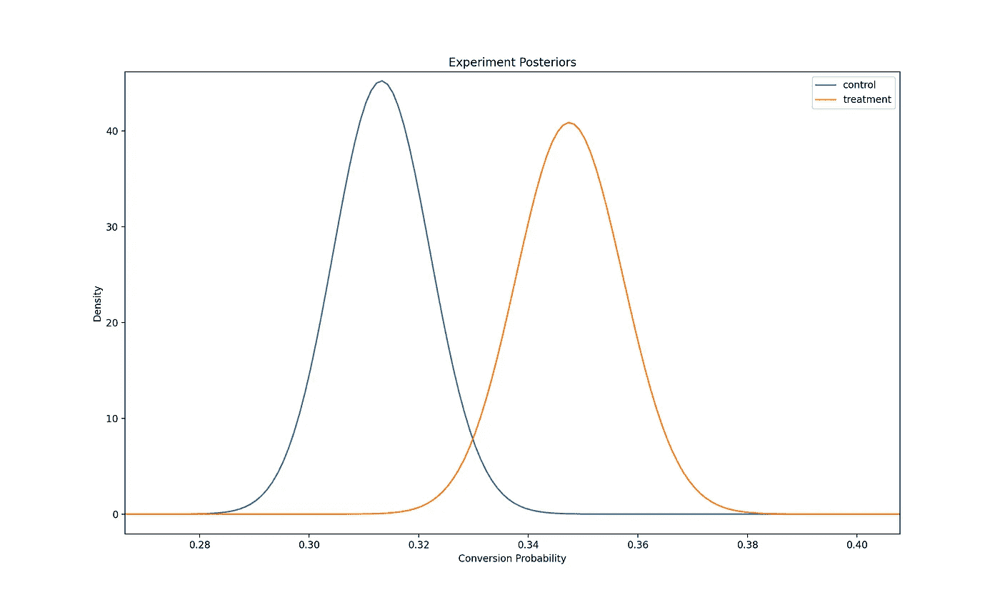
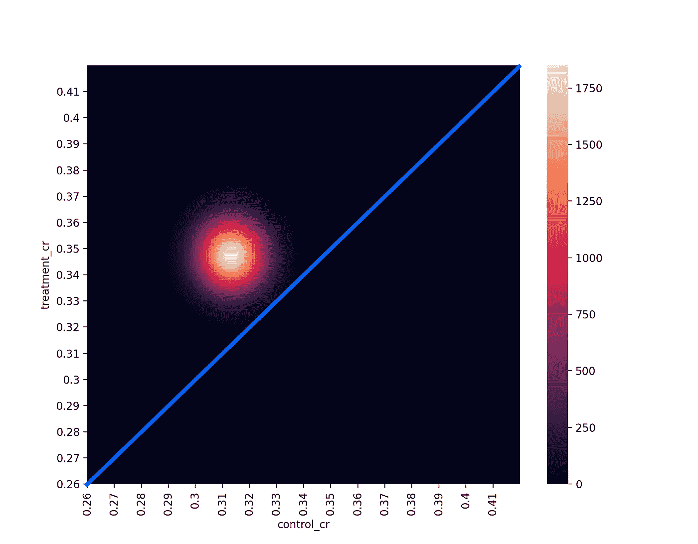
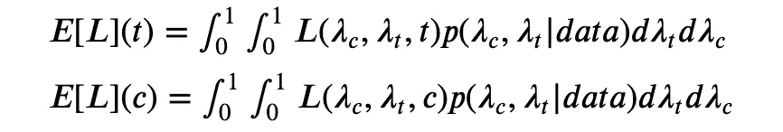
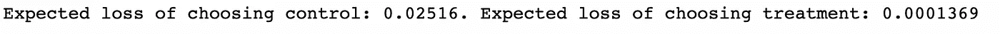

# 贝叶斯 AB 检验—第一部分—转换

> 原文：<https://towardsdatascience.com/bayesian-ab-testing-part-i-conversions-ac2635f878ec?source=collection_archive---------13----------------------->


在 [Unsplash](https://unsplash.com?utm_source=medium&utm_medium=referral) 上[庞浩文](https://unsplash.com/@raypang?utm_source=medium&utm_medium=referral)的照片

# 系列结构

在[之前的一篇博文](/bayesian-experimentation-methods-for-products-636514951e43)中，我讨论了使用贝叶斯 AB 测试方法而不是频繁测试方法的优势。在这一系列的博客文章中，我将更深入地研究相关的计算，以及如何在现实世界中实现它们。该系列的结构如下:

1.  基于转换的测试度量(速率度量)的建模和分析
2.  [基于收入的测试指标的建模和分析](/bayesian-ab-testing-part-ii-revenue-1fbcf04f96cd)
3.  [计算测试持续时间](/bayesian-ab-testing-part-iii-test-duration-f2305215009c)
4.  [选择一个合适的先验](/bayesian-ab-testing-part-iv-choosing-a-prior-5a4fe3223bfd)
5.  用多个变量运行测试

因此，废话不多说，让我们进入如何在贝叶斯产品实验中建模、使用和分析基于转换的测试指标。

# 实验背景

根据在[上一篇文章](/bayesian-experimentation-methods-for-products-636514951e43)中使用的例子，让我们假设我们最近改变了追加销售屏幕上的信息，并希望在向更广泛的用户群发布之前进行 AB 测试。我们假设我们所做的改变将会带来更好的转化率。

与 frequentist 方法类似，我们可以将𝑋促销屏幕上的每次转换建模为伯努利随机变量，转换概率为𝜆:


在频率主义方法下，我们假设𝜆是一个常数，而在贝叶斯方法下，我们将其建模为一个随机变量，有自己的概率分布。我们的第一步是使用过去的数据为这个分布选择一个合适的近似值。我们称之为我们之前的𝜆.分布

然后，我们设定损失阈值，这是我们在犯错时愿意接受的最大预期损失。与任何统计建模一样，贝叶斯实验方法是建立在真实世界数据的近似值之上的。因此，我们总是有可能从测试中得出错误的结论。这个损失阈值让我们可以说，即使我们得出了错误的结论，我们也可以确信转化率不会下降超过我们可以接受的水平。

最后，我们以随机实验的形式抽取样本，并使用这些样本来更新分布，从而更新我们关于𝜆在追加销售屏幕的控制和治疗版本下的信念。我们可以使用这些后验分布来计算治疗优于对照组的概率以及错误选择治疗的预期损失。

所以我们的第一步是选择𝜆.的先验分布要做到这一点，我们可以看看我们最近(过去几周)收集的关于这一转换的数据。我生成了一个样本先验数据集，我们可以用它来做这个练习。

```
import pandas as pdprior_data = pd.read_csv('prior_data.csv')

print(prior_data.head())
print(prior_data.shape)
```



因为这个数据集是人工生成的，所以它已经是这个练习的理想格式。在现实世界中，我们可能需要执行一些 ETL 操作来获得这种格式的数据。然而，这超出了本文的范围。

我们看到我们有 5268 个用户的样本大小，对于每个用户，我们可以看到他们是否在这个屏幕上转换。我们可以继续计算之前的转换率。

```
conversion_rate = prior_data['converted'].sum()/prior_data.shape[0]print(f'Prior Conversion Rate is {round(conversion_rate, 3)}')
```


# 选择先验分布

我们看到先前的数据给出了大约 30%的转化率。我们现在用它来为𝜆.选择一个先验分布选择先验是贝叶斯实验方法的一个重要方面，值得单独发表。我将在本系列的第 4 部分中对此进行更深入的探讨。然而，为了这篇文章的目的，我将使用一个粗略的方法来选择一个先验。

我们将使用 [beta 分布](https://en.wikipedia.org/wiki/Beta_distribution)来模拟我们的转换率，因为它是[0，1]上的灵活分布，也是良好的[共轭先验](https://en.wikipedia.org/wiki/Conjugate_prior)。当我们用实验数据计算后验概率时，这将使我们的计算更容易。

为我们的转换选择先验分布时，最好选择比先验数据建议的更弱的先验。我将在本系列的第 4 部分再次深入探讨这个问题，但是本质上，选择太强的先验可能导致我们的后验分布是错误的，因此可能导致错误的计算和结论。

记住这一点，让我们看看不同强度的潜在前科。

```
import numpy as np
from scipy.stats import beta
import matplotlib.pyplot as pltfig, ax = plt.subplots(1, 1)x = np.linspace(0,1,1000)beta_weak = beta(round(conversion_rate, 1)*10 + 1, 10 + 1 - round(conversion_rate, 1)*10)beta_mid = beta(round(conversion_rate, 1)*50 + 1, 50 + 1 - round(conversion_rate, 1)*50)beta_strong = beta(round(conversion_rate, 2)*100 + 1, 100 + 1 - round(conversion_rate, 2)*100)ax.plot(x, beta_weak.pdf(x), label=f'weak Beta({int(round(conversion_rate, 1)*10) + 1}, {10 + 1 - int(round(conversion_rate, 1)*10)})')ax.plot(x, beta_mid.pdf(x), label=f'mid Beta({int(round(conversion_rate, 1)*50) + 1}, {50 + 1 - int(round(conversion_rate, 1)*50)})')ax.plot(x, beta_strong.pdf(x), label=f'strong Beta({int(round(conversion_rate, 2)*100) + 1}, {100 + 1 - int(round(conversion_rate, 2)*100)})')ax.set_xlabel('Conversion Probability')
ax.set_ylabel('Density')
ax.set_title('Choice of Priors')
ax.legend()
```



先验选择(图片由作者提供)

这里我们可以看到三个先验分布，它们的平均转换率约为 30%，与我们的先验数据相似，但都比先验数据的真实分布弱得多。

让我们选择一个在图中最弱和中等先验之间的先验(𝐵𝑒𝑡𝑎(7,15)


其中𝐵(𝑎,𝑏)是被定义为[的β函数](https://en.wikipedia.org/wiki/Beta_function)


并且具有该属性


```
prior_alpha = round(conversion_rate, 1)*20 + 1
prior_beta = 20 + 1 - round(conversion_rate, 1)*20prior = beta(prior_alpha, prior_beta)fig, ax = plt.subplots(1, 1)x = np.linspace(0,1,1000)ax.plot(x, prior.pdf(x), label=f'prior Beta({int(round(conversion_rate, 1)*20) + 1}, {20 + 1 - int(round(conversion_rate, 1)*20)})')
ax.set_xlabel('Conversion Probability')
ax.set_ylabel('Density')
ax.set_title('Chosen Prior')
ax.legend()
```



选择的先验(图片由作者提供)

# 设置损失阈值

既然我们已经选择了先验，我们需要选择我们的𝜖，这是我们在错误选择错误变量的情况下愿意接受的最高预期损失。让我们假设这对我们来说是一个重要的转变，所以我们希望对这个𝜖.相当保守我们不愿意接受超过 0.5%的相对预期损失。所以我们设定𝜖=0.005∗0.3=0.0015.

我们有一个预期损失的先验和阈值，所以我们可以开始运行我们的实验并从中收集数据。

# 实验结果

让我们假设我们已经让我们的实验运行了几个星期，并想检查我们是否能从中得出任何结论。为了做到这一点，我们需要使用我们的实验数据来计算我们的后验分布，然后我们可以使用它来计算每个变量变得更好的概率，以及错误选择每个变量的预期损失。

出于本练习的目的，我生成了一个样本实验数据集。让我们从探索它和聚合它开始，找出每个变体的转换率。

```
experiment_data = pd.read_csv('experiment_data.csv')print(experiment_data.head())
print(experiment_data.shape)
```



我们看到该数据集与之前的数据集相似，只是多了一列，用于指定用户被分配到哪个组，以及他们看到哪个变量。再次值得注意的是，由于这个数据集是人工生成的，它已经是这个练习的理想格式，不需要额外的 ETL 操作。

我们现在可以开始汇总数据了。

```
results = experiment_data.groupby('group').agg({'userId': pd.Series.nunique, 'converted': sum})results.rename({'userId': 'sampleSize'}, axis=1, inplace=True)results['conversionRate'] = results['converted']/results['sampleSize']print(results)
```


我们可以通过观察得知治疗有更好的转化率，但我们需要进行进一步的计算，以更新我们对对照组和治疗组变异体各自的转化概率𝜆_𝑐和𝜆_𝑡的看法。

有了我们的实验数据，我们现在可以计算每个变量下的后验分布。但在此之前，让我们探索一下，仅仅从我们现有的信息中，这是如何可能的背后的数学原理。我们将使用一个定理[1]陈述如下:

假设我们有先验知识


假设一个变体被展示给𝑛的访问者，而𝑐改变了信仰，那么该变体的后验分布由下式给出


让我们继续证明这一点。根据贝叶斯定理，我们得到了


由于我们将每次转换建模为具有概率𝜆的伯努利 RV，给定𝜆，我们可以将向𝑛游客展示变量的结果建模为二项式 RV。所以我们有


因此，使用我们先前的定义


现在让我们只考虑系数


利用贝塔函数的定义，我们可以说



将(3)和(4)替换回(2)



将(5)替换回(1)


自𝑓(𝜆以来；𝑎+𝑐,𝑏+𝑛−𝑐)是在[0，1]上的分布，分母是 1，我们得到了我们想要的结果。

现在我们已经充分相信了数学，我们可以计算我们的后验分布。

```
control = beta(prior_alpha + results.loc['control', 'converted'], prior_beta + results.loc['control', 'sampleSize'] - results.loc['control', 'converted'])treatment = beta(prior_alpha + results.loc['treatment', 'converted'], prior_beta + results.loc['treatment', 'sampleSize'] - results.loc['treatment', 'converted'])fig, ax = plt.subplots()x = np.linspace(0.26,0.42,1000)ax.plot(x, control.pdf(x), label='control')
ax.plot(x, treatment.pdf(x), label='treatment')
ax.set_xlabel('Conversion Probability')
ax.set_ylabel('Density')
ax.set_title('Experiment Posteriors')
ax.legend()
```



实验后验(图片由作者提供)

现在我们已经得到了后验分布，我们可以继续计算联合后验分布。由于随机实验是基于将用户随机分配到一个变量的想法，我们可以假设这两个分布是独立的。请注意，情况并非总是如此。例如，在某些情况下，网络效应可能会发挥作用，我们需要考虑到这一点。这种假设也依赖于随机分配过程的正常工作。

让我们假设我们的随机分配方法工作正常，没有网络效应。在这种假设下，我们可以说:


让我们用这个来计算我们的联合后验分布。

```
import seaborn as snsjoint_dist_for_plot = []
for i in np.linspace(0.26,0.42,161):
    for j in np.linspace(0.26,0.42,161):
        joint_dist_for_plot.append([i, j, control.pdf(i)*treatment.pdf(j)])joint_dist_for_plot = pd.DataFrame(joint_dist_for_plot)joint_dist_for_plot.rename({0: 'control_cr', 1: 'treatment_cr', 2: 'joint_density'}, axis=1, inplace=True)tick_locations = range(0, 160, 10)
tick_labels = [round(0.26 + i*0.01, 2) for i in range(16)]heatmap_df = pd.pivot_table(joint_dist_for_plot, values='joint_density', index='treatment_cr', columns='control_cr')ax = sns.heatmap(heatmap_df)
ax.set_xticks(tick_locations)
ax.set_xticklabels(tick_labels)
ax.set_yticks(tick_locations)
ax.set_yticklabels(tick_labels)
ax.invert_yaxis()
```



关节后部(图片由作者提供)

图表中的蓝线代表𝜆_𝑐=𝜆_𝑡.由于后关节在这条线以上，我们可以用它作为治疗效果更好的直观指示。如果后关节在这条线以下，那么我们可以很确定控制会更好。如果关节后部的任何部分在线上，那么哪种变型更好就有更多的不确定性。

为了量化这一点，我们需要计算𝑝(𝜆_𝑡≥𝜆_𝑐)和𝐸[𝐿](𝑡)，错误选择治疗的预期损失。

```
import decimal
decimal.getcontext().prec = 4control_simulation = np.random.beta(prior_alpha + results.loc['control', 'converted'], prior_beta + results.loc['control', 'sampleSize'] - results.loc['control', 'converted'], size=10000)treatment_simulation = np.random.beta(prior_alpha + results.loc['treatment', 'converted'], prior_beta + results.loc['treatment', 'sampleSize'] - results.loc['treatment', 'converted'], size=10000)treatment_won = [i <= j for i,j in zip(control_simulation, treatment_simulation)]chance_of_beating_control = np.mean(treatment_won)print(f'Chance of treatment beating control is {decimal.getcontext().create_decimal(chance_of_beating_control)}')
```


从模拟中我们看到𝑝(𝜆_𝑡≥𝜆_𝑐)=0.9718 so 治疗有 97%的机会比对照组好。

既然我们已经计算了治疗效果更好的可能性，我们需要计算𝐸[𝐿](𝑡).每个变量的损失函数由下式给出


因此，每个变量的预期损失由下式给出



我们用这个来计算预期损失[2]

```
decimal.getcontext().prec = 4loss_control = [max(j - i, 0) for i,j in zip(control_simulation, treatment_simulation)]loss_treatment = [max(i - j, 0) for i,j in zip(control_simulation, treatment_simulation)]all_loss_control = [int(i)*j for i,j in zip(treatment_won, loss_control)]all_loss_treatment = [(1 - int(i))*j for i,j in zip(treatment_won, loss_treatment)]expected_loss_control = np.mean(all_loss_control)
expected_loss_treatment = np.mean(all_loss_treatment)print(f'Expected loss of choosing control: {decimal.getcontext().create_decimal(expected_loss_control)}. Expected loss of choosing treatment: {decimal.getcontext().create_decimal(expected_loss_treatment)}')
```



通过运行模拟，我们看到:

𝐸[𝐿](𝑡) = 0.0001369 < 0.0015 = 𝜖

因为其中一个变异的预期损失低于我们在测试开始时设定的阈值，所以测试达到了显著性。我们可以很有把握地得出结论，治疗效果更好，错误选择治疗的预期成本不会超过我们能接受的水平。因此，我们强烈建议将追加销售屏幕的处理方式推广到我们的其他用户群。

我希望这个案例研究有助于您理解实现贝叶斯 AB 测试方法所需的计算。观看这个空间的[系列的下一部分](/bayesian-ab-testing-part-ii-revenue-1fbcf04f96cd)！

# 参考

[1] [VWO 白皮书](https://cdn2.hubspot.net/hubfs/310840/VWO_SmartStats_technical_whitepaper.pdf)作者:C. Stucchio

[2] [贝叶斯 A/B 测试——一个模拟的实践探索](/exploring-bayesian-a-b-testing-with-simulations-7500b4fc55bc)作者 Blake Arnold——我使用了 Blake 代码中的逻辑来计算预期损失

我还发现迈克尔·弗拉斯科的《贝叶斯 A/B 测试的力量》非常有助于理解贝叶斯 A/B 测试方法的技术层面

我这篇文章的代码可以在[这里](https://github.com/ksureshkumar-loveshark/blogs_public/tree/main/Bayesian%20AB%20Testing/Conversions)找到

感谢阅读这篇文章！我希望它能帮助您更好地理解如何实现转换度量的贝叶斯 AB 测试方法。

*如果你喜欢阅读我的文章，愿意支持我的写作，并且正在考虑订阅一个媒体，请随时使用我下面的推荐链接。我会从你的订阅费中提成。*

[](https://medium.com/@kaushsk12/membership) [## 通过我的推荐链接加入 Medium

### 阅读 Kaushik Sureshkumar(以及媒体上成千上万的其他作家)的每一个故事。您的会员费直接…

medium.com](https://medium.com/@kaushsk12/membership)