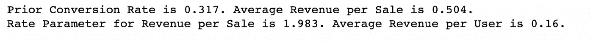
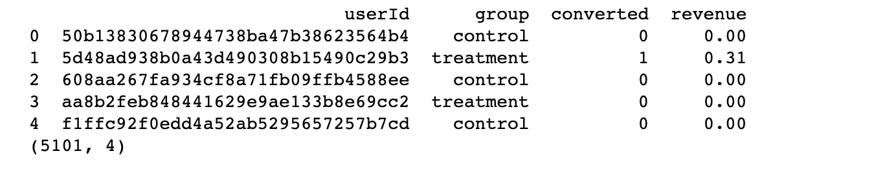
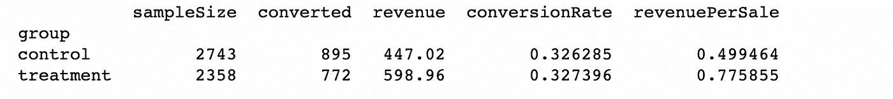
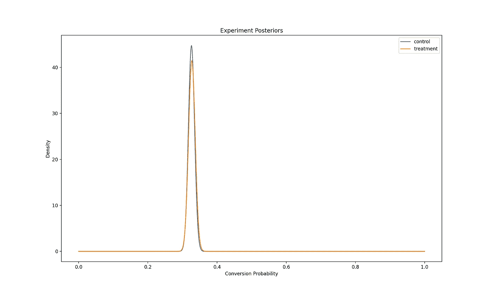
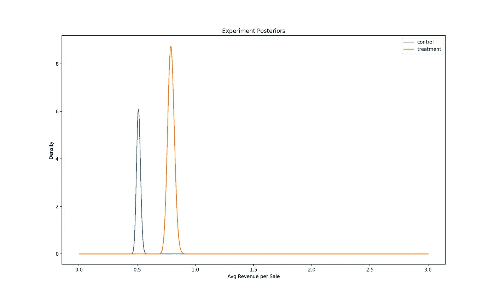
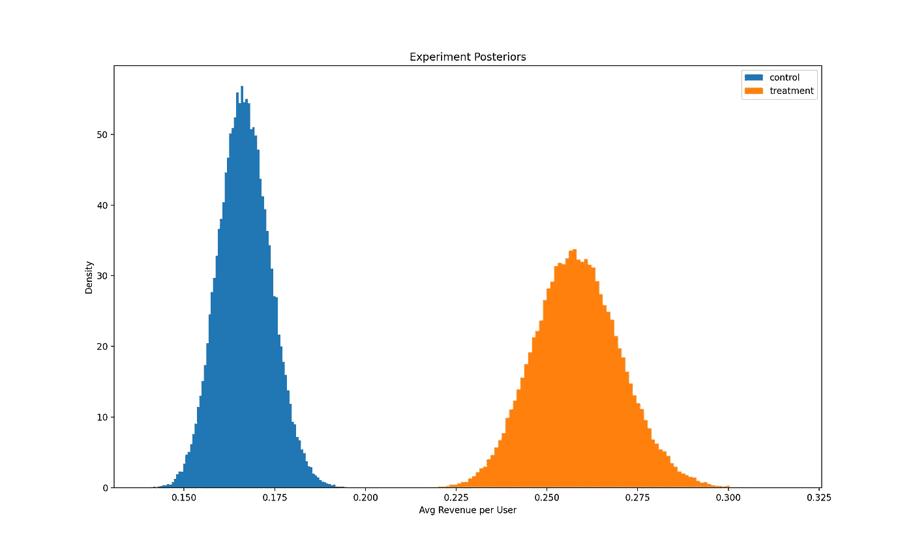
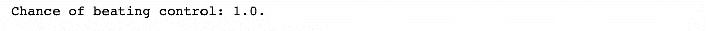
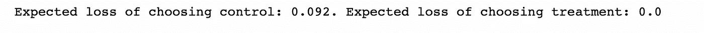

# 贝叶斯 AB 检验—第二部分—收入

> 原文：<https://towardsdatascience.com/bayesian-ab-testing-part-ii-revenue-1fbcf04f96cd?source=collection_archive---------10----------------------->


米歇尔·汉德森在 [Unsplash](https://unsplash.com?utm_source=medium&utm_medium=referral) 上的照片

# 系列结构

这篇文章是关于将贝叶斯 AB 测试方法应用于现实生活产品场景的系列博客文章的第二部分。它使用了在系列的第一部分[中讨论的一些概念。](/bayesian-ab-testing-part-i-conversions-ac2635f878ec)

1.  [基于转换的测试指标(速率指标)的建模和分析](/bayesian-ab-testing-part-i-conversions-ac2635f878ec)
2.  基于收入的测试指标的建模和分析(连续指标)
3.  [计算测试持续时间](/bayesian-ab-testing-part-iii-test-duration-f2305215009c)
4.  [选择一个合适的先验](/bayesian-ab-testing-part-iv-choosing-a-prior-5a4fe3223bfd)
5.  用多个变量运行测试

让我们开始讨论如何在贝叶斯产品实验中建模、使用和分析收入测试指标。

# 实验背景

假设我们最近对应用程序中的商店功能进行了 UX 更改。我们相信这些变化让我们的用户更容易进行更大的应用内购买，我们希望在向更广泛的用户群发布之前进行 AB 测试。我们假设我们所做的改变将导致每用户平均收入的显著提高。

我们将每个用户产生的收入建模为随机变量𝑅=𝑋∗𝑌，其中:

𝑋是一个伯努利随机变量，它指的是用户是否进行了购买，转换概率为𝜆:𝑋𝐵𝑒𝑟(𝜆)

𝑌是一个指数随机变量，指的是购买的规模，如果它是与利率参数𝜃:𝑌𝐸𝑥𝑝(𝜃)

在这个模型中，我们知道每笔销售的平均收入是由 1/𝜃给出的，每用户的平均收入是由𝜆/𝜃.给出的

我们分析的第一步是查看过去的数据，为该模型的关键参数𝜆和𝜃选择合适的先验分布。

接下来，我们设置一个损失阈值——在我们错误地推出错误变体的情况下，我们愿意接受的最大预期损失。与任何统计建模一样，贝叶斯实验方法是建立在真实世界数据的近似值之上的。因此，我们总是有可能从测试中得出错误的结论。这个损失阈值允许我们说，即使我们得出了错误的结论，我们也可以确信每个用户的平均收入不会下降超过这个阈值。

最后，我们以随机实验的形式抽取样本，并使用这些样本来更新分布，以及我们对商店控制和治疗版本下的𝜆和𝜃的信念。然后我们可以用这些后验分布来计算我们感兴趣的概率和预期损失。

为了给我们的参数选择先验分布，让我们先看看我们最近收集的一些过去的购买数据。我生成了一个样本先验数据集，我们可以用它来做这个练习。

```
import pandas as pd
import numpy as npprior_data = pd.read_csv('prior_data.csv')print(prior_data.head())
print(prior_data.shape)
```


因为这个数据集是人工生成的，所以它已经是这个练习的理想格式。在现实世界中，我们可能需要执行一些 ETL 操作来获得这种格式的数据。然而，这超出了本文的范围。

我们看到，我们有一个 5268 个用户的样本大小，对于每个用户，我们可以看到他们是否进行了购买。对于那些确实进行了购买的用户，我们还可以看到购买的规模。我们可以继续计算之前的转换率、每笔销售的平均收入、每笔销售收入的比率参数以及每用户的平均收入。

```
conversion_rate = prior_data['converted'].sum()/prior_data.shape[0]converted = prior_data[prior_data['converted'] == 1]
avg_purchase = converted['revenue'].mean()print(f'Prior Conversion Rate is {round(conversion_rate, 3)}. Average Revenue per Sale is {round(avg_purchase, 3)}.')print(f'Rate Parameter for Revenue per Sale is {round(1/avg_purchase, 3)}. Average Revenue per User is {round(conversion_rate*avg_purchase, 3)}.')
```



# 选择先验分布

利用上面的信息，我们可以选择𝜆和𝜃.的先验分布使用与前一篇文章相同的逻辑，我们可以为我们的转换概率𝜆.选择𝐵𝑒𝑡𝑎(7,15 的先验总之，我们选择使用[贝塔分布](https://en.wikipedia.org/wiki/Beta_distribution)，因为它是[0，1]上的灵活分布，并且在之前是一个好的[共轭。](https://en.wikipedia.org/wiki/Conjugate_prior)

对于𝜃，每笔销售收入的比率参数，我们将使用[伽马分布](https://en.wikipedia.org/wiki/Gamma_distribution)，因为它是一个在[0，∞)上的灵活分布，也是一个很好的共轭先验。当我们用实验数据计算后验概率时，这将使我们的计算更容易。

我们可以选择非常弱的先验分布𝐺𝑎𝑚𝑚𝑎(0.1，0.1)。[1]

# 设置损失阈值

既然我们已经选择了先验，我们需要选择我们的𝜖，这是我们在错误选择错误变量的情况下愿意接受的最高预期损失。让我们假设商店不是我们的主要收入来源，但它对我们非常重要，所以我们希望在这个𝜖.上保守一些我们可以设定𝜖 = 0.005。

我们有先验分布和预期损失的阈值，所以我们可以开始运行我们的实验并从中收集数据。

# 实验结果

让我们假设我们已经让我们的实验运行了几个星期，并想检查我们是否能从中得出任何结论。为了做到这一点，我们需要使用我们的实验数据来计算我们的后验分布，然后我们可以使用它来计算每个变量变得更好的概率，以及错误选择每个变量的预期损失。

出于本练习的目的，我生成了一个样本实验数据集。让我们从探索它开始。

```
experiment_data = pd.read_csv('experiment_data.csv')print(experiment_data.head())
print(experiment_data.shape)
```



我们看到该数据集与之前的数据集相似，只是多了一列，用于指定用户被分配到哪个组，以及他们看到哪个变量。再次值得注意的是，由于这个数据集是人工生成的，它已经是这个练习的理想格式，不需要额外的 ETL 操作。

我们现在可以开始汇总数据了。

```
results = experiment_data.groupby('group').agg({'userId': pd.Series.nunique, 'converted': sum, 'revenue': sum})results.rename({'userId': 'sampleSize'}, axis=1, inplace=True)results['conversionRate'] = results['converted']/results['sampleSize']results['revenuePerSale'] = results['revenue']/results['converted']
print(results)
```



经检查，似乎两组有相似的转换率，但治疗有更好的每销售收入。然而，为了更新我们关于𝜆和𝜃的两种变体的信念，我们需要进行进一步的计算。

使用前一篇文章的[中概述的计算，我们可以计算两个变量的𝜆后验分布。](/bayesian-ab-testing-part-i-conversions-ac2635f878ec)

```
from scipy.stats import beta, gamma
import seaborn as sns
import matplotlib.pyplot as pltcontrol_cr = beta(7 + results.loc['control', 'converted'], 15 + results.loc['control', 'sampleSize'] - results.loc['control', 'converted'])treatment_cr = beta(7 + results.loc['treatment', 'converted'], 15 + results.loc['treatment', 'sampleSize'] - results.loc['treatment', 'converted'])fig, ax = plt.subplots()x = np.linspace(0,1,1000)ax.plot(x, control_cr.pdf(x), label='control')
ax.plot(x, treatment_cr.pdf(x), label='treatment')
ax.set_xlabel('Conversion Probability')
ax.set_ylabel('Density')
ax.set_title('Experiment Posteriors')
ax.legend()
```



转换后验概率(图片由作者提供)

𝜆_𝑐和𝜆_𝑡的后验分布几乎相同。通过观察我们可以看出，处理对转换概率没有大的影响。

让我们来看看它是如何影响收入的比率参数的。我们将使用下面的结果[2]来计算𝜃_𝑐和𝜃_𝑡:

假设先验

𝜃 ∼ 𝐺𝑎𝑚𝑚𝑎(𝑘, Θ)

假设向𝑛游客展示了一个变种。𝑐换算成每销售𝑠.的平均收入然后，后验分布由下式给出

𝜃|𝑐,𝑠 ∼ 𝐺𝑎𝑚𝑚𝑎(𝑘 + 𝑐, Θ/(1 + Θ𝑐𝑠))

(如果你对这个结果背后的数学原理感到好奇，这里有[的证明](https://cdn2.hubspot.net/hubfs/310840/VWO_SmartStats_technical_whitepaper.pdf)。)

让我们继续计算我们的后验概率𝜃_𝑐和𝜃_𝑡.

```
control_rr = gamma(a=(0.1 + results.loc['control', 'converted']), scale=(0.1/(1 + (0.1)*results.loc['control', 'converted']*results.loc['control', 'revenuePerSale'])))treatment_rr = gamma(a=(0.1 + results.loc['treatment', 'converted']), scale=(0.1/(1 + (0.1)*results.loc['treatment', 'converted']*results.loc['treatment', 'revenuePerSale'])))fig, ax = plt.subplots()x = np.linspace(0,3,1000)ax.plot(x, control_rr.pdf(x), label='control')
ax.plot(x, treatment_rr.pdf(x), label='treatment')
ax.set_xlabel('Rate Parameter')
ax.set_ylabel('Density')
ax.set_title('Experiment Posteriors')
ax.legend()
```


费率参数(每笔销售收入)后验概率(图片由作者提供)

后验分布根本没有重叠，所以我们可以相当确定其中一个变量比另一个更好。处理率参数低于控制率参数，因此更好，因为它将导致更高的平均销售收入。为了更清楚地看到这一点，让我们画出在这些后验概率下每笔销售的平均收入的分布。

```
fig, ax = plt.subplots()x = np.linspace(0,3,1000)
z = [1/i for i in x]ax.plot(x, control_rr.pdf(z), label='control')
ax.plot(x, treatment_rr.pdf(z), label='treatment')
ax.set_xlabel('Avg Revenue per Sale')
ax.set_ylabel('Density')
ax.set_title('Experiment Posteriors')
ax.legend()
```



每笔销售的平均收入(图片由作者提供)

我们可以清楚地看到，治疗组的平均销售收入高于对照组。

所以两种变体有相似的转换率，但是 treatment 有更好的每笔销售的平均收入，所以它也必须有更好的每用户平均收入。让我们画出每个用户平均收入的后验概率来证实这一点。我们可以进行一些模拟来帮助我们。

```
control_conversion_simulation = np.random.beta(7 + results.loc['control', 'converted'], 15 + results.loc['control', 'sampleSize'] - results.loc['control', 'converted'], size=100000)treatment_conversion_simulation = np.random.beta(7 + results.loc['treatment', 'converted'], 15 + results.loc['treatment', 'sampleSize'] - results.loc['treatment', 'converted'], size=100000)control_revenue_simulation = np.random.gamma(shape=(0.1 + results.loc['control', 'converted']), scale=(0.1/(1 + (0.1)*results.loc['control', 'converted']*results.loc['control', 'revenuePerSale'])), size=100000)treatment_revenue_simulation = np.random.gamma(shape=(0.1 + results.loc['treatment', 'converted']), scale=(0.1/(1 + (0.1)*results.loc['treatment', 'converted']*results.loc['treatment', 'revenuePerSale'])), size=100000)control_avg_purchase = [i/j for i,j in zip(control_conversion_simulation, control_revenue_simulation)]treatment_avg_purchase = [i/j for i,j in zip(treatment_conversion_simulation, treatment_revenue_simulation)]fig, ax = plt.subplots()x = np.linspace(0,1,1000)ax.hist(control_avg_purchase, density=True, label='control', histtype='stepfilled', bins=100)
ax.hist(treatment_avg_purchase, density=True, label='treatment', histtype='stepfilled', bins=100)
ax.set_xlabel('Avg Revenue per User')
ax.set_ylabel('Density')
ax.set_title('Experiment Posteriors')
ax.legend()
```



每用户平均收入(图片由作者提供)

治疗组的平均收入明显高于对照组。通过检查这些后验，我们可以很有把握地认为治疗是更好的。然而，为了量化这一点，我们需要计算𝑝(𝜆_𝑡/𝜃_𝑡 ≥ 𝜆_𝑐/𝜃_𝑐)和𝐸[𝐿](𝑡)，错误选择治疗的预期损失。

```
treatment_won = [i <= j for i,j in zip(control_avg_purchase, treatment_avg_purchase)]chance_to_beat_ctrl = np.mean(treatment_won)
print(f'Chance of beating control: {round(chance_to_beat_ctrl, 3)}.')
```



从模拟中我们看到𝑝(𝜆_𝑡/𝜃_𝑡 ≥ 𝜆_𝑐/𝜃_𝑐) = 1，所以治疗有 100%的机会比对照组好。

既然我们已经计算了治疗效果更好的可能性，我们需要计算𝐸[𝐿](𝑡).每个变量的损失函数由下式给出


我们用这个来计算预期损失。

```
loss_control = [max(j - i, 0) for i,j in zip(control_avg_purchase, treatment_avg_purchase)]loss_treatment = [max(i - j, 0) for i,j in zip(control_avg_purchase, treatment_avg_purchase)]all_loss_control = [int(i)*j for i,j in zip(treatment_won, loss_control)]all_loss_treatment = [(1 - int(i))*j for i,j in zip(treatment_won, loss_treatment)]expected_loss_control = np.mean(all_loss_control)
expected_loss_treatment = np.mean(all_loss_treatment)print(f'Expected loss of choosing control: {round(expected_loss_control, 3)}. Expected loss of choosing treatment: {round(expected_loss_treatment, 3)}')
```



从运行模拟中我们看到

𝐸[𝐿](𝑡)=0 < 0.005=𝜖.

因为其中一个变异的预期损失低于我们在测试开始时设定的阈值，所以测试达到了显著性。我们可以很有把握地得出结论，治疗效果更好，错误选择治疗的预期成本不会超过我们能接受的水平。因此，我们强烈建议将追加销售屏幕的处理方式推广到我们的其他用户群。

我希望这个案例研究有助于您理解实现贝叶斯 AB 测试方法所需的计算。观看这个空间的[系列的下一部分](/bayesian-ab-testing-part-iii-test-duration-f2305215009c)！

# 参考

[1] [通过 Omri Fima 的贝叶斯 A/B 测试优化收入](https://medium.com/ni-tech-talk/optimizing-revenue-with-bayesian-a-b-testing-5068e8ac41ea)

[2] [VWO 白皮书](https://cdn2.hubspot.net/hubfs/310840/VWO_SmartStats_technical_whitepaper.pdf)作者:C.Stucchio

我这篇文章的代码可以在[这里](https://github.com/ksureshkumar-loveshark/blogs_public/tree/main/Bayesian%20AB%20Testing/Revenue)找到

感谢阅读这篇文章！我希望它能帮助您更好地理解如何为收入和其他计数指标实现贝叶斯 AB 测试方法。

如果你喜欢阅读我的文章，愿意支持我的写作，并且正在考虑订阅一个媒体，请随时使用我下面的推荐链接。我会从你的订阅费中提成。

<https://medium.com/@kaushsk12/membership> 