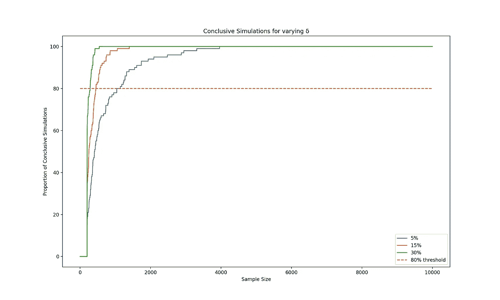

# 贝叶斯 AB 测试第三部分测试持续时间

> 原文：<https://towardsdatascience.com/bayesian-ab-testing-part-iii-test-duration-f2305215009c?source=collection_archive---------22----------------------->

在 [Unsplash](https://unsplash.com?utm_source=medium&utm_medium=referral) 上由 [Aron 视觉](https://unsplash.com/@aronvisuals?utm_source=medium&utm_medium=referral)拍摄的照片

# 系列结构

这篇文章是将贝叶斯 AB 测试方法应用于现实生活产品场景的系列博客文章的第三部分。它使用了在系列的第一部分[中讨论的一些概念。](/bayesian-ab-testing-part-i-conversions-ac2635f878ec)

1.  [基于转换的测试指标(速率指标)的建模和分析](/bayesian-ab-testing-part-i-conversions-ac2635f878ec)
2.  [基于收入的测试指标(持续指标)的建模和分析](/bayesian-ab-testing-part-ii-revenue-1fbcf04f96cd)
3.  计算测试持续时间
4.  [选择一个合适的先验](/bayesian-ab-testing-part-iv-choosing-a-prior-5a4fe3223bfd)
5.  用多个变量运行测试

# 实验背景

根据[上一篇文章](/bayesian-ab-testing-part-i-conversions-ac2635f878ec)中使用的示例，我们假设我们最近更改了追加销售屏幕上的信息，并希望在向更广泛的用户群发布之前进行 AB 测试。我们假设我们所做的改变将会带来更好的转化率。

我们继续将转换率建模为具有转换概率𝜆的伯努利随机变量，进而我们使用𝐵𝑒𝑡𝑎(7,15).的先验分布进行建模然后我们选择我们的预期损失阈值𝜖 = 0.0015。我们现在准备运行我们的测试，但是我们要运行多长时间呢？

在我们深入分析来回答这个问题之前，让我们首先考虑一下测试持续时间实际上意味着什么。以下公式给出了计算测试持续时间的常用方法:

测试中包含的变量数量和用户比例是在测试设计过程中就已经决定的因素。我们预计一周内的用户数量是基于前几周的数据进行的简单计算。所以本质上，问题归结为在实验中为每个变体选择一个合理的所需样本量。

人们经常建议，贝叶斯产品实验应该运行，直到其中一个变量的预期损失低于我们的阈值𝜖，在这一点上，我们宣布该变量为赢家。这样我们就不需要担心计算所需的样本量。然而，遵循这种方法可能会导致我们错误地选择一个变体来推出，因为这是一个被称为[窥视](http://varianceexplained.org/r/bayesian-ab-testing/) [1]的概念。为了进一步探讨这一点，让我们考虑下面的例子。

# 偷看

让我们考虑一下𝜆_𝑐和𝜆_𝑡非常相似的情况。我们模拟运行 AB 测试，并期望结果是非决定性的。然而，我们看到以下结果。

偷看例子(图片由作者提供)

我们从右侧的转换率中可以看出，𝜆_𝑐和𝜆_𝑡在前 1000 个样本中趋于一致。然而，更有趣的观察是关于左边的图表。我们看到，在前几个样本中，控制预期损失低于阈值。如果我们在这里停止测试，我们会得出控制明显优于治疗的结论，这将是错误的结论。我们还看到，如果我们在这里不停止测试，根据我们停止测试的时间，所有三种结果(对照组获胜、治疗组获胜和非决定性测试)都是可能的。那么我们如何决定何时停止测试呢？

运行我们实验的模拟将帮助我们避免落入窥视的陷阱，并最终帮助我们为每个变量选择一个合理的所需样本量。在我们研究这是如何工作的之前，让我们考虑下面的警告。

# 警告

下面提出的方法的主要警告是，它没有考虑任何选择测试持续时间的实验设计参数。特别是，它没有考虑任何季节或基于时间的转换变化。在现实世界中，您用作测试指标的转换很可能会根据一周中的某一天甚至一天中的某个时间而变化。因此，为了避免由于季节变化而得出错误的结论，至少运行几周的测试是值得的。我建议使用这篇文章中概述的方法来计算运行测试需要多长时间。

# 样本量计算

影响所需样本量的主要因素有三个:

*   可察觉的最小影响𝛿—𝜆的最小变化我们需要推广治疗
*   预期损失阈值𝜖——在我们错误宣布赢家的情况下，我们愿意接受的转化率的最大损失
*   转换概率𝜆标度

我们将在后面的文章中深入探讨这些因素是如何影响样本量的，但是让我们先建立一个计算合理样本量的过程。

让我们先给上述因素赋值。我们对实验进行了 100 次模拟，平均先验转换率为 32%，预期损失阈值𝜖为 0.0015，相对最小可检测效应为 15%(因此我们寻找𝜆_𝑡≥0.15∫𝜆_𝑐).

现在让我们来研究一下模拟数据。

实验模拟(图片由作者提供)

通过检查，我们可以看到，在通过处理达到最小可检测效果的情况下，大多数实验在我们达到每个变体 2000 个样本时结束。然而，我们仍然需要对 4000 个用户进行测试，这是一个很大的数字，可能需要一段时间。因此，让我们看看我们是否可以减少这一点，同时仍然非常肯定，测试将是决定性的。

为了停止测试，我们需要设置一个最小样本数，这样我们就不会掉进偷看的陷阱。让我们放大上面的预期损失图来选择这个最小样本数。

实验模拟—放大低样本量(图片由作者提供)

再次，通过仔细观察，我们可以看到，如果我们将最小样本量设置为 200，大多数假阳性(选择控制的预期损失低于阈值的情况)都可以被消除。我们现在继续，并绘制在每个模拟中需要多少样本来宣布获胜者[2]，假设每个变体至少观察到 200 个样本。

结论性模拟(图片由作者提供)

我们看到，我们只需要每个变体 450 个样本，80%的测试就能得出结论。因此，如果我们决定运行测试，直到我们有 900 个样本，然后，鉴于最低可检测的影响，我们有 80%的机会，测试将是决定性的。因此，我们看到，我们很可能找到一个比我们原来认为的少 3100 个样本的结论性结果。

应用同样的逻辑，现在让我们看看我们前面讨论的差异因素是如何影响所需样本量的。

# 最小可检测效应

最小可检测效应𝛿是我们想要检测的𝜆的最小相对百分比变化。这是最小的变化，将使治疗值得推出给我们的用户群。让我们看看这个𝛿如何影响我们的样本量计算。当从{0.05，0.15，0.3}中选择𝛿时，我们将使用 32%的先前平均转换率和 0.0015 的预期损失阈值。

𝛿变化的决定性模拟(图片由作者提供)

我们发现，最低可检测效应越高，80%的决定性试验所需的每个变异体的样本量越低，反之亦然。选择 5%的𝛿将要求我们总共获得大约 2100 个样本，而选择 30%的𝛿将要求我们总共只获得大约 600 个样本。直觉上，这是有意义的，因为转换概率的变化越大，我们需要确定它的样本就越少。

# 预期损失阈值

预期损失阈值𝜖是在我们错误地选择了一个变量的情况下，我们愿意接受的最大预期损失。这是我们在这种情况下最大的预期转化率下降。让我们看看这个𝜖如何影响我们的样本量计算。当从{0.0005，0.0015，0.003}中选择𝜖时，我们将使用 32%的先验平均转化率和 15%的最小可检测效应。

𝜖变化的决定性模拟(图片由作者提供)

我们看到，预期损失阈值越高，80%的检验所需的每个变量的样本量越低，反之亦然。选择 0.0005 的𝜖将需要我们总共获得大约 1350 个样本，而选择 0.003 的𝜖将需要我们总共仅获得大约 650 个样本。所需样本量的变化小于最小可检测效应的情况，因为𝜖的变化规模不同于𝛿.的变化规模然而，概念是相似的，预期损失阈值越低，我们就越想确定实验的结果，因此所需的样本量就越大。

# 转换概率的标度

现在让我们看看测试中使用的转换概率的比例如何影响我们的样本大小计算。我们将使用 15%的𝛿，并选择 0.005 的相对𝜖。我们在这种情况下使用了相对𝜖，因此分析更加公平，这与在之前的情况下使用𝜖 = 0.0015 相同，之前的平均转换率保持不变，为 32%。在这种情况下，我们将考虑{0.05，0.32，0.6}之前的平均转换率。

𝜆变化的决定性模拟(图片由作者提供)

我们看到一个有趣的结果。尽管对于较高的转换率，所需的样本量没有(相对)大的差异，但是随着转换率变低，所需的样本量变得不成比例地大。在计算所需的样本量时，这是一个需要牢记的重要概念。这是因为转换概率𝜆越低，𝜆的后验分布就越分散，因此我们需要更多的样本来减少这种分散。

我希望这篇文章对你估计贝叶斯产品实验的合理测试持续时间有所帮助，并理解影响它的因素。观看这个空间的[系列的下一部分](/bayesian-ab-testing-part-iv-choosing-a-prior-5a4fe3223bfd)！

# 参考

【1】[贝叶斯 AB 测试对偷看免疫吗？](http://varianceexplained.org/r/bayesian-ab-testing/)作者大卫·罗宾逊

[2] [贝叶斯 A/B 测试——布莱克·阿诺德的模拟实践探索](/exploring-bayesian-a-b-testing-with-simulations-7500b4fc55bc)——我从布莱克的帖子中获得了查看结论性模拟百分位数的想法

我这篇文章的代码可以在[这里](https://github.com/ksureshkumar-loveshark/blogs_public/tree/main/Bayesian%20AB%20Testing/Test%20Duration)找到