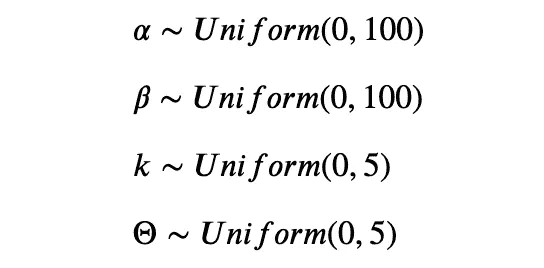
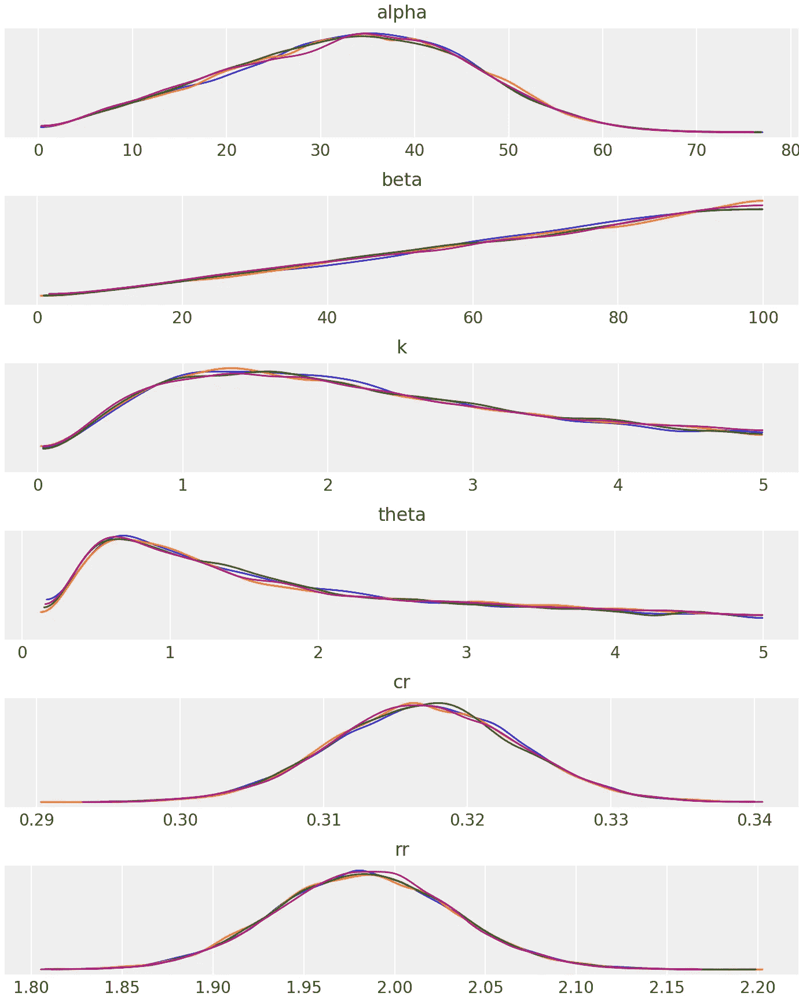
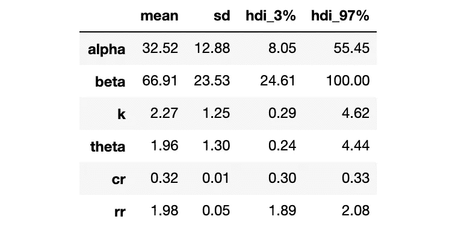
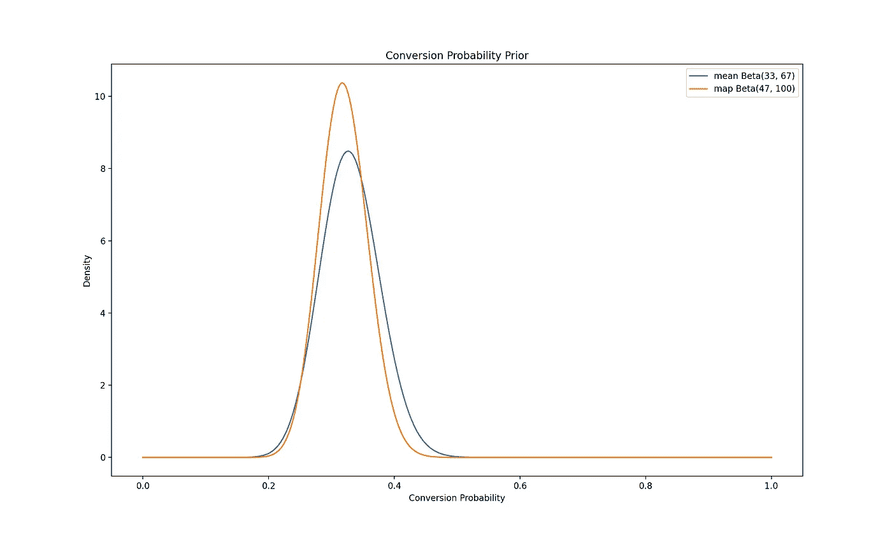
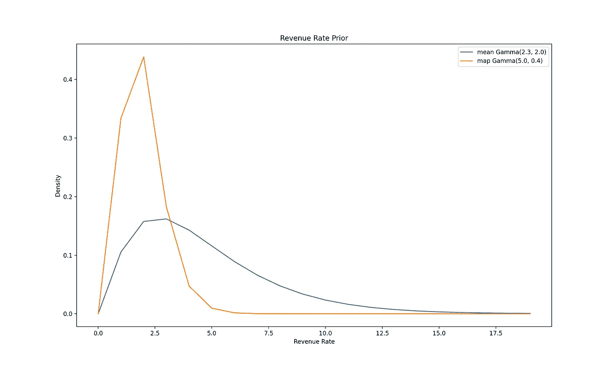

# 贝叶斯 AB 检验——第四部分——选择先验

> 原文：<https://towardsdatascience.com/bayesian-ab-testing-part-iv-choosing-a-prior-5a4fe3223bfd?source=collection_archive---------16----------------------->

## 如何为您的测试度量选择一个合理的先验分布


杰森·登特在 [Unsplash](https://unsplash.com?utm_source=medium&utm_medium=referral) 上拍摄的照片

# 系列结构

这篇文章是关于将贝叶斯 AB 测试方法应用于现实生活产品场景的系列博客文章的第 4 部分。它使用了本系列第一部[和第二部](/bayesian-ab-testing-part-i-conversions-ac2635f878ec)[中讨论的一些概念。](/bayesian-ab-testing-part-ii-revenue-1fbcf04f96cd)

1.  [基于转换的测试指标(速率指标)的建模和分析](/bayesian-ab-testing-part-i-conversions-ac2635f878ec)
2.  [基于收入的测试指标(持续指标)的建模和分析](/bayesian-ab-testing-part-ii-revenue-1fbcf04f96cd)
3.  [计算测试持续时间](/bayesian-ab-testing-part-iii-test-duration-f2305215009c)
4.  选择合适的先验
5.  用多个变量运行测试

# 什么是先验分布？

在贝叶斯推理中，先验分布是一种概率分布，用于在从基础总体中抽取样本之前表明我们对未知变量的信念。然后，我们使用这些数据，通过[贝叶斯法则](https://en.wikipedia.org/wiki/Bayes%27_theorem)更新我们对变量的信念，从而得到变量的后验分布。

在 AB 测试的[上下文中，先验分布是一组我们认为测试度量要采用的值，并为每个值分配一个概率。然后，我们以随机实验的形式抽取样本，用于计算后验分布。这些后验分布反过来用于计算 AB 检验的结果。](/bayesian-experimentation-methods-for-products-636514951e43)

# 先验分布的选择如何影响实验？

嗯，贝叶斯法则告诉我们


用文字来说，可以写成


其中分母是归一化常数。因此，该规则可以简化为


因为测试的结果是根据后验概率计算的，而先验是后验概率的一个因素，所以先验的选择对测试有影响，但我们需要小心它的影响有多大。如果我们选择太强的先验，先验将成为主导因素，提取样本的可能性不会产生太大的影响，使实验变得无用。这可能会导致后验概率、控制概率和变异概率快速收敛，从而导致测试不确定。然而，如果我们选择一个非常弱的先验，后验概率将主要依赖于可能性，所以我们需要更多的样本来得出结论性的结果，导致测试时间更长，产品迭代速度更慢。

为了使我们的后验分布更容易计算，我们也可以使用[共轭先验](https://en.wikipedia.org/wiki/Conjugate_prior)。共轭先验是我们可以与似然函数一起使用的先验分布，使得我们计算的后验分布具有与先验分布相似的形式。使用共轭先验简化了我们的计算，同时仍然为测试度量提供了良好的统计模型。在本系列的[第一篇](/bayesian-ab-testing-part-i-conversions-ac2635f878ec)和[第二篇](/bayesian-ab-testing-part-ii-revenue-1fbcf04f96cd)文章中，我们已经看到了简化的计算和共轭先验的选择是如何对我们有利的。

# 前科类型

在我们深入探讨如何选择一个先验之前，让我们快速看一下三种主要类型的先验。[1]

主观的

*   基于实验者对该领域的了解
*   在我们的例子中，这将基于产品和数据团队先前对这个测试指标的经验

客观且信息丰富

*   基于该值的历史数据
*   在我们的例子中，这将基于我们所拥有的关于测试指标的任何历史数据
*   它也可能是以前实验的后验分布

无信息的

*   不传达任何价值信息的先验
*   在我们的例子中，这将是测试度量空间上的均匀分布

让我们假设我们是公司和产品的新手，所以我们没有足够的信息来使用主观先验。我们也不希望使用无信息的先验，因为我们认为这将导致更长的测试，从而阻碍我们产品的进展。让我们来看几个技巧，我们可以用来选择一个客观的和信息丰富的先验。

# 检查

选择先验分布的最简单方法是绘制和检查相关测试指标的历史数据。为了进一步理解这一点，让我们考虑这个系列的第[篇文章中的实验。假设我们最近更改了追加销售屏幕上的信息，并希望在向更广泛的用户群发布之前进行 AB 测试。我们假设我们所做的改变将会带来更好的转化率。](/bayesian-ab-testing-part-i-conversions-ac2635f878ec)

在我们设置测试之前，我们希望使用历史数据来选择一个先验。让我们看看如何绘制数据来帮助我们选择。我们将数据分成 100 个分区，计算出每个分区的转换率，并将转换率绘制成直方图。

```
import pandas as pd
import numpy as np
import matplotlib.pyplot as plt
import seaborn as sns

prior_data = pd.read_csv('prior_data_conversions.csv')x = np.linspace(0,1,1000)partitions = np.array_split(prior_data, 100)rates = []for partition in partitions:
    rates.append(partition['converted'].mean())_, ax = plt.subplots()sns.histplot(rates, kde=True, label='CR')ax.legend()
ax.set_xlabel('Conversion Rate')
ax.set_ylabel('Density')
ax.set_title('Histogram of Prior Conversion Rates')
```


先前转换率的直方图(图片由作者提供)

我们现在可以选择一个类似于上面分布的先验分布，但是稍微弱一点。我们不想选择太强的先验，因为我们希望可能性成为计算先验的主导因素。然而，我们确实希望选择一个足够强的先验，这样测试持续时间将会更短。

我们将使用β分布来模拟我们的转换率，因为它是[0，1]上的灵活分布，也是一个很好的共轭先验。所以让我们继续，为我们的练习绘制一些不同强度的潜在先验。

```
import numpy as np
from scipy.stats import beta
import matplotlib.pyplot as plt_, ax = plt.subplots(1, 1)x = np.linspace(0,1,1000)beta_weak = beta(4, 8)
beta_mid = beta(16, 36)
beta_strong = beta(33, 69)ax.plot(x, beta_weak.pdf(x), label=f'weak Beta({4}, {8})')
ax.plot(x, beta_mid.pdf(x), label=f'mid Beta({16}, {36})')
ax.plot(x, beta_strong.pdf(x), label=f'strong Beta({33}, {69})')ax.set_xlabel('Conversion Probability')
ax.set_ylabel('Density')
ax.set_title('Choice of Priors')
ax.legend()
```


先验选择(图片由作者提供)

我们看到，即使我们绘制的最强先验也比转化率的历史分布弱。所以我们可以提前选择𝐵𝑒𝑡𝑎(33,69)作为我们的前期分销。

我们现在可以运行我们的实验，计算后验概率和测试结果。要了解更多关于如何做到这一点，特别是对于概述的实验，请查看[这篇](/bayesian-ab-testing-part-i-conversions-ac2635f878ec)帖子。

# 蒙特卡罗马尔可夫链(MCMC)

一个更复杂但非常有趣的选择先验分布的方法是使用蒙特卡罗马尔可夫链。这种方法对于未知变量由其他随机变量决定的模型特别有用，每个随机变量都有自己的分布。因此，这是一个很好的 AB 测试技术，测试指标是基于[收入的](/bayesian-ab-testing-part-ii-revenue-1fbcf04f96cd)(比如每个用户的平均收入)。

在我们开始讨论如何使用这种方法之前，让我先介绍一下它是如何工作的——MCMC 应该有自己的一篇文章，所以这篇介绍会非常简短。[2] MCMC 方法允许我们通过运行模拟从一个未知分布中取样(因此名称的 [**蒙特卡罗**](https://en.wikipedia.org/wiki/Monte_Carlo_method) 部分)，其中我们创建一个[马尔可夫链](https://en.wikipedia.org/wiki/Markov_chain)，它将我们的未知分布作为其[平稳分布](https://en.wikipedia.org/wiki/Stationary_distribution)。

但是这些术语实际上是什么意思呢？嗯，**马尔可夫链**是一个在一组状态之间跳跃的过程，每次跳跃都遵循[马尔可夫性质](https://en.wikipedia.org/wiki/Markov_property)。简而言之，这意味着跳转到某个特定状态的概率只取决于流程的当前状态，而不是流程跳转的前一个状态。由于这种无记忆的特性，以及在不同状态之间跳跃的概念，这个过程通常被称为随机行走。让我们假设我们执行无限步的随机行走，那么**平稳分布**是我们访问每个状态的步数的比例。

现在我们对 MCMC 方法有了一点了解，让我们开始使用它们来为 AB 测试选择先验。让我们考虑一下这个系列的第二篇文章中的实验。我们最近对应用程序中的商店功能进行了 UX 更改。我们相信这些变化让我们的用户更容易进行更大的应用内购买，我们希望在向更广泛的用户群发布之前进行 AB 测试。我们假设我们所做的改变将导致每用户平均收入的显著提高。

我们将每个用户产生的收入建模为随机变量𝑅=𝑋∗𝑌，其中:

𝑋是一个伯努利随机变量，指的是用户是否进行了购买，转换概率为𝜆-𝑋∼𝐵𝑒𝑟(𝜆)

𝑌是一个指数随机变量，指的是购买的规模，如果它与利率参数𝜃-𝑌∼𝐸𝑥𝑝(𝜃)

我们可以用𝜆和𝜃的共轭先验来简化我们的计算。


我们现在需要为我们的参数选择先验，这可能是无信息的。



```
import arviz as az
import pymc3 as pmprior_revenue = pd.read_csv('prior_data_revenue.csv')rev_observed = prior_revenue[prior_revenue['converted'] == 1]['revenue'].valuesconv_observed = prior_revenue['converted'].valuesmodel = pm.Model()with model:
    alpha = pm.Uniform("alpha", lower=0, upper=100)
    beta = pm.Uniform("beta", lower=0, upper=100)
    k = pm.Uniform("k", lower=0, upper=5)
    theta = pm.Uniform("theta", lower=0, upper=5) cr = pm.Beta('cr', alpha=alpha, beta=beta)
    rr = pm.Gamma('rr', alpha=k, beta=(1/theta)) conversion = pm.Bernoulli('conversion', p=cr, observed=conv_observed) revenue_per_sale = pm.Exponential('revenue_per_sale', lam=rr, observed=rev_observed) trace = pm.sample(10000, return_inferencedata=False)
```

一旦我们拟合了模型，我们现在可以绘制每个参数的分布，并打印出一些汇总统计数据。

```
with model:
    az.plot_trace(trace, compact=False)
```



MCMC 跟踪(图片由作者提供)

```
with model:
    display(az.summary(trace, kind='stats', round_to=2))
```



```
map_estimate = pm.find_MAP(model=model)print(map_estimate)
```


我们将要使用的两个主要统计数据是每个参数的平均值和每个参数的 [MAP](https://en.wikipedia.org/wiki/Maximum_a_posteriori_estimation) 估计值。简而言之，后者是对每个参数分布的点的估计，这些点导致转换率和收益率分布的模式。由于我们的参数先验是一致的，这些估计也是𝜆和𝜃.先验分布的[极大似然估计](https://en.wikipedia.org/wiki/Maximum_likelihood_estimation)[3]

让我们继续使用这些统计数据来绘制前科。

```
from scipy.stats import betacr_prior_mean = beta(33, 67)
cr_prior_map = beta(47, 100)x = np.linspace(0,1,1000)_, ax = plt.subplots()sns.lineplot(x=x, y=cr_prior_mean.pdf(x), label='mean Beta(33,67)')
sns.lineplot(x=x, y=cr_prior_map.pdf(x), label='map Beta(47,100)')ax.set_xlabel('Conversion Probability')
ax.set_ylabel('Density')
ax.set_title('Conversion Probability Prior')
ax.legend()
```



在转换概率𝜆的情况下，两种分布非常相似。我们将继续选择较弱的一个作为度量，因此我们的先验由下式给出

𝜆∼𝐵𝑒𝑡𝑎(33,67)

```
from scipy.stats import gammarr_prior_mean = gamma(a=2.3, scale=2.0)
rr_prior_map = gamma(a=5, scale=0.4)x = list(range(20))rr_mean = [rr_prior_mean.pdf(i) for i in x]
rr_map = [rr_prior_map.pdf(i) for i in x]_, ax = plt.subplots()sns.lineplot(x=x, y=rr_mean, label='mean Gamma(2.3,2.0)')
sns.lineplot(x=x, y=rr_map, label='map Gamma(5,0.4)')ax.set_xlabel('Revenue Rate')
ax.set_ylabel('Density')
ax.set_title('Revenue Rate Prior')
ax.legend()
```



类似地，在𝜃收益率的情况下，让我们继续选择较弱的先验，它使用来自我们的 MCMC 算法的𝑘和θ分布的平均值。所以我们有

𝜃∼𝐺𝑎𝑚𝑚𝑎(2.3,2.0)

现在我们有了先验知识，我们可以进行实验，计算后验概率和测试结果。为了找到更多关于如何做到这一点的信息，特别是对于这个概述的实验，请查看[这篇](/bayesian-ab-testing-part-ii-revenue-1fbcf04f96cd)帖子。

我希望您发现这种用于选择先验知识的技术探索是有帮助的。请关注本系列的下一部分！

# 参考

[1][http://www.stats.org.uk/priors/Bayes6.pdf](http://www.stats.org.uk/priors/Bayes6.pdf)

[2][Rahul Agarwal 的《每个人的 MCMC 直觉》](/mcmc-intuition-for-everyone-5ae79fff22b1)——我发现这对理解 MCMC 算法很有帮助

[3] [最大似然估计 VS 最大后验 A](/mle-vs-map-a989f423ae5c)杨

我在这篇文章中的代码可以在这里找到。