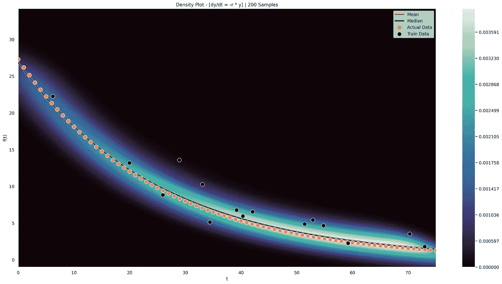
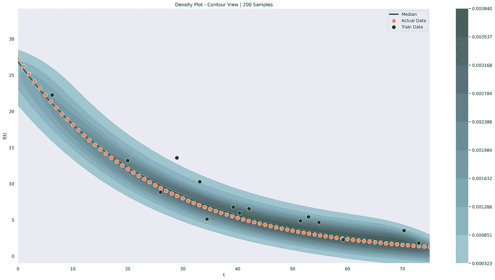
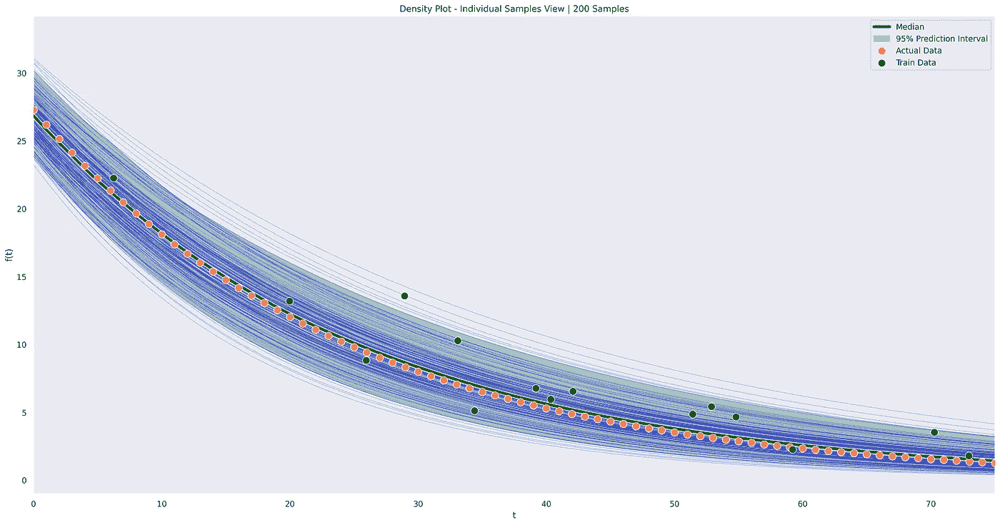
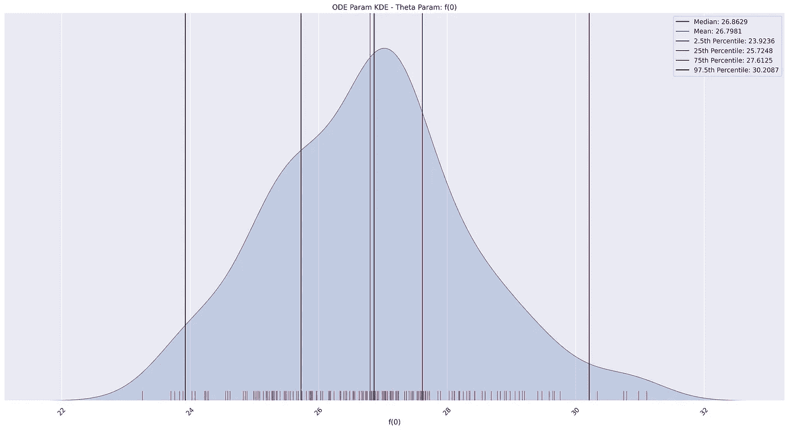
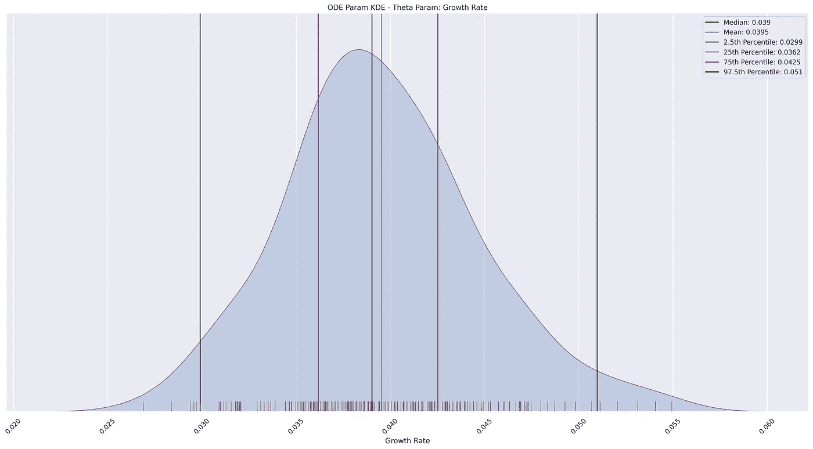

# 通过 JAX 的贝叶斯近似神经网络示例

> 原文：<https://towardsdatascience.com/bayesian-approximated-neural-network-example-via-jax-flexible-parameter-distributions-for-odes-9b4a7f79b493?source=collection_archive---------21----------------------->

## 常微分方程的灵活参数分布

虽然存在几种已知的方法来近似 ode 的参数分布(特别是 [PyMC3](https://docs.pymc.io/en/stable/) )，但这种概念验证方法在不提供先验分布的情况下估计未知分布。使用神经网络中的漏失概念作为模型不确定性的贝叶斯近似形式，可以通过训练的神经网络的采样来近似灵活的参数分布。

由于具有由给定神经网络学习的灵活输出分布的优势，理论上预测可以更好地拟合伴随有模型不确定性而不是硬离散数字的真实生活数据。对于许多业务场景，尤其是与医疗保健行业的患者护理相关的业务场景，拥有这些预测信息是必不可少的。毕竟，当模型的可解释性或置信度未知时，医生为什么要根据给定患者的图表考虑稳健模型的输出以获得更好的药物治疗呢？在做出关键决策时，我们当然希望对模型的预测有所了解。当将这种方法与常微分方程(ODE)甚至常微分方程系统相结合时，可以更容易更有效地对复杂的真实世界动力学进行建模，而同时仍然应用一些刚性结构(以增加可解释性)。可以导出模型不确定性和灵活的 ODE 参数分布，而不必对潜在参数“可能”是什么做出有影响的先验假设。

启发我的是这篇论文:

【arxiv.org 【1506.02142】作为贝叶斯近似的辍学:表示深度学习中的模型不确定性】

本文中的示例用于估算一个简单 ODE 所需的两个参数，dy/dt = -r * y。一个参数用于增长率 r，另一个参数用于对某个 t 进行积分的初始 y 值。概念验证的一个期望是可视化 t 轴上的输出分布，并有可能在 t 轴上具有可变分布。通过对经过训练的贝叶斯神经网络进行采样(通过丢弃)，我们可以预期近似的 ODE 参数分布是灵活的，因此不能保证是一致的。我发现这对于更复杂的情况是非常强大和有用的，而不必提供一些假设的先验分布，因为神经网络将近似参数分布，并且还可以扩展以及支持连续/在线训练。

我更喜欢将变量依赖关系保存在外部，而不是内嵌，但是我想提供一个工作的单个文件脚本，以便更容易地查看所有引用的函数和变量。下面是单个文件中的完整代码(文件:**Bayesian _ appx _ nn _ ex _ jax . py**):

 [## GitHub-bmurders 2/用于灵活模式参数分布的贝叶斯近似神经网络…

### 使用贝叶斯近似神经网络的工作概念证明，通过漏失获得灵活的参数…

github.com](https://github.com/bmurders2/Bayesian-Approximated-Neural-Networks-for-Flexible-ODE-Parameter-Distributions) 

Python 文件依赖于以下包:

*   numpy
*   熊猫
*   matplotlib
*   海生的
*   jax[cpu] ( [JAX](https://github.com/google/jax) )

我在执行 Python 脚本时的方法依赖于 Tensorflow GPU Docker 镜像(版本 2.6.0，Python 3.6.9)进行加速的 GPU CUDA 训练。然而，运行这个脚本既不需要 Tensorflow 也不需要 GPU，因为标准的基于 CPU 的 JAX 包也可以工作(用列出的包和 Python 3.9 成功测试)。JAX 对 [XLA](https://www.tensorflow.org/xla) 和 [JIT](https://jax.readthedocs.io/en/latest/jax-101/02-jitting.html) 的利用甚至对于 CPU 来说都是惊人的！如果您在执行这个 Python 文件时碰巧使用了 VS 代码，那么有一些字符串，#%%，它们是 [VS 代码的 Python 交互特性](https://code.visualstudio.com/docs/python/jupyter-support-py)的一部分，用于在处理 Python 文件时获得类似 Jupyter 的体验。如果这个 Python 文件作为 Jupyter 文件导出，这些字符串将自动创建它们相应的单元格(如果直接在 Jupyter 笔记本中运行这个带有交互单元格的文件比 VS Code 的交互窗口特性更好)。

JAX 的实验包包括 [Stax](https://github.com/google/jax/blob/main/jax/example_libraries/README.md#neural-net-building-with-stax) 直接在 JAX 境内进行神经网络开发和训练。其他强大的软件包使用 JAX 创建非常健壮的神经网络，如 [Trax](https://github.com/google/trax) ，但我认为 Stax 更容易为这个演示建立原型，不需要 JAX 以外的其他软件包。Python 文件使用以下神经网络超参数:

*   辍学率值:0.1
*   每层单位:2048
*   隐藏层数:1
*   主要激活功能:MISH

虽然“深”神经网络将允许更鲁棒的拟合，但是这个示例 ODE 对于单个隐藏层来说足够简单，但是具有“非常宽”的隐藏层(当试图通过神经网络放弃这种贝叶斯近似方法来关联或“近似”高斯过程时，这是一个重要的概念)。对于训练，在对训练数据进行全面训练之前，有一个“好的”猜测是非常重要的。这类似于大多数优化器或最小化算法，其中初始参数值的“坏”猜测可能阻止适当拟合的有效收敛。因此，训练被分成两部分，第一部分用于在对添加了噪声的训练数据进行最终训练之前“启动”神经网络以输出“好的”猜测参数值。采用这种方法将大大有助于在训练期间避免 NaN 值，因为给定函数的参数可能具有非常陡的梯度，这取决于参数所在的位置。为两个训练实例选择的优化器是 JAX 的 ADAMAX，其步长为 2e-3 用于启动训练会话，2e-5 用于针对添加噪声的训练数据的训练。对于损失训练函数，使用 Huber。

在对添加了噪声的训练数据进行训练之后，使用 200 个样本来确定使用任意预测区间的分位数的输出分布。在这种方法中，使用直接标准差+平均值上的分位数绘制预测区间更有用，因为您不必担心区间会忽略 ODE 的重要方面，例如跨越目标 ODE 函数的水平渐近线。 [Seaborn](https://seaborn.pydata.org/index.html) 和 [Matplotlib](https://matplotlib.org/) 用于以下地块:

*   导出跨 t 轴的输出样本的密度视觉。
*   样品的外观。
*   单个样本的图。
*   近似 ODE 参数的分布。

按作者分类的图像—t 轴上输出分布的密度图

按作者分类的图像-输出的等值线视图

按作者分类的图像-带有预测间隔的单个样本视图

按作者分类的图像-参数 y(0)的样本分布

按作者分类的图像-参数 r 的样本分布

我们可以从近似 ODE 参数的密度图中看到，它们并不完全一致，这正是我在训练后想要看到的。目标 ODE 并不太复杂，但是演示这种方法如何灵活地获得非均匀分布才是目标。重要的是，绘制更多的样本可以影响 ODE 参数估计的可视化近似密度图，但是对于 200 个样本，对于近似 ODE 参数密度“是什么”应该是足够的。

我们可以使用某种形式的增广神经常微分方程，通过这里提出的贝叶斯扭曲，直接逼近该函数。但是，如果我们碰巧对潜在的动态有一些合理的知识或假设，那么利用这种方法会更好。试图用黑盒模型直接模拟潜在动态的一个可能的结果是，我们将无法适当地欣赏参考常微分方程确实存在的水平渐近线。然而，这种方法允许利用神经网络来“学习”目标 ODE 参数的分布，并给出有用的预测区间和中值输出。我对这种方法很感兴趣，并希望其他人会受到启发，利用概率输出进行数据建模(特别是像神经网络这样的黑盒模型)。