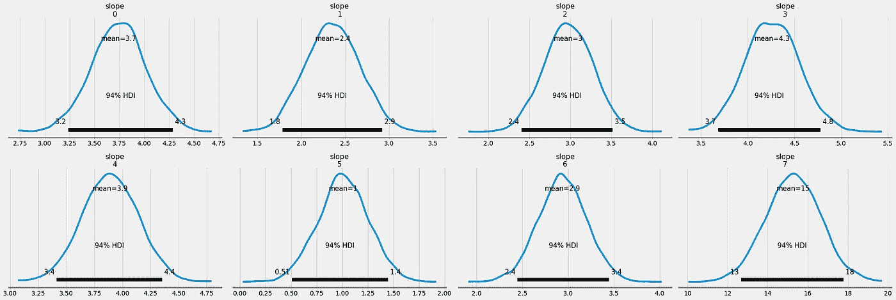
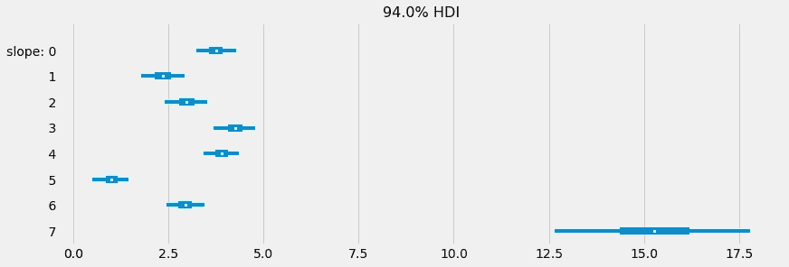
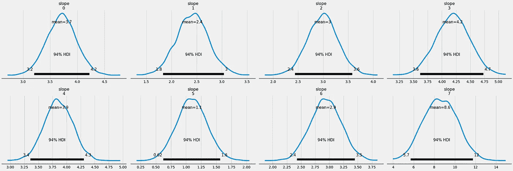
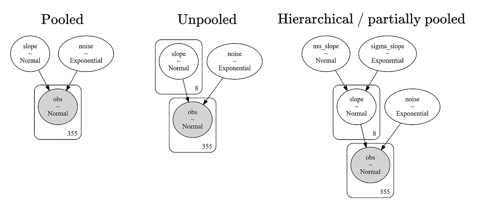

# PyMC3 中的贝叶斯分层建模

> 原文：<https://towardsdatascience.com/bayesian-hierarchical-modeling-in-pymc3-d113c97f5149?source=collection_archive---------2----------------------->

## [贝叶斯统计](https://medium.com/tag/bayesian-statistics)

## 治愈你模特的健忘症


在 [Unsplash](https://unsplash.com?utm_source=medium&utm_medium=referral) 上由 [Rob Pumphrey](https://unsplash.com/@robpumphrey?utm_source=medium&utm_medium=referral) 拍摄的照片

# 两种方法的故事

有时，当你试图在一个完全异构的数据集上进行机器学习时，你会面临选择的痛苦。作为我所说的异构数据集的一个例子，考虑一个简单的身高数据集。


图片由作者提供。

这个数据真正重要的特征是身高。然而，我们也可以在这里找到两个不同的群体:男性和女性。仅由男性组成的子数据集本身是同质的，仅由女性组成的子数据集也是如此，但是将两者放在一起会产生异质数据集。

给定一些异构数据，您可以:

*   在完整的数据集上构建一个大模型，或者
*   在数据集更小、更同质的部分上构建多个模型。


图片由作者提供。

## 利弊

构建一个大模型，也被称为**(完全)池化**，通常是最简单的方法:你把所有的样本放在一起，忘记不同的组。然而，如果大模型过于简单，它可能会忽略数据中的不同细微差别，从而导致**不符合**。当使用高度可解释的模型(如线性模型)时，这个问题会很快发生。如果您可以并且想要使用黑盒方法，如梯度增强，该模型可以自己发现并学习不同的子数据集，但代价是降低了可解释性。

建立几个更小的模型似乎是一个更好的主意:你将数据集分割成不同的更同质的部分，并为每个部分建立一个更小的模型。由此产生的模型被称为**非池化**模型。这样，每个模型都可以很好地处理一小部分数据，并且它们应该一起形成一个不错的模型。这种方法的明显缺点是你必须适应许多模型，但是当小数据集变得*太小*时，一个更严重的问题出现了:**过度适应**。

为了说明这一点，假设我们的身高数据集由 100 个样本组成:97 名女性和 3 名男性。我们现在想通过取身高的样本平均值来估计每组的平均身高。虽然女性的猜测应该是相当不错的，但男性的结果将非常不可靠，因为观察的数量很少。主要问题如下:

> 子模型是完全独立的。被训练的每个子模型不向其他子模型传递任何信息。在某种意义上，总模型忘记了它在每个子数据集上做什么。

未冷却的模型。

# 模特的健忘症

虽然训练孤立的模型*在某些情况下可能*有意义，但在我看来，子模型共享知识往往更好。

举个现实生活中的例子，在 [*小酒馆到德国金色 M*](https://de.wikipedia.org/wiki/McDonald%E2%80%99s) 买个芝士汉堡的等待时间平均需要两分钟(这个数字是我编的)。如果我现在去法国，平均等待时间很可能与这两分钟相差不远。日本可能也是如此。当然，一些国家更快，一些国家平均更慢，但是不管是哪个国家，等待一个汉堡一个小时应该是一个相当罕见的例外。所以，如果我饿了，想在法国吃一个芝士汉堡，我会想到要等多久，也许我是对的。我可以将从一个小组(德国)学到的知识转移到另一个小组(法国)进行预测。*这同样适用于 heights 数据集。*

## 一个有用的默认

当然，你也可以创造一些情景，让人们误以为记住了你学过的东西。在医生办公室的等待时间可能不会给你任何关于交通灯绿色阶段持续时间的指示，所以你不应该试图在这两个不相关的变量之间分享知识。

然而，如果我们诚实，通常我们不会看到来自完全不相关和随机来源的数据。通常情况下，这是相当一致的，只是在国家、性别、商店等群体中有一些变化，因此

> 我觉得分享知识往往是一个很好的默认。

那么，如何让我们的模型有更好的记忆呢？或者说，换一种方式，如何教会子模型之间的沟通和协同工作？这有几种方法，例如，在神经网络的情况下，*参数*或*权重分配*，这里我不打算详细说明。

然而，正如你从这篇文章的标题中所知道的，我们将转向贝叶斯，并学习如何做**贝叶斯分层建模**作为我们问题的可能解决方案。我们将再次使用 [PyMC3](https://docs.pymc.io/) ，因为它是一个不错的包。

如果您从未听说过贝叶斯统计或 PyMC3，并想学习它，请查看我关于这个有趣主题的其他介绍性文章。

</a-gentle-introduction-to-bayesian-inference-6a7552e313cb>  </conducting-bayesian-inference-in-python-using-pymc3-d407f8d934a5>  

**走吧！**

# PyMC3 中的分层建模

首先，我们将重新审视两者，在**贝叶斯**设置中的池化和非池化方法，因为它是

1.  一个很好的练习，而且
2.  非池化和层次化(也称为**部分池化**或**多级**)的代码库非常相似。

在我们开始之前，让我们创建一个数据集进行实验。我们将创建一个简单的一维回归问题，即只有一个特征和一个目标。有八个不同的组，每个组都有自己的斜率，固定截距为零。

```
import numpy as np

np.random.seed(0) # to keep it reproducible

mean_slope = 2 # the 8 different slopes have a mean of 2

slopes = np.random.normal(mean_slope, size=8)
groups = np.array(50*[0, 1, 2, 3, 4, 5, 6] + 5*[7])

x = np.random.randn(355)
y = slopes[groups] * x + 0.1*np.random.randn(355)
```

`groups`变量包含每个观察值所属的组。0 到 6 组各有 50 个观察值。然后，最后是少数群体 7，只有五个观察值。

作为一个小指南，要获得属于组 2 的元素，可以使用`x[groups==2], y[groups==2]`。这个子数据集的斜率是`slopes[2]`。

为了增加趣味，让我们在这个少数群体中加入局外人。

```
y[-1] = 30 # the last 5 observations are from minority group 7
y[-2] = 30
```

导入我们最喜欢的贝叶斯库后

```
import pymc3 as pm
import arviz as az
```

我们可以开始建模了！

## 混合模型

我们将从忽略组开始，将这个数据集视为一个大块。PyMC3 中不带截距的简单贝叶斯线性回归如下所示:

```
with pm.Model() as pooled_model:
    slope = pm.Normal('slope', 0, 20)
    noise = pm.Exponential('noise', 0.1)

    obs = pm.Normal('obs', slope*x, noise, observed=y)

    pooled_trace = pm.sample(return_inferencedata=True)

az.plot_posterior(pooled_trace, var_names=['slope'])
```

输出将是


图片由作者提供。

这基本上没用，因为我们只得到一个单一的斜率，但这并不奇怪。下一个最好的方法是为每组引入一个斜率。

## 无池模型

```
with pm.Model() as unpooled_model:
    slope = pm.Normal('slope', 0, 20, shape=8)
    noise = pm.Exponential('noise', 10)

    obs = pm.Normal('obs', slope[groups]*x, noise, observed=y)

    unpooled_trace = pm.sample(return_inferencedata=True)

az.plot_posterior(unpooled_trace, var_names=['slope'])
```

我们现在有八个不同的斜坡，都是独立训练的:



图片由作者提供。

我们也可以仅标绘 94%的高密度区间(HDI ),即包含 94%后位质量的短可信区间

```
az.plot_forest(unpooled_trace, var_names=['slope'], combined=True)
```

我们得到了



图片由作者提供。

你可以看到第 0 组到第 6 组的斜率很小，而第 7 组的斜率很大。但这是完全错误的，因为我们所有的斜率都应该在值**2**左右。发生了什么事？简单:我们通过在最小的群体中引入异常值来欺骗模型。

这正是我之前谈到的问题:组 7 的子模型没有机会，因为它不知道组 0 到组 6 中发生了什么。它不知道斜率通常在 2 左右。

所以，让我们来解决这个问题。

## 部分池化 aka 层次模型

```
with pm.Model() as hierarchical_model:
    mu_slope = pm.Normal('mu_slope', 0, 1) # hyperprior 1
    sigma_slope = pm.Exponential('sigma_slope', 13) # hyperprior 2

    slope = pm.Normal('slope', mu_slope, sigma_slope, shape=8)
    noise = pm.Exponential('noise', 10)

    obs = pm.Normal('obs', slope[groups]*x, noise, observed=y)

    hierarchical_trace = pm.sample(
        return_inferencedata=True,
        target_accept=0.995
    )

az.plot_posterior(hierarchical_trace)
```

那么，现在这是什么？在无池模型中，我们通过

```
slope = pm.Normal('slope', 0, 20, shape=8)
```

我们告诉模型，斜率应该在零左右，但是具有相当大的 20 的标准偏差。

在分层模型中，我们定义了所谓的**超先验**来为斜率先验找到更好的均值和标准差。重要的是:

```
mu_slope = pm.Normal('mu_slope', 0, 1)
sigma_slope = pm.Exponential('sigma_slope', 13)

slope = pm.Normal('slope', mu_slope, sigma_slope, shape=8)
```

我们用`mu_slope`代替零，用`sigma_slope`代替二十，就这么简单。这两个都是随机变量，我们可以用贝叶斯推理来学习。`mu_slope`和`sigma_slope`被称为超优先级，例如，决策树的最大深度被称为超参数。它们都比`slope`高一个*层级*，因为在`slope`可以计算之前，它们必须首先被评估。

> 注意:我在`sample`方法中添加了`target_accept=0.995`来改进采样，因为从这个嵌套的后验模型中采样不再像对非 pool 模型那样容易。我可以在另一篇文章中进一步解释这一点。

后验看起来像这样:



图片由作者提供。


图片由作者提供。

这仍然不是完美的，但比无池模型更接近事实。这是因为该模型还试图使用`mu_slope`超级函数来计算斜率平均值。真实的先验应该是 2，然而，由于异常值，模型认为它大约是 3。


图片由作者提供。

尽管如此，我们在非 pool 模型中看到的大斜率**15**将*拉向这个大约 3 的`mu_slope`。其他参数也是如此:*

> 在分层建模中，所有参数都被拉向全局平均值。这种效应被称为收缩。

总而言之，层次模型是明显的赢家。作为最后一步，让我们使用**标牌符号**直观地比较三种型号。这是一个不言自明的模型可视化表示，可能对你们当中的视觉学习者有所帮助。

# 使用平板符号比较模型

PyMC3 有一个奇妙的功能`pm.model_to_graphviz(model)`以一种很好的方式显示你的模型。



图片由作者提供。

我喜欢这种表示，因为你可以清楚地看到模型的某种演变。在混合模型中，我们从单一斜率开始。然后我们增加斜率的数量，用数字为 8 的方框表示。

> 这个符号是为斜坡画 8 个圆的捷径。我猜这个小盒子应该是一张桌子，上面叠放着 8 个盘子，我们从上面看，因此得名。

这个过程的最后一步是在顶层引入一个新的变量层，即超优先级。

# 结论

在本文中，我们讨论了处理异构数据集时不同的建模方法。起初，我声称有两种方式:池化和非池化模型。很明显，我在撒谎，正如我们已经看到的分层建模一样。

一个有趣的观察是，您可以将分层建模看作是对非池化建模的**推广。如果您将超优先级设置为某个*常量*随机变量，您将再次以无池方法结束。否则，层次模型通过跟踪全局参数来做一些不同的事情，例如`mu_slope`，它充当我们想要估计的实际参数的种子。作为一个很好的副作用，我们也得到这些全局参数的估计。如果在不同的组中没有值得分享的东西，层次模型也会学习这个，这很好。这就是为什么**我认为你应该尽可能使用层次化的方法，而不是非池化的方法**:通常这没有坏处。**

当使用分层建模而不是无池建模时，唯一可能出错的是有更多的**参数**要估计，并且由于嵌套的参数，估计也变得更加困难。你必须使用一些技巧，比如改变 MCMC 采样参数或者引入所谓的*非中心*变量。

一个以**为中心的** ( *我称之为嵌套的*)变量类似于另外两个随机变量`a`和`b`的`pm.Normal('X', a, b)`，这就是我们上面用过的。然而，在正态分布的特殊情况下，你也可以写`a + b*pm.Normal('X', 0, 1)`，这从统计学的角度来看是等价的，但对于计算后验分布的 MCMC 算法来说是一个巨大的差异。

尽管如此，如果你能克服计算问题，我认为分层建模通常是一条值得尝试的道路。

作为一个额外的资源，看看托马斯·威奇和达内·埃尔伯斯写的这篇不错的博文。

我希望你今天学到了新的、有趣的、有用的东西。感谢阅读！

**作为最后一点，如果你**

1.  **想支持我多写点机器学习和**
2.  **无论如何，计划获得一个中等订阅量，**

**为什么不做** [**通过这个环节**](https://dr-robert-kuebler.medium.com/membership) **？这将对我帮助很大！😊**

透明地说，给你的价格不变，但大约一半的订阅费直接归我。

**非常感谢，如果你考虑支持我！**

> 如果你有任何问题，请在 [LinkedIn](https://www.linkedin.com/in/dr-robert-k%C3%BCbler-983859150/) 上给我写信！