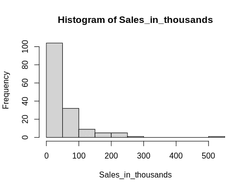
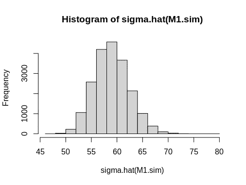

# 贝叶斯线性回归:基于 arm 的汽车销售分析

> 原文：<https://towardsdatascience.com/bayesian-linear-regression-analysis-of-car-sales-with-arm-in-r-b1147e79a9a4?source=collection_archive---------22----------------------->

## 使用贝叶斯线性回归解释不确定性


来源:图片来自 [Pixabay](https://pixabay.com/photos/speedometer-dashboard-car-speed-1249610/)

线性回归是最常用也是最有用的建模工具之一。

虽然没有任何形式的回归分析可以接近现实，但它可以很好地预测因变量，并确定每个自变量影响因变量的程度，即每个系数的大小和重要性。

然而，传统的线性回归可能有缺点，因为这种方法不能真正解释估算中的**不确定性**。

然而，贝叶斯线性回归可以作为这个问题的解决方案-通过重复模拟提供许多不同的系数值估计。例如，如果我们希望进行 20，000 次模拟，这种方法可以返回 20，000 条不同的回归线，这些回归线将说明在各种情况下因变量的潜在波动。

为了说明这一点，让我们来看看 R 中的 **arm** 库如何使用贝叶斯线性回归来预测汽车销量。

# 标准线性回归

该分析是在 [Kaggle](https://www.kaggle.com/gagandeep16/car-sales) 可用的汽车销售数据集上进行的，该数据集根据 [CC0 1.0 通用(CC0 1.0)公共领域专用许可](https://creativecommons.org/publicdomain/zero/1.0/)提供。

在第一种情况下，设计线性回归来确定销售额(以千计)如何根据以下因素波动:

*   发动机尺寸
*   车型
*   马力
*   轴距
*   宽度
*   长度
*   整备重量
*   燃料容量
*   燃料效率
*   功率性能因数

这里是线性回归和输出结果。

```
Call:
lm(formula = Sales_in_thousands ~ Engine_size + Vehicle_type + 
    Horsepower + Wheelbase + Width + Length + Curb_weight + Fuel_capacity + 
    Fuel_efficiency + Power_perf_factor)Residuals:
    Min      1Q  Median      3Q     Max 
-104.47  -29.09   -6.86   14.00  337.19Coefficients:
                       Estimate Std. Error t value Pr(>|t|)   
(Intercept)           -302.7471   154.7623  -1.956  0.05242 . 
Engine_size             31.7419    11.0641   2.869  0.00475 **
Vehicle_typePassenger  -45.1881    19.3850  -2.331  0.02117 * 
Horsepower              -0.5830     0.8825  -0.661  0.50990   
Wheelbase                3.7231     1.3670   2.724  0.00727 **
Width                    0.8454     2.4341   0.347  0.72889   
Length                   0.7609     0.8295   0.917  0.36054   
Curb_weight            -63.7597    20.4988  -3.110  0.00226 **
Fuel_capacity           -1.1049     2.7603  -0.400  0.68955   
Fuel_efficiency          0.5560     2.3522   0.236  0.81350   
Power_perf_factor        0.2592     1.9605   0.132  0.89502   
---
Signif. codes:  0 ‘***’ 0.001 ‘**’ 0.01 ‘*’ 0.05 ‘.’ 0.1 ‘ ’ 1Residual standard error: 58 on 141 degrees of freedom
  (5 observations deleted due to missingness)
Multiple R-squared:  0.3391, Adjusted R-squared:  0.2922 
F-statistic: 7.235 on 10 and 141 DF,  p-value: 3.643e-09
```

我们可以看到，发动机尺寸、车型、轴距和整备质量在 5%的水平上具有统计显著性(一些变量在 1%的水平上具有显著性)。

在删除无关紧要的变量并在迭代中再次生成回归后，最终的回归结果如下:

```
Call:
lm(formula = Sales_in_thousands ~ Vehicle_type + Wheelbase + 
    Curb_weight)Residuals:
    Min      1Q  Median      3Q     Max 
-107.15  -32.26   -9.68   18.33  339.38Coefficients:
                      Estimate Std. Error t value Pr(>|t|)    
(Intercept)           -288.840     76.741  -3.764 0.000239 ***
Vehicle_typePassenger  -44.626     12.673  -3.521 0.000568 ***
Wheelbase                5.287      0.816   6.479 1.23e-09 ***
Curb_weight            -57.100     10.697  -5.338 3.39e-07 ***
---
Signif. codes:  0 ‘***’ 0.001 ‘**’ 0.01 ‘*’ 0.05 ‘.’ 0.1 ‘ ’ 1Residual standard error: 58.67 on 151 degrees of freedom
  (2 observations deleted due to missingness)
Multiple R-squared:  0.2787, Adjusted R-squared:  0.2644 
F-statistic: 19.45 on 3 and 151 DF,  p-value: 1.027e-10
```

重要变量是车辆类型、轴距和整备质量。虽然 **27.87%** 的 R 平方在统计学上较低，但这并不一定意味着模型不好。事实上，有许多不同的因素可以影响汽车销售，这里没有考虑。

模型中的其余变量被表示为非常重要，这表明它们与确定汽车销售相关。让我们更详细地分析模型系数。

*   在这种情况下， **-288.84** 的截距是虚假的，但理论上代表了所有其他系数为零时的最小销售额。但是，销售额不能为负，因此系数本身没有任何意义。
*   由于 Vehicle_typePassenger 变量的系数为-44.626，这意味着如果一种车型被归类为“客车”而不是“轿车”，销售额将下降 **$44.626** 。
*   轴距每增加一个单位，汽车销量就会增加**5.287 美元**。
*   整备质量每增加一个单位，汽车销量就会减少**-57.10 美元**。

使用方差膨胀因子检验时，没有一个变量的多重共线性检验为阳性(即 VIF 统计值大于 5)。这表明没有一个变量彼此显著相关，因此扭曲了回归结果。

```
> library(car)
> vif(M1)
Vehicle_type    Wheelbase  Curb_weight 
    1.384649     1.746395     2.035252
```

直方图表明汽车销售的分布是非正态的。因此，在这种情况下，异方差性没有被测试(或者实际上被校正)。事实上，正态性并不是生成线性回归模型的必要条件。



来源:RStudio 输出

# 贝叶斯线性回归

> “所有的模型都是错的，但有些是有用的。”
> 
> 乔治·e·p·Box

虽然上述线性回归提供了信息，但它的一个缺点是没有考虑到估计中的不确定性。

例如，我们真的可以期望轴距每增加一个单位，汽车销量总会增加 5.287 美元吗？

事实上，我们知道情况并非如此。相反，我们想想出一种方法来解释估计中的不确定性，并生成一系列广泛的销售预测。

毕竟，贝叶斯分析的目的是以概率的方式分析数据——考虑尽可能多的潜在情况。

考虑到这一点，R 中的 [arm](https://cran.r-project.org/web/packages/arm/arm.pdf) 包用于生成 20，000 条不同的回归线，以说明估计中的不确定性。

我们可以看到，生成模拟时，会生成具有不同系数估计的回归。

```
> library(arm)
> M1.sim <- sim(M1, n.sims=20000)
> M1.sim
> coef.M1.sim <- coef(M1.sim)
> coef.M1.simAn object of class "sim"
Slot "coef":
         (Intercept) Vehicle_typePassenger Wheelbase Curb_weight
    [1,]  -142.29350           -40.1585711  4.046482   -62.73836
    [2,]  -311.43351           -46.1396357  6.056344   -74.03777
...
  [249,]  -249.44178           -52.5240319  5.590081   -76.08825
  [250,]  -184.34866           -60.6832116  4.493316   -59.79492
 [ reached getOption("max.print") -- omitted 19750 rows ]
```

此外，还会产生残差(由*σhat*提取):

```
> sigma.M1.sim <- sigma.hat(M1.sim)
> sigma.M1.sim
[1] 53.53439 56.59501 62.36744 48.25297 62.11458 65.81519 51.64420
[8] 62.34890 55.86902 52.15755 60.12543 59.68573 55.92115 62.00584
[15] 60.30506 63.08531 56.79228 57.74138 53.94584 57.22139 60.00236
...
[981] 54.00598 63.18356 59.70908 60.27791 64.86504 53.71799 59.88211
[988] 58.08702 56.12842 62.05933 61.02171 54.30973 60.43517 61.74605
[995] 54.91794 60.25361 56.72824 57.06674 61.47696 62.64697
[ reached getOption("max.print") -- omitted 19000 entries ]
```

现在，可以在分位数的基础上计算系数的不确定性:

```
> apply(coef(M1.sim), 2, quantile)
     (Intercept) Vehicle_typePassenger Wheelbase Curb_weight
0%    -589.44627             -98.60129  1.929788   -97.18706
25%   -341.31489             -53.40231  4.737972   -64.23857
50%   -289.01086             -44.73874  5.287846   -57.07201
75%   -237.68266             -36.07124  5.836498   -49.90656
100%    20.27591              11.40947  8.547013   -19.46040
```

通过观察这些系数，我们可以看到系数本身可能存在显著的变化。

例如，虽然乘用车类型降低了 0%、25%、50%和 75%分位数的销售额，但在 100%分位数的模拟中，销售额实际上是增加的。有没有逆势而上的特殊车型？这个模型可以为进一步研究这个问题提供一个有用的起点。

对于汽车的轴距(前轮和后轮之间的距离)，我们可以看到，在 0%分位数时，每增加一个单位对销售额的影响是 1.92 美元，但在 100%分位数时会增加到 8.54 美元。

除了系数估计值之外，我们还可以绘制残差图(由 sigma.hat 提取):



来源:RStudio 输出

以下是基于分位数报告的残差:

```
> q
      0%      25%      50%      75%     100% 
47.52279 56.60056 58.82638 61.15704 78.96791
```

鉴于我们已经看到汽车销售的分布具有强烈的正偏态分布(即，选定的几款汽车显示的销售数字比其余的高得多)，这可能是我们看到高不确定性估计值的原因之一，即，50%分位数的不确定性估计值为 58，826 美元。

然而，贝叶斯线性回归在通过生成大范围的模拟和潜在情景来模拟这种不确定性时非常有用。

# 结论

在本文中，您已经看到:

*   传统线性回归的缺点
*   如何生成贝叶斯线性回归
*   使用 arm 包生成许多回归模拟
*   模型估计的不确定性分析

非常感谢您的宝贵时间，非常感谢您的任何问题或反馈。你可以在[michael-grogan.com](https://www.michael-grogan.com/)找到更多我的数据科学内容。

*免责声明:本文是在“原样”的基础上编写的，没有担保。它旨在提供数据科学概念的概述，不应被解释为专业建议。本文中的发现和解释是作者的发现和解释，不被本文中提到的任何第三方认可或隶属于任何第三方。作者与本文提及的任何第三方无任何关系。*