# Bambi 贝叶斯线性回归

> 原文：<https://towardsdatascience.com/bayesian-linear-regression-with-bambi-a5e6570f167b?source=collection_archive---------4----------------------->

## 利用贝叶斯推理得到你的预测分布

# 动机

用回归线拟合样本数据时，可能会得到如下的回归线:

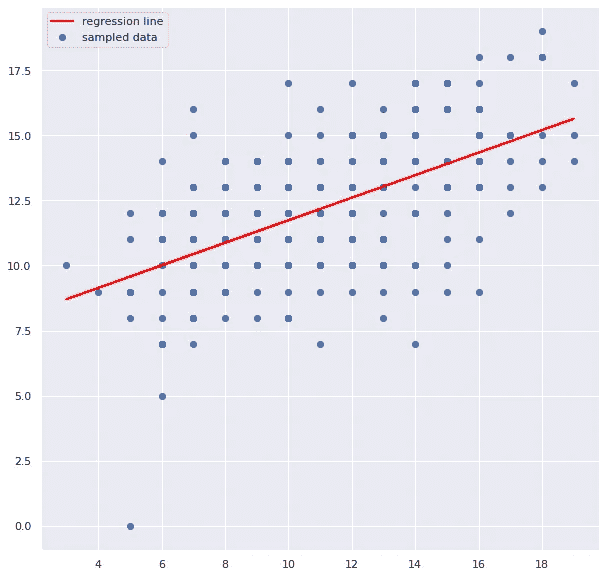

作者图片

如果你能得到一个预测的分布，而不是一条回归线，不是很好吗？

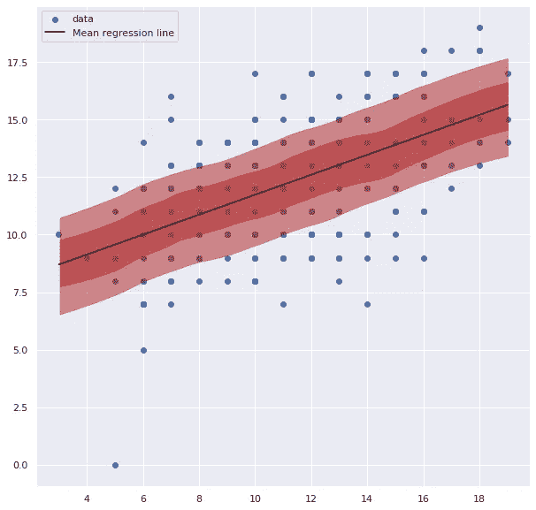

作者图片

这就是贝叶斯线性回归派上用场的时候。在本文中，您将学习如何用 Python 构建贝叶斯线性回归。

# 线性回归到底是什么？

要了解贝叶斯线性回归和普通最小二乘线性回归(OLS)(我们都很熟悉的线性回归)的区别，我们先来了解一下什么是 OLS。

## 从一个例子开始

理解算法最简单的方法是从一个例子开始。

我们将在 Kaggle 上使用显示学生数学和葡萄牙语成绩的数据集。

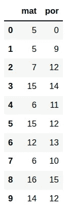

作者图片

绘制数据:

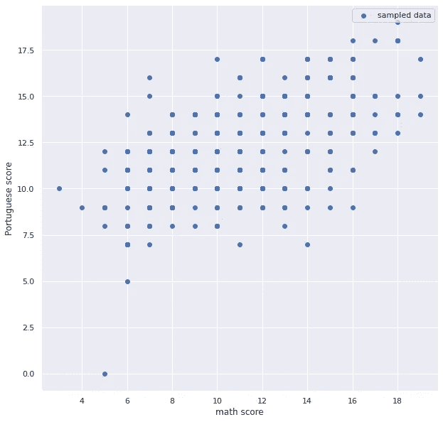

作者图片

我们的目标是找到最能描述数学成绩和葡萄牙语成绩之间关系的线性回归线。

如果您有𝑛变量，您的线性回归方程将如下所示:

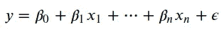

作者图片

其中𝑦是响应变量，𝑥's 是解释变量，𝛽ᵢ是变量𝑥ᵢ的权重， *ε* 是误差项。

由于我们的数据中只有一个解释变量，我们的线性回归方程将如下所示:

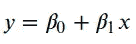

作者图片

其中，𝑦是预测的葡萄牙语分数，𝑥是观察到的数学分数。

在矩阵形式中，等式变为:

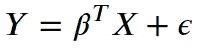

作者图片

𝛽有几个可能的值，但我们将只选择最小化残差平方和(RSS)的𝛽值。RSS 是𝑦ᵢ和𝑦̂ᵢ之间的平方差之和，其中𝑦ᵢ是数据的第一个实际值，𝑦̂ᵢ是使用回归的第一个预测值。

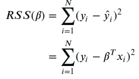

作者图片

最小化 RSS 将给出𝛽.的估计让我们尝试使用 scikit-learn 的线性回归模型来应用这个方法。

绘制回归线:

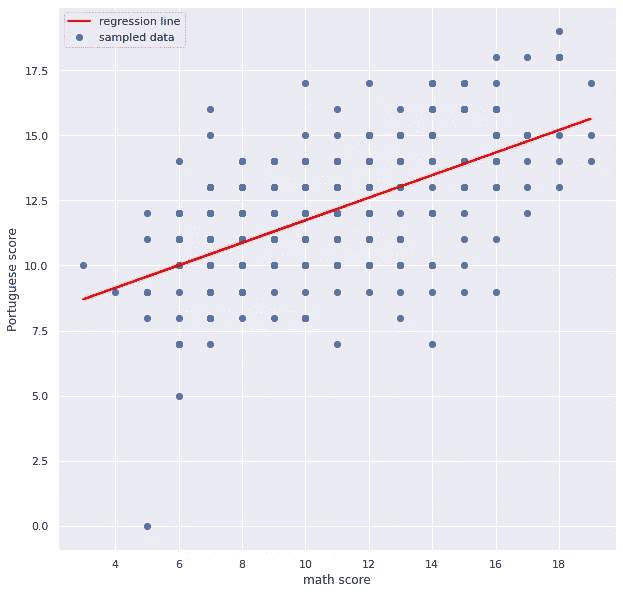

作者图片

求系数:

```
array([0.4335796])
```

找到截距:

```
7.403346211071996
```

通过看系数和曲线图，我们可以说，如果数学成绩增加 1，葡萄牙语平均成绩增加 0.43。如果数学成绩为 0，葡萄牙语成绩的预测值为 7.403。

普通最小二乘法返回单点估计。但是如果我们想看到可能的估计值的分布呢？让我们试着用斑比来做这件事。

# 使用 Bambi 构建贝叶斯线性回归模型

## 斑比是什么？

[Bambi](https://bambinos.github.io/bambi/main/index.html) 是用 Python 编写的高级贝叶斯建模接口。它构建在编程框架 PyMC3 之上。因此，Bambi 类似于 PyMC3，但是更容易使用。

</detect-change-points-with-bayesian-inference-and-pymc3-3b4f3ae6b9bb>  

要安装 Bambi，请键入:

```
pip install bambi
```

## 建立线性回归模型

使用 Bambi 构建线性回归模型非常简单。既然我们要用`mat`(数学成绩)来预测`por`(葡萄牙成绩)，我们可以写:

使用 PyMC3 从 4 条链中各抽取 1000 个样本(单次运行 [MCMC](https://machinelearningmastery.com/markov-chain-monte-carlo-for-probability/) ):

默认情况下，Bambi 使用`family="gaussian"`，这意味着具有正常误差的线性回归。

## 分析系数的分布

使用 [ArviZ](https://arviz-devs.github.io/arviz/) 绘制结果:

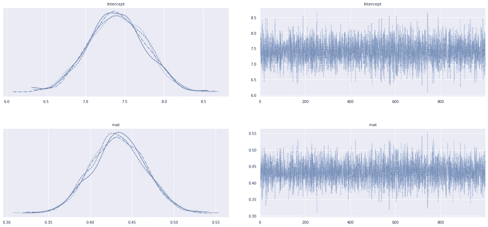

作者图片

在上图中，`Intercept`和`mat`分别是来自方程𝑦 = 𝛽₀ + 𝛽₁𝑥 + *ε的𝛽₀和𝛽₁。*左边的图显示了变量的分布。右边的图显示了每次迭代中每个变量的值。

看左边的图，我们可以说:

*   𝛽₀和𝛽₁的分布接近正态分布。
*   𝛽₀的平均值从 7.2 到 7.5。
*   𝛽₁的平均值从 0.42 到 0.44。

这太酷了！我们得到的不是𝛽₀和𝛽₁的单点估计，而是𝛽₀和𝛽₁的分布。

分布的形状也有助于我们理解我们对𝛽₀或𝛽₁.的价值有多确定具体来说:

*   分布的扩散越大(越大*【σ】*)，我们对𝛽₀和𝛽₁.的价值就越不确定
*   分布的扩散越小(越小*【σ】*)，我们对𝛽₀和𝛽₁.的价值就越有把握

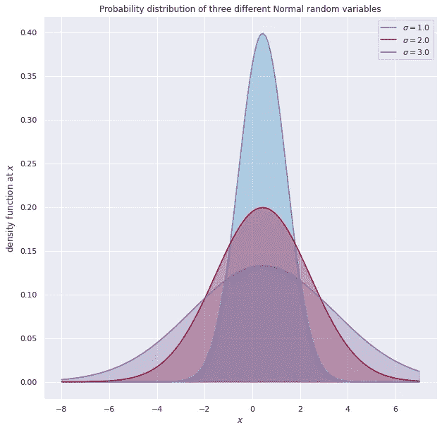

作者图片

## 比较贝叶斯线性回归和 OLS 的结果

与 scikit-learn 的普通最小二乘线性回归生成的𝛽₀和𝛽₁的值相比，Bambi 的贝叶斯线性回归生成的𝛽₀和𝛽₁的平均值如何？从寻找斑比创造的𝛽₀和𝛽₁的意义开始。

𝛽₀:的意义

```
0.43346411871369533
```

𝛽₁:的意义

```
7.403637994335104
```

它们非常接近 scikit-learn 生成的𝛽₀和𝛽₁的值！

## 绘制回归线

𝛽₀和𝛽₁.共有 4×1000 = 4000 个样本对于每一对𝛽₀和𝛽₁，我们可以得到𝑦.的一个估计

让我们用 10 对不同的𝛽₀和𝛽₁:来看 10 个预测

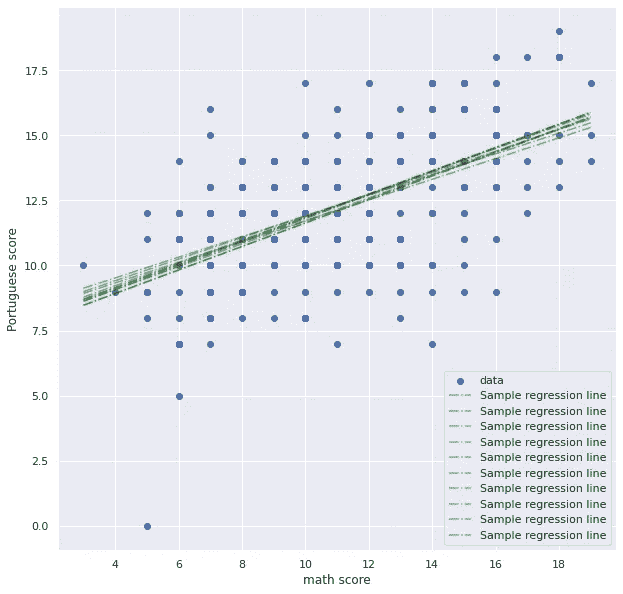

作者图片

酷！现在让我们使用𝛽₀ 的**平均值和𝛽₁** 的**平均值来得到𝑦(用黑线表示)的单一估计值。**

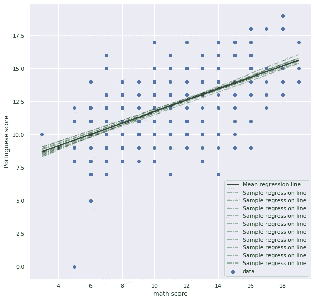

作者图片

从上面的图中，我们可以看到黑线很好的呈现了所有的绿线。

## 所有预测的分布图

将单个预测分布与平均预测分布进行比较的另一种方法是将它们的分布相互重叠。

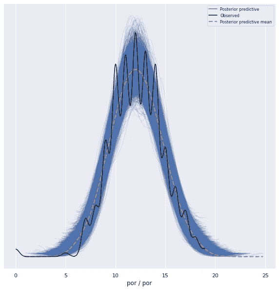

作者图片

从上面的图中我们可以看到，橙色线(平均预测分布)很好地代表了黑线(观察值)。

## 绘制预测的最高密度区间

对于𝑥 的特定值，最常见的**预测是什么？让我们使用`az.plot_hdi` (HDI 代表最高密度区间)来解决这个问题。**


作者图片

在上面的图中，

*   暗红色区间是给定𝑥值时 38%的预测值所在的区间
*   给定𝑥值，浅红色区间表示 68%的预测值

例如，如果数学成绩是 10，我们可以说葡萄牙语成绩的 38%的预测位于 10.5 到 12.8 之间。

通过创建贝叶斯线性回归模型，我们能够在给定𝑥.值的情况下创建大多数预测所在的区间很酷，不是吗？

# 结论

恭喜你！您刚刚学习了如何使用 Bambi 获得线性回归模型的系数分布，这使您能够获得可能预测的分布。

有一个分布将会给预测带来更多的洞察力。既然使用 Bambi 创建贝叶斯线性回归模型很容易，为什么不试一试呢？

本文的源代码可以在这里找到:

<https://github.com/khuyentran1401/Data-science/blob/master/statistics/bayes_linear_regression/linear_regression.ipynb>  

我喜欢写一些基本的数据科学概念，并尝试不同的算法和数据科学工具。你可以通过 [LinkedIn](https://www.linkedin.com/in/khuyen-tran-1ab926151/) 和 [Twitter](https://twitter.com/KhuyenTran16) 与我联系。

如果你想查看我写的所有文章的代码，请点击这里。在 Medium 上关注我，了解我的最新数据科学文章，例如:

</bayes-theorem-clearly-explained-with-visualization-5083ea5e9b14>  </how-to-find-best-locations-for-your-restaurants-with-python-b2fadc91c4dd>  </observe-the-friend-paradox-in-facebook-data-using-python-314c23fd49e4>  </introduction-to-yellowbrick-a-python-library-to-explain-the-prediction-of-your-machine-learning-d63ecee10ecc>  

# 参考

科尔森，W. (2018 年 4 月 20 日)。*贝叶斯线性回归简介*。中等。检索于 2021 年 12 月 29 日，来自[https://towards data science . com/introduction-to-Bayesian-linear-regression-e66e 60791 ea 7](/introduction-to-bayesian-linear-regression-e66e60791ea7)