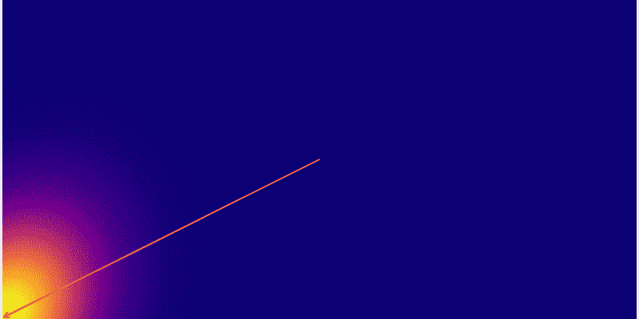
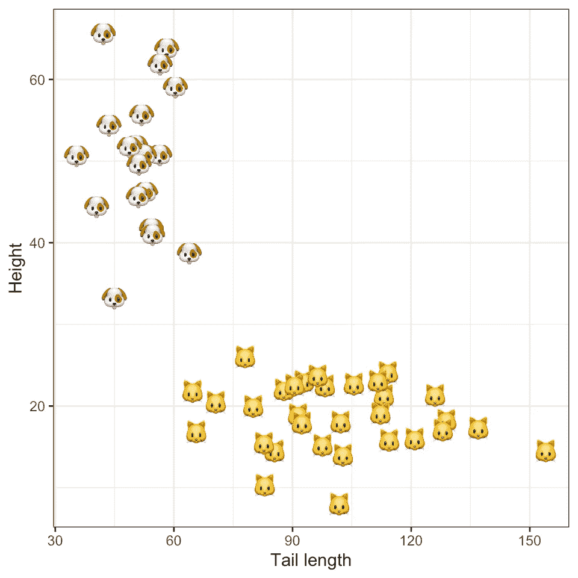
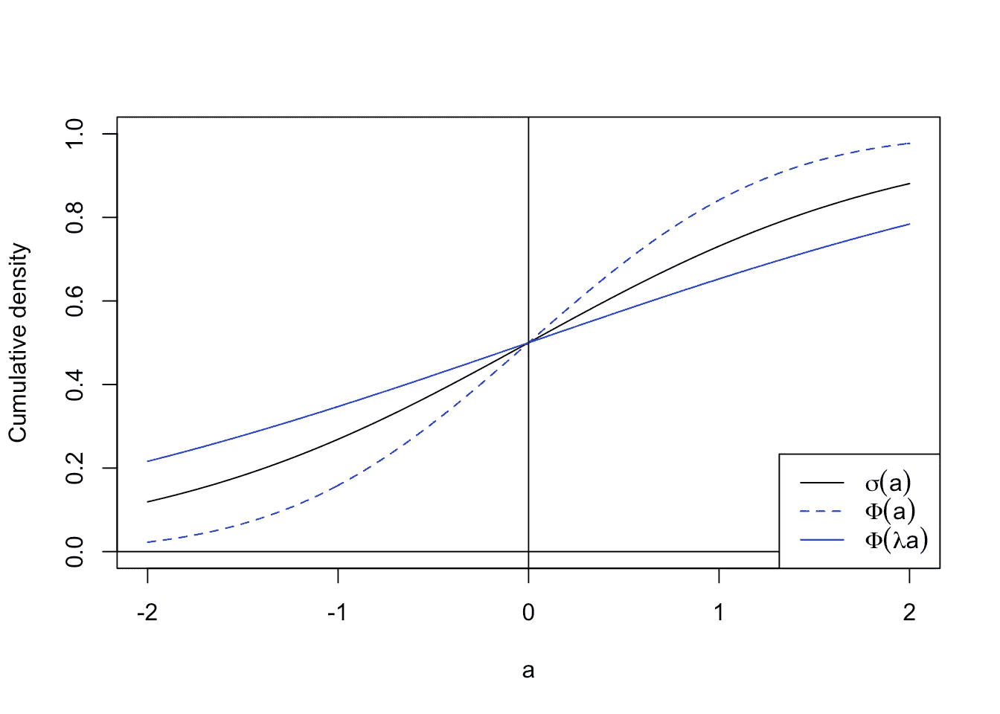
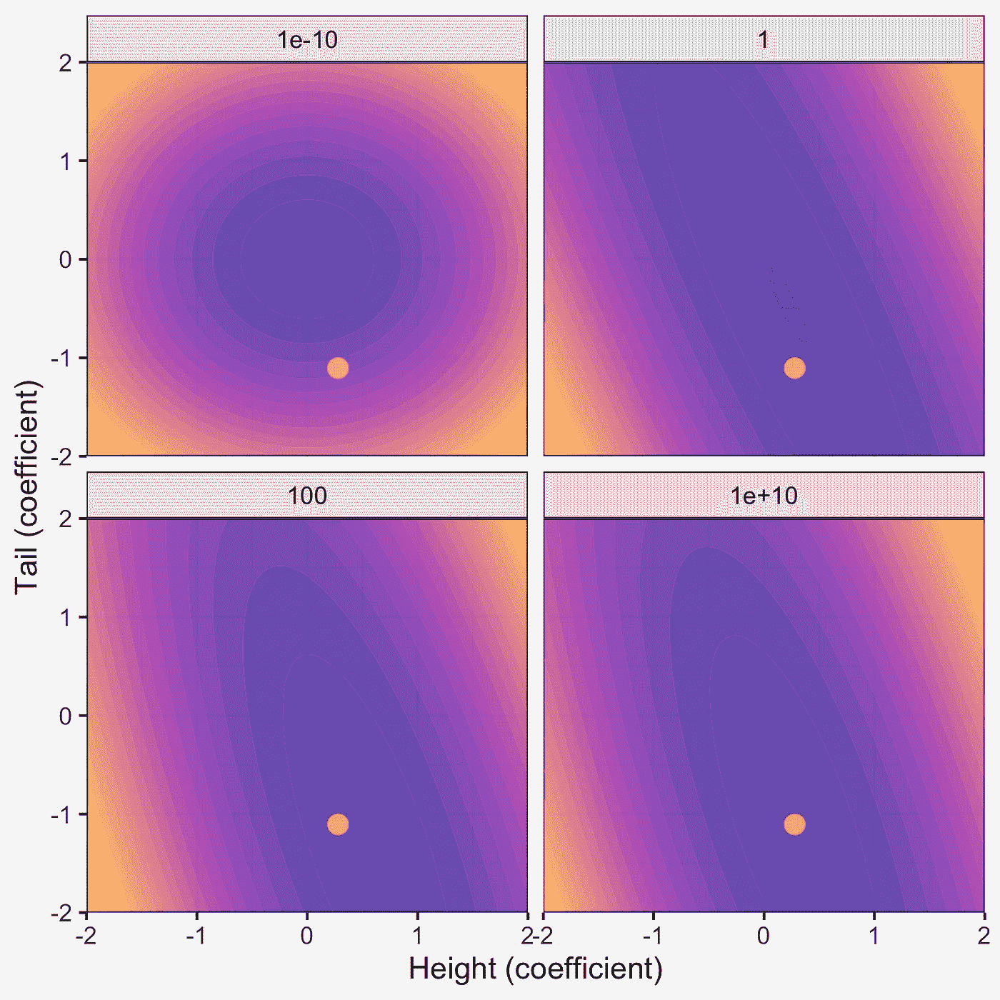
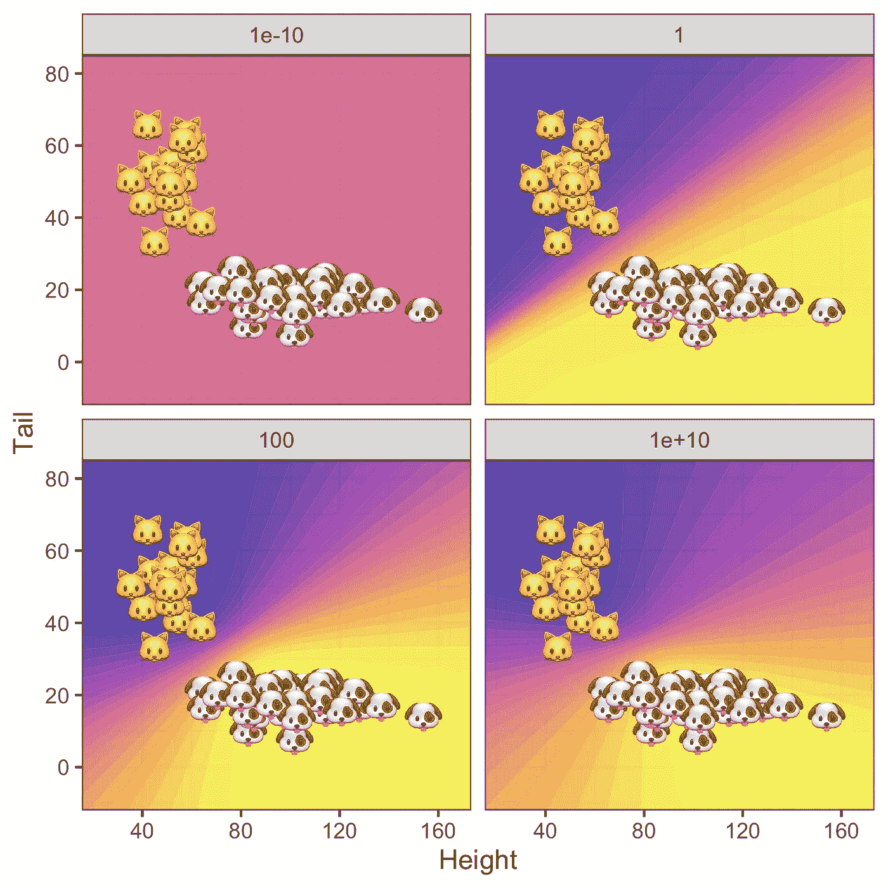

# 贝叶斯逻辑回归

> 原文：<https://towardsdatascience.com/bayesian-logistic-regression-53df017ba90f?source=collection_archive---------9----------------------->

## 从零开始用朱莉娅语言

变化参数分布的模拟。图片作者。

如果您曾经搜索过评估模型准确性的评估指标，那么您很可能会发现许多不同的选项可供选择。从某种意义上说，准确性是预测的圣杯，所以机器学习社区花大量时间思考它一点也不奇怪。在一个越来越多的高风险决策被自动化的世界中，模型准确性实际上是一个非常有效的关注点。

但是，这种模型评估的方法看起来像是自动化决策制定的一种可靠而完整的方法吗？我们没有忘记什么吗？有些人会说，我们需要更多地关注模型的不确定性。无论你对你的模型进行了多少次交叉验证，优化的损失指标以及它的参数和预测仍然是固有的随机变量。仅仅关注预测的准确性而完全忽略不确定性会给自动决策系统带来错误的信心。因此，任何从数据中学习的**可信的**方法至少应该对其自身的不确定性保持透明。

我们如何估计模型参数和预测的不确定性？ **Frequentist** 不确定性量化方法通常涉及基于渐近假设或自举的封闭型解决方案(例如，参见此处的[逻辑回归的](https://web.stanford.edu/class/archive/stats/stats200/stats200.1172/Lecture26.pdf))。在贝叶斯统计和机器学习中，我们关心的是对模型参数的后验分布建模。这种不确定性量化方法被称为**贝叶斯推理**，因为我们以贝叶斯方式处理模型参数:我们基于**先验**知识或信念对其分布做出假设，并根据新证据更新这些信念。频率主义者的方法避免了明确先前信念的需要，这在过去有时被认为是不科学的。然而，频率主义者的方法有自己的假设和缺陷(例如，参见 Murphy (2012))的讨论)。不深入讨论这个问题，现在让我们看看**贝叶斯逻辑回归**是如何自下而上实现的。

# 基本事实

在本帖中，我们将使用由二进制标签和相应的特征向量组成的合成玩具数据集。使用合成数据的好处是，我们可以控制生成数据的**基本事实**。特别地，我们将假设二元标签确实是由逻辑回归模型生成的。从混合高斯模型中生成特征。

为了给我们的例子增加一点生气，我们假设二进制标签根据猫和狗的身高和尾巴长度将样本分为猫和狗。下图显示了二维特征域中的合成数据。在下一节介绍贝叶斯逻辑回归之后，我们将使用这些数据来估计我们的模型。

地面真相标签。图片作者。

# 数学

在 Medium 上的文章中加入数学仍然有点麻烦，所以这里我们将完全依靠直觉，完全避免公式。使用 Julia 语言的好处之一是它允许使用 Unicode 字符，所以我们将在下面看到的代码看起来几乎和数学一样。如果你想看到完整的数学处理，以全面理解所有的细节，请随时查看我的[网站](https://www.paltmeyer.com/post/bayesian-logistic-regression/)上这篇文章的扩展版本。

## 问题设置

贝叶斯逻辑回归的起点是**贝叶斯定理**，它正式声明参数的后验分布与两个量的乘积成比例:给定参数的观察数据的可能性和参数的先验密度。应用到我们的上下文中，可以直观地理解如下:我们关于逻辑回归系数的后验信念由我们的先验信念和我们观察到的证据(即数据)形成。

在假设单个标签-特征对独立地分布**和**相同地分布**的情况下，它们的联合似然性就是它们单个密度的乘积(伯努利)。关于参数的先验信念由我们决定。在实践中，它们可能来自以前的实验。这里我们将使用零均值球面高斯先验，原因将在下面进一步解释。**

与线性回归不同，估计或最大化后验概率没有封闭形式的解析解，但幸运的是，精确的近似值确实存在(Murphy 2022)。一种最简单的方法叫做**拉普拉斯近似法**,实现起来非常简单，计算起来也非常高效。它依赖于以下观察结果:在高斯先验假设下，逻辑回归的后验概率也近似为高斯分布:特别是，该高斯分布以最大 T2 后验概率(MAP)估计为中心，其协方差矩阵等于在该模式下评估的逆 Hessian 矩阵。下面我们将看到如何估计地图和相应的黑森。

## 解决问题

实际上，我们不会直接最大化后验概率。相反，我们最小化负对数似然，这是等价的，并且更容易实现。下面的 Julia 代码显示了这个损失函数及其导数的实现。

**免责声明** ❗️ *我应该提到这是我第一次用 Julia 编程，所以对于任何一个 Julia 的专业人士:请容忍我！非常乐意在评论中听到你的建议。*

如您所见，负对数似然性等于两项之和:首先是(对数)伯努利分布之和(对应于数据的似然性)，其次是(对数)高斯分布(对应于我们先前的信念)。

拉普拉斯近似下贝叶斯逻辑回归的损失函数及其导数。

由于最小化这个损失函数是一个凸优化问题，我们有许多有效的算法可供选择来解决这个问题。有了 Hessian，使用二阶方法似乎是很自然的，因为包含关于损失函数曲率的信息通常会导致更快的收敛。这里我们将这样实现**牛顿法**:

Julia 语言中带 Arminjo 回溯的牛顿法。

## 后验预测

假设现在我们已经使用训练数据训练了贝叶斯逻辑回归模型作为我们的二元分类器，并且新的未标记样本到达。与任何二元分类器一样，我们可以通过简单地将新样本插入到我们的拟合模型中来预测丢失的标签。如果在训练阶段，我们发现模型达到了很好的精度，我们可以期待良好的样本外性能。但是因为我们仍然在处理一个随机变量的期望值，我们通常想知道这个预测有多嘈杂。

形式上，我们对**后验预测**分布感兴趣，它没有任何进一步的假设，是一个数学上难以处理的积分。它可以通过蒙特卡洛进行数值估计——通过简单地从后验分布中重复采样参数——或者通过使用所谓的**概率单位近似值。**后者利用了 sigmoid 函数可以由重新调整的标准高斯 cdf 很好地近似的发现(见下图)。以这种方式近似 sigmoid 函数允许我们导出后验预测的解析解。这种方法用于生成下一节中的结果。

概率单位近似的演示。图片作者。

# 估计值

下面的第一张图显示了在不同程度的先验不确定性下，高度和尾长系数的后验分布。红点表示无约束最大似然估计(MLE)。注意，随着先验不确定性趋于零，后验不确定性接近先验不确定性。这是很直观的，因为我们已经强加给自己，我们对先前的信念没有不确定性，因此再多的新证据也不能把我们推向任何方向。相反，对于非常大的先验不确定性，后验分布以无约束极大似然估计为中心:先验知识非常不确定，因此后验分布由数据的似然性决定。

不同先验不确定度σ下的后验分布。图片作者。

后验预测呢？情况类似:因为对于非常低水平的先验不确定性，后验完全由零均值先验支配，所以所有样本都被分类为 0.5(下图左上图)。随着我们逐渐增加先验的不确定性，预测后验越来越依赖于数据:预测标签的不确定性仅在没有样本填充的区域高。毫不奇怪，这种影响对于 MLE 来说是最强的，我们看到了一些过度拟合的证据。

不同先验不确定度σ下的预测后验分布。图片作者。

# 包扎

在这篇文章中，我们看到了贝叶斯逻辑回归是如何在 Julia 语言中实现的。模型参数的估计后验分布可用于量化系数和模型预测的不确定性。我认为对模型的不确定性保持透明是很重要的，以避免对估计值过于自信。

贝叶斯(概率)机器学习有更多的好处。了解我们的模型在输入域的什么地方表现出高度不确定性，例如，可以有助于标记数据:例如，参见 Gal、Islam 和 Ghahramani (2017)以及对图像数据的**主动学习**的有趣应用的后续工作。类似地，最近有一项工作在**算法追索权的背景下使用了后验预测的估计值(**舒特等人，2021)。关于算法追索权的简要介绍，请参见我的[上一篇文章](/individual-recourse-for-black-box-models-5e9ed1e4b4cc)。

作为进一步阅读概率机器学习的重要参考，我强烈推荐 Murphy (2022)。这本书的电子版目前可以作为草稿免费获得。最后，如果你很好奇想详细看看完整的源代码，想亲自尝试一下代码，可以看看这个[互动笔记本](https://colab.research.google.com/github/pat-alt/pat-alt.github.io/blob/main/content/post/2021-11-15-bayesian-logistic-regression/julia_implementation.ipynb)。

# 参考

克里斯托弗·毕晓普，2006 年。*模式识别与机器学习*。斯普林格。

加尔，亚林，里亚沙特伊斯兰和邹斌 Ghahramani。2017."图像数据的深度贝叶斯主动学习."在*机器学习国际会议*，1183–92。PMLR。

凯文·墨菲，2012 年。*机器学习:概率视角*。麻省理工出版社。

— -.2022.*概率机器学习:简介*。麻省理工出版社。

舒特，丽莎，奥斯卡·基，罗里·麦克·格拉斯，卢卡·科斯塔贝洛，波格丹一世·萨卡利安努，亚林·加尔，等。"通过隐含最小化认知和随机不确定性产生可解释的反事实解释."在*国际人工智能和统计会议*上，1756–64。PMLR。

*全文发表于 2021 年 11 月 15 日 https://www.paltmeyer.com***。**