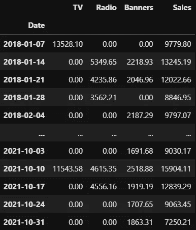
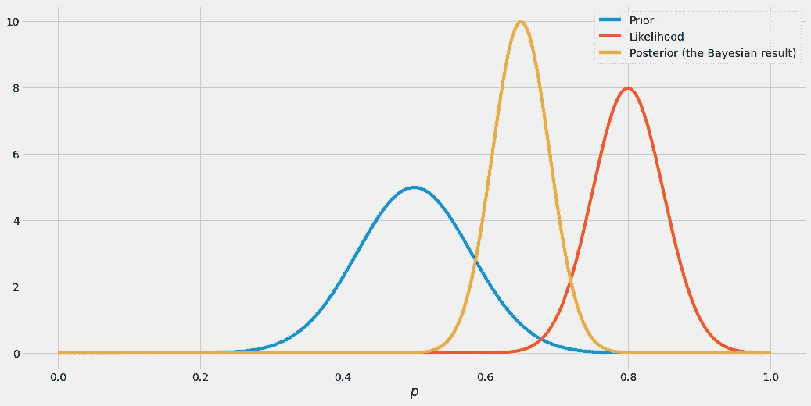
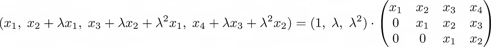
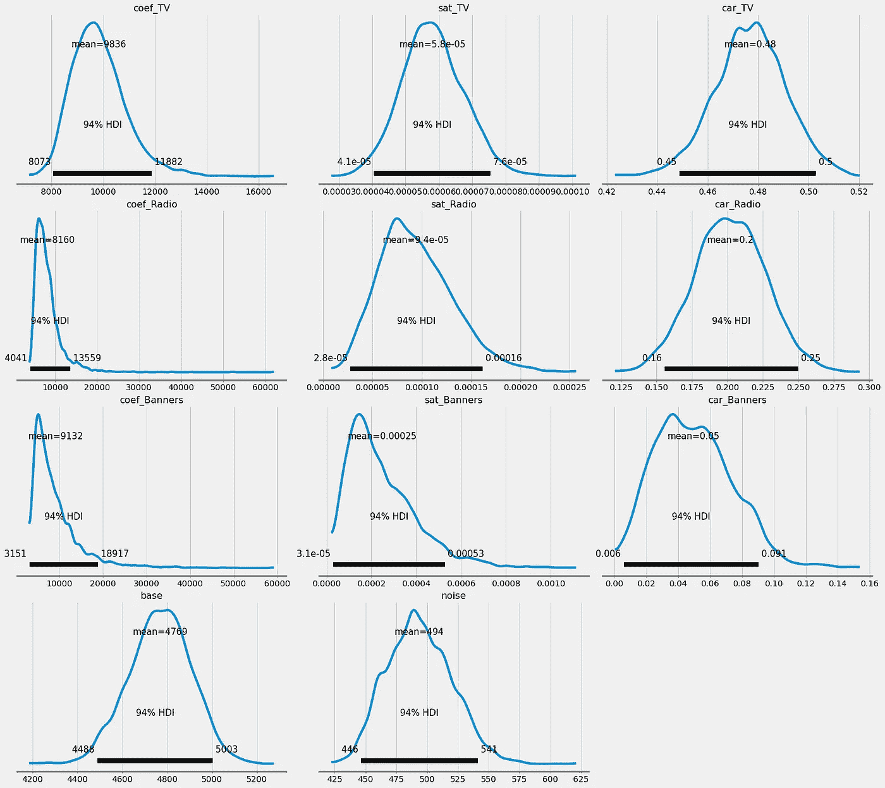
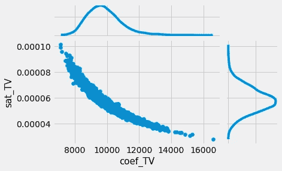
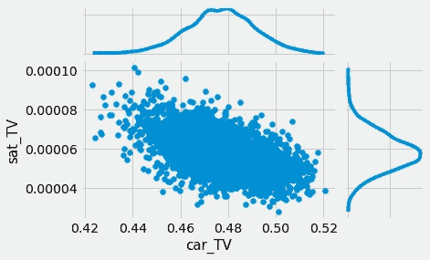
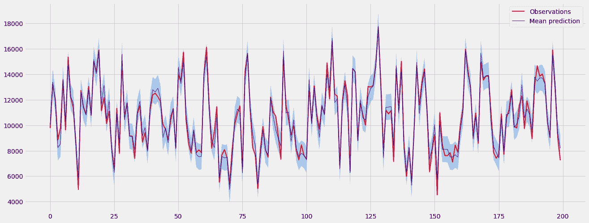
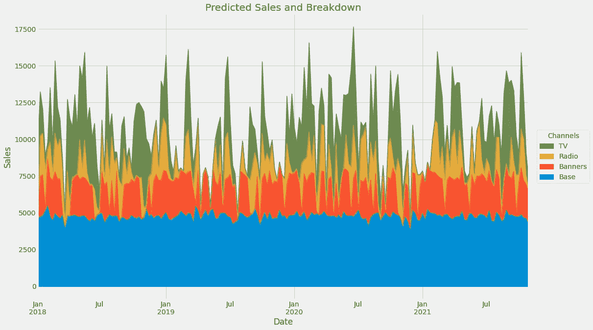

# 通过 PyMC3 在 Python 中进行贝叶斯营销组合建模

> 原文：<https://towardsdatascience.com/bayesian-marketing-mix-modeling-in-python-via-pymc3-7b2071f6001a?source=collection_archive---------0----------------------->

## [营销分析](https://medium.com/tag/marketing-analytics)

## 一次性估计饱和度、残留和其他参数，包括它们的不确定性


由[格雷格·拉科齐](https://unsplash.com/@grakozy?utm_source=medium&utm_medium=referral)在 [Unsplash](https://unsplash.com?utm_source=medium&utm_medium=referral) 上拍摄的照片

在这篇文章中，我想结合我在早期文章中讨论的两个概念:**贝叶斯建模**和**营销组合建模**。因为你很有可能对这两个主题都不熟悉，所以让我给你一个快速的介绍和进一步的阅读。我会

1.  激发什么是营销组合建模，
2.  贝叶斯建模是什么，以及
3.  为什么将两者结合起来是有意义的。

然后，我将向您展示如何使用 [PyMC3](https://docs.pymc.io/en/v3/) 进行实践。

# **准备工作**

如果你是我文章的热心读者(*谢谢！*)，你可以跳过几节直接看代码。否则，请继续阅读。

## 营销组合建模

每个企业的一个基本问题是决定在哪些渠道上花费营销预算。你可以每天花 1000€在电视广告上，2000€在广播广告上，3000€在网页横幅广告上，跟着感觉走。但这有什么好处吗？

也许网页横幅频道已经在 T21 饱和了，在那里只花 1500€和 3000€一样好。这样你就可以节省 1500€，或者把它们投入到其他更好的销售渠道。

或者也许一些频道甚至有负的投资回报率——你在广告上花的每一欧元，你得到的回报不到一欧元。我们绝对不应该在这样一个频道上浪费太多的钱，至少从商业角度来看它没有战略重要性。

要回答这样的问题，你必须了解不同的**媒体支出**(电视、广播……)**如何影响你的销售**或其他感兴趣的 KPI。

在营销组合建模中，你从媒体支出数据集开始。它通常通过一些*控制变量*进行扩展，即关于任何可能影响目标 KPI 的信息，如假期、天气、足球锦标赛、停工、产品价格等等。不过，为了简洁起见，我们将省略控制变量。然后，当然，你需要一个你想要预测的 KPI。这通常是销售额、新客户数量等等。因此，典型的数据集可能如下所示:



图片由作者提供。

在我以前的文章中，我更详细地描述了动机以及如何进行营销组合建模。为了理解本文的其余部分，请在这里查看它们:

[](/introduction-to-marketing-mix-modeling-in-python-d0dd81f4e794) [## Python 市场营销组合建模简介

### 哪些广告支出真正推动了你的销售？

towardsdatascience.com](/introduction-to-marketing-mix-modeling-in-python-d0dd81f4e794) [](/an-upgraded-marketing-mix-modeling-in-python-5ebb3bddc1b6) [## Python 中升级的营销组合建模

### 让我平庸的营销组合模式更加强大

towardsdatascience.com](/an-upgraded-marketing-mix-modeling-in-python-5ebb3bddc1b6) 

## 贝叶斯建模

许多估计器和模型源于一种*最大似然*方法。举个例子，假设你想估计一枚硬币正面朝上的概率 *p* 。你**翻转 10 次**，看到 **8 个头**，你得出什么结论？概率的自然估计是 *p* = 8 / 10 = 80%，这也是最大似然估计。你也可以计算一个置信区间，看看这个估计是否可靠，但是我们想走另一条路。

想象一下，我们想要加入一些关于概率 *p* 的**先验知识**。如果你从钱包里随机抽取了硬币，比如没有理由认为硬币有偏差，那么 *p* 应该不会离 50%太远，假设你不是魔术师。

使用贝叶斯建模，您可以将这种先验知识结合起来，最终得到对 *p* 的*密度*估计，即不是单个值，而是整个分布。这个分布可能在最大似然估计和先验之间的某处有一个峰值，可能是 65%。



红色曲线的模式是最大似然估计。图片由作者提供。

总而言之，贝叶斯建模是关于在先验知识和观察到的数据之间找到一个平衡点。在上图中，这意味着:没有任何数据，我们从蓝色曲线开始。这只是一种信念，一种直觉。然后，我们观察数据，告诉我们将蓝色曲线向红色曲线移动。我们以黄色混合曲线结束，它描绘了所谓的*后验*分布。

你可以在这里阅读更多关于动机的信息:

[](/a-gentle-introduction-to-bayesian-inference-6a7552e313cb) [## 贝叶斯推理的简明介绍

### 了解频率主义者和贝叶斯推理方法之间的区别

towardsdatascience.com](/a-gentle-introduction-to-bayesian-inference-6a7552e313cb) 

现在，理解理论是好的，但我们也必须能够应用它来完成事情。通常，我使用令人敬畏的 python 库 [PyMC3](https://docs.pymc.io/en/v3/) 进行贝叶斯建模。你可以在这里看到它的作用:

[](/bayesian-linear-regression-in-python-via-pymc3-ab8c2c498211) [## 通过 PyMC3 在 Python 中实现贝叶斯线性回归

### 了解如何推断模型参数并对新数据进行预测，包括不确定性估计！

towardsdatascience.com](/bayesian-linear-regression-in-python-via-pymc3-ab8c2c498211) 

## 为什么营销混合建模与贝叶斯？

您可以用许多超参数来定义营销组合模型:

*   饱和度
*   结转强度
*   结转长度
*   …

然后，可以使用超参数优化方法来找到最优组合。这就是我在另一篇关于营销组合建模的文章中所做的， [**用 Python**](/an-upgraded-marketing-mix-modeling-in-python-5ebb3bddc1b6) **升级的营销组合建模。**

这种方法很好，但是有一点我不喜欢:

> 超参数估计通常是不稳定的。

这意味着完全不同的超参数集可能产生同样好的模型。可能会有

*   **型号 A** 的电视残留强度为 0.4，电视饱和度为 0.8，以及
*   **型号 B** 电视结转强度 0.9，电视饱和度 0.5，

两者在测试装置上具有相同的 *r* 或 MAPE。从预测的角度来看，这两种模型是可以互换的，**如果你保持在你目前所看到的营销支出范围内。**

然而，使用模型 A 进行外推完全不同于使用模型 b 进行外推。这是一种相当不令人满意和麻烦的行为，因为外推是优化媒体预算时要做的事情。如果你过去一直每天花 0€到 1000€在电视广告上，为了优化，你必须知道当你花 5000€甚至 10000€时会发生什么。

> 你需要一个具有出色推断能力的模型。

通常，你不得不在两个以上的型号中选择。在这种情况下，您至少可以通过两种方式进行操作

*   你可以选择你创建的第一个模型，因为你甚至没有意识到这个问题。这种方法简单但危险。
*   您可以选择一个对您、一些领域专家或利益相关者来说正确的模型。对于一些人来说，这是可以的，但我不喜欢将产出预期放入模型中，因为下面的问题:

> 如果有人已经知道了答案，我为什么还要建立一个复制这个答案的模型呢？

从这里也可能有一些合理的方法，但是我现在想向你展示如何使用贝叶斯建模来规避这个问题。

# 建模开始！

首先，让我们获取数据集。

```
import pandas as pd

data = pd.read_csv(
  'https://raw.githubusercontent.com/Garve/datasets/4576d323bf2b66c906d5130d686245ad205505cf/mmm.csv',
  parse_dates=['Date'],
  index_col='Date'
)

X = data.drop(columns=['Sales'])
y = data['Sales']
```

然后，我们必须定义饱和度和结转功能，类似于上一篇文章。在 PyMC3 语言中，它可能是这样的:

```
import theano.tensor as tt

def saturate(x, a):
    return 1 - tt.exp(-a*x)

def carryover(x, strength, length=21):
    w = tt.as_tensor_variable(
        [tt.power(strength, i) for i in range(length)]
    )

    x_lags = tt.stack(
        [tt.concatenate([
            tt.zeros(i),
            x[:x.shape[0]-i]
        ]) for i in range(length)]
    )

    return tt.dot(w, x_lags)
```

饱和度函数应该很容易掌握。然而，结转有点麻烦。基本上，您可以将遗留转换表示为矩阵向量乘法。你只需要先组装矩阵`x_lags`和向量`w`就可以了。作为一个例子，我们可以转换输入向量 *x* = ( *x* ₁， *x* ₂， *x* ₃， *x* ₄)，结转长度为 3 via



图片由作者提供。

上面代码中的`carryover`函数就是这样做的。有了这些功能，我们终于可以开始建模了。

```
import pymc3 as pm

with pm.Model() as mmm:
    channel_contributions = []

    for channel in X.columns:
        coef = pm.Exponential(f'coef_{channel}', lam=0.0001)
        sat = pm.Exponential(f'sat_{channel}', lam=1)
        car = pm.Beta(f'car_{channel}', alpha=2, beta=2)

        channel_data = X[channel].values
        channel_contribution = pm.Deterministic(
            f'contribution_{channel}',
            coef * saturate(
                carryover(
                    channel_data,
                    car
                ),
                sat
            )
        )

        channel_contributions.append(channel_contribution)

    base = pm.Exponential('base', lam=0.0001)
    noise = pm.Exponential('noise', lam=0.0001)

    sales = pm.Normal(
        'sales',
        mu=sum(channel_contributions) + base,
        sigma=noise,
        observed=y
    )

    trace = pm.sample(return_inferencedata=True, tune=3000)
```

我们可以看到所有参数(不再有超参数！)用粗体标出。它是回归系数、饱和强度、残留强度、基线和噪音。

> 请注意，我没有考虑结转长度，而是将其设置为 21。这是因为我还不知道如何在 PyMC3 中用可变维度在`carrover`函数中创建矩阵和向量。但通常，我会用泊松随机变量来表示遗留长度。如果你知道如何正确地做这件事，请给我留言！*😉*也许现在也是给 pyro 一个机会的好时机，PyMC3 这样的另一种概率编程语言。

## 模型输出的分析

之后，我们可以看看通常的图片。让我们从后验分布开始。执行

```
import arviz as az

az.plot_posterior(
    trace,
    var_names=['~contribution'],
    filter_vars='like'
)
```

生产



图片由作者提供。

在这里，你可以看到所有参数的后验概率。它们都有很好的单峰形状。您还可以通过以下方式探索变量对的行为

```
az.plot_joint(
    trace,
    var_names=['coef_TV', 'sat_TV'],
)
```



图片由作者提供。

这里你可以看到饱和强度和回归系数不是独立的，而是负相关的:系数越高，饱和参数越低。这是有意义的，因为较高的系数可以补偿较慢增加的饱和曲线(=较低的`sat_TV`),反之亦然。

让我们看另一个例子:

```
az.plot_joint(
    trace,
    var_names=['car_TV', 'sat_TV'],
)
```



图片由作者提供。

**在这里，我们可以看到为什么超参数优化可能会有问题。这张图片中的每个点都是一个潜在的模型，你可以通过超参数优化找到它。**

对于一个真正唯一的最佳模型，我们更愿意看到一个点云紧紧的集中在一个点上(car_TV_true，sat_TV_true)。然而，在这里，我们看到 TV 残留强度可以具有在 0.4 和 0.5 之间的合理值，这取决于饱和度参数。

在我们下结论之前，我们还可以检查一下这个模型是否好。执行

```
import matplotlib.pyplot as plt

with mmm:
    posterior = pm.sample_posterior_predictive(trace)

means = posterior['sales'].mean(0)
stds = posterior['sales'].std(0)

plt.figure(figsize=(20, 8))
plt.plot(y.values, linewidth=2, c='r', label='Observations')
plt.plot(means, linewidth=1, c='b', label='Mean prediction')
plt.fill_between(np.arange(len(y)), means - 2*stds, means + 2*stds, alpha=0.33)
plt.legend()
```

给了我们



图片由作者提供。

所以看起来这个模型找到了一些有用的东西。在这里，我不会进一步详细讨论如何评估模型的性能，我们可以在将来这样做。

## 渠道贡献

到目前为止，我们已经处理了分布，但是对于我们最喜欢的渠道贡献图，让我们再次以单个值结束。由于我们在 PyMC3 代码中引入了一些通道贡献变量，现在我们可以使用一个简短的`compute_mean`函数轻松提取它们。

```
def compute_mean(trace, channel):
    return (trace
            .posterior[f'contribution_{channel}']
            .values
            .reshape(4000, 200)
            .mean(0)
           )

channels = ['Banners', 'Radio', 'TV']
unadj_contributions = pd.DataFrame(
    {'Base': trace.posterior['base'].values.mean()},
    index=X.index
)

for channel in channels:
    unadj_contributions[channel] = compute_mean(trace, channel)

adj_contributions = (unadj_contributions
                     .div(unadj_contributions.sum(axis=1), axis=0)
                     .mul(y, axis=0)
                    )

ax = (adj_contributions
      .plot.area(
          figsize=(16, 10),
          linewidth=1,
          title='Predicted Sales and Breakdown',
          ylabel='Sales',
          xlabel='Date'
      )
     )

handles, labels = ax.get_legend_handles_labels()
ax.legend(
    handles[::-1], labels[::-1],
    title='Channels', loc="center left",
    bbox_to_anchor=(1.01, 0.5)
)
```



图片由作者提供。

看起来不错！

# 总结与展望

在本文中，我们讨论了使用最大似然法的营销组合建模可能会因为超参数估计而变得困难。可能有许多模型在测试集上表现良好，但具有完全不同的外推行为——这些(超)参数非常不稳定。

然而，适当的外推是优化的关键。因此，我们设计了一个基本的营销组合模型，在贝叶斯设置中具有饱和和结转效应。这被证明是有用的，因为它一次估计所有的参数，给我们更稳定的参数估计。

然后，我们使用 PyMC3 实现了它，并再次创建了一个漂亮的贡献图表，以查看渠道支出对销售额的贡献。

## 模型扩展

我们现在可以采用我们已经创建的贝叶斯模型，并进一步扩展它。例如，我们可以引入随时间变化的参数。如果两年前电视遗留强度开始为 0.8，但随着时间的推移慢慢下降到 0.5，这可能是有用的，这是*概念漂移*的一个例子。我们可以使用**高斯随机游走**，轻松地对此建模，如我关于滚动回归的另一篇文章所示:

[](/rockin-rolling-regression-in-python-via-pymc3-e4722b6118cd) [## 通过 PyMC3 在 Python 中实现滚动回归

### 学习如何处理变化的参数

towardsdatascience.com](/rockin-rolling-regression-in-python-via-pymc3-e4722b6118cd) 

同样，我们可以对变化的基线进行建模。到目前为止，我们已经把基线当作一个单一的数字，它在整个训练期间是固定的。但也许随着时间的推移，由于我们的战略广告努力，它也增加了。这是使用我们旧的超参数优化最大似然模型很难解决的问题。

我希望你今天学到了新的、有趣的、有用的东西。感谢阅读！

**作为最后一点，如果你**

1.  **想支持我多写点机器学习和**
2.  **无论如何都要计划获得中等订阅量，**

**为什么不做** [**通过这个链接**](https://dr-robert-kuebler.medium.com/membership) **？这将对我帮助很大！😊**

*说实话，给你的价格没有变化，但大约一半的订阅费直接归我。*

非常感谢，如果你考虑支持我的话！

> *有问题就在* [*LinkedIn*](https://www.linkedin.com/in/dr-robert-k%C3%BCbler-983859150/) *上写我！*