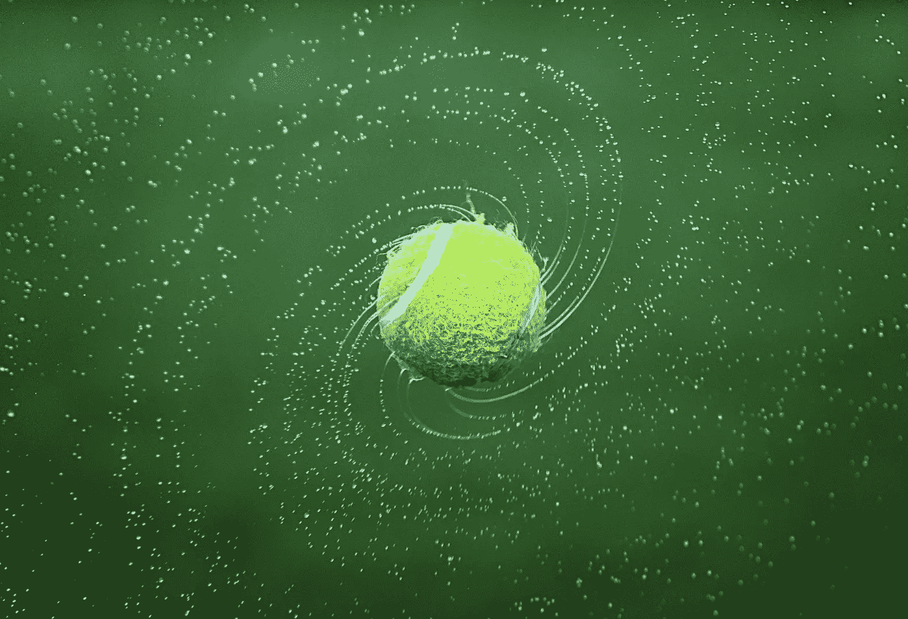
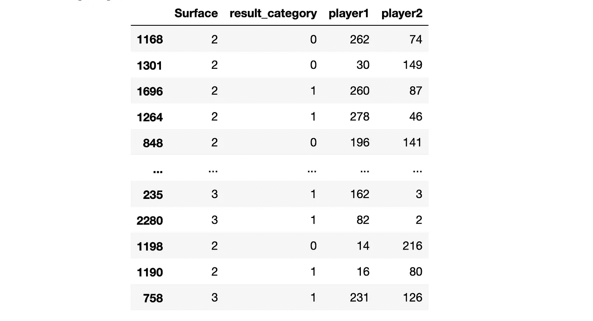
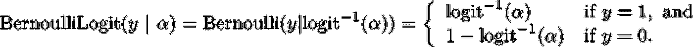
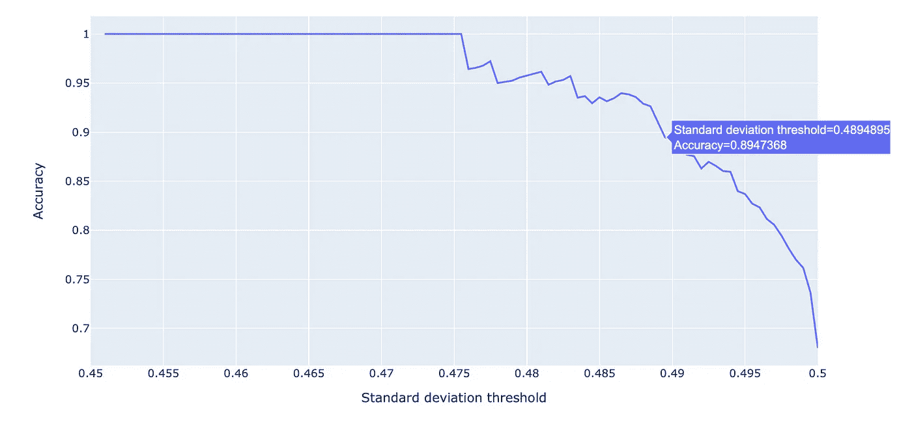
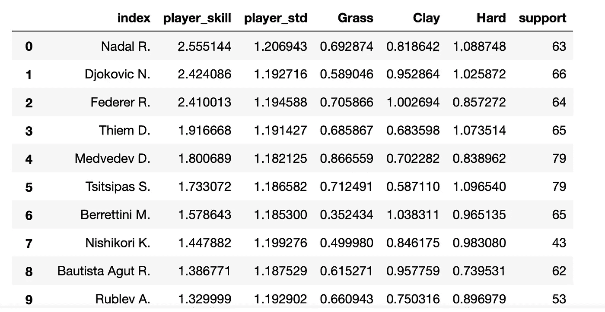
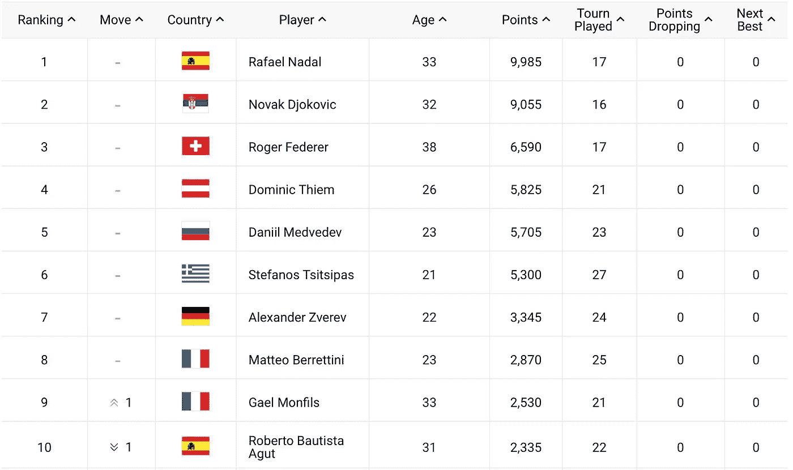

# 网球运动员排名的贝叶斯模型

> 原文：<https://towardsdatascience.com/bayesian-modelling-for-tennis-player-ranking-d151aef789a7?source=collection_archive---------27----------------------->

## 贝叶斯模型如何帮助我们对网球比赛结果建模并创建运动员排名？

图片来自 [Pixabay](https://pixabay.com/photos/tennis-tennis-ball-spinning-ball-1381230/) 上的 Bessi

我的前两篇文章是关于马尔可夫链蒙特卡罗和变分推理背后的理论，它为贝叶斯建模奠定了基础。在本文中，我们将使用贝叶斯模型和 MCMC 来预测网球比赛的结果，并在这样做的过程中，创建一个网球运动员的排名。

</variational-inference-for-neural-networks-a4b5cf72b24>  </introduction-to-mcmc-1c8e3ea88cc9>  

## 数据如何？

本项目使用的所有数据均来自此处的。我选择使用 2019 年的数据，因为 2020 年对体育来说是一个怪异的年份(&其他一切！)

2019 年的数据包含 2611 场男子单打比赛，来自所有 ATP(网球职业选手协会)锦标赛。对于这个项目，我们将只使用数据的`Winner`、`Loser`和`Surface`列。

本项目所需的数据处理如下:

1.  将玩家姓名映射到玩家 ID
2.  将曲面映射到曲面 ID
3.  将`Winner`和`Loser`列改为`player1`和`player2`
4.  随机洗牌，使`player1`不总是赢家(我们不希望任何模型知道`player1`有优势)。
5.  创建一个名为`result_category`的新列，指示`player1`是否赢得了游戏。

这给我们留下了一个看起来像这样的数据帧:

经过处理的 ATP 网球数据，图片由作者提供

## 建模理论

这个问题的建模方法围绕着一个想法，即一个网球运动员有一个潜在的技能分数，决定了他们赢得比赛的能力。如果一个玩家的分数比另一个玩家高，他们应该更有可能赢。此外，一个玩家应该有 3 个不同的奖励，取决于他们玩的表面(草地，粘土或硬)。这应该模拟玩家在不同表面上的真实可变性。

值得注意的是，由于我们将此视为贝叶斯建模问题，一切都变成了概率，所有技能和表面奖励都带有不确定性，这应该模拟不同玩家的真实方差。

## 实践建模

有很多不同的包可以用来解决这样的问题，包括`PyMC3`和`pyro.`，我选择使用`PyStan`，它是一个包装`Stan`编程语言的包装器。

我不会深入讨论如何使用 Stan 的细节，因为 Stan 手册比我能做的要好得多，但是我会试着解释一些基本的东西。有 3 个主要模块定义一个模型，`data`、`parameters`和`model`(可选地，你也可以包括`generated quantities`)。

1.  `data`定义所有的模型特征和目标(如果有的话)
2.  `parameters`定义所有你想要取样的变量
3.  `model`定义参数先验和模型似然
4.  `generated quantities`在采样后运行，用于执行模型推断

主要关注的是`model`块，我们在这里定义先验和似然性。

似然性表明给定的网球比赛分布为二元伯努利随机变量，其中参数 p 由运动员能力差异的 sigmoid 确定。

来自[标准文档](https://mc-stan.org/docs/2_19/functions-reference/bernoulli-logit-distribution.html)的伯努利逻辑函数。注意 logit^-1 和乙状结肠一样

玩家能力是两件事的函数，基础技能分数`player_ability`和表面奖励`surface_bonus`。注意选择不使用超先验参数化`player_ability`和`surface_bonus`的平均值。这是因为可能性仅取决于`player_ability`和`surface_bonus`中的差异，因此任何关于平均值的先验只会导致约束较差的问题。

请注意，我们确实允许每个表面有单独的标准偏差，即一些表面会导致或多或少的性能差异。最后值得注意的建模细节是两个标准差的先验选择。两者都被选作`uniform(0,10)`，这是一个完全未知的先验，目的是不在模型上强加太多的先验信息。我们同样可以选择像逆伽马先验这样的东西，但是我在采样时似乎收敛得稍微差一些。

## 结果

因此，如果我们对大约 90%的游戏(随机选择)进行训练，并对最后 10%进行验证，我们在测试集上获得的二进制准确率大约为 70%，在维持集上获得的二进制准确率为 65%。这并不坏，因为我们给模型的唯一信息是谁玩了，结果是什么，他们在什么表面上玩。

但是请记住，贝叶斯模型允许对我们预测的不确定性进行测量。如果我们根据预测样本的标准偏差来设定预测的阈值，我们可以建立这样的曲线…

σ与精度图，图片由作者提供

因此，通过设定大约 0.49 的标准偏差阈值，我们可以将准确率提高到近 90%！

## 玩家排名

我们的模型要求我们学习每个玩家的分数，以便预测谁将赢得给定的网球比赛。所以我们的模式还免费给了我们一个玩家排名！

模特选手排名，作者图片

如果把排名和 2019 年底开始的 ATP 排名对比一下…

[2019 年底 ATP 排名](https://www.atptour.com/en/rankings/singles?rankDate=2020-01-06&rankRange=0-100)

我们以正确的顺序获得了前 6 名，并且我们正确地找到了 ATP 前 10 名中的 8/10！对于几个小时的造型来说还不错！

## 我们学到了什么？

在本文中，我们在 Stan 中构建了一个贝叶斯模型来预测网球比赛的结果。我们还研究了如何使用该模型为球员创建一个与 ATP 排名相当一致的球员排名！使用 Stan 既直观又有趣。我很期待看到我们还能用它做些什么！