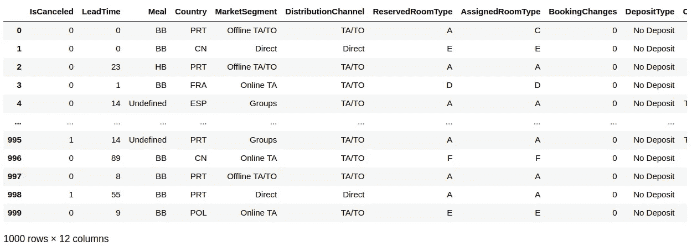
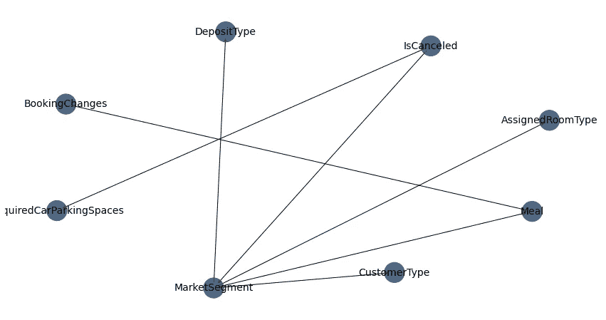
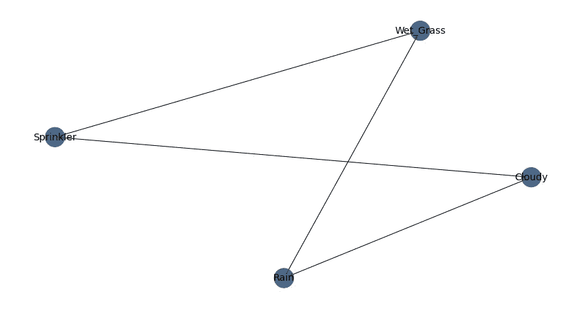
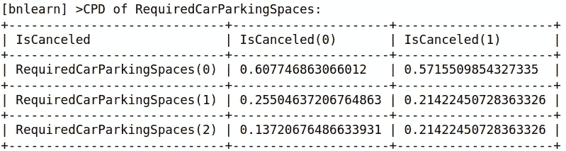
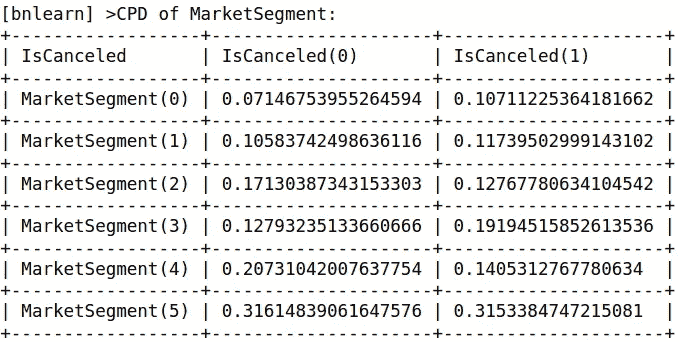

# 贝叶斯网络:分析酒店客户数据

> 原文：<https://towardsdatascience.com/bayesian-networks-analysing-hotel-customer-data-cd67dfd6fd43?source=collection_archive---------16----------------------->

## 用 bnlearn 实现概率建模


来源:图片由 [geralt](https://pixabay.com/users/geralt-9301/) 从 [Pixabay](https://pixabay.com/illustrations/earth-network-blockchain-globe-3537401/) 拍摄

在检查不同变量之间的依赖关系时，贝叶斯网络是一个非常直观的工具。

具体来说， **DAG** (或有向无环图)是允许我们表示给定变量集之间的条件概率。

使用 Python 中的 *bnlearn* 库，让我们看看这样的分析如何让我们收集关于酒店客户不同属性之间的依赖性的见解。

# 背景

本分析中使用的酒店预订数据来自 Antonio、Almeida 和 Nunes (2019)。

采用不同酒店客户属性的数据集，如客户是否取消、他们的原籍国、市场细分等，从数据集中随机抽取 1000 个观察值。



来源:Jupyter 笔记本输出，Antonio、Almeida 和 Nunes 的数据集(2019 年)

# 数据处理和 DAG 生成

我们将首先把数据转换成一个热数据矩阵。该函数通过自动检测相关数据类型并在必要时实现一键编码来工作:

```
dfhot, dfnum = bn.df2onehot(df)
```

现在，我们将生成 DAG。

首先，将根节点设置为*is cancelled*，即客户是否取消了酒店预订。在这种情况下，我们将它设置为根节点——因为我们对研究不同的客户属性如何影响取消行为特别感兴趣。

此外，我们还选择放弃某些变量，如提前期，因为我们主要对分析整个数据集的分类特征感兴趣，并根据每个特征中包含的不同类别分配取消概率。

与数据集中其他要素紧密关联的要素将被丢弃。例如， *ReservedRoomType* 与 *AssignedRoomType* 紧密相关，因此决定放弃前者。

```
DAG = bn.structure_learning.fit(dfnum, methodtype='cl', black_list=['LeadTime', 'Country', 'DistributionChannel','ReservedRoomType'], root_node='IsCanceled', bw_list_method='nodes')G = bn.plot(DAG)
```

以下是生成的 DAG:



来源:Jupyter 笔记本输出

如上所述，我们现在可以看到变量之间依赖关系的网状图。

例如，*取消*似乎证明了一个很强的条件概率，其中*市场细分*和*需要停车位*。换句话说，某个细分市场的客户比其他人更有可能取消预订，停车位的可用性似乎也对客户是否选择取消预订有很大影响。

反过来， *MarketSegment* 变量似乎显示出与 *AssignedRoomType* 和 *DepositType* 等的显著相关性。例如，某些细分市场可能比其他市场更愿意提前支付押金，或者某些细分市场可能为某个房间类别支付更多费用。

当然，这是表面层次的分析，因为虽然 DAG 的可视化可以向我们显示不同变量之间存在依赖关系，但它们无法解释这些依赖关系的性质或它们存在的原因。

从这个角度来看，在进行进一步分析之前，对不同变量之间的关系有一个总体的了解是非常有用的。

# 进一步分析

在更详细地生成 DAG 的图之后，我们现在可以更详细地分析参数。

## 简单看一下另一个例子

让我们考虑一个不同的例子 bnlearn 库提供的洒水喷头例子。



来源:Jupyter 笔记本输出

当分析这里的相关性时，我们可以看到雨和云之间存在关系，无论洒水器是开着还是关着，以及湿草的发生率。

可以在变量之间计算 CPD(或条件概率分布)。

例如，这里是生成的 Rain 变量的 CPD。

```
[bnlearn] >CPD of Rain:
+---------+--------------------+---------------------+
| Cloudy  | Cloudy(0)          | Cloudy(1)           |
+---------+--------------------+---------------------+
| Rain(0) | 0.6518218623481782 | 0.33695652173913043 |
+---------+--------------------+---------------------+
| Rain(1) | 0.3481781376518219 | 0.6630434782608695  |
+---------+--------------------+---------------------+
```

如果是阴天，看不到下雨的概率超过 65%。在这种情况下，观测到降雨的概率不到 35%。

另一方面，如果有云，那么观察到下雨的概率超过 66%，观察到不下雨的概率略高于 33%。

## 回到我们酒店的例子

既然我们已经考虑了一个更简单的例子，那么让我们来看看在酒店数据中生成的一些 CPD。

```
>>> model = bn.parameter_learning.fit(DAG, dfnum)
```

看到取消本身的概率刚刚超过 38%。

```
[bnlearn] >CPD of IsCanceled:
+---------------+-------+
| IsCanceled(0) | 0.611 |
+---------------+-------+
| IsCanceled(1) | 0.389 |
+---------------+-------+
```

现在，让我们考虑不同变量对取消概率的影响。

**所需停车位**



来源:Jupyter 笔记本输出

我们可以看到，如果没有所需的停车位可用，那么客户取消的可能性会大大增加。

**细分市场**



来源:Jupyter 笔记本输出

从该 CPD 中，我们还可以看到某些细分市场显示出比其他市场更高的取消概率。

现在，让我们假设我们希望考虑选择变量组合对取消概率的影响。

我们以餐食变量为例。如果酒店不满足顾客的饮食要求，任何一位顾客取消预订的可能性有多大？

```
>>> query = bn.inference.fit(model, variables=['IsCanceled'], evidence={'Meal':True})
>>> print(query)
>>> print(query.df)+----+--------------+---------+
|    |   IsCanceled |       p |
+====+==============+=========+
|  0 |            0 | 0.62191 |
+----+--------------+---------+
|  1 |            1 | 0.37809 |
+----+--------------+---------+
```

那么，如果我们也考虑所需的停车位呢？

```
>>> query = bn.inference.fit(model, variables=['IsCanceled'], evidence={'RequiredCarParkingSpaces':True, 'Meal':True})
>>> print(query)
>>> print(query.df)+----+--------------+---------+
|    |   IsCanceled |       p |
+====+==============+=========+
|  0 |            0 | 0.66197 |
+----+--------------+---------+
|  1 |            1 | 0.33803 |
+----+--------------+---------+
```

我们可以看到取消的概率下降到 33%多一点。当去除用餐变量时，概率刚刚超过 34%。从这个角度来看，分析表明，一家酒店如果有足够的停车位供有需求的顾客使用，那么取消预订的可能性就会大大降低。

通过这种方式， *bnlearn* 库在提供变量之间存在的条件概率的高层次概述以及对那些依赖关系的本质的更详细分析方面非常有用。

# 结论

在本文中，您已经看到:

*   贝叶斯网络如何运作
*   如何绘制和解释定向丙烯图(DAG)
*   用 bnlearn 计算条件概率

非常感谢您的宝贵时间，非常感谢您的任何问题或反馈。你可以在这里找到原始文章以及该项目的 GitHub 文件夹的链接。

# 参考

*   [安东尼奥、阿尔梅达、努内斯(2019)。酒店预订需求数据集。](https://www.sciencedirect.com/science/article/pii/S2352340918315191)
*   [erdogant.github.io: bnlearn 文档。](https://erdogant.github.io/bnlearn/pages/html/Examples.html)

*免责声明:本文是在“原样”的基础上编写的，没有任何担保。它旨在提供数据科学概念的概述，不应被解释为专业建议。本文中的发现和解释是作者的发现和解释，不被本文中提到的任何第三方认可或隶属于任何第三方。作者与本文提及的任何第三方无任何关系。*