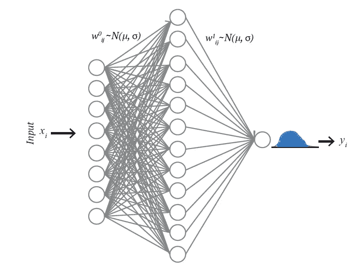
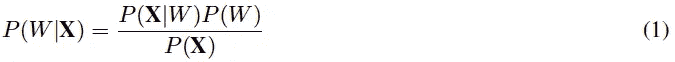
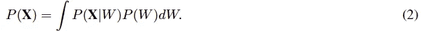
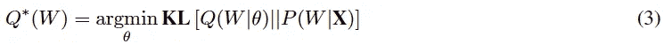
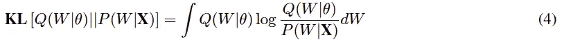
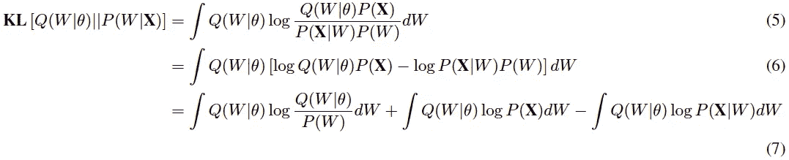
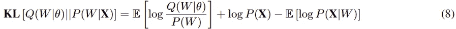

# 贝叶斯神经网络

> 原文：<https://towardsdatascience.com/bayesian-neural-network-7041dd09f2cc?source=collection_archive---------13----------------------->



图 1:示意图显示了这项工作中使用的贝叶斯神经网络的架构。该网络有一个包含八个参数的输入层、一个包含十二个节点的隐藏层和一个包含一个节点的输出层。输入层和隐藏层之间的权重由正态分布的 w0_ij 定义。I，j 是节点输入和隐藏层节点索引。类似地，w1_jk 是隐藏层和输出层之间权重的正态分布。在输出节点，网络产生介于 0 和 1 之间的预测分数分布。图摘自我在 arxiv 上发表的一篇文章:[https://arxiv.org/abs/1911.09660](https://arxiv.org/abs/1911.09660)

在传统的神经网络中，权重被指定为单个值或点估计值，而在 BNN 中，权重被视为概率分布。网络权重的这些概率分布用于估计权重和预测的不确定性。图 1 显示了重量呈正态分布的 BNN 的示意图。使用贝叶斯定理计算权重的后验值，如下所示:



其中 X 是数据，P(X|W)是观察到 X 的可能性，给定权重(W)，P(W)是权重的先验信念，分母 P(X)是数据的概率，也称为证据。它需要对所有可能的权重值进行积分，如下所示:



综合证据中所有的不确定权重，很难找到一个封闭形式的解析解。因此，基于模拟或数值的替代方法，如蒙特卡罗马尔可夫链(MCMC)，变分推理(VI)被考虑。MCMC 抽样已经成为现代贝叶斯统计中重要的推理方法。科学家们在许多应用中广泛研究和应用。然而，该技术对于大型数据集或复杂模型来说很慢。另一方面，变分推断(VI)比其他方法更快。它还被应用于解决许多大规模计算昂贵的神经科学和计算机视觉问题。

在 VI 中，考虑一个新的分布 Q(W|θ),它近似于真实的后验 P(W|X)。Q(W|θ)通过 W 进行参数化，VI 通过优化找到使两个分布的差异最小化的正确集合:



在上面的等式-3 中，KL 或 kull back–lei bler 散度是真实分布和近似分布之间相似性(相对熵)的非对称和信息论度量。Q(W|θ)和 P(W|X)之间的 KL 散度定义为:



用等式-1 代替 P(W|X ),我们得到:



取 Q(W|θ)的期望值，我们得到:



上面的等式仍然显示了 **logP(X)的依赖性，使得**很难被 KL 计算。因此，通过添加具有负 KL 散度的 **logP(X)** 来导出备选目标函数。 **logP(X)** 是关于 Q(W|θ)的常数。新函数称为下界证据(ELBO ),表示为:


第一项称为似然性，第二项是变分分布和先验权重分布之间的负 KL 散度。因此，ELBO 在可能性和先验之间进行平衡。可以使用不同的优化算法(如梯度下降)来优化 ELBO 目标函数以最小化 KL 散度。

想要在你的领域找到对机器学习和图论感兴趣的人吗？

我将通过分享关于 xoolooloo 的有趣信息来结束这篇文章。它是一个基于位置的搜索引擎，使用相似和多重兴趣来查找当地人。例如，如果你读了这篇文章，你肯定对图论、机器学习感兴趣。因此，你可以在你的地区找到有这些兴趣的人；去看看 www.xoolooloo.com 的

非常感谢您的阅读。我希望你喜欢这篇文章。完整代码和相关数据可在 [Github](https://github.com/msahamed/earthquake_physics_bayesian_nn) 上找到。文章链接:[https://arxiv.org/abs/1911.09660](https://arxiv.org/abs/1911.09660)。我很想收到你的来信。你可以联系我:

```
Email: sabbers@gmail.com
LinkedIn: [https://www.linkedin.com/in/sabber-ahamed/](https://www.linkedin.com/in/sabber-ahamed/)
Github: [https://github.com/msahamed](https://github.com/msahamed)
Medium: [https://medium.com/@sabber/](https://medium.com/@sabber/)
```