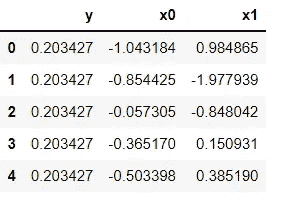
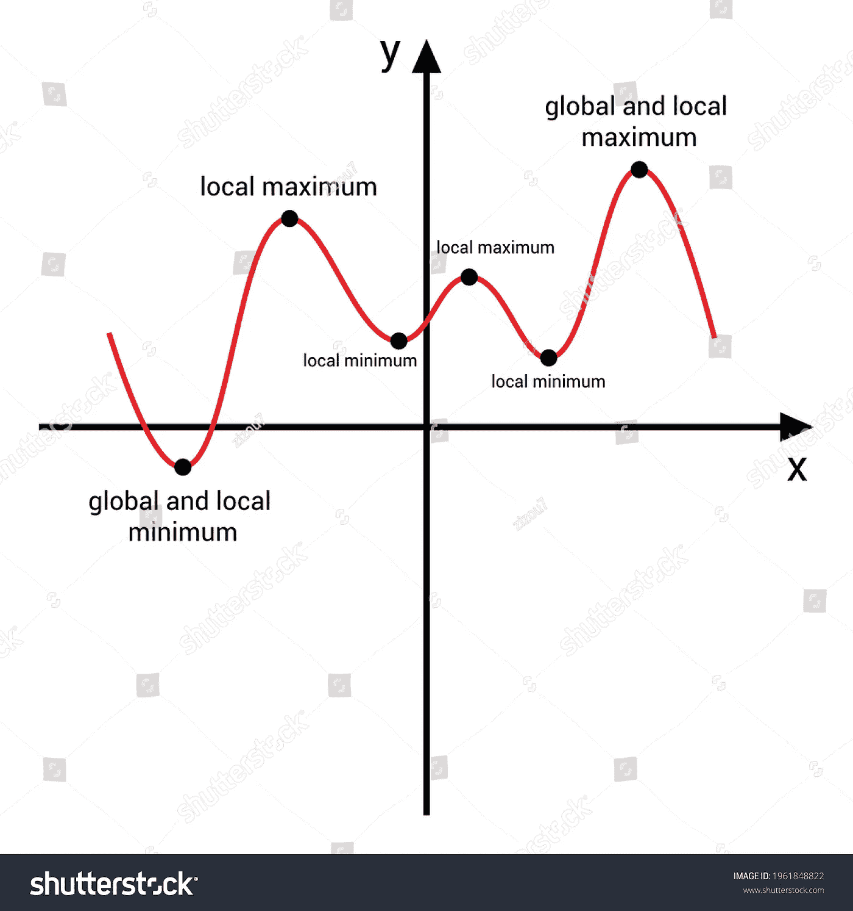
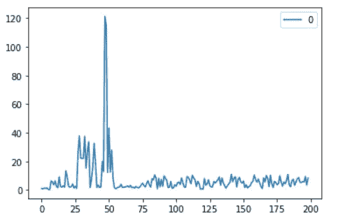
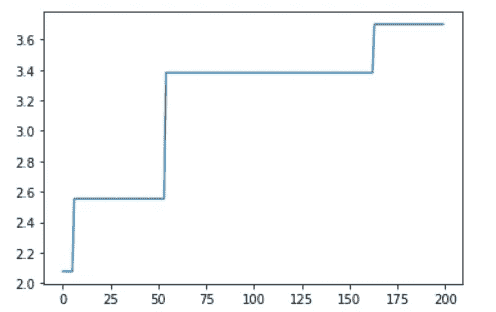

# 贝叶斯优化:一步一步的方法

> 原文：<https://towardsdatascience.com/bayesian-optimization-a-step-by-step-approach-a1cb678dd2ec?source=collection_archive---------3----------------------->

## 统计、概率、优化

## 用统计细节解释贝叶斯优化


[M. B. M.](https://unsplash.com/@m_b_m?utm_source=medium&utm_medium=referral) 在 [Unsplash](https://unsplash.com?utm_source=medium&utm_medium=referral) 上拍摄的照片

在许多现实生活的分析用例中，优化函数是非常重要的。所谓优化，我们的意思是，用某一组参数组合找到目标函数的最大值或最小值。找出最小值或最大值以及参数应该是目标。在本文中，我们将讨论用贝叶斯方法优化一个未知的代价函数的基础。

## 昂贵的黑盒函数优化——微积分

从基础微积分我们知道，要找到一个函数的最大值或最小值，我们需要求解 x 的导数方程，如下所示:


方程的根将是参数 x 的最优值，这又给出了函数 f(x)的最优值。只要知道函数 f(x)的完整代数形式，就很简单。但是，在许多现实生活场景中，事情并非如此简单。如果它是一个黑盒，那么你将只知道任何 f(x)的输出&输入值，但是你将不知道完整的形式。所以，分析上你找不到导数。除此之外，调用该函数的成本可能非常高。考虑如下两个用例:

> 1.**找出神经网络的最佳超参数组合**

考虑一个解决分类问题的大型复杂神经网络。超参数可以是网络中隐藏单元的数量、隐藏层的数量等。这些之间的关系可以被认为是一个假设的函数，该函数将超参数作为输入，并将分类精度作为输出。当然，你不知道这个函数的实际代数形式。找到最佳组合的一种方法是通过反复训练网络来尝试各种随机组合。问题的根源就在于此。我们负担不起重复培训，因为这是一个非常庞大和复杂的网络，培训需要大量的时间和资源。贝叶斯优化可以在这里有所帮助。

> 2.**考古遗址的挖掘——寻找最佳“挖掘点”**

不仅对于软件(如神经网络案例)，贝叶斯优化也有助于克服物理世界的挑战。在一个考古现场，专家们想到的主要问题是:“在哪里挖掘？”。不用说，从人力、金钱和时间的角度来看，挖掘是一个昂贵的“黑箱”操作。这个函数可以被认为是返回了一个站点中可用资源的列表，参数可以是位置细节，以及其他一些特定领域的东西。找到那个位置是一个挑战，贝叶斯方法可以解决这个问题。

在所有情况下，都需要进行一些函数的初始运行来进行估计。考虑以下功能:

它是“白盒”(因为导数可以通过分析找到)，乍看起来成本并不高，但是为了方便起见，假设它是成本很高的&本质上是“黑盒”，需要大量时间来返回输出。让我们进行一些模拟，

```
x = np.random.randn(5,2)
y = costly_function(x)
pd.DataFrame(data={'y':y, 'x0':x[:,0], 'x1':x[:,1]})
```

结果呢，



该函数有两个参数 x0 和 x1。对于上面这种代价很高的函数，我们只能调用几次。可能发生的情况是，初始的函数结果&输入可能在一个文件或数据库中给我们。然后，我们必须找出最佳(最小或最大)值和与之相关的参数组合(本例中为 x0 & x1)。我们永远不会知道实际的代数形式，导数的解析形式，因此必须进行数值优化。

在贝叶斯优化中，输入/输出组合的初始集合通常如上所述给出，或者可以从函数中生成。对于上面讨论的两个用例，可以如下实现:

1.  神经网络在不同的超参数组合上被训练多次，并且精确度被捕获和存储。该集合可以用作初始数据点。
2.  在考古挖掘作业中，可以进行几次初步挖掘来收集有关遗址的信息。它作为初始数据点。

简而言之，这是一个约束优化，它解决了下面给出两个问题:

I)找出以数值方式给出黑盒函数最优值的最优参数，因为无法找到解析导数。

ii)保持整个过程中函数调用的数量尽可能的少，因为这是非常昂贵的。(除了最初的几次运行)

## 贝叶斯优化术语

贝叶斯方法基于“黑盒”函数的统计建模和参数空间的智能探索。了解几个术语是很重要的。

> 1.**代理模型**

它是“黑箱”功能的统计/概率模型。它是后者的代理。为了试验不同的参数，该模型用于模拟函数输出，而不是调用实际的高成本函数。高斯过程回归(它是多变量高斯随机过程)被用作贝叶斯优化中的“代理”。

> 2.**采集功能**

它是一个度量函数，决定哪个参数值可以从函数中返回最佳值。它有许多变体。我们将与“预期改进”一起工作。

> 3.**勘探 vs 开采**

典型的策略是在参数空间中的局部和全局最优值之间进行补偿。考虑下面给出的图表:

<https://www.shutterstock.com/image-vector/local-global-maxima-minima-1961848822>  

在进行参数空间探索时，可以在函数具有高值或低值的地方找到许多这样的局部最优数据点。但是，这一过程不应就此停止，因为在其他一些领域可能有更多的最佳值。它被称为“*探险*”。另一方面，也应该重视从函数中持续返回最优(高或低)值的点。就是“*剥削*”。所以，两者都有一定的意义。这是一个微不足道的决定，“什么时候探索不同位置的更优数据点，或者什么时候利用同一个方向的&”。这是贝叶斯优化在参数空间中击败传统随机搜索或网格搜索方法的领域，因为它采取了中间立场。它有助于通过少量的实际函数调用更快地实现目标。另外两种方法是完全忽略这一事实的盲目搜索。搜索必须非常精确&“切中要害”以降低成本。贝叶斯方法很好地解决了这个问题。

简而言之，*采集函数*使用“探索对开发”策略，以迭代方式决定最佳参数搜索。在这些迭代中，代理模型有助于获得函数的模拟输出。任何贝叶斯方法都是基于“先验/后验”的概念。前面提到的函数的初始运行被用作起始点或“先验”，并且在每次迭代中，这些“先验”被“后验”数据点丰富。几次迭代后，达到最佳数据点，整个过程在此停止。接下来，我们将看到所有这些技术的实际应用。

## 逐步实施

我们将使用前面部分声明的带有两个参数的同一个“成本函数”作为要优化的目标函数，即，我们需要在当前情况下最大化它。假设该函数是“黑盒”,很少运行的输出会给我们。我们将定义一个类“BayesianOptimizer ”,并逐步声明它的功能和属性。

让我们首先创建类的结构并声明它的属性。

“gauss_pr”是前面提到的代理模型。“x_init”和“y_init”通常是初始运行集合中函数的参数和输出。您将及时看到其他属性的用法。

现在，我们将在同一个类中创建一个名为“_get_expected_improvement”的函数，这是贝叶斯方法的核心。就是前面说的想要的*采集函数*。在开始之前，让我们先讨论一些理论。

每当尝试一个新的数据点时，我们都需要计算一个称为“预期改进”或“EI”的指标来给出该数据点的权重。公式由下式给出:


在哪里


这乍一看有点复杂。“mu(f(x))”是根据高斯过程对新数据点 x 的预测(即“y”值)。“max{f(x)}”是根据当前阶段的整个先验列表的预测的最大值(也是从高斯过程获得的)。“sigma(f(x))”通常是新数据点 x 的预测标准偏差。“mu(f(x))”和“max{f(x)}”之间的差异只是为了检查搜索过程的改进。较高的值表示新数据点正在从函数返回一个高值，该值比迄今为止获得的最大值“*显著*”高。这个“*显著性*是通过将差值乘以累积概率密度得到的。因此，它给出了一个预期的或整体的"*表示*改进，当然这是"*开发*部分。这个值还被一个神奇的因子“sigma(f(x))”放大了。它给出了“EI”度量的不确定性，并且是处理“*探索*部分的秘密。“mu(f(x))”和“sigma(f(x))”很好地平衡了彼此的影响，因此 EI(x)采取了中间立场。

现在，我们将看到这个函数的实现，

> 它避免了实际的函数调用，并使用高斯过程作为代理。因此，具有不同点的试验通过代理高斯过程发生，而不是实际函数。这就是“降低成本”的秘诀之一。

这个高斯过程是如何迭代建立的，我们后面会看到。

接下来，这个获取函数用于计算随机选择的数据点的邻域中的“EI”度量，在数值上，它通过数值导数计算而被最大化。不要在这里混淆！！我们刚才又说了函数的“数值导数”。但是，它不是目标成本函数。它是关于最大化*采集函数*。只要想一想！！我们将只对给出“EI”最大值的数据点感兴趣，即从当前最大值给出目标函数的最大改进(“y”值)。

> 当然，这将为我们继续搜索参数空间提供正确的方向，避免不必要的盲目探索。这是“降低成本”的第二个秘诀。

接下来我们将看到实现，

尝试了一批(由“batch_size”提到的)随机生成的数据点，并且对于每一个数据点，采集函数被最大化(实际上，负函数被最小化以匹配“scipy”库支持)。将函数的负值最小化等价于将其最大化)。同样，从迭代中取“EI”的最大值，并返回相应的参数 x 值。从一个起点开始数值最大化，再从结果中取最大值，实际上给了参数 x 一个正确的方向，有适量的平均值和不确定性。它是广度搜索(不确定性)和深度搜索(均值)之间的折衷，从两者中获得最佳效果。

现在，下一部分是实际工作。您看到有一个高斯过程回归器作为代理模型。它用于在“先前”数据点的基础上迭代构建模型。“优化”功能可以完成所有这些工作。如下图所示。

上述步骤可以总结如下:

I)从初始“先前”数据点中找出最大值和相应的参数 x

ii)用初始“先前”数据点构建高斯过程。高斯过程使用*最大似然估计*来寻找参数之间的正确联合分布。

iii)使用采集函数获得下一个最佳参数 x。如前所述，在这个步骤中，在高斯模型的帮助下对不同的数据点进行试错，而不需要调用实际的“昂贵的”目标函数。

iv)使用真实目标函数获得参数值 x 的“y”值。它是“后验”数据点。

v)用“后验”数据更新“先验”,根据“先验”更新当前最大值，然后再次转到步骤 ii)

vi)最后，返回当前最大“y”值和相应的参数 x。

您会注意到，我们还进行了一些距离计算，并捕获了当前的最佳样本(除了当前的最大值 y 和相应的 x 之外，什么也没有)。从函数“_get_next_probable_point”计算两个连续的可能的下一个 x 值之间的距离。它显示了算法的进度。你会在结果中看到这一点。

## 结果

我们将使用两个二维样本参数作为初始数据点。我们可以使用 n 维，因为“costing _ function”足够通用，可以处理这种情况。

```
sample_x = np.array([[8,1],[6.2,5.3]])
sample_y = costly_function(sample_x)
```

现在，是时候使用“BayesianOptimizer”类了，

```
bopt = BayesianOptimizer(target_func=costly_function, x_init=sample_x, y_init=sample_y, n_iter=200, scale=10, batch_size=30)
bopt.optimize()
```

它触发邻域大小为 30 的搜索，并进行 200 次迭代。结果如下所示:


因此，对于参数 x0=1.92 和 x1=3.62，代价函数的最大值是 3.7。你可能已经注意到，在代价函数的定义中，我们引入了一个随机噪声，只是为了让它的导数难以计算。

> 记住，正如前面多次说过的，你永远也不会得到“高成本函数”的主体或定义。这里，为了便于理解，我们只创建了一个虚拟函数。但是，实际上，情况并非如此。样本 x & y 可能作为数据集提供给你，或者会有一些公共/私有托管的“黑盒”API，可以调用它来获得任何 x 的 y 值。

现在，我们将从计算中得到一些其他的结果，

可以画出距离，

```
pd.DataFrame(bopt.distances_).plot()
```



注意，两个连续的可能的下一个 x 点之间的距离随着迭代而减小。这是意料之中的。高斯模型在每次迭代后变得更加成熟，其预测变得更加完美，从而产生精确的“EI”值。最终，在每次迭代之后，它更接近最优 x，因此距离开始减小。

现在，我们将看到“y”值在迭代中是如何变化的，

```
bopt.best_samples_['y'].plot()
```



注意，y 是逐步达到最大值的。每次迭代都产生对最大值“y”的更好估计。

现在，同样的图计算“EI”

```
bopt.best_samples_['ei'].plot()
```


“EI”正在如预期的那样下降。想想吧！！。每一次迭代之后，都会产生一个更好的 y，所以这意味着当我们向最优的方向前进时，获得更大改进的机会就更少了。

## 有趣的事实

一个大问题“你如何决定 n_iter？”改变它的值肯定会影响我们对最大值的估计。这里需要注意的一点是，

> n_iter 等于在除初始化部分之外的整个优化过程中调用实际代价函数的次数

所以，当然它的价值取决于我们准备承担多少成本。

考虑神经网络模型的用例 1。如果有一个云环境，它对深度神经网络的每次“训练”运行向其客户收费，并且存在预算约束，则必须相应地设置“n_iter ”(因为在这种情况下，目标函数是网络的训练&获得准确性)。

贝叶斯方法试图通过减少实际调用来给出函数的估计，因此在某些情况下其准确性可能不如 RandomSearch 或 GridSearch。

> 当成本比非常小的精确度更重要时，贝叶斯优化是有用的。

源代码可以在这里找到，

<https://github.com/avisheknag17/public_ml_models/blob/master/bayesian_optimization/bayesian_optimization.ipynb> 