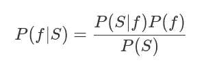
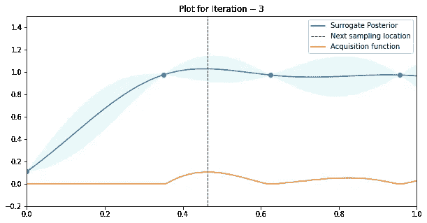

# 贝叶斯优化和超参数调整

> 原文：<https://towardsdatascience.com/bayesian-optimization-and-hyperparameter-tuning-6a22f14cb9fa?source=collection_archive---------10----------------------->

Patrick Federi 在 [Unsplash](https://unsplash.com?utm_source=medium&utm_medium=referral) 上的照片

一般的优化问题可以表述为通过遵守某些约束来寻找某个目标函数的极小点的任务。更正式的说法是，我们可以把它写成

我们通常假设我们的函数是可微的，并且根据我们如何计算我们函数的一阶和二阶梯度(Jacobians 和 Hessians ),我们指定不同种类的方法来解决这个问题。因此，在一阶优化问题中，我们可以评估我们的目标函数以及雅可比，而在二阶问题中，我们甚至可以评估 Hessian。在其他情况下，我们对目标函数的形式施加一些其他约束，或者做一些技巧来逼近梯度，比如在拟牛顿优化中逼近 Hessians。然而，这些不包括 f(x)是黑盒的情况。因为我们不能假设我们完全知道这个函数，我们的任务可以重新表述为在发现函数的同时找到这个最佳点。这可以写成同样的形式，只是没有约束

# KWIK

为了找到未知的 **f** 的最优 **x** ，我们需要明确地推理关于 **f** 的已知信息。这是受**知道它所知道的**框架的启发。我将展示一个来自[原始论文](https://www.microsoft.com/en-us/research/wp-content/uploads/2016/02/published-9.pdf)的例子，它有助于激发对我们功能的这种明确推理的需求。考虑导航下图的任务:

图 1:知道它所知道的(KWIK)示例(摘自原始论文)

图中的每条边都与一个二元成本相关联，我们假设代理事先不知道这些成本，但知道图的拓扑结构。每次代理从一个节点移动到另一个节点时，它都会观察并累积成本。一集是从左边的信源到右边的信宿。因此，学习任务是在几集内找出最佳路径。对于代理来说，最简单的解决方案是假设边的成本是一致的，因此，选择通过中间的最短路径，这样总成本为 13。然后，我们可以使用标准的回归算法来拟合这个数据集的权重向量，并简单地根据到目前为止观察到的节点来估计其他路径的成本，这为我们提供了 12 个顶部路径、13 个中间路径和 14 个底部路径。因此，代理会选择中间路径，即使它与上面的路径相比是次优的。

现在，让我们考虑一个代理，它不仅适合一个权重向量，还可以推理它是否可以利用可用数据获得边的成本。假设代理通过中间路径完成了第一集，累计奖励 13，那么它需要回答的问题就是接下来该走哪条路径。在底部路径中，倒数第二个节点的成本是 2，这可以从已经访问过的节点的成本中计算出来

这比我们开始时一致的假设给了我们更多的确定性。然而，这种依赖性对于上层节点并不真正存在，因为线性组合对已经访问过的节点不起作用。如果我们引入一种方法，让我们的代理说它不确定上层节点的成本的答案，我们可以从本质上激励它在下一轮中探索上层节点，允许我们的代理访问这个节点并发现最优解。这类似于我们如何讨论强化学习中的探索-利用困境。

# MDP 和信念

受前一节和[土匪](https://www.youtube.com/watch?v=5rev-zVx1Ps)的启发，我们可以将我们的求解器建模为代理，将函数建模为环境。我们的代理可以在一系列可能的值和有限的样本预算中采样函数值，它需要找到最优的 ***x*** 。从环境中采样后得到的观测值是一个有噪声的估计，可以称之为 ***y*** 。因此，我们可以把函数写成这些估计的期望值

我们可以把这看作一个马尔可夫决策过程，其中状态是由代理到目前为止收集的数据定义的。姑且称这个数据为 ***S*** 。因此，在每次迭代 ***t*** 时，我们的代理处于一种状态，需要决定在哪里采样下一个点。一旦它收集了这个样本，它就把它添加到现有的知识中:

我们可以创建一个策略，代理可以遵循该策略从某个特定的状态执行任何操作:

该代理使用一个对 ***f*** 的先验进行操作，并基于该先验通过将其乘以对输出的期望来计算确定性后验:

由于代理事先不知道 ***f*** ，所以它需要根据累积的数据计算该函数的后验置信

通过引入这种信念，我们可以在这些后验信念上定义一个 MDP，这意味着该 MDP 中的状态是后验信念***【P(f | S)】***，并且从一个信念状态到另一个信念状态的转换是随机的。因此，代理需要本质上模拟这个 MDP 中的转换，并且它可以在理论上解决最优问题。然而，困难在于后验信念的计算。

# 贝叶斯方法

这就是贝叶斯方法发挥作用的地方。他们将这种信念公式化为贝叶斯表示，并在每一步使用高斯过程进行计算。在此之后，他们使用启发式方法来选择下一个决策。用于计算这种信念的高斯过程被称为**替代函数**，而启发式被称为**获取函数。我们可以把这个过程写成如下:**

1.  使用替代高斯过程计算后验置信值***【x】***以形成围绕该估计值的平均值和标准偏差的估计值***【σ(x)***以描述不确定性
2.  计算采集函数 ***α(x)*** ，该函数与从数值范围中采样下一个点的益处成比例
3.  找到这个采集函数的最大点，并在下一个位置采样

这个过程重复固定次数的迭代，也称为**优化预算，**收敛到一个相当好的点。三种流行的采集功能是:

*   **改善概率(MPI)** →采集函数值与每个点的改善概率成正比。我们可以把它描述为代理后验概率的上尾 CDF:

*   **预期改善(EI)** →该值不仅与概率成比例，还与从该点开始的可能改善幅度成比例:

*   **置信上限(UCB)** →我们通过偏差和可调控制参数来控制探索，并利用后验平均值来获得下一个采样点:

对获取函数的这种最大化的评估是另一个非线性优化问题。然而，优点是这些函数是解析的，因此，我们可以区分它们，并确保至少在局部水平上收敛。为了使这个过程全局收敛，我们需要从该域的多个起点进行优化，并希望在所有这些随机起点之后，该算法找到的最大值确实足够接近全局值。

# 超参数调谐

全局贝叶斯优化可以显示良好结果的地方之一是神经网络的超参数优化。因此，让我们实现这种方法来调整图像分类器的学习率！我将使用 KMNIST 数据集和一个带有随机梯度下降优化器的小型 ResNet 模型。我们的攻击计划如下:

1.  使用数据集和可定制的学习率为我们的神经网络创建一个训练管道。
2.  将网络的训练和推理投射到一个目标函数中，这个目标函数可以作为我们的黑箱。
3.  将推断映射到可以在优化过程中使用的评估度量。我们本质上需要一个足够好的信号，让我们的求解器可以用来评估采样点。
4.  在全局贝叶斯优化过程中使用此函数。

# 创建培训管道和目标函数

我已经使用 PyTorch 和 lightning 模块创建了一个样板文件，可以用来训练我们的网络。由于 KMNIST 和 ResNet 架构已经在 PyTorch 中可用，所以我们需要做的就是为 MNIST 定制 ResNet 架构，我已经做了如下工作:

一旦完成，我们的下一步是使用训练管道，并将其转换为目标函数。为此，我们需要以某种方式评估我们的模型。我使用了平衡准确性作为评估指标，但也可以使用任何其他指标(如 AUC-ROC 评分)

# 实施贝叶斯优化

正如前面提到的，我们首先需要一个高斯过程作为代理模型。我们可以从头开始写，或者使用一些开源库来完成。在这里，我使用 sci-kit learn 创建了一个回归变量

一旦高斯过程建立，我们现在需要写采集函数。我使用了预期改进获取功能。核心思想可以按照[莫卡斯和莫卡斯](https://link.springer.com/article/10.1007/BF00940509)的提议重写:

在哪里

乘数φ和ɸ分别是 PDF 和 CDF 函数。这个公式是一个解析表达式，它与我们先前的公式获得了相同的结果，并且我们增加了ε作为探测参数。这可以通过以下方式实现:

代理函数只是使用之前编写的高斯过程进行预测。一旦我们有了预期的改进，我们需要通过最大化这些预期的改进来优化我们的收购

# 把所有的放在一起

现在我们有了优化例程，我们只需要将它们与我们的目标函数结合成一个循环，我们就完成了。我已经将优化实现为一个类，并将参数传递给这个类。因此，主循环如下所示:

这里，我在主循环中使用了 10 次函数求值的预算，在第一次后验估计之前使用了 2 次函数求值的预算。下面显示了最终结果的示例图

纵轴是平衡精度，横轴是学习率。可以看出，这是主循环的第三次迭代，采样 2 个点作为初始估计，并且获取函数在不确定性和平均值平衡的区域是最高的。

这是我在 TDS 发表的第一篇文章，所以我希望你会喜欢。我应该声明的一点是，上述采集函数的优化并没有真正使用我之前提到的多起点方法。但是，我计划在将来将这一点添加到代码中。代码在我的 [Github 库](https://github.com/amsks/BayesianOpt)里。我在我的[网站](https://amsks.github.io/)上不断总结我学到的东西，欢迎随时查看。