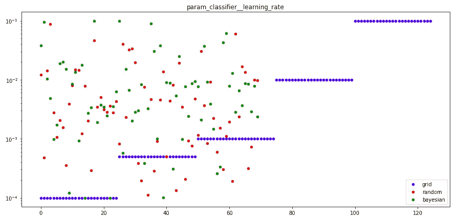
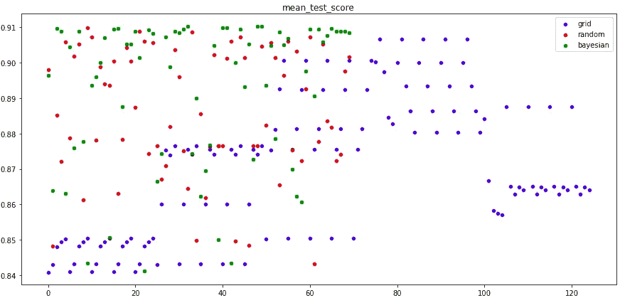

# 超参数调整方法-网格，随机或贝叶斯搜索？

> 原文：<https://towardsdatascience.com/bayesian-optimization-for-hyperparameter-tuning-how-and-why-655b0ee0b399?source=collection_archive---------10----------------------->

局部最小值和最大值的示例(图片由作者提供— Mayrhofen 2019)

## 使用三种方法的超参数优化实用指南:网格、随机和贝叶斯搜索

当我在做我的上一个项目时，在我训练了模型的第一个版本之后，我得到了一个新的数据块。那天，我觉得有点懒，并尝试使用相同的模型类型和超参数，用新数据重新训练我的模型。可惜没有按照我的预期进行。由于数据量的增加，它的性能没有得到改善，反而略有下降。添加的数据与我之前的数据分布不同，与原始数据相比，它的数量不可忽略，这与我的预期相反。

因此，我发现自己处于一个未知的领域，不知道应该使用哪个超参数。我手动尝试了一些选项，但有太多可能的组合，我在管理我的实验时遇到了麻烦。那时，我决定更深入地研究超参数调优领域。

## 你对这篇文章有什么期待？

1.  超参数调谐简介。
2.  解释超参数搜索方法。
3.  每种方法的代码示例。
4.  比较和结论。

对于帖子中的所有例子，我使用了 Kaggles 的[心脏病发作分析预测数据集](https://www.kaggle.com/rashikrahmanpritom/heart-attack-analysis-prediction-dataset)。

我准备了一个简单的管道，用于所有的例子。

# 什么是超参数调整，为什么它很重要？

超参数是控制算法整体行为的算法变量。它影响其速度、分辨率、结构，并最终影响性能。有时它只有很小的影响，但在其他情况下，它是至关重要的。一个很好的例子是**学习率**。当它太大时，学习不够敏感，模型结果不稳定。但是当它太小时，模型学习起来就有困难，可能会卡住。

当算法有许多参数时，很难尝试所有可能的组合来找到最佳集合。因此，我们希望以一种可管理的方式高效地进行超参数调整。

# 超参数搜索的类型

执行超参数搜索有三种主要方法:

1.  网格搜索
2.  随机搜索
3.  贝叶斯搜索

## 网格搜索

执行超参数调整的基本方法是尝试所有可能的参数组合。例如，如果您想要调整 **learning_rate** 和 **max_depth** ，您需要指定您认为与搜索相关的所有值。然后，当我们运行超参数优化时，我们尝试两个列表中的所有组合。

在下面的例子中，我试图找到 **learning_rate** (5 个值)、 **max_depth** (5 个值)和 **n_estimators** (5 个值)的最佳值——总共 125 次迭代。

## 随机搜索

与网格搜索不同，在随机搜索中，只尝试了部分参数值。参数值从给定的**列表**或**列表**指定的**分布**中采样。被采样的参数设置的数量由 **n_iter** 给出。当参数以列表形式呈现时，执行无替换采样(如网格搜索)。但是如果参数以分布形式给出，则使用带有替换的采样**(推荐)。**

根据我的经验，随机搜索的优点是你可以在不增加迭代次数(耗时)的情况下扩展你的搜索范围。此外，您可以使用它来找到狭窄的限制，以便在更小的区域内继续进行彻底的搜索。

在下面的例子中，我使用参数分布进行替换采样。

# 贝叶斯搜索

贝叶斯搜索与其他方法的主要区别在于，调整算法根据前一轮得分在每一轮中优化其参数选择。因此，该算法不是随机选择下一组参数，而是优化选择，并且可能比前两种方法更快地达到最佳参数组。也就是说，这种方法只选择相关的搜索空间，并放弃最有可能不提供最佳解决方案的范围。因此，当您拥有大量数据，学习速度较慢，并且您希望**最大限度地减少调整时间**时，这是非常有益的。

与随机搜索示例相同，我在这个示例中使用了用于采样的参数分布:

## 参数搜索的可视化——学习率

这个比较中的最佳学习率参数是 0.008(通过贝叶斯搜索找到)。

## 每次迭代平均分数的可视化

我们可以看到贝叶斯搜索比其他方法略胜一筹。这种影响在更大的数据集和更复杂的模型中更加明显。

# 讨论和结论

我在相同的参数范围内运行了三种搜索方法。网格搜索运行 125 次迭代，随机和贝叶斯运行 70 次迭代。这个数据集相对简单，所以分数的变化并不明显。尽管如此，随机搜索和贝叶斯搜索比网格搜索表现更好，迭代次数更少。**贝叶斯**搜索找到了实现**最佳得分**的超参数。

关于该主题的进一步阅读，我推荐阅读以下精彩帖子:[https://towardsdatascience . com/a-conceptual-explain-of-Bayesian-model-based-hyperparameter-optimization-for-machine-learning-b 8172278050 f](/a-conceptual-explanation-of-bayesian-model-based-hyperparameter-optimization-for-machine-learning-b8172278050f)。

祝你好运！