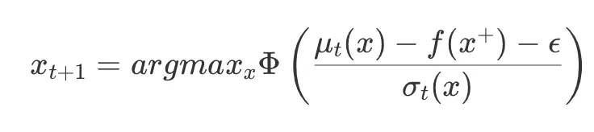
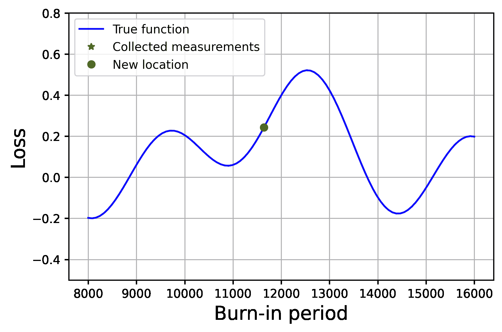

# 贝叶斯优化的超参数调整或者我如何用木头雕刻船

> 原文：<https://towardsdatascience.com/bayesian-optimization-or-how-i-carved-boats-from-wood-examples-and-code-78b9c79b31e5?source=collection_archive---------36----------------------->

## 示例和代码

作者图片

小时候，我和祖母在一个小村庄里度过夏天，周围没有同龄人，也没有什么娱乐活动。虽然阅读占据了我大部分的时间，我也曾经用木头雕刻小船。我的船有三个我特别注意的特点——船的宽度、龙骨的长度和桅杆的长度。

一般来说，更宽的船更稳定，但速度较慢，也不好看。桅杆较长的船需要平衡，因此龙骨较长，速度较慢。我测试了随机配置的船只，没有遵循系统的方法。

设计船很有趣，那时我有足够的时间。另一方面，为大多数机器学习模型寻找最佳超参数通常是不可避免的。在时间紧迫的情况下，这可能是一项压力很大且非常昂贵的任务。虽然超参数网格搜索对于单个参数来说可能足够了，但是对于更多的参数来说，可能的测试选项的数量呈指数增长！

好在有帮助——贝叶斯优化！

这篇文章是对必要组件的一个非常简短的概述，旨在以一个 [jupyter 笔记本](https://github.com/mikhailiuk/medium/blob/master/Bayesian-optimization/bayesian_optimization.ipynb)的形式提供可伸缩的代码。看看吧！

# 理论

在解释这个问题时，我发现牢记最终目标是有用的。本文的目标是找到深度神经网络的超参数，以最大限度地提高验证精度。为此，我们将使用贝叶斯优化。我们可以将这个过程分成几个步骤:

1.  用超参数值初始化网络；
2.  训练模型并在验证集上保存最佳精度；
3.  对目前收集的性能数据拟合一个*高斯过程* (GP)。这里，到目前为止测试的超参数值是独立变量，并且具有这些超参数值的模型的精度是预测变量；
4.  使用 GP fit 上的*采集功能*获得下一组超参数值，通过这些值，模型有望获得更好的性能；
5.  转到步骤 1。

因此，该过程需要两个重要步骤

*   损失函数估计——将通过高斯过程实现；
*   获取函数——损失的最高预期改善。

## 高斯过程

与线性模型不同，我们选择一个具有有限参数的函数，高斯过程(GPs)是非线性模型，不会将我们局限于一个函数。GPs 允许用一系列函数对数据建模。

使用 GPs 时，我们假设每个数据点都是正态分布的随机变量，并且每个数据点都相互关联。也就是说，整个数据集可以用具有非平凡协方差的多变量正态分布来描述。

GPs 完全由均值 *m* 和克内尔 *K* 函数描述。mean 函数非常简单，它接受数据点特征并返回该数据点的预测变量的平均值。核函数将两个数据点作为输入，并返回它们之间的协方差。内核描述了数据点之间的关系，因此是对结果拟合方式的隐含约束。

让我们从一个由五个数据点组成的简单例子开始。在我们的例子中，假设 y 轴是我们想要最大化的机器学习算法的损失函数，x 轴是影响预测精度的超参数，例如预烧时间。

作者图片

对于我们的高斯过程，我们假设损耗相对于预烧期是平滑的，我们不希望损耗在预烧期发生微小变化后突然改变。因此，我们选择一个非常标准的平方指数核来加强这种平滑先验。

平方指数核

直观上，如果点 x 和 x’靠得很近，协方差将会很大，即，与相距较远的点相比，它们对彼此的位置具有更大的影响(这里 l 和σ是核的超参数)。核函数通常以矩阵形式书写，即通过 GPs 建模的多元高斯分布的协方差矩阵。因此，我们可以享受这个矩阵的一些性质——正定性和对称性。

核的选择是一门艺术，有很多关于如何自动完成这项工作、如何将核组合在一起以及如何为多维数据选择核的研究，因为为一个维度做出的假设可能不适用于另一个维度。更多内核可视化可以在[这里](https://www.cs.toronto.edu/~duvenaud/cookbook/)找到。一个完整的研究分支正在研究模型训练时的学习内核。

让我们回到这个问题上来。我们用 GP 建模我们的数据:

作者图片

注意，即使在我们有数据测量(损失)的位置，标准偏差也是非零的。这是因为除了平方指数内核之外，我们还使用了[白化内核](https://scikit-learn.org/stable/modules/generated/sklearn.gaussian_process.kernels.WhiteKernel.html)——添加到每个点的小常数方差，允许预测值中的一些不确定性。当我们寻找函数的最大值时，这将是有用的。

关于高斯过程的更多细节，请查看[尼尔·劳伦斯的博客](http://inverseprobability.com/talks/notes/gaussian-processes.html)和[这篇精彩的博文](/understanding-gaussian-process-the-socratic-way-ba02369d804)。

## 贝叶斯优化— ***采集*** 函数

该步骤中的任务是找到超参数的值，该值将改善我们找到的拟合损失函数的当前最大值(最小值)。为了确定每个点的潜力(例如，相对于预期的改进或改进的概率)是最大值(最小值),我们使用一个获取函数。采集函数接收获得的 GP 拟合(每个点的平均值和方差),并为机器学习算法的下一次运行返回超参数值。下面我们考虑两个简单的获取函数:改进概率和预期改进。

**改进概率**:通过均值和方差估计，我们寻找最有可能成为下一个峰值的点。

改进概率标准

这里ф是标准累积正态分布，μt(x)是点 x 处的预测平均值，f(x+)是数据点中的当前最大值，ε是避免分子中为零的小误差项，sigma 是点 x 处的标准偏差，用于标准化分布。均值越大，概率越高。另一方面，较小的标准差会导致较高的概率值，因为我们在预测中更有把握。因此，改进的可能性阻碍了对空间的探索。

**预期改进**:另一种常见的方法是使用预期改进。该方法允许具有较高估计方差的点有更大的机会被选择。在这种情况下，要选择的下一个点将最大化预期的改善，x_(t+1)=argmax_x(EI)，其中:

预期的改进

有关推导的更多细节，请参考本文[的](https://distill.pub/2020/bayesian-optimization/)部分。在下面的例子中，我将使用预期改进，因为它已被证明可以产生更好的样本。下面给出了上述功能的预期改进。

作者图片

EI 标准在大约 11800 和 12900 处有两个明显的峰值，在[8000，10500]和[14200，16000]处有平坦的尾部。我们可以重新查看上图中的 GP 拟合，并注意到峰值对应于均值和标准差之和最大的拟合值。

基于汤姆森采样的其他策略可以在[教程 1](https://arxiv.org/abs/1807.02811) 和[教程 2](https://dash.harvard.edu/bitstream/handle/1/27769882/BayesOptLoop.pdf;jsessionid=4990339A8FDE6CBE54D9C7B4B7A510BA?sequence=1) 中找到。更多的例子可以参考这篇[的文章](https://distill.pub/2020/bayesian-optimization/)。

# 让我们运行一些代码！

本文基于一个 [jupyter 笔记本](https://github.com/mikhailiuk/medium/blob/master/Bayesian-optimization/bayesian_optimization.ipynb)。我把这个例子设计成可扩展的——添加更多的变量来优化只需要设置这些变量的名称、它们的范围和采样位置的数量。因此，下面的两个例子需要最少的代码更改。

在这两个例子中，我都使用预期改善作为获取函数。试着自己运行代码，用改进的概率来代替。

## 1D 的例子

假设我们正在训练一个变压器网络，为此我们需要找到老化超参数的最佳值。

作者图片

所选点随着时间的推移逐渐攀升至函数的最大值。随着在最大值周围采样的点越来越多，该点周围的方差越来越小。同时，即使未探索区域的预测平均值小于最大值，高方差也允许探索未探索的空间。

## 2D 的例子

1D 的情况不太实际，因为通常有更多的超参数需要优化。在这个例子中，我们考虑具有两个超参数的 2D 情况:预烧期和学习率。在 3D 中可视化采样点可能很困难。下面我也展示了数据的等高线图——从顶部看。

作者图片

这两个例子最终都融合了。运行更多的迭代会产生更精确的估计。典型的停止标准是每个新步骤的增加。

## 实用性

直接在原始参数值以及我们正在建模的损失函数的原始范围上运行贝叶斯优化可能具有不利影响，因为核函数没有考虑变化的范围。为了将这一方面纳入优化，我将数据重新调整到 0–1 的范围。

由于最终准确度的值受到许多条件的影响，例如机器学习算法的初始化，因此在对其建模时，我们允许在具有白噪声核的预测中存在一些噪声。

# 进一步阅读

贝叶斯优化非常昂贵，应考虑实际因素。关于如何在实践中运行它的更多细节，请查看这篇[论文](https://arxiv.org/pdf/1206.2944.pdf)。

对于那些对集成解决方案更感兴趣的人，请查看[权重和偏差](https://wandb.ai)，它为跟踪模型的超参数和度量提供了现成的套件，以及[他们对贝叶斯优化的实现](https://wandb.ai/site/articles/bayesian-hyperparameter-optimization-a-primer)

Distill 有一篇很棒的关于贝叶斯优化的文章，一定要看看牛津大学的这篇评论文章[！](https://www.cs.ox.ac.uk/people/nando.defreitas/publications/BayesOptLoop.pdf)

别忘了这篇文章是基于一本 [jupyter 笔记本](https://github.com/mikhailiuk/medium/blob/master/Bayesian-optimization/bayesian_optimization.ipynb)。看看吧！

非常感谢 [Param 韩吉](https://www.cl.cam.ac.uk/~pmh64/)对内容提出的宝贵建议！

## 喜欢作者？保持联系！

我错过了什么吗？不要犹豫，直接在 [LinkedIn](https://www.linkedin.com/in/aliakseimikhailiuk/) 或 [Twitter](https://twitter.com/mikhailiuka) 上给我留言、评论或发消息吧！

</active-sampling-for-pairwise-comparisons-476c2dc18231>  </can-you-do-better-sampling-strategies-with-an-emphasis-on-gibbs-sampling-practicals-and-code-c97730d54ebc>  </a-note-on-parametric-and-non-parametric-bootstrap-resampling-72069b2be228> 