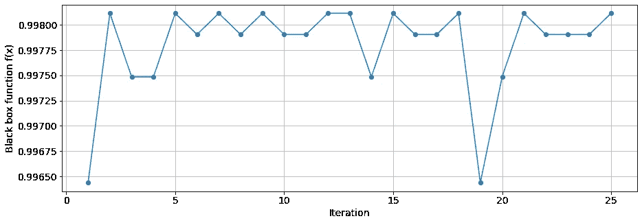

# 用 Python 实现贝叶斯优化

> 原文：<https://towardsdatascience.com/bayesian-optimization-with-python-85c66df711ec?source=collection_archive---------1----------------------->

## 优化评估成本高昂的黑盒函数

如果你在数据科学或机器学习领域，很可能你已经在做[优化](https://en.wikipedia.org/wiki/Mathematical_optimization)！例如，训练一个[神经网络](https://en.wikipedia.org/wiki/Neural_network)是一个优化问题，因为我们希望找到一组模型权重，使[损失函数](https://en.wikipedia.org/wiki/Loss_function)最小化。[找到产生最佳性能模型的超参数组](https://en.wikipedia.org/wiki/Hyperparameter_optimization)是另一个优化问题。

优化算法有多种形式，每一种都是为了解决特定类型的问题而创建的。特别是，学术界和工业界的科学家共同面临的一类问题是评估昂贵的[黑盒函数](https://en.wikipedia.org/wiki/Black_box)的优化。在今天的帖子中，我们将探讨如何用 Python 优化评估代价高昂的黑盒函数！


最优化问题是科学和工程中经常遇到的问题。Shane Rounce 在 [Unsplash](https://unsplash.com/?utm_source=unsplash&utm_medium=referral&utm_content=creditCopyText) 上拍摄的照片。

# 评估黑盒功能的成本很高

“评估昂贵的黑盒”意味着所涉及的功能或操作需要花费大量的金钱或资源来执行，并且其内部工作方式无法理解。一个评估代价昂贵的黑盒函数的好例子是优化深度神经网络的超参数。每个训练迭代可能需要几天的时间来完成，我们不能预先分析超参数值，这将导致最佳性能的模型。

当然，我们对每一个可能的超参数值进行交叉验证网格搜索，但是重复这么多训练迭代会导致计算成本激增！需要一种更有效的方法来使用最少的迭代次数找到最佳的超参数集。好在那种方法已经存在:[贝叶斯优化](https://en.wikipedia.org/wiki/Bayesian_optimization)！

# 贝叶斯优化算法

[贝叶斯优化](https://en.wikipedia.org/wiki/Bayesian_optimization)是一种基于机器学习的优化算法，用于寻找参数，以全局优化给定的黑盒函数。该算法包含两个重要部分:

1.  要优化的黑盒函数: *f* ( *x* )。我们要找到全局优化 *f* ( *x* )的 *x* 的值。根据问题的不同， *f* ( *x* )有时也被称为目标函数、目标函数或损失函数。一般来说，我们只知道 *f* ( *x* )的输入和输出。
2.  采集函数: *a* ( *x* ，用于生成 *x* 的新值，以供 *f* ( *x* )评估。 *a* ( *x* )内部依靠一个[高斯过程模型](https://medium.com/@natsunoyuki/gaussian-process-models-7ebce1feb83d) *m* ( *X* ， *y* )生成新的 *x* 值。

优化过程本身如下:

1.  定义黑盒函数 *f* ( *x* )、采集函数 *a* ( *x* )以及参数 *x* 的搜索空间。
2.  随机产生 x 的一些初始值*，从 *f* ( *x* )测量相应的输出。*
3.  将一个[高斯过程模型](https://medium.com/@natsunoyuki/gaussian-process-models-7ebce1feb83d) *m* ( *X* ， *y* )装配到 *X* = *x* 和*y*=*f*(*X*)上。换句话说， *m* ( *X* ， *y* )作为 *f* ( *x* )的代理模型！
4.  采集函数 *a* ( *x* )然后使用 *m* ( *X* ， *y* )生成新的 *x* 值，如下所示。用 *m* ( *X* ， *y* )预测*f(*X*)如何随 *x* 变化。导致 *m* ( *X* ， *y* )中预测值最大的 *x* 的值，则建议作为 *x* 的下一个样本，用 *f* ( *x* )进行评估。*
5.  *重复步骤 3 和 4 中的优化过程，直到我们最终得到一个导致全局最优值 *f* ( *x* )的值 *x* 。请注意， *x* 和 *f* ( *x* )的所有历史值都应该用于在下一次迭代中训练高斯过程模型 *m* ( *X* ，*y*)——随着数据点数量的增加， *m* ( *X* ， *y* )在预测最优值方面变得更好*

# *用`bayes_opt`库进行贝叶斯优化*

*作为演示的一部分，我们使用`[bayes_opt](https://github.com/fmfn/BayesianOptimization)`库来执行对基于`sklearn`乳腺癌数据训练的`SVC`模型的超参数`C`的搜索。*

*优化器的组件包括:*

1.  *黑盒函数 *f* ( *x* )是我们希望最大化的 ROC AUC 分数，以便获得最佳表现模型。*
2.  *所使用的采集函数 *a* ( *x* )是置信上限(`"ucb"`)函数，其形式为:`a = mean + kappa * std`。`mean`和`std`都是高斯过程模型 *m* ( *X* ， *y* )的输出。`kappa`是优化器的一个超级参数，用于平衡对 *x* 搜索的探索和利用。对于`kappa`的小值，`std`没有`mean`和*那么强调，a* ( *x* )侧重于在发现的局部极小值周围搜索。对于`kappa`的大值，`std`更为重要， *a* ( *x* )侧重于在 *x* 的未搜索区域进行搜索。*

*执行上述优化步骤的“现成”Python 代码如下。*

```
*import numpy as np
import matplotlib.pyplot as plt
from sklearn.svm import SVC
from sklearn.datasets import load_breast_cancer
from sklearn.preprocessing import MinMaxScaler
from sklearn.model_selection import train_test_split
from sklearn.metrics import roc_auc_score
from bayes_opt import BayesianOptimization, UtilityFunction
import warnings
warnings.filterwarnings("ignore") # Prepare the data.
cancer = load_breast_cancer()
X = cancer["data"]
y = cancer["target"]X_train, X_test, y_train, y_test = train_test_split(X, y,
                                            stratify = y,
                                        random_state = 42)scaler = MinMaxScaler()
X_train_scaled = scaler.fit_transform(X_train)
X_test_scaled = scaler.transform(X_test)# Define the black box function to optimize.
def black_box_function(C):
    # C: SVC hyper parameter to optimize for.
    model = SVC(C = C)
    model.fit(X_train_scaled, y_train)
    y_score = model.decision_function(X_test_scaled)
    f = roc_auc_score(y_test, y_score)
    return f# Set range of C to optimize for.
# bayes_opt requires this to be a dictionary.
pbounds = {"C": [0.1, 10]}# Create a BayesianOptimization optimizer,
# and optimize the given black_box_function.
optimizer = BayesianOptimization(f = black_box_function,
                                 pbounds = pbounds, verbose = 2,
                                 random_state = 4)optimizer.maximize(init_points = 5, n_iter = 10)print("Best result: {}; f(x) = {}.".format(optimizer.max["params"], optimizer.max["target"]))*
```

*运行上面的 Python 代码会打印出以下输出:*

```
*|   iter    |  target   |     C     | ------------------------------------- 
|  1        |  0.9979   |  9.674    | 
|  2        |  0.9975   |  5.518    | 
|  3        |  0.9979   |  9.73     | 
|  4        |  0.9979   |  7.177    | 
|  5        |  0.9979   |  7.008    | 
|  6        |  0.9914   |  0.1023   | 
|  7        |  0.9981   |  8.505    | 
|  8        |  0.9981   |  8.15     | 
|  9        |  0.9981   |  8.327    | 
|  10       |  0.9981   |  8.8      | 
|  11       |  0.9981   |  8.67     | 
|  12       |  0.9981   |  7.974    | 
|  13       |  0.9979   |  6.273    | 
|  14       |  0.9981   |  8.064    | 
|  15       |  0.9981   |  8.911    | ===================================== Best result: {'C': 8.505474666113539}; f(x) = 0.9981132075471698.*
```

*从上面的结果来看，优化器设法确定使用超级参数值`C = 8.505`会产生性能最佳的模型！*

# *对优化过程的更多控制*

*您可能已经意识到优化器将搜索参数作为连续变量输出。如果参数必须是离散的，这将导致一个问题。作为一个例子，让我们假设我们也想搜索模型`SVC`的最佳`degree`值，然而`degree`必须是一个整数。在这种情况下，我们需要对优化过程进行更多的控制。*

*此外，我们没有指定上面采集函数 *a* ( *x* )的超参数`kappa`，也没有指定使用哪种类型的采集函数。一般来说，缺省设置在大多数情况下应该是有效的，但是在某些情况下，对优化器有更多的控制会更好。*

*幸运的是，`bayes_opt`并没有使用上面显示的简单工作流程，而是提供了一个更加可控的优化过程。在这种情况下，我们必须在一个`for`循环中手动执行每个优化步骤。在这个`for`循环中，如果需要，我们可以添加额外的代码来执行其他计算，比如强制搜索参数是离散的。*

```
*# Create the optimizer. The black box function to optimize is not
# specified here, as we will call that function directly later on.
optimizer = BayesianOptimization(f = None, 
                                 pbounds = {"C": [0.01, 10], 
                                            "degree": [1, 5]}, 
                                 verbose = 2, random_state = 1234)# Specify the acquisition function (bayes_opt uses the term
# utility function) to be the upper confidence bounds "ucb".
# We set kappa = 1.96 to balance exploration vs exploitation.
# xi = 0.01 is another hyper parameter which is required in the
# arguments, but is not used by "ucb". Other acquisition functions
# such as the expected improvement "ei" will be affected by xi.
utility = UtilityFunction(kind = "ucb", kappa = 1.96, xi = 0.01)# We want to optimize both C and degree simultaneously.
def black_box_function(C, degree):
    model = SVC(C = C, degree = degree)
    model.fit(X_train_scaled, y_train)
    y_score = model.decision_function(X_test_scaled)
    f = roc_auc_score(y_test, y_score)
    return f# Optimization for loop.
for i in range(25):
    # Get optimizer to suggest new parameter values to try using the
    # specified acquisition function.
    next_point = optimizer.suggest(utility) # Force degree from float to int.
    next_point["degree"] = int(next_point["degree"]) # Evaluate the output of the black_box_function using 
    # the new parameter values.
    target = black_box_function(**next_point) try:
        # Update the optimizer with the evaluation results. 
        # This should be in try-except to catch any errors!
        optimizer.register(params = next_point, target = target)
    except:
        passprint("Best result: {}; f(x) = {:.3f}.".format(optimizer.max["params"], optimizer.max["target"]))plt.figure(figsize = (15, 5))
plt.plot(range(1, 1 + len(optimizer.space.target)), optimizer.space.target, "-o")
plt.grid(True)
plt.xlabel("Iteration", fontsize = 14)
plt.ylabel("Black box function f(x)", fontsize = 14)
plt.xticks(fontsize = 14)
plt.yticks(fontsize = 14)
plt.show()*
```

*此代码导致输出:
`Best result: {‘C’: 9.984215837074222, ‘degree’: 4.0}; f(x) = 0.998.`*

**

*超过 25 次迭代的 SVC 模型的 C 和度的贝叶斯优化。*

*根据上面的结果，优化器设法确定使用超级参数值`C = 9.984`和`degree = 4`会产生性能最佳的`SVC`模型！*

# *摘要*

*今天，我们探讨了贝叶斯优化的工作原理，并使用贝叶斯优化器来优化机器学习模型的超参数。对于小数据集或简单模型，与执行网格搜索相比，超参数搜索的速度可能并不显著。然而，对于非常大的数据集或深度神经网络，测试网格中的每个样本在经济上可能变得不可行，使用贝叶斯优化将提高超参数搜索过程的效率！*

*在以后的帖子中，我将演示如何使用贝叶斯优化来优化激光器的功率输出！在此之前，感谢您的阅读！*

# *参考*

*[1] C. M. Bishop (2006)，<https://www.microsoft.com/en-us/research/uploads/prod/2006/01/Bishop-Pattern-Recognition-and-Machine-Learning-2006.pdf>*【斯普林格】。【https://github.com/fmfn/BayesianOptimization】 <https://github.com/fmfn/BayesianOptimization> 。
【3】[https://scikit-optimize.github.io/stable/](https://scikit-optimize.github.io/stable/)。**