# 偏差修正似然的贝叶斯参数估计

> 原文：<https://towardsdatascience.com/bayesian-parameter-estimation-with-bias-corrected-likelihood-c0a86f91f90e?source=collection_archive---------24----------------------->

照片由[西格蒙德](https://unsplash.com/@sigmund)在 [Unsplash](https://unsplash.com/) 上拍摄

O 统计估计量的一个特征是它们可能是**有偏的**:即使估计量是**(弱)一致的**，也就是说，随着样本量的增加，估计量的值(在概率上)收敛于潜在参数的真实值，估计量的期望值可能不同于真实值。

下面的例子给出了一个有偏估计量。假设我们参加一次抽奖，从一个瓮中抽取不同颜色的球，一次抽取一个球。我们假设球的总数要么非常大，要么每次试验后球都被放回瓮中。我们不知道不同颜色的数量，但我们碰巧知道抽奖是公平的，因为每次尝试抽取特定颜色的概率是固定的，并且与颜色无关。换句话说，颜色均匀地分布在球中。通过观察有限的试验序列(即，不是所有的，而只是骨灰盒中包含的球的样本)，我们可以尝试并估计不同颜色的总数，从而通过正确猜测下一次试验中抽取的颜色来估计我们赢得彩票的机会。首先，我们可以记下观察到的颜色并连续编号，例如:

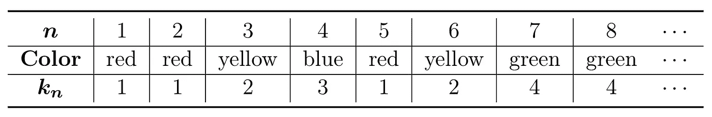

如果我们观察上面的顺序，我们可以很容易地推断出:至少有*种****K =*4***种颜色可供选择。一般来说，在给定未知参数 ***K*** colors 的情况下，观察长度为*n 的独立试验序列**、k₂……**的可能性计算为:**

**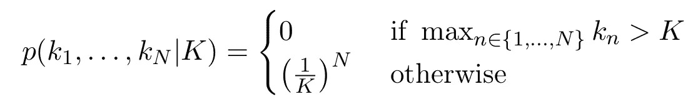**

*****K*** 的**最大似然估计器(MLE)** 最大化该似然:**

**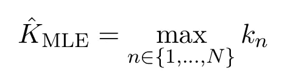**

**所以在这个意义上，颜色总数的平凡下界 ***K =* 4** 也是颜色总数的最佳可能估计量。**

**经过多次试验后，几乎肯定会观察到所有可能的颜色，因此 MLE 在概率上收敛于真实的参数值:它是一致的估计量。但是我们也知道，估计量会系统地低估小样本的真实值，因为很明显，它的值永远不会大于试验次数。我们希望明确地计算这种偏差。设 ***K₀*** 为未知参数的真值。在 ***N*** 独立试验中找到颜色号 ***k*** 的概率由下式给出:**

**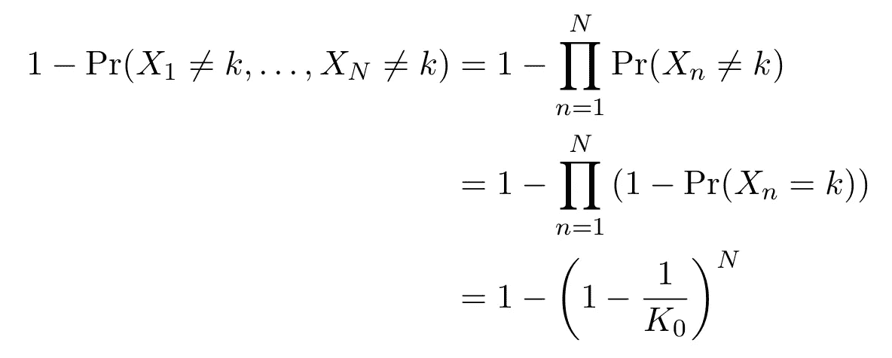**

**因此，MLE 的偏差计算为:**

**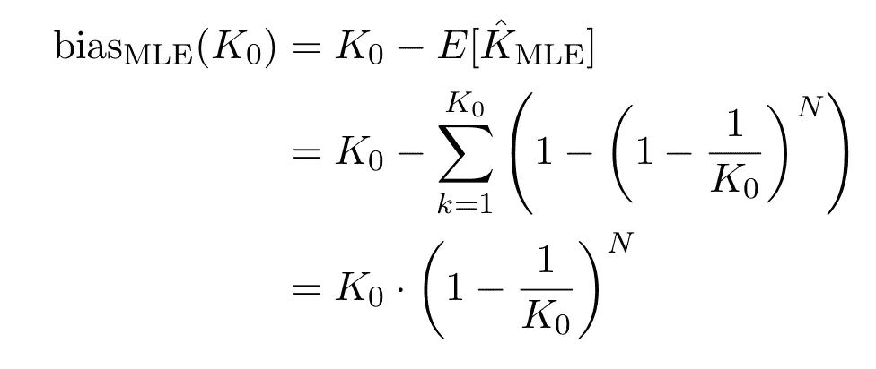**

**我们不能把这种偏差加到我们的估计中，因为它取决于我们希望估计的未知参数值。**

**F 或大样本量 ***N*** ，上述偏差趋近于零。然而，我们也看到，对于大参数值 ***K₀*** ，不仅小样本量的偏差大，而且即使对于大样本，偏差也非常缓慢地接近零。也许我们运气好，对 ***K₀*** 的大小有一些先验知识；也许我们对彩票中奖的可能性有一些先入为主的想法。纳入此类先入之见的标准方法是采用贝叶斯范式，并通过先验概率“修正”可能性:**

**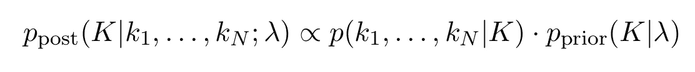**

**超参数 ***λ*** 被选择为最符合我们对***【K】***的先入之见，并且后验分布在观察证据后对我们关于参数的知识进行建模。隐含着从频率主义者到贝叶斯观点的范式转变:我们已经从把*K 想象成一个具有未知但确定值的参数，转移到把 ***K*** 想象成一个随机变量。随机是因为我们缺乏关于它的“真实价值”的知识——贝叶斯应该用引号括起来，因为这是一个他们已经放弃了本体论承诺的实体。然而，在这篇文章中，我们不会采取一个明显的频率主义者或贝叶斯立场，而是提出一个实际的组合。***

**尽管如此，点估计仍然是有意义的，因为我们有最高的可信度，最大后验估计量(MAP)**:****

****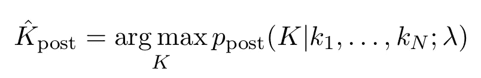****

****形式上，MAP 估计量与无信息(即，均匀/恒定先验)的 MLE 一致。没有商定的“正确”方法来选择信息先验的形状，因此我们将继续假设它是泊松分布:****

****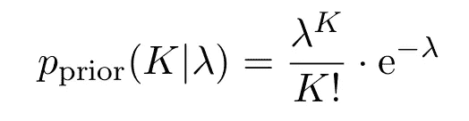****

****现在，我们可以希望通过先验知识的贡献来纠正偏差。下图显示了从带有***= 25****种不同颜色的骨灰盒中进行抽奖的模拟:*****

*****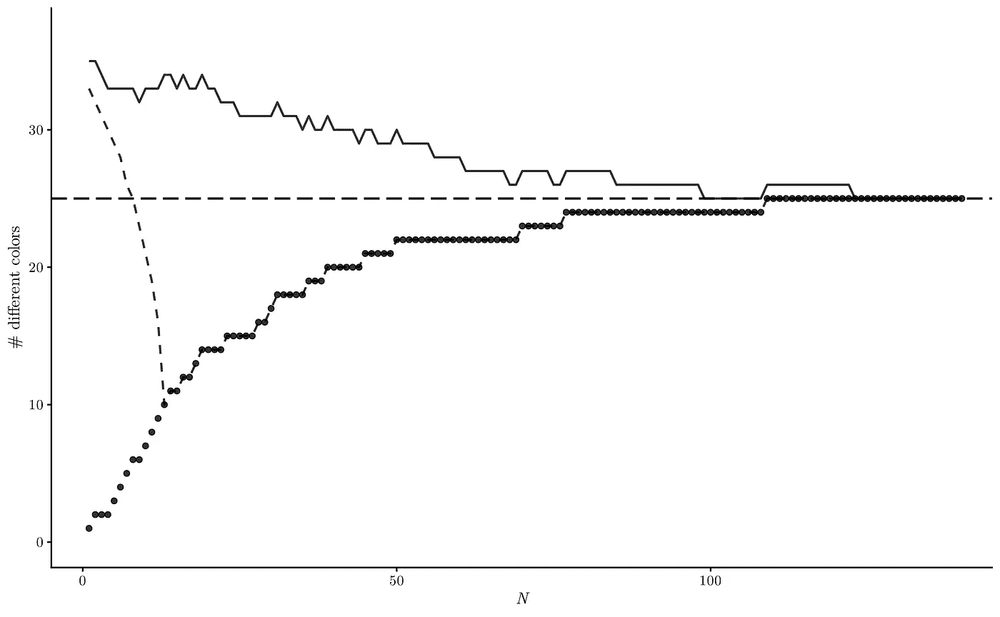*****

*****圆点代表作为样本大小函数的最大似然估计，它总是低估真实值，并且这种偏差对于小样本特别大。虚线表示具有泊松先验和 ***λ* = 35** 的 MAP 估计。即使先验表现出相当大的初始高估，在仅仅几次试验之后，最大似然和后验分布实际上是一致的。另一方面，实线显示出对这种效应更强的鲁棒性。它表示具有偏差校正似然的 MAP 估计量，如下所述。*****

****因此，如果对似然性的估计存在较大偏差，我们不能指望先验信息在没有一些额外修正的情况下得到有效补偿。如前所述，校正偏差并不简单，因为它取决于未知参数。然而，我们可以从先验分布中计算参数值估计，然后该先验分布可以代替真实的参数值并通知偏差的估计:****

****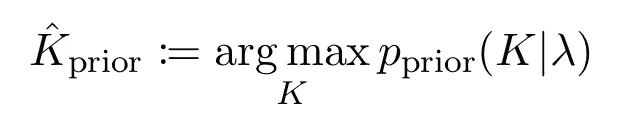****

****这允许我们用先验偏差校正似然性写下**后验分布如下:******

****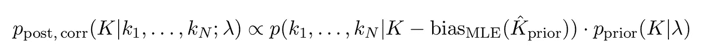****

****只要我们知道似然估计的偏差是真实参数值(和样本大小)的函数，就可以使用这个公式。如果在分析上不知道，可以想象这种函数可以通过蒙特卡罗模拟产生。****

****如下图所示，当先前估计本身存在负偏差( ***λ* = 18** )时，偏差校正图也显示出改进的鲁棒性:****

****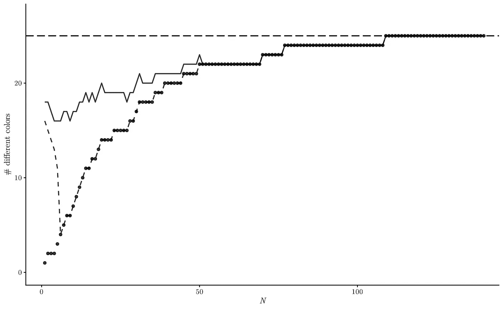****

# ****结论****

****对于这个玩具示例，我们已经表明，通过使用先验信息来校正贝叶斯参数估计中的似然偏差可能意味着对小样本量的估计的准确性和稳健性的改进。这种技术可以很容易地推广到这个玩具示例之外，并可能在现实世界的应用程序中有用。****

# ****参考****

****[维基百科上的最大似然估计](https://en.wikipedia.org/wiki/Maximum_likelihood_estimation)****

****[维基百科上的最大后验估计](https://en.wikipedia.org/wiki/Maximum_a_posteriori_estimation)****

****[维基百科上一致的估计量](https://en.wikipedia.org/wiki/Consistent_estimator)****