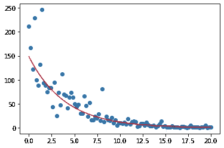
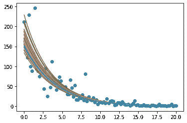
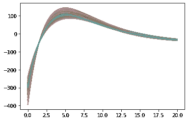
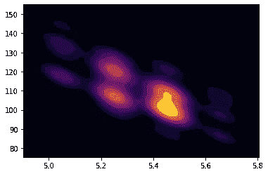

# 基于 PyMC3 的贝叶斯价格优化

> 原文：<https://towardsdatascience.com/bayesian-price-optimization-with-pymc3-d1264beb38ee?source=collection_archive---------13----------------------->

## PyMC3，黑仔可视化和概率决策

信用:Pexels.com

在本文中，我们将从贝叶斯的角度探讨价格优化。那么什么是**价格优化**？

它是在给定成本和收入的情况下优化商品或服务的价格。收入通常受制于“需求曲线”，这是价格和消费者需求单位之间的简单关系。过低的价格会吸引市场上的任何人，但不会带来足够的收入来抵消成本。但反过来也是如此。如果价格太高，那么很少顾客(如果有的话)会被吸引；因此，成本仍然可能超过收入。因此，优化的任务。

正如我们将看到的，成本可能是需求单位的任何函数。这可能是购买、储存、运输或任何基本上与所需单位相关的任何成本。在这种情况下，为了便于说明，我们将做一个简单的假设，但是可以更改函数以满足任何需要考虑的任意成本。

那么**为什么是贝氏**？

Frequentist 方法使用置信区间。这意味着我们有 X%的把握，某个参数的真实值落在给定的区间内。但是在这段时间内，我们的信心*如何呢？频繁主义者的方法在这里帮不了我们太多。更糟糕的是，参数通常是相互关联的。*

另一方面，贝叶斯方法模拟所有参数的联合分布。当然，我们可以做出 X%的可信区间——但是我们的分析给出了参数联合分布的形状。当我们想模拟收入、成本和利润对价格变化的反应时，置信区间对我们的目的来说不够透明。

## 数据模拟

假设我们在一个炎热的夏天在一个柠檬水摊位上工作，卖几夸脱的柠檬水。我们有一个冷藏箱，我们以 50 美元的固定费用租用，每夸脱柠檬水需要 1.5 美元的冰——我知道这很荒谬。但这是一个成本约束，我们将在后面出于说明目的实现它，以便您可以将其替换为您自己的成本函数。

首先，我们需要一条需求曲线；为了简单起见，我们将模拟我们自己的。需求曲线建模有多种方法。一个很有效的方法包含了指数衰减。当价格接近零时，预测的需求将无限高，而如果价格任意(无限)高，需求将渐近接近零。

我们是怎么得到这条曲线的？嗯，我刚刚说漏嘴了，是模拟的！但是让我们假设你提供了不同价格的几夸脱柠檬水，你观察到了下面的模式。实际上，使用折扣本身就是一门科学。你可以清楚地了解需求曲线，并评估营销渠道的功效。我们不会在这里进入折扣和定价实验，因此模拟。

鸣谢:作者图片

## 贝叶斯线性模型

我们本质上只是揭示了我们设定的参数。价格和需求的对数单位之间存在线性关系(因为需求呈现指数衰减。)

为什么是贝叶斯模型？我们可以推断它们的联合分布，而不是推断单个参数、截距和斜率的置信区间。这太棒了！它允许我们推断收入、成本和利润的分布。

频率主义者的方法是使用单一的斜率和截距，得出收入、成本或利润的点估计值。这将使我们无法清楚地表达我们对最优决策的确定性。

正如您所看到的，PyMC3 语法非常用户友好，易于理解。如果你已经熟悉贝叶斯分析，你会注意到我对 m、b 和 s 的先验知识，我们的斜率、截距和噪声项。这些有效地规范了搜索空间。斜率和截距可能是正的也可能是负的，所以我用了正常的先验。然而，噪声(误差)不可能是负的，因此我选择了指数分布。

## 后验预测图

让我们看看贝叶斯方法在后验预测分布中的作用。贝叶斯分析的一个真正有用的特性是生成后验预测分布的能力。这意味着我们可以可视化我们的模型认为是什么(和不是什么！)有可能。我们从斜率和截距的联合分布中取样，在给定一系列价格的情况下推断需求单位的预测，并绘制图表。绘制的线条简洁地捕捉了我们的价格-需求关系的变化！

鸣谢:作者图片

## 收入和利润

最后一步归结为定义一个成本函数，并推断出对需求、收入、成本和利润的预测，我们将这些视为具有自身分布的随机变量。

收入很简单，它是价格乘以需求量。我武断地决定，成本是 50 美元的管理费用加上 1.5 美元/单位。然而，这个成本函数可以替换为所需单元的任何函数。

鸣谢:作者图片

上面，我们可以看到 5.5 美元/单位的价格对应的是最大化的利润。下面的另一种视觉化方式捕捉到了 2D 的这种关系。热点中心显示，在给定需求、收入和成本的情况下，5.5 美元的价格可以带来 95-105 美元的总利润。

鸣谢:作者图片

最后这张图显示了价格和利润之间的关系，这是价格优化中倒数第二个利益关系。我们现在知道，我们可以以大约 5.5 美元的价格出售一些商品或服务，产生 95-105 美元的利润。

你有它！我希望我已经说服你至少尝试贝叶斯方法。一点额外的前期工作会给你一个更健壮的框架来理解你的决策空间。

## 离别笔记

亲爱的读者，我注意到一种模式，即*用户将我的故事添加到他们的列表中，但不鼓掌或订阅*。请——如果你喜欢我的内容，**通过鼓掌、评论和订阅**来确认它是有用的。这(1)有助于我确定下一步为您创建什么内容的优先级，以及(2)有助于其他媒体用户找到我的内容。**谢谢你！**