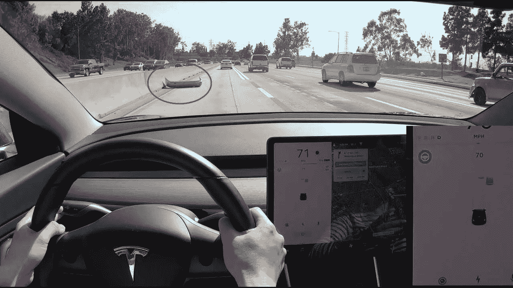
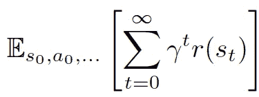
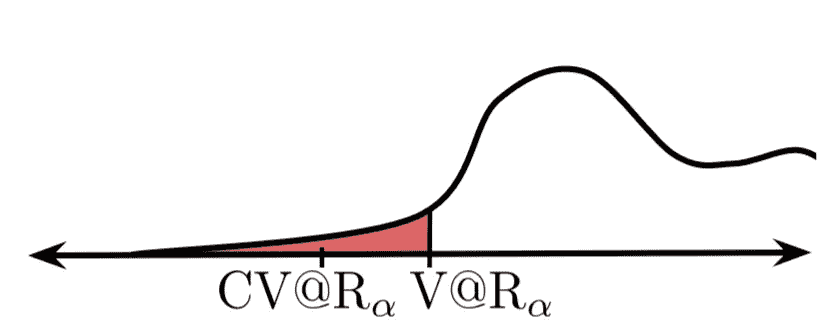
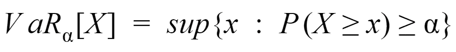
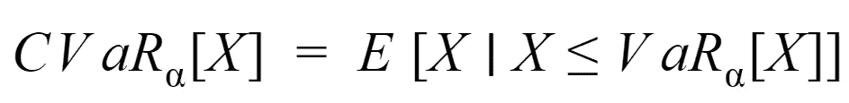
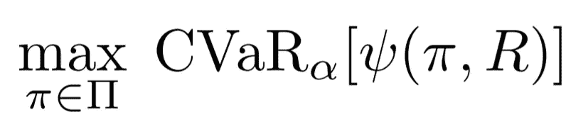
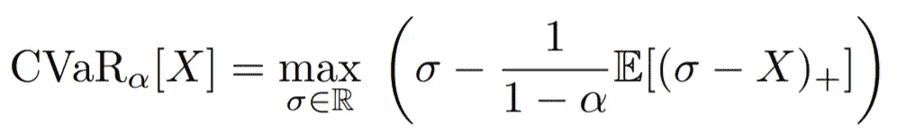
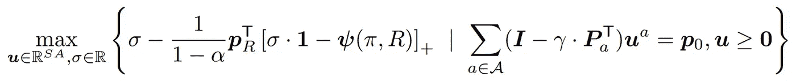
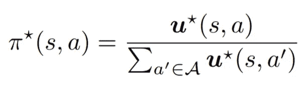
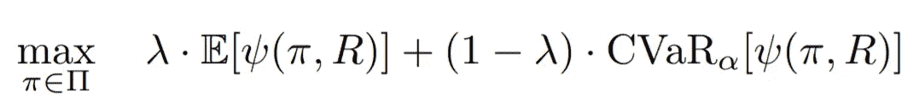

# 贝叶斯强化学习:用安全网模仿

> 原文：<https://towardsdatascience.com/bayesian-reinforcement-learning-imitation-with-a-safety-net-6dd4d66da8bb?source=collection_archive---------25----------------------->

## [人工智能校准和安全](https://towardsdatascience.com/tagged/ai-alignment-and-safety)

## 用恐惧强化学习

由 [Alfonso Navarro](https://unsplash.com/@poncho_nj?utm_source=medium&utm_medium=referral) 在 [Unsplash](https://unsplash.com?utm_source=medium&utm_medium=referral) 上拍摄

# 想象一下

比方说，你在高速公路上开车，无意中发现了这个:

斯卡泰利·奥尔谢夫斯基在斯卡泰利上的照片

显然，被圈起来的物体是一个汽车保险杠，但是让我们假设我们不确定这个物体是什么。作为人类，我们通过一系列问题来决定下一步行动:

1.  “那是什么？”
2.  “危险吗？”
3.  "我要不要急转弯来避开这个物体？"

尤其是在路上，我们倾向于安全行事。如果我们不知道这个物体是什么，我们几乎总是会选择避开这个物体。

然而，假设我们有一些人工智能机器人驾驶汽车。我们还假设人工智能确定这个物体是*很可能是*一个无害的纸箱。因此，驾驶汽车的代理人可能不会考虑到物体可能存在的*风险*与代理人所想的不一样。

克里斯托夫·杰施克在 [Unsplash](https://unsplash.com?utm_source=medium&utm_medium=referral) 上拍摄的照片

## 比较奖励信号

面对不确定性，我们如何训练代理人考虑这些风险？好吧，我们将从展示我们如何在学习环境中表现这种假定的“不确定性”开始。

要快速回顾强化学习的基础，请查看由 [SmartLab AI](https://medium.com/u/92f1b31b478b?source=post_page-----6dd4d66da8bb--------------------------------) 和 [Robert Moni](https://medium.com/u/d2551b71b60f?source=post_page-----6dd4d66da8bb--------------------------------) 撰写的[这篇](https://medium.com/@SmartLabAI/reinforcement-learning-algorithms-an-intuitive-overview-904e2dff5bbc)文章:

<https://medium.com/@SmartLabAI/reinforcement-learning-algorithms-an-intuitive-overview-904e2dff5bbc>  

典型的强化学习环境给了我们一个显式的奖励函数，将状态-动作对映射到实数。在给定的状态下，更高的奖励意味着更有利的行动，反之亦然。RL 目标是最大化给定剧集的累积奖励:

然而，如果我们不确定这个奖励函数呢？假设我们有一套不同的奖励函数。有些可能是错的，有些可能是对的，或者可能一些子集的组合更接近于地面真相。然后，假设这些奖励函数中的每一个都有可能是“真正的奖励函数”报酬函数的这种分布称为后验报酬分布。

换句话说，给定一个国家行动对，与其回报相关的不是一个单一的实数，而是一个分布(多个数字，每个数字都有自己的概率)。这就是我们如何对环境中的不确定性建模；我们不确定我们行为的后果。

那又怎样？为什么不能只取这个报酬分布的期望值，把它崩成一个呢？这样，我们就有了和以前一样的场景:每个国家行动对都有一个单一的奖励。让我们看看会出什么问题。

斯特凡诺·佐卡在 [Unsplash](https://unsplash.com?utm_source=medium&utm_medium=referral) 上的照片

让我们把这个和汽车驾驶的例子联系起来。假设我们有以下奖励分配，假设驾驶员决定碾过物体:

*   如果物体是一个纸板箱，奖励 1(概率. 9)
*   如果物体是汽车保险杠(概率 0.1)，奖励-5

在期望值中，我们的代理会被鼓励碾过物体，并会选择忽略与作为保险杠的物体相关的可能的*风险*。

那么，我们如何避免这个问题呢？我们需要一种可以训练风险意识策略的算法。接下来，我们将再看几个公式来帮助我们深入了解。

照片由 [Unsplash](https://unsplash.com?utm_source=medium&utm_medium=referral) 上的 [Loic Leray](https://unsplash.com/@loicleray?utm_source=medium&utm_medium=referral) 拍摄

## 动机

假设我们有一些连续的奖励概率分布。然后，假设我们绘制了不同轨迹的累积回报的概率分布图。

换句话说，x 轴代表一个代理可以采取的所有可能轨迹的累积回报。y 轴是每个轨迹的相关概率密度*(注意这不是概率本身，因为我们现在处理的是连续分布)。*

此分布的哪一部分代表与此环境相关的风险？我们可以把风险解释为导致不利结果的可能性。所以，我们的“风险”与这个图的左边，或者分布的某个较低的分位数相关。这就引出了我们对 Var 的定义。

Var 代表分布的 1-alpha 最低分位数。换句话说，它告诉我们，有 1-alpha 的概率生成一条轨迹，其累积回报低于 Var。直觉上，我们希望增加这个 Var 值。通过这种方式，我们可以增加在 1-alpha 概率的最坏情况下获得的回报，最大化甚至在“风险”情况下的表现。

然而，由于各种属性，Var 很难优化。相反，我们定义了 CVaR 值，这个值更容易优化:

CVaR 代表 1-alpha 下分位数内的预期表现。我们可以这样想 CVaR。假设，如果我们要训练奖励分布的*期望值，*给定一个状态，我们将通过考虑整个奖励分布来计算奖励。

然而，我们可以认为 CVaR 是在看这个分布的一个更小的窗口，即它的一些 1-alpha 更低的分数。然后，我们放大该窗口，并计算该窗口中的预期值(忽略其他一切)。

那么，CVaR 这个东西是什么意思呢？直觉上，如果我们能最大化 CVaR，我们就能最大化与那些悲观奖励函数相关的奖励金额(或者我们可以认为它是最小化惩罚)，所有这些加起来有 1-alpha 的正确概率。

由[史蒂文·韦尔奇](https://unsplash.com/@stevewelch?utm_source=medium&utm_medium=referral)在 [Unsplash](https://unsplash.com?utm_source=medium&utm_medium=referral) 上拍摄的照片

## 训练一项可怕的政策

因此，我们希望最大化 CVaR 来训练一个在 1-alpha 最坏情况下优化回报的策略:

其中 pi 代表一项政策，R 是后验奖励分布，psi 代表给定一项政策和奖励分布的累积奖励分布。

在某种意义上，我们可以认为增加 alpha 是告诉我们的政策有多害怕最坏的情况(就回报而言)。alpha 越高，左边的窗口越小，我们的 CVaR 向左移动越远，我们越优先考虑最坏的情况。

出于优化的目的，有一种表示 CVaR 的有用方法。下面是我们可以申请的身份(此处不涉及证明):

期望值中的“+”下标表示 ReLU 函数。因此，我们可以在我们的上下文中重新定义 CVaR，如下所示:

等一下。事情变得一团糟。让我们剖析一下这个等式中的每一个变量。这里，我们根据训练环境中的变量重新定义 CVaR。适马是我们正在最大化的一个参数，在我们之前对 CVaR 的重新定义中已经给出。阿尔法是一个超参数。

向量 p_r 代表与我们每个可能的回报函数相关的*后验概率。然后，我们加粗的 psi 表示在每个奖励函数下轨迹的预期累积奖励。这个概率向量“点乘”成括号中的结果向量，产生先前定义的期望值。*

总的优化问题变成如下:

注意我们在右边给出了一些约束。我们在这篇文章中没有推导出约束，但是它总结了 MDP 施加的约束(即平稳性)。变量 u 表示给定策略下的预期状态动作占用率计数。使用线性规划，我们可以在多项式时间内求解一个策略，定义如下:

那么，我们如何在强化学习的背景下计算这些变量呢？让我们看一下这项政策的每一部分:

*   后验回报函数概率:这些是给我们的
*   给定回报函数的预期回报:这些值可以通过不同的政策展开和蒙特卡罗来估计
*   适马:通常利用 CVaR 是凹的这一事实进行估计。欲了解更多详情，请查阅论文[1]。

因此，在实际训练中，我们收集政策轨迹样本，并随后估计预期回报和 sigma。然后，我们可以通过相应地求解线性规划来生成最优策略。

为了将这个公式转化为连续的状态和动作空间，我们可以使用一个策略梯度，其优势等于或正比于烧烤目标。这个烘烤目标/优点值是通过如上所述的类似采样来估计的。

由 [Clark Young](https://unsplash.com/@cbyoung?utm_source=medium&utm_medium=referral) 在 [Unsplash](https://unsplash.com?utm_source=medium&utm_medium=referral) 上拍摄

## 玩小鸡游戏

最大化 CVaR 是通过直接优化较低分位数性能来训练风险容忍策略的强有力方法。但是，也有不好的一面。

仅仅最大化 CVaR，特别是在高 alpha 值的情况下，很大程度上忽略了更高的分位数回报函数。换句话说，习得的政策可能过于悲观和厌恶风险。对给定的奖励分配的这种不信任会产生次优的政策，特别是当奖励分配实际上是准确的时候。

因此，BROIL 选择在优化 CVaR 和报酬分布的期望值之间进行平衡:

其中 lambda 是一个超参数，表示我们对优化期望值的支持程度。我们可以将 lambda 解释为对奖励分配的信任度的度量。

马科斯·迈尔在 [Unsplash](https://unsplash.com?utm_source=medium&utm_medium=referral) 上的照片

## 结果

关于初步结果，请查看丹尼尔·布朗的论文[1]。当我们增加和减少 BROIL 的超参数(alpha 和 lambda)时，我们可以看到非常有趣的政策变化。

《炙烤的持续适应》是我和我的两个搭档和朱探索的一个班级研究项目的一部分。我们发现，通过修改最先进的策略梯度方法，BROIL 可以平滑地适应具有连续状态和动作空间的更复杂的环境。我们探索的其他部分将不会公开，因为我们的工作可能会进一步探索。

# 参考

[1]D.Brown，S. Niekum，M.Petrik，Bayesian [模仿学习的鲁棒优化](https://arxiv.org/pdf/2007.12315.pdf) (2020)。

*从经典到最新，这里是讨论多代理和单代理强化学习的相关文章:*

</how-deepminds-unreal-agent-performed-9-times-better-than-experts-on-atari-9c6ee538404e>  </counterfactual-policy-gradients-explained-40ac91cef6ae> 