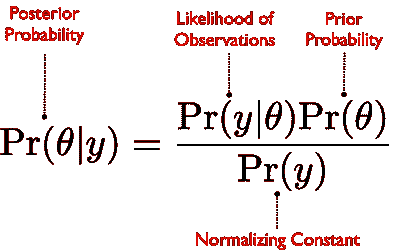
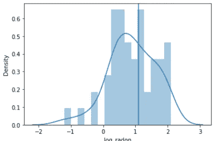
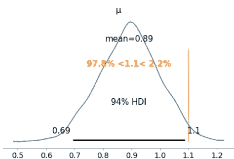

# 贝叶斯统计程序设计:导论

> 原文：<https://towardsdatascience.com/bayesian-statistical-programming-an-introduction-4ca3e2ddae76?source=collection_archive---------11----------------------->

## 第 1 部分，共 5 部分:贝叶斯统计的基本理论以及如何用 Python 实现一个简单的理论。

即使对于非数据科学家来说，贝叶斯统计这个术语也很流行。你可能在大学期间学过必修课，但没有意识到贝叶斯统计有多重要。事实上，贝叶斯统计不仅仅是一种特定的方法甚至是一类方法；这是一种完全不同的统计分析范式。


阿曼德·库利在 [Unsplash](https://unsplash.com?utm_source=medium&utm_medium=referral) 上拍摄的照片

# 为什么是贝叶斯统计？

贝叶斯统计为您提供了更新您对新数据证据的信念的工具，这是一个在许多现实世界场景中常见的概念，例如用于跟踪流行病、预测经济趋势或预测气候变化。贝叶斯统计是许多更著名的统计模型的基础，例如高斯过程。

</introduction-to-gaussian-process-programming-in-plain-english-8dd7a94cb18d> [## 用简单的英语介绍高斯过程编程

towardsdatascience.com](/introduction-to-gaussian-process-programming-in-plain-english-8dd7a94cb18d) 

最重要的是，学习贝叶斯统计的原则对于作为数据科学家的您来说是一笔宝贵的财富，因为它为您提供了一个全新的视角来解决现实世界数据的动态来源的新问题。

**注意:**这是包含贝叶斯统计编程主题的 5 部分系列文章的第一篇。

1.  这篇文章涵盖了贝叶斯统计的基本理论以及如何用 Python 实现一个简单的贝叶斯统计。

2.第二篇**将向您介绍贝叶斯推理以及如何执行基本的模型评估。**

</building-and-evaluating-your-bayesian-statistical-model-3ab703fc4ea8> [## 构建和评估您的贝叶斯统计模型

towardsdatascience.com](/building-and-evaluating-your-bayesian-statistical-model-3ab703fc4ea8) 

3.第三部分将涵盖一种特殊类型的贝叶斯算法，称为蒙特卡罗马尔可夫链(MCMC)。

4.第四部分将基于之前的文章构建一个更复杂的贝叶斯模型。

5.**第五**部分将向您介绍贝叶斯模型检查和评估的高级概念。

# 目录:

1.  什么是贝叶斯统计？
2.  贝叶斯编程介绍
3.  贝叶斯工作流
4.  构建简单的贝叶斯模型

事不宜迟，让我们开始介绍贝叶斯统计编程帖子。

# 什么是贝叶斯统计？

你可能在网上或课堂上看到过这个等式。



贝叶斯统计公式(来源: [PyData 2019](https://github.com/fonnesbeck/mcmc_pydata_london_2019/blob/master/notebooks/1-Introduction_to_PyMC3.ipynb) )

如果你还没有，不要担心，因为我将简要地向你介绍贝叶斯的基本原理和公式是如何工作的。

## **关键术语**

上述贝叶斯公式的组成部分通常被称为*概率陈述*。例如，在下面的*后验概率*陈述中，该术语的意思是“给定观察值 *y* ，θ*θ*(θ)*的概率是多少”。*

Theta (θ)是这里的*未知数*，称为我们感兴趣的*参数*。参数的不确定性遵循特定的概率分布，该概率分布可以使用将数据与所讨论的参数相关联的模型的组合来估计。


贝叶斯概率陈述(图片由作者提供)

> 上面的贝叶斯统计公式也被称为 ***逆概率*** ，因为它是从观测值到参数开始的。换句话说，贝叶斯统计试图从数据(结果)中推断假设(原因)，而不是用数据来接受/拒绝工作假设。

## 贝叶斯公式

那么，贝叶斯公式告诉了我们什么？

1.  后验概率是我们感兴趣的主要部分，因为θ是我们感兴趣的参数。
2.  观察可能性简单地表示给定一个具体的θ值，数据 *y* 在现实世界中被看到的可能性有多大。
3.  先验概率是我们对θ应该是什么样子的最佳猜测(例如，它可能遵循正态或高斯分布)
4.  归一化常数只是一个使整个方程积分为一的因子常数(因为概率不能低于 0 而高于 1)。

既然我们已经介绍了贝叶斯统计的基本理论，让我们开始为即将到来的贝叶斯编程教程做准备。

# 贝叶斯编程介绍

## 装置

首先，安装 PyMC3 作为我们执行贝叶斯统计编程的选择库。

1.  使用*康达*(推荐)

```
conda install -c conda-forge pymc3
```

2.使用画中画

```
pip install pymc3
```

## 获取数据

我们将使用描述美国家庭中氡气浓度的氡数据集。氡已被证明是非吸烟者中肺癌的最高预测因素之一，其浓度通常与房屋的整体条件有关(例如，地下室的存在，*等*)。

首先，在您的笔记本或终端中运行以下命令:

```
!wget "[https://raw.githubusercontent.com/fonnesbeck/mcmc_pydata_london_2019/master/data/radon.csv](https://raw.githubusercontent.com/fonnesbeck/mcmc_pydata_london_2019/master/data/radon.csv)"
```

确保您的数据位于笔记本的同一目录中。

## 数据探索

```
import pandas as pd
import seaborn as sns
import matplotlib.pyplot as plt
import numpy as npradon = pd.read_csv('./radon.csv', index_col=0)radon.head()
```

我们注意到有 29 栏描述了一个家庭中氡的浓度。


数据集摘要(图片由作者提供)

让我们画一张图，显示“ANOKA”县氡的对数浓度分布，用一条垂直线说明对数浓度为 1.1。

```
anoka_radon = radon.query('county=="ANOKA"').log_radon
sns.distplot(anoka_radon, bins=16)plt.axvline(1.1)
```



密度分布(图片由作者提供)

在阿诺卡，氡对数浓度超过 1.1 的家庭比例似乎相当大，这是一个相当令人担忧的趋势…

# 贝叶斯工作流

现在我们有了数据，让我们进行贝叶斯推断。一般来说，这个过程可以分为三个步骤:

## 步骤 1:指定概率模型

这是你作为建模者将要做出*许多*选择的地方。你需要将最可能的[概率分布函数](https://www.itl.nist.gov/div898/handbook/eda/section3/eda366.htm)(例如，正态或高斯、柯西、二项式、t 分布、f 分布、*等*)分配给*所有的*。


概率分布函数的样本(来源:[NIST.gov](https://www.itl.nist.gov/div898/handbook/eda/section3/eda366.htm))

所谓*一切*，我指的是包括未知参数、数据、协变量、缺失数据、预测在内的一切。因此，尝试不同的分布函数，看看它在现实世界中有什么意义。

## 步骤 2:计算后验分布

记得这个人吗？


后验分布(图片由作者提供)

好，现在你将计算这个概率项，给定贝叶斯方程右边的所有项。

## 第三步:检查你的模型

与其他 ML 模型一样，评估您的模型是关键。回到第一步，检查你的假设是否有意义。如果没有，改变概率分布函数，并一遍又一遍地重复。

# 构建简单的贝叶斯模型

现在，我将向您介绍一个简单的编程练习来构建您的第一个贝叶斯模型。我将在后续的帖子中更详细地介绍这些内容，请关注我！

## 步骤 1:定义贝叶斯模型

首先，我们用两个参数定义 Randon 的贝叶斯模型，均值(μ-“miu”)和它的偏差(σ-“sigma”)。这些参数(μ和σ)也需要通过选择我们选择的分布函数**来建模(**记住**:我们必须定义所有参数的概率分布)。**

对于这些，我们选择的函数是μ=0 和σ=10 的正态/高斯分布和均匀分布。您可以在模型验证检查期间重新校准这些值，如上面步骤 3 中所述。

```
from pymc3 import Model, Normal, Uniformwith Model() as radon_model:
    μ = Normal(’μ’, mu=0, sd=10)
    σ = Uniform(’σ’, 0, 10)
```

下一步是用另一个概率分布编译 radon_model 本身。

```
with radon_model:
    dist = Normal('dist', mu=μ, sd=σ, observed=anoka_radon)
```

## 步骤 2:用数据拟合模型

现在，我们需要用数据来拟合模型(即培训)。

```
from pymc3 import sample

with radon_model:
    samples = sample(1000, tune=1000, cores=2, random_seed=12)
```

让我们画出我们的参数μ在训练后的分布图，同时画出 95%的置信线

```
from arviz import plot_posterior

plot_posterior(samples, var_names=['μ'], ref_val=1.1)
```



Miu 的分布(图片按作者)

看起来 1.1 的对数浓度可能没有那么糟糕，因为它接近分布的尾端(只有 2.2%的样本具有大于 1.1 的对数浓度)。

# **离别的思念**

我们已经讨论了贝叶斯统计的基本理论，以及为什么它对任何数据科学家来说都是如此重要的工具。在下一篇文章中，我将更详细地介绍构建更健壮的贝叶斯模型所需的一些建模方面。敬请期待！

***做订阅我的邮件简讯:***[*【https://tinyurl.com/2npw2fnz】*](https://tinyurl.com/2npw2fnz)****在这里我定期用通俗易懂的语言和漂亮的可视化总结 AI 研究论文。****