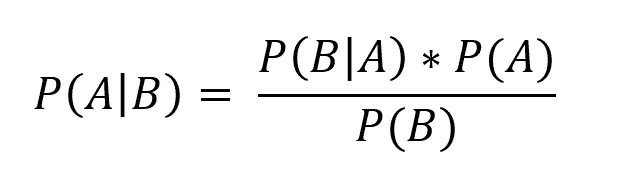
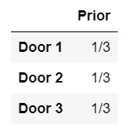
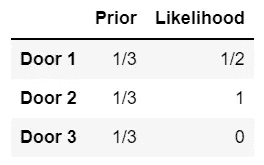
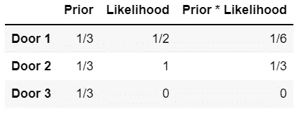
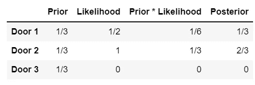
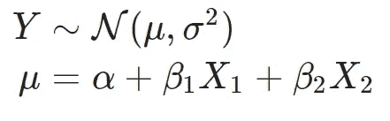
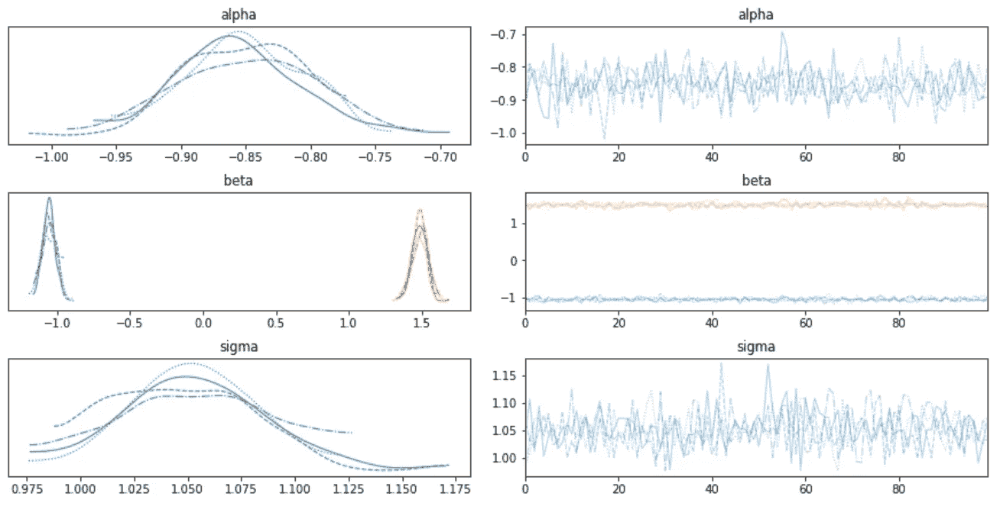
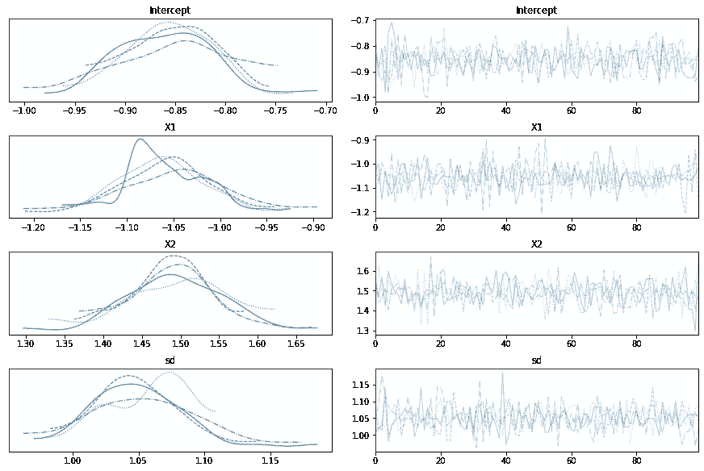
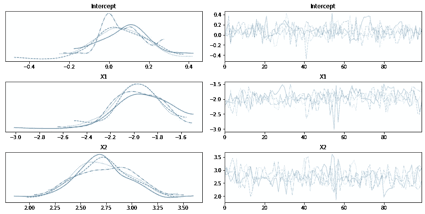

# 贝叶斯统计 101

> 原文：<https://towardsdatascience.com/bayesian-statistics-101-4c4bc5fde1e1?source=collection_archive---------1----------------------->


照片由 [Unsplash](https://unsplash.com?utm_source=medium&utm_medium=referral) 上的[延斯·勒列](https://unsplash.com/@madebyjens?utm_source=medium&utm_medium=referral)拍摄

## 不管你喜不喜欢，你都不会再以同样的方式看待统计数据了

# 介绍

贝叶斯统计与经典统计(也称为频率统计)的基本区别在于它对概率的解释。前者将其视为“*信任度*”，而后者将其视为“*在多次试验中观察到的相对频率*”。

这种差异可能看起来过于抽象，但它对后来开发的方法有很大的实际影响。

频率主义者的观点是最常见的，因此影响了大量的统计技术。然而，许多现代方法依赖于贝叶斯方法，可以产生很好的结果，当没有太多数据可用时，为您提供替代方案。

我们现在将看到的方法将为您提供一个正式的框架，通过该框架，您可以将主观判断添加到您的数据科学问题中，这在您没有太多可用数据时，或者在您知道数据存在某种缺陷时会特别有用。它还将帮助您理解一些著名的机器学习算法的起源，如朴素贝叶斯分类器和贝叶斯神经网络。

我们将从快速浏览贝叶斯定理(贝叶斯统计的核心)开始，然后继续学习由此衍生的一些技术，以及如何使用它们来解决各种统计问题。顺便说一下，我们将使用 Python。

# 贝叶斯定理



贝叶斯定理

上面的等式很简单，但是理解它需要知道一些概率论的符号:

*   **P(A)** :事件发生的概率 A
*   **P(A|B)** :假设事件 B 发生，事件 A 发生*的概率*

一个事件可以是任何事情。例如， **P(A|B)** 可以表示“假设( **|** )你的聚合酶链式反应测试检测结果为阳性( **B** )，你得到 COVID ( **A** )的概率( **P** )。要使用上述等式计算该概率，我们需要:

*   **P(A)** :具有 COVID 的概率(不考虑测试结果)
*   **P(B)** :聚合酶链式反应测试出现阳性结果的概率(无论您是否有 COVID)
*   P(B|A) :给定 COVID，聚合酶链式反应测试出现阳性结果的概率

这个定理可以很容易地从条件概率的定义中推导出来，它并不专门用于贝叶斯统计，也不是经常性的争论。到目前为止，这只是基本的概率论。

# 贝叶斯统计

贝叶斯统计从现在开始所做的就是把这个定理变成下面的咒语:

> 你对世界如何运转有一个先验的信念。一旦你得到数据，你就相应地更新这种信念。

这意味着您通过定义一个先验分布来开始解决任何问题(这一步非常主观)，然后您使用观察数据的可能性来更新该先验，创建一个后验分布。

不清楚？让我们看一个问题解决方案的例子，你会看到这在实践中是如何发生的。

## 蒙蒂·霍尔问题

*让我们做个交易*是一个流行的电视游戏节目，始于 60 年代的美国，其最初的主持人叫蒙蒂·霍尔。基于它的一个著名的概率谜题后来出名了，格式如下:

> 你在游戏节目的舞台上，这里有三扇门。其中一个后面有一辆汽车，另外两个后面有一只山羊。你必须选择其中一扇门，你的奖品将是门后的任何东西(显然你想要这辆车)。
> 
> 你选 1 号门。然后主人打开 3 号门，发现门后有一只山羊。然后，他给你选择坚持 1 号门还是转 2 号门。你是做什么的？

这就是这个问题引起了很多愤怒的地方:我们的直觉告诉我们，换车门或坚持我们的选择之间没有区别，两者都有 50%的可能性把车藏起来。然而，仔细观察就会发现，换门确实是有益的——它实际上会让你的胜算翻倍。

让我们用贝叶斯观点来看这个问题。

我们从每个门的 1/3 的先验概率分布开始。这意味着每扇门都有 1/3 的机会成为“正确的”门(有 3 扇门，我们没有理由认为其中一扇门比另一扇门更有可能)。先验是贝叶斯定理中的 P(A)。



我们的前科

然后，考虑到我们拥有的新数据，我们继续计算可能性。如果汽车在后面，主人打开 3 号门(如他所做的)的可能性有多大:

*   **1 号门**:主持人会在 2 号门和 3 号门之间随机选择，所以这种情况下他打开 3 号门的概率是 **1/2**
*   **门 2** :主持人必须打开门 3(因为汽车在门 2 后面，而你已经选择了门 1)，所以在这种情况下他打开门 3 的概率是 **1**
*   **3 号门**:如果后面有车，主人不可能打开 3 号门，所以这种情况下主人打开 3 号门的概率是 **0**

这给我们留下了:



每个门的先验和可能性

似然性相当于贝叶斯定理中的 P(B|A)。现在，让我们计算“先验”和“可能性”的乘积:



先验*可能性是前两列的乘积

您会注意到 3 个值(1/6、1/3 和 0)加起来不等于 1。这是因为我们遗漏了贝叶斯定理的最后一个元素:P(B)。这恰好是这三个值的总和。通过将每一个除以总和，我们将以它们加到 1 的方式缩放它们。在我们的问题中，3 个值相加等于 1/2 (1/6 + 1/3 = 1/2)。为了找到我们的后验概率，我们只需将最后一列除以 1/2:



最后，我们的后路！

正如所料，汽车在 3 号门后面的概率是 0，因为主机已经打开了它。我们还看到，门 2 隐藏汽车的可能性是门 1 的两倍。

如果你对这个问题特别感兴趣，或者你觉得结果太反直觉，这里有一整篇文章[关于它](/the-monty-hall-problem-9c4053ef0640)。

好吧，我知道这是一个玩具问题，我们使用了一个非常简单的分布作为我们的先验。当我们面对现实生活中的复杂问题时，会发生什么呢？这些问题有许多变量，先验不容易定义，可能性很难计算。幸运的是，有一个 Python 库可以帮助我们:PyMC3。

使用 PyMC3，您可以对许多事情使用贝叶斯推理，包括估计回归和分类的参数。您可以使用该库附带的内置函数来完成这项工作，或者使用它从头开始构建定制模型。第一个选项更简单，但灵活性较差，而第二个选项在选择参数时会给你更多的自由。

让我们来看看如何将这两个选项用于回归和分类等经典问题。

# 回归

## 线性回归“从零开始”



贝叶斯线性回归定义

如果你熟悉线性回归，你会发现它与传统模型有一些不同。主要的一点是，在贝叶斯回归中，我们不把参数α、β1、β2 和σ看作固定值，而是看作服从分布的变量。

我们将尝试估计这些分布，使用和以前一样的方法:定义一个先验分布并用数据更新它，得到一个后验分布。

在写这一部分时，我在使用真实世界的数据还是生成虚假数据来运行回归之间犹豫不决。我决定使用假数据，因为这将使我们能够将我们的结果与真实的地面真相进行比较:我们用来生成数据的参数。

```
**[IN]:** import arviz as az
import matplotlib.pyplot as plt
import numpy as np
import pandas as pd
import pymc3 as pm**# Setting a random seed for reproducibility**
np.random.seed(23)**# True parameter values**
alpha = -0.8
beta = [-1, 1.5]
sigma = 1**# Number of observations**
size = 500**# Predictor variables**
X1 = np.random.randn(size)
X2 = np.random.randn(size) * 0.8**# Outcome variable**
Y = alpha + beta[0] * X1 + beta[1] * X2 + np.random.randn(size) * sigma**# Putting our original data into a dataframe (we'll use it later on)**
df = pd.DataFrame(
    data = np.array([X1, X2, Y]),
    index=['X1', 'X2', 'Y']
).T
```

目前，除了导入所需的库和生成数据之外，我们还没有做太多工作。现在让我们使用 PyMC3 创建第一个模型:

```
**[IN]:**
with pm.Model() as model_1:
    **# Data**
    X_1 = pm.Data('X1', X1)
    X_2 = pm.Data('X2', X2) **# Priors**
    alpha = pm.Normal("alpha", mu=0, sigma=10)
    beta = pm.Normal("beta", mu=0, sigma=10, shape=2)
    sigma = pm.HalfNormal("sigma", sigma=10) **# Likelihood**
    mu = alpha + beta[0] * X_1 + beta[1] * X_2
    Y_obs = pm.Normal("Y_obs", mu=mu, sigma=sigma, observed=Y)

    **# Posterior**
    trace = pm.sample(100, return_inferencedata=False, chains=4)
    az.plot_trace(trace)
```

首先，请注意模型构造的格式，这是 PyMC3 的标准格式:您将所有内容(数据、先验、似然和后验)放在一个“with”语句中，在这里命名您的模型(在我们的例子中是“model_1”)。稍后可以访问这个模型。

你可能会问为什么这些前科？在这种特定情况下，对于α和β，我们使用以 0 为中心的正态分布，因为我们没有任何先验知识可以表明 X 和 y 之间的强关系。关于每个先验中的σ= 10，它设置了正态分布的标准偏差，因此该数字越高，我们的先验中的方差越大，因此它们的信息量越少(如果您不太确定这些先验，这可能是一件好事)。西格玛参数的*半正态*分布将保持其正值。

尝试测试不同的先验，看看最终结果变化有多大，这实际上是一件好事，看看你的模型对不良先验有多稳健(变化越大，你越依赖你的先验)。

让我们来看看我们模型的输出:



第一个模型输出

该图中的每一“行”代表我们的一个参数(α、β、σ)，左边部分代表后验分布，右边部分代表它们随时间的收敛。

以左上角的图为例:它显示了 alpha 的估计后验分布。但是等等，实际上有 4 个发行版，而不是一个！这是因为 pm.sample()有一个名为*链*的参数，设置为 2 或系统中 CPU 的数量，取其中较大的一个。在我的例子中，它等于 4，但是为了便于说明，我决定显式地设置它。*链*将设置并行运行的独立链的数量，这允许我们有一些收敛统计。

您还可以在右侧的图中看到链的概念，每个链有一条线。然而，这些线条显示的是什么？你看到 pm.sample()中的 100 了吗？也就是设置要抽取的样本数量。这些线条基本上显示了 100 个样本中，4 个链中每个链的参数的最可能估计值。对于 alpha，您可以看到它在-0.8 附近变化(尽管稍微偏向较低的值)。

在中间的左、右图中，beta 1 和 beta 2 的信息相同(可以通过不同的颜色区分它们)。

如你所见，估计的分布或多或少与基本事实一致(一些偏差可能来自我们设定的先验)。

我们有后验分布和它们的图，但是你可能想知道我们如何用它做预测。PyMC3 有一个名为*fast _ sample _ posterior _ predictive*的函数，它允许我们这样做:

```
**[IN]:**
with model_1:pm.set_data({
        'X1': [0.6, 0.02],
        'X2': [-1.3, 0.3]
    })
    y_test = pm.fast_sample_posterior_predictive(trace, samples=100)print(y_test['Y_obs'].mean(axis=0))**[OUT]:**
[-3.27941019 -0.31231568]
```

输出是我们放入示例中的 2 个观察值的预测，通过使用我们的后验分布获取 100 个样本来生成。

此外，如果您需要点估计而不仅仅是分布，您可以通过运行 *find_MAP* 并使用这些参数构建一个经典的线性方程来获得:

```
**[IN}:**
pm.find_MAP(model=model_1)**[OUT]:**
{'alpha': array(-0.85492716),
 'beta': array([-1.05603871,  1.48859634]),
 'sigma_log__': array(0.04380838),
 'sigma': array(1.04478214)}
```

尽管 PyMC3 可能需要一段时间才能运行，但它确实让我们的生活变得轻松了许多。但是它到底是做什么的呢？

PyMC3 的工作方式与我们构建 Monty Hall 示例的方式并不完全相同，因为它并不计算精确的后验分布。相反，它做出了一个聪明的举动，实际上是*从后验概率中采样*数据，以便对其进行估计(这就是为什么你会在我们代码的“后验”部分看到“样本”函数)。

虽然这不会产生我们正在寻找的精确分布，但它在合理的时间内给了我们一个很好的近似值。它使用主要基于 MCMC(马尔可夫链蒙特卡罗)和 VI(变分推理)算法的方法来拟合模型。如果你想要更多关于这两种方法的数学细节，我建议你阅读[这篇文章](/bayesian-inference-algorithms-mcmc-and-vi-a8dad51ad5f5)。

## 使用 GLM 的线性回归

现在，让我们看看如何使用 PyMC3 中的 GLM 类来获得我们的后验概率:

```
**[IN]:**
from pymc3.glm import GLM# Creating our model
with pm.Model() as model_glm:
    GLM.from_formula('Y ~ X1 + X2', df)
    trace = pm.sample(100)
    pm.traceplot(trace)
    plt.show()**[OUT]:**
```



GLM 产量

这个模型的构建几乎是不言自明的，也就是说，你所要做的就是写出 GLM 的公式，剩下的工作和以前差不多。显然，区别在于运行代码时幕后发生了什么。例如，你会注意到，这一次，你没有为你的参数设置先验。相反，PyMC3 使用默认的、无信息的先验，例如宽均匀和扩散正态分布，试图添加尽可能少的先验信息。

对结果的解释与前面的例子相同。

# 分类

## 逻辑回归“从零开始”

对于这个例子，让我们像以前一样重复使用相同的数据，但是为 Y 创建两个类:高于平均值的类和不高于平均值的类。

```
**[IN]:**
**# Creating a binary variable**
df['Y_bin']=df['Y']>df['Y'].mean()
```

我们现在将应用与线性回归相似的方法，但使用不同的可能性函数:

```
**[IN]:**
with pm.Model() as model_log: **# Priors**
    alpha = pm.Normal("alpha", mu=0, sigma=10)
    beta = pm.Normal("beta", mu=0, sigma=10, shape=2) **# Likelihood **   
    p = pm.Deterministic('p', pm.math.sigmoid(alpha + beta[0] * X1 + beta[1] * X2))
    Y_obs = pm.Bernoulli("Y_obs", p, observed=df['Y_bin'])

    **# Posterior**
    trace = pm.sample(100, return_inferencedata=False, chains=4)
    az.plot_trace(trace)**[OUT]:**
```


我们第一次逻辑回归的输出

首先，请记住，我们在这里估计的参数与我们为线性回归创建的参数不同，尽管它们有相同的名称。在第一种情况下，我们直接使用它们来创建 Y，而这里我们是在估计逻辑回归中的参数，所以我们不应该使用我们为 alpha 和 beta 设置的初始值作为这些参数的基础。

## 使用 GLM 的逻辑回归

让我们再次尝试解决上述分类问题，但使用 GLM:

```
**[IN]:**
from pymc3.glm.families import Binomialwith pm.Model() as model_glm_logistic:
    GLM.from_formula('Y_bin ~ X1 + X2', df, family=Binomial())
    trace = pm.sample(100)
    pm.traceplot(trace)
    plt.show()
```



逻辑回归的输出-GLM 版本

这个版本(逻辑回归)与第一个 GLM(线性回归)之间的差异主要在于 *family=Binomial()* 参数，显然至少在构建代码方面是如此。

# 结论

正如你所看到的，贝叶斯推理背后的直觉很简单:你的后验概率将介于你的先验(主观)信念和你观察到的数据之间，这意味着不同的人将得到不同的分布。然而，由此产生的方法并不那么简单，因为它们要求我们以不同的方式思考:总是根据分布而不是固定参数进行推理。

这只是对基本贝叶斯统计和推理的介绍，但这个主题要深入得多，并且有更多有趣的方法源于它:朴素贝叶斯分类器、贝叶斯神经网络、贝叶斯假设测试、贝叶斯分层建模和贝叶斯强化学习。希望我很快会在另一篇文章中写这些话题。

# 更进一步

如果你想更深入地研究贝叶斯统计，这里列出了一些额外的信息来源:

 [## 想想贝叶斯

### 认为贝叶斯是一本免费的书。它在知识共享署名-非商业性使用-类似共享 4.0 下可用…

allendowney.github.io](https://allendowney.github.io/ThinkBayes2) [](https://docs.pymc.io/en/stable/pymc-examples/examples/getting_started.html) [## PyMC3 - PyMC3 3.11.4 文档入门

### 作者:John Salvatier，Thomas V. Wiecki，Christopher Fonnesbeck 注:本文基于 PeerJ CS 出版物…

docs.pymc.io](https://docs.pymc.io/en/stable/pymc-examples/examples/getting_started.html) [](/stan-vs-pymc3-vs-edward-1d45c5d6da77) [## 斯坦 vs PyMc3 (vs 爱德华)

towardsdatascience.com](/stan-vs-pymc3-vs-edward-1d45c5d6da77) 

最后，本文使用的代码可从以下网址获得:

[](https://github.com/arthurmello/statistics/blob/master/6.%20Bayesian%20statistics/Bayesian%20statistics.ipynb) [## 统计/贝叶斯统计. ipynb at master Arthur Mello/统计

### 教程的统计方法说明。通过创建帐户为 arthurmello/statistics 的发展做出贡献…

github.com](https://github.com/arthurmello/statistics/blob/master/6.%20Bayesian%20statistics/Bayesian%20statistics.ipynb) 

如果你喜欢这篇文章，你可能也会喜欢这些:

[](https://medium.com/@arthurmello_/the-science-of-why-a-brief-introduction-ed92060e6f0d) [## 为什么的科学:简介

### 理解因果关系是如何工作的，以及如何处理它

medium.com](https://medium.com/@arthurmello_/the-science-of-why-a-brief-introduction-ed92060e6f0d) [](/xgboost-theory-and-practice-fb8912930ad6) [## XGBoost:理论与实践

### 了解最流行的算法之一是如何工作的，以及如何使用它

towardsdatascience.com](/xgboost-theory-and-practice-fb8912930ad6) [](/k-nearest-neighbors-theory-and-practice-7f6f6ee48e56) [## k 近邻:理论与实践

### 了解如何使用 KNN，这是最直观的分类和回归算法之一

towardsdatascience.com](/k-nearest-neighbors-theory-and-practice-7f6f6ee48e56) 

> 如果你想进一步讨论，请随时在 [LinkedIn](https://www.linkedin.com/in/melloarthur/) 上联系我，这将是我的荣幸(老实说)。