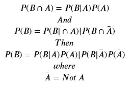
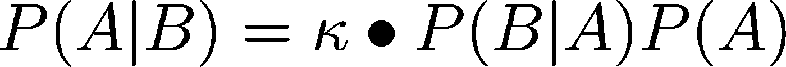
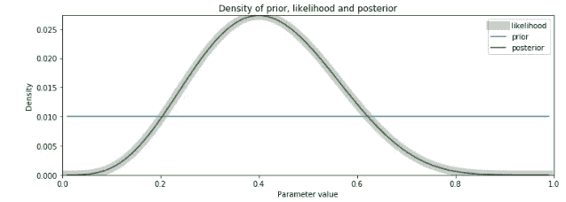
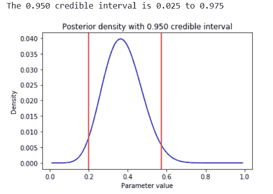

# 贝叶斯统计

> 原文：<https://towardsdatascience.com/bayesian-statistics-11f225174d5a?source=collection_archive---------16----------------------->

## [入门](https://towardsdatascience.com/tagged/getting-started)

## 很难相信概率统计曾经有过争议


常客 vs Bayesians |照片由 [Lucas Benjamin](https://unsplash.com/@aznbokchoy) 拍摄

这篇文章建立在我上一篇关于 [Bootstrap 重采样](/bootstrap-resampling-2b453bb036ec)的文章之上。

# 贝叶斯模型简介

贝叶斯模型是一类丰富的模型，可以为频繁模型提供有吸引力的替代方案。可以说，贝叶斯统计最广为人知的特征是贝叶斯定理，稍后将详细介绍。随着最近更强大的计算能力的出现和普遍接受，贝叶斯方法现在被广泛用于从医学研究到自然语言处理(NLP)到理解到网络搜索的领域。

在 20 世纪早期，有一场关于现在被称为贝叶斯的合法性的大辩论，贝叶斯本质上是一种做一些统计的概率方法——与我们都非常熟悉的“频繁主义者”阵营形成对比。用我们时代的说法，这是统计学家之间的#雅各布团队与#爱德华团队之争。这个争论现在已经没有实际意义了，因为几乎每个人都是贝叶斯主义者和频率主义者。一个很好的启发是，有些问题用频率主义方法处理更好，有些用贝叶斯方法处理更好。

在这篇文章结束时，我希望你能欣赏这个笑话:贝叶斯是这样一个人，她模糊地期待一匹马，瞥见一头驴，强烈地相信她看到了一头骡子！

## 历史

托马斯·贝叶斯牧师(1702-1761)提出了贝叶斯定理的一个有限版本。贝叶斯的兴趣在于赌博游戏的概率。他也是艾萨克·牛顿爵士新奇的微积分理论的狂热支持者，出版了他令人惊讶的标题为“*流动学说导论，并为数学家们对《分析家》作者*的反对意见进行辩护。”

1814 年，皮埃尔·西蒙·拉普拉斯在“*Essai philosophique sur les probabilityés*”中发表了一个版本的贝叶斯定理，类似于它的现代形式拉普拉斯将贝叶斯方法应用于天体力学问题。解决这些问题对 18 世纪晚期/19 世纪早期的船只有很大的实际意义。地球物理学家和数学家哈罗德·杰弗里斯广泛使用了贝叶斯方法。

二战见证了贝叶斯方法的许多成功应用:

*   Andrey Kolmagorov，一位俄罗斯(苏联)的统计学家，使用贝叶斯方法极大地提高了火炮的精确度
*   艾伦·图灵用贝叶斯模型破解了德国潜艇的密码
*   伯纳德·库普曼，法国出生的美国数学家，通过截获定向无线电信号帮助盟军定位德国潜艇

20 世纪后半叶，计算贝叶斯方法取得了以下显著进展:

*   使用蒙特卡罗方法的统计抽样:斯坦尼斯拉夫·乌兰，约翰·冯·诺依曼；1946, 1947
*   MCMC，或[马尔可夫链蒙特卡罗](https://en.wikipedia.org/wiki/Markov_chain_Monte_Carlo)；Metropolis 等人(1953)《化学物理杂志》
*   Hastings (1970)，使用马尔可夫链的蒙特卡罗抽样方法及其应用
*   Geman 和 Geman (1984)图像的随机松弛、吉布斯分布和贝叶斯恢复
*   杜安，肯尼迪，彭德尔顿和罗威思(1987)，哈密顿 MCMC
*   盖尔范德和史密斯(1990)，基于抽样的方法来计算边际密度。

## 贝叶斯与频率主义观点

随着更强大的计算能力和普遍接受，贝叶斯方法现在被广泛应用于从医学研究到自然语言理解到网络搜索的各个领域。在实用主义者中，今天的普遍看法是，有些问题用频率主义方法处理更好，有些用贝叶斯方法处理更好。

从我关于[中心极限定理](https://medium.com/swlh/on-the-importance-of-the-central-limit-theorem-e8cce1f4d253) (CLT)的第一篇文章开始，我就确定了你需要“足够的数据”来应用 CLT。Bootstrap 抽样是获得更多接近基础分布的分布的便捷方法。这些是常客的工具；但是，如果数据太少，无法可靠地应用 CLT，会发生什么呢？作为一名概率贝叶斯统计学家，我已经有了一些估计，不可否认，有一点猜测，但有一种方法可以以智能的方式将猜测与我的数据结合起来。这就是贝叶斯统计的基本内容——你把它结合起来，基本上，这种结合是两个概率分布的简单乘法，一个是你猜测的，另一个是你有证据的。

数据越多，先验分布就越不重要，可以使用 Frequentist 方法。但是，在数据较少的情况下，贝叶斯的会给你一个更好的答案。

那么贝叶斯和频率主义方法论有什么不同呢？简单来说:

*   贝叶斯方法使用**先验分布**来量化已知的参数
*   常客没有量化任何参数；取而代之的是使用 **p 值**和**置信区间** (CI)来表达关于参数的未知数

这两种方法都很有用，可以融合越来越多的数据，但形成对比:

**严格的频率主义方法**

*   **目标是点估计和 CI**
*   从观察开始
*   给定新的观察值，重新计算模型
*   示例:均值估计、t 检验、方差分析

**贝叶斯方法**

*   **目标是后验分布**
*   从之前的分布开始(猜测)
*   给定新的观察值，更新后验(信念/假设)
*   示例:平均最高密度区间(HDI)重叠的后验分布

今天，没有人是严格的常客。贝叶斯方法简单有效，这是事实。

## 贝叶斯定理

贝叶斯定理描述了一个事件的概率，基于**先验知识(我们的猜测)**可能与事件相关的条件，**我们的数据**。贝叶斯定理告诉我们如何将这两种概率结合起来。例如，如果患阿尔茨海默氏症等疾病与年龄有关，那么使用贝叶斯定理，一个人的年龄可以用来更可靠地评估他们患阿尔茨海默氏症、癌症或任何其他年龄相关疾病的概率。

贝叶斯定理用于更新假设的概率；假设是这种猜测，这种先验分布。先验的意思是你之前的信念，在你有证据之前就有的信念，是更新它的一种方式。因为你得到了更多的信息，你更新了你的假设，等等。

对于那些不知道或者已经忘记的人，让我们从条件概率的规则中推导出贝叶斯定理:


条件概率

翻译成“给定 B 的情况下，A 发生的概率。”


"给定 A 发生的概率，B 发生的概率."

消除𝑃(𝐴∩𝐵)和做非常小的代数:


或者，重新排列术语


也就是贝叶斯定理！这描述了如何找到给定事件 b 的事件 A 的条件概率。

## 应用程序

你有一个疾病测试，鉴于你有这种疾病，你得到阳性测试结果的概率非常非常高；换句话说，这个测试有很高的准确率。问题是，即使你没有患病，也有可能得到阳性检测结果。你可以根据贝叶斯定律简单计算。重要的一点是，这些概率并不等同于给定疾病后得到阳性结果的概率**也不等同于给定疾病阳性结果后得到阳性结果的概率**。


测试灵敏度与疾病的发病率不匹配

这是两种不同的概率分布。使它们如此不同的是患病的概率和阳性检测结果的概率。所以如果这种病很少见，那么发病的概率会非常非常小。

疾病检测:A =有疾病，B =检测呈阳性。


## 例子


尽管测试的准确度很高，但该测试的灵敏度相当差

使用 Bayes 定理，我们已经推导出，这种疾病的阳性测试结果表明，只有 10%的时间该人将实际患有该疾病，因为该疾病的发病率比假阳性率低一个数量级。

## Python 示例:头发和眼睛颜色的概率

样本人群具有以下头发和眼睛颜色组合的概率。我将在 Jupyter 笔记本中运行下面的代码来查找条件概率:

```
# begin with the imports
import pandas as pd
import numpy as np
import matplotlib
from matplotlib import pyplot as plt
import scipy
import seaborn as sns
import itertools%matplotlib inline# create the dataframe
hair_eye = pd.DataFrame({
    'black': [0.11, 0.03, 0.03, 0.01],
    'blond': [0.01, 0.16, 0.02, 0.03],
    'brunette': [0.2, 0.14, 0.09, 0.05],
    'red': [0.04, 0.03, 0.02, 0.02],

}, index=['brown', 'blue', 'hazel', 'green'])hair_eye
```


名词（noun 的缩写）b:这是眼睛颜色的字符串索引，而不是从零开始的数字索引。

```
hair_eye.loc[‘hazel’, ‘red’]
```


2%的人有淡褐色的眼睛和红色的头发

上表中的数字是**条件概率**。请注意，在这种情况下:

𝑃(hair|eye)=𝑃(eye|hair)p(hair|eye)=p(eye|hair)

给定这些条件概率，很容易通过对行和列中的概率求和来计算边际概率。**边际概率**是沿着分布的一个变量(一个边际)的概率。边际分布的总和必须是 1。

```
## Compute the marginal distribution of each eye color
hair_eye[‘marginal_eye’] = hair_eye.sum(axis=1)hair_eye
```


添加了 marginal_eye 列

```
hair_eye.sum(axis=0)
```


头发颜色的概率总和为 1

```
hair_eye.loc[‘marginal_hair’] = hair_eye.sum(axis=0)
hair_eye.describe
```


眼睛颜色概率的总和也是 1.0

我有蓝色的眼睛。我想知道他们有蓝眼睛的头发颜色的边际概率是多少？

```
# probability of blue eyes given any hair color divided by total probability of blue eyes# marginal probabilities of hair color given blue eyes
#blue_black(.03/.36) + blue_brunette(.14/.36) + blue_red(.03/.36) + blue_blond(.16/.36)
blue = hair_eye.loc[‘blue’,:]/hair_eye.loc[‘blue’,’marginal_eye’]
blue
```


对于一个蓝眼睛的人来说，有 44%的可能是金发，像我一样

# 应用贝叶斯定理

有一个方便用于计算问题的贝叶斯定理公式，因为我们不想像上面的例子那样，将所有计算 **P(B)** 的可能性相加。

这里有更多关于条件概率的事实和关系，主要来自于 P(B)很难计算的事实:



重写贝叶斯定理；


这是一个混乱，但我们并不总是需要复杂的分母，这是 B 的概率。 **P(B)** 是我们的实际证据，很难得到。请记住，这是概率性的，我们使用的数据样本比我们通常使用的要小。

重写我们得到的:



忽略常数 **𝑘，**因为它给出的证据——p(b)——被假定为常数，我们得到:


我们不需要知道实际证据和数据的概率分布

## 应用简化关系贝叶斯定理

我们将上述简化关系解释如下:


比例贝叶斯

比例关系适用于观察到的数据分布，或模型中的参数(部分斜率、截距、误差分布、套索常数等)。上面的等式告诉你如何把你的先验信念和你的证据结合起来，如果你想称之为先验分布的话。

一个重要的细微差别是，虽然我们不能谈论精确的值，但我们可以谈论分布；我们可以讨论概率分布曲线的形状。我们要的是所谓的后验分布。这就是我们想要的。我们所做的是猜测先验分布:A 的概率是多少？给定我所拥有的数据，某事为真的概率是多少？给定 B 的概率是多少？给定我所拥有的数据，某事为真的概率是多少？有些人会将此重新表述为，给定数据 B，我的假设 A 为真的概率是多少？

我可能只有很少的数据。太少做任何常客的方法；但是我可以估计，利用我拥有的少量数据，称为**可能性**，我可以估计这个数据是正确的概率，假设我可以直接计算。因为我有数据，不是很多数据，对我来说太少了以至于不能相信，但是我有一些数据。我有我的假设。所以我可以计算我的分布。

先验分布是我的假设的概率，我不知道，但我可以猜出来。如果我真的不擅长猜测，我会说这个先验分布是一个**均匀分布**，它可能是高斯或任何其他形状。现在，如果我猜测均匀分布，我仍然在做概率统计，贝叶斯统计，但我真的，真的很接近常客会做的。

在贝叶斯理论中，当我得到更多的数据时，我会更新这个先验分布，因为我会说，“嘿！”一开始我以为是制服。现在我看到，这个东西，这个概率分布，实际上有一个中间值。所以我现在要选择一个不同的分布。或者我要修改我的分布，以适应我在屁股上看到的东西。我试图让这个先验分布看起来和我的后验分布形状相似。当我说形状相似时，那实际上是非常误导的。我想做的是找到一个数学公式，将 A 的概率和给定 B 的概率混合起来。数学的类型相似，等式看起来相似，就像问题的公式化，而不是实际的概率；我们称之为得到共轭先验。这是当你寻找一个在数学上与你认为的最终分布相似的分布时。这在形式上被称为搜索共轭先验。由于其灵活性，β分布经常(但不总是)被用作先验分布。

重申一下，**假设被形式化为模型中的参数**，P(A)，而 **P(B|A)** ，是给定这些参数的数据的概率——这很容易做到，t 检验可以做到这一点！

## 创建贝叶斯模型

给定关于参数行为的先验假设(先验)，生成一个模型，告诉我们观察我们的数据的概率，以计算我们的参数的新概率。因此，使用贝叶斯模型的步骤如下:

*   确定与研究问题相关的数据:例如，数据的测量范围
*   定义数据的描述性模型。例如，选择线性模型公式或(2，1)的 beta 分布
*   指定参数的先验分布——这是假设的形式化。例如，认为线性模型中的误差正态分布为𝑁(𝜃,𝜎)
*   选择贝叶斯推理公式来计算后验参数概率
*   如果观察到更多数据，则更新贝叶斯模型。这是关键！随着更多数据的加入，后验分布自然更新
*   从参数的后验分布的实现中模拟数据值

## 选择一个先验

先验分布的选择对贝叶斯分析非常重要。先验知识应该让**持怀疑态度的观众**信服。要考虑的一些启发是:

*   领域知识(SME)
*   先前的观察
*   如果知识贫乏，则使用信息量较少先验知识
*   **注意:**均匀先验是信息性的，你需要对值的范围设置限制

一种分析和计算简单的选择是前面提到的共轭先验。当似然性乘以共轭先验时，后验分布与似然性相同。大多数命名的分布都有共轭:


共轭先验并不总是被使用

## Python 示例:新冠肺炎随机采样

作为您所在城市的卫生官员，您对分析新冠肺炎感染率很感兴趣。您决定在红灯时在十字路口抽取 10 个人的样本，并确定他们的 Covid 测试结果是否为阳性——测试速度很快，为了避免抽样偏差，我们对他们进行了测试。数据是二项式分布的；一个人测试阳性或测试阴性——为了简单起见，假设测试是 100%准确的。

在本笔记本示例中:

*   为参数𝑝选择一个先验，即拥有新冠肺炎的概率。
*   使用数据，计算可能性。
*   计算后验和后验分布。
*   尝试另一个以前的发行版。
*   向我们的数据集添加更多的数据，以更新后验分布。

数据的似然性和后验分布是二项式分布。二项分布有一个参数我们需要估计，𝑝，概率。对于𝑘在𝑁试验中的成功，我们可以正式这样写:


以下代码计算一些基本的汇总统计信息:

```
sampled = [‘yes’,’no’,’yes’,’no’,’no’,’yes’,’no’,’no’,’no’,’yes’]
positive = [1 if x is ‘yes’ else 0 for x in sampled]
positive
```


```
N = len(positive) # sample size
n_positive = sum(positive) # number of positive drivers
n_not = N — n_positive # number negative
print(‘Tested positive= %d Tested negative= %d’
 ‘\nProbability of having COVID-19= %.1f’ 
 % (n_positive, n_not, n_positive / (n_positive+ n_not)))
```


对于先验，我将从均匀分布开始，因为我不知道预期 Covid 率是多少:

```
N = 100
p = np.linspace(.01, .99, num=N)
pp = [1./N] * N
plt.plot(p, pp, linewidth=2, color=’blue’)
plt.show()
```

下一步:计算可能性。可能性是给定参数的数据的概率，**【𝑃(𝑋|𝑝】**。每个测试的每个观察值为“肯定”或“否定”都是伯努利试验，所以我选择二项分布。

```
def likelihood(p, data):
 k = sum(data)
 N = len(data)
 # Compute Binomial likelihood
 l = scipy.special.comb(N, k) * p**k * (1-p)**(N-k)
 # Normalize the likelihood to sum to unity
 return l/sum(l)l = likelihood(p, positive)
plt.plot(p, l)
plt.title(‘Likelihood function’)
plt.xlabel(‘Parameter’)
plt.ylabel(‘Likelihood’)
plt.show()
```


给定我们的假设，我们的数据为真的概率

现在我们有了先验和似然，我们可以计算参数𝑝:**𝑃(𝑝|𝑋】**的后验分布。

注意:这里使用的计算方法是为了便于说明而简化的。必须使用计算效率高的代码！

```
def posterior(prior, like):
 post = prior * like # compute the product of the probabilities
 return post / sum(post) # normalize the distributiondef plot_post(prior, like, post, x):
 maxy = max(max(prior), max(like), max(post))
 plt.figure(figsize=(12, 4))
 plt.plot(x, like, label=’likelihood’, linewidth=12, color=’black’, alpha=.2)
 plt.plot(x, prior, label=’prior’)
 plt.plot(x, post, label=’posterior’, color=’green’)
 plt.ylim(0, maxy)
 plt.xlim(0, 1)
 plt.title(‘Density of prior, likelihood and posterior’)
 plt.xlabel(‘Parameter value’)
 plt.ylabel(‘Density’)
 plt.legend()

post = posterior(pp, l)
plot_post(pp, l, post, p)
```



```
print(‘Maximum of the prior density = %.3f’ % max(pp))
print(‘Maximum likelihood = %.3f’ % max(l))
print(‘MAP = %.3f’ % max(post))
```


有了均匀的先验分布，**后验就是概率**。关键点在于，在给定均匀先验的情况下，频繁者概率与贝叶斯后验分布相同。

## 尝试不同的先验

从上面的图表中，我选择了二项式分布的**共轭先验**，也就是贝塔分布。贝塔分布定义在区间 0 ≤贝塔(P|A，B)≤10 ≤贝塔(P|A，B)≤1 上。贝塔分布有两个参数，𝑎和𝑏，它们决定了形状。

```
plt.figure(figsize=(12, 8))alpha = [.5, 1, 2, 3, 4]
beta = alpha[:]
x = np.linspace(.001, .999, num=100) #100 samplesfor i, (a, b) in enumerate(itertools.product(alpha, beta)):
 plt.subplot(len(alpha), len(beta), i+1)
 plt.plot(x, scipy.stats.beta.pdf(x, a, b))
 plt.title(‘(a, b) = ({}, {})’.format(a,b))
plt.tight_layout()
```


请注意，这些贝塔分布在参数稍有不同的情况下会变得多么不同

我仍然不太了解这个十字路口的司机的行为，他们可能有也可能没有新冠肺炎，所以我选择了一个相当不具信息性或宽泛的贝塔分布作为假设的先验。我选择 a=2 和 b=2 的对称先验:

```
def beta_prior(x, a, b):
 l = scipy.stats.beta.pdf(p, a, b) # compute likelihood
 return l / l.sum() # normalize and returnpp = beta_prior(p, 2, 2)
post = posterior(pp, l)
plot_post(pp, l, post, p)
```


注意，后验的模式接近于似然的模式，但是已经向先验的模式移动。贝叶斯后验概率向先验转移的这种行为被称为**收缩**性质:后验概率的最大似然点的趋势被称为向先验概率的最大似然点收缩。

## 更新贝叶斯模型

让我们用数据集的 10 个新观察值来更新模型。请注意，添加到模型中的观察值越多，后验分布就越接近可能性。

注意:对于大型数据集，可能需要**大量的**数据来观察后验概率和可能性的收敛行为。

```
new_samples = [’yes’,’no’,’no’,’no’,’no’,
 ‘yes’,’no’,’yes’,’no’,’no’] # new data to update model, n = 20
new_positive = [1 if x is ‘yes’ else 0 for x in new_samples]l = likelihood(p, positive+ new_positive)
post = posterior(pp, l)
plot_post(pp, l, post, p)
```


与第一个相比，注意当我们用更多的数据更新时，两个分布的收敛

## 可信区间

**可信区间**是贝叶斯后验分布上的区间。可信区间有时被称为最高密度区间(HDI)。例如，90%可信区间包含具有最高概率密度的后验分布的 90%。由于贝叶斯的可信区间和频率主义者的置信区间缩写相同(CI ),这可能会引起混淆。

幸运的是，**可信区间是频率主义者置信区间**的贝叶斯模拟。然而，它们在概念上是不同的。置信区间是根据测试统计的分布选择的，而可信区间是根据参数的后验分布计算的。对于对称分布，可信区间在数值上可以与置信区间相同。然而，在一般情况下，这两个量可以有很大的不同。

现在，我们绘制二项分布参数 p 的后验分布。95%可信区间(HDI)也将计算并显示出来:

```
num_samples = 100000
lower_q, upper_q = [.025, .975]# Caution, this code assumes a symmetric prior distribution and will not work in the general casedef plot_ci(p, post, num_samples, lower_q, upper_q):
 # Compute a large sample by resampling with replacement
 samples = np.random.choice(p, size=num_samples, replace=True, p=post)
 ci = scipy.percentile(samples, [lower_q*100, upper_q*100]) # compute the quantiles

 interval = upper_q — lower_q
 plt.title(‘Posterior density with %.3f credible interval’ % interval)
 plt.plot(p, post, color=’blue’)
 plt.xlabel(‘Parameter value’)
 plt.ylabel(‘Density’)
 plt.axvline(x=ci[0], color=’red’)
 plt.axvline(x=ci[1], color=’red’)
 print(‘The %.3f credible interval is %.3f to %.3f’ 
 % (interval, lower_q, upper_q))

plot_ci(p, post, num_samples, lower_q, upper_q)
```



因为上面的**后验分布是对称的**，和我们选择的贝塔先验一样，**的分析和频率主义方法**中 CI 的分析是一样的。我们可以有 95%的信心，在这个十字路口红灯时，大约 40%的司机会有新冠肺炎！这些信息对于卫生机构合理分配资源非常有用。

如果你还记得第三段中的笑话，关于贝叶斯人模糊地怀疑一匹马，瞥见一只驴，并强烈怀疑看到了一头骡子——我希望你现在能给笑话的每个条款分配适当的部分贝叶斯定理。

查看我的下一篇关于[线性回归](/an-introduction-to-linear-regression-9cbb64b52d23)和使用 [bootstrap 和回归模型](/linear-regression-with-bootstrapping-4924c05d2a9)的文章。

在 [Linkedin](https://www.linkedin.com/in/james-a-w-godwin/) 上找到我

*物理学家兼数据科学家——适用于新机遇| SaaS |体育|初创企业|扩大规模*