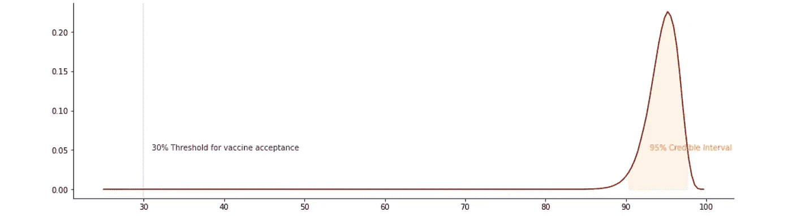

# 辉瑞-生物泰克新冠肺炎疫苗功效的贝叶斯统计—第一部分

> 原文：<https://towardsdatascience.com/bayesian-statistics-of-efficacy-of-pfizer-biontech-covid-19-vaccine-part-i-efac8d4e0539?source=collection_archive---------6----------------------->

## [BCN 因果 ALGO](https://towardsdatascience.com/tagged/bcn-causal-algo)

## 疫苗效力和β-二项式模型

[疾控中心](https://unsplash.com/@cdc?utm_source=medium&utm_medium=referral)在 [Unsplash](https://unsplash.com?utm_source=medium&utm_medium=referral) 上拍摄的照片

# 目录

*第一部分(本帖)* **简介
什么是疫苗效力
结果可信度** 贝叶斯推断
β-二项式模型
**利用模拟进行疫苗效力统计** 疫苗和安慰剂发生率
蒙特卡罗方法
后验概率和 95%可信区间

*第二部分(* [*下一篇*](https://bartekskorulski.medium.com/bayesian-statistics-of-efficacy-of-pfizer-biontech-covid-19-vaccine-part-ii-7c5388489163) *)*
**转载自文章的统计数据** 附加参数θ
θ的先验分布和发生率的调整
后验疫苗效力的可信区间
先前有感染迹象的参与者和先前无感染迹象的参与者中的新冠肺炎发生率
**最终注释
参考文献**

# 介绍

2020 年 12 月 10 日*《新英格兰医学杂志*发表了一篇题为[*bnt 162 b 2 mRNA 新冠肺炎疫苗*](https://www.nejm.org/doi/full/10.1056/NEJMoa2034577) 的安全性和有效性的论文。本文介绍了一项**随机对照研究**的结果，其中 43，548 名参与者被随机分配接受两剂 BNT162b2 疫苗(现称为辉瑞-生物泰克新冠肺炎疫苗)或两剂安慰剂。这些剂量每隔三周使用一次。然后对参与者进行为期约 2 个月的新冠肺炎发展跟踪。结果令人吃惊。疫苗效力为 **95%** ，其中*可信区间*等于(90.3–97.6%)。发表一天后，美国美国食品药品监督管理局发布了第一份[疫苗](https://www.fda.gov/emergency-preparedness-and-response/coronavirus-disease-2019-covid-19/pfizer-biontech-covid-19-vaccine)的紧急使用授权。这是一个新的希望，因为这个世界正在经历一个非常复杂的时期，死亡人数增加，封锁，边境关闭，失业率上升，就业机会消失，经济衰退…

除了是一个重要的结果之外，引起我注意的是这篇论文的作者使用*可信区间*报告了统计数据。这意味着研究者决定使用**贝叶斯**而不是**频率主义者的推论**。由于我参与了随机对照试验的设计，我想了解它是如何完成的。不幸的是，文章或研究方案中并未包含所有细节。所以我需要做一些侦查工作。

首先，我收集了关于疫苗组和安慰剂组的人数，以及每组中受感染人数的信息，然后我做了一些计算。得到的可信区间的大小与文章中的接近，但不相同。所以我更仔细地看了协议。我试着从那里重现这些步骤。这一次，计算出的可信区间更接近原始区间，但仍不完全相同。

最后，我意识到我们需要对疫苗组和安慰剂组的规模进行额外的调整。和“瞧！”。数字是一样的。但是我怎么能确定这不是巧合呢？幸运的是，文章中还计算了另一个可信区间。有了这些，我就可以确认这些步骤很可能是正确的。

我不得不承认，在试图找出如何从文章中重现结果时，我获得了一些乐趣。如果你有兴趣了解 2020 年最重要的一项研究中的统计数据是如何计算的，在这篇文章中你可以找到跟随我的步骤所需要的一切。我希望你熟悉统计学，但你不需要成为专家。在这里，我试图解释贝叶斯推理的一些概念，可以帮助你理解计算。我还包含了您自己执行的 Python 代码。

我把笔记分成了两部分。在第一部分的**中，我会给你一个理解下面章节所需的贝叶斯推理的最小概要。然后，我将介绍一种简单的方法来计算文章的统计数据。用这种方法，你可以得到接近原来的结果。如果这对你来说还不够，你还应该读一下 [**第二部分**](https://bartekskorulski.medium.com/bayesian-statistics-of-efficacy-of-pfizer-biontech-covid-19-vaccine-part-ii-7c5388489163) 的注释。这部分稍微难一点。我们将向您展示一种方法，允许您以一位数的精度再现结果。然后，我们将使用文章中可以找到的另一个可信区间来验证该方法。**

# 什么是疫苗效力

在转向贝叶斯统计之前，让我解释一下如何估计疫苗效力。首先，我们需要将研究参与者随机分为两组:疫苗组和安慰剂组。被称为疫苗组的第一组人接受疫苗，安慰剂组的人接受安慰剂。无论是参与者还是申请人员都不知道参与者接种的是疫苗还是安慰剂。然后，当研究结束时，疫苗效力通过以下公式进行评估

其中 **IRR** 为[发生率比](https://en.wikipedia.org/wiki/Rate_ratio)，由下式给出

***疫苗发病率*** 是疫苗组中确诊的新冠肺炎病病例与人数之比 ***安慰剂发病率*** 与安慰剂组相同(参见[论文](https://www.nejm.org/doi/full/10.1056/NEJMoa2034577)中的统计分析部分)。

现在，让我们看看纸上的数字，重新计算。这些数字可以在下表中找到，这是我从原始文章中复制的。

表 1:针对 covid 的疫苗效力(转载自[https://www.nejm.org/doi/full/10.1056/NEJMoa2034577](https://www.nejm.org/doi/full/10.1056/NEJMoa2034577)

您可以在表格的第一行看到，在疫苗接种前没有感染迹象的*参与者的情况下*在疫苗组中，我们有 *8* 个新冠肺炎病例，根据监测时间调整后的参与者人数为 *17，411* (见表 1)。注意，我们没有使用参与者总数，即*18198*。这是因为需要对监测时间进行调整，因为不是每个人都在同一时间参与了研究。例如，如果一个人被监测 1 个月，而另一个人被监测 2 个月，这是不一样的，因为后者有更多的机会出现有症状的新冠肺炎。所以我们必须修改这个总数，我们得到 *17，411* 。我们无法重现这一计算结果，因为我们无法获得单个患者的数据。然而，我们建议对如何做到这一点感兴趣的读者参考这个笔记本。

因此，我们可以计算疫苗发病率如下

安慰剂组的发病率也是如此:

把这些放在一起

我们可以用下面的方式解释这个结果。在接种疫苗的人群中，95%通常会出现新冠肺炎症状的人没有表现出任何迹象。

# 结果的可信度

这个 95%的功效看起来确实很不错。但是……*我们有多少信心？*在随机对照试验中，我们通过估计无效或效力不足的疫苗上市的概率来回答这个问题。我们称之为“控制[I 型误差](https://en.wikipedia.org/wiki/Type_I_and_type_II_errors)”。

在本研究中，疫苗效力的评估是基于疫苗效力大于 **30%** 的概率(参见方案[第](https://www.nejm.org/doi/suppl/10.1056/NEJMoa2034577/suppl_file/nejmoa2034577_protocol.pdf)9.1.2.1 部分，第 107 页)。他们决定，为了批准疫苗，这个概率必须大于 97.5%。即

换句话说，犯 I 型错误的概率应该低于 2.5%，在这种情况下，I 型错误意味着批准效力低于 30%的疫苗。结果如何？表 1 的最后一列显示疫苗效力大于 30%的概率高于 **99.99%** 。等价的，犯 I 型错误的概率低于 **0.01%** 。

事实上，结果要比这好得多。 **95%可信区间**等于(*90.3*–97.6%)。稍后我会详细解释什么是 95%可信区间。现在让我告诉你，它暗示疫苗效力大于 *90.3%* 的概率是 97.5%。所以最初的 30%门槛相当悲观。

*30%的阈值相当悲观，因为结果表明疫苗效力的分布在右侧很远。这对我们来说是个好消息。*

现在轮到我们深入贝叶斯推理来计算这些结果了。

## 贝叶斯推理

在这封短信中无法解释[贝叶斯统计](https://en.wikipedia.org/wiki/Bayesian_statistics)。有很多书很好地做到了这一点(例如， [*贝叶斯统计，李家杰*](https://www.york.ac.uk/depts/maths/histstat/pml1/bayes/book.htm)的导论)。我要做的是展示足够的信息来解释和再现文章的结果。我还会向读者推荐在哪里可以找到更多的解释。

贝叶斯统计中的核心角色当然是由[贝叶斯定理](https://en.wikipedia.org/wiki/Bayes%27_theorem)扮演的。为了我们的需要，我们可以把它重新表述为

这是什么意思？**先验信念**代表我们在收集数据之前的信念，由可能参数的概率分布表示。**似然**是针对每个可能的参数，得到观测数据的概率。(**先验信念)*(观测数据的似然)**是修正我们信念的公式。如果更有可能为某些参数收集观察数据，则这些参数在**后验置信**的分布中获得更多权重。奇怪的等号表示我们可以忽略常数，也就是说我们不在乎这个公式是乘以 0.01 还是 100。这里我们处理概率分布，所以我们只需要知道不同可能性之间的关系。

我知道第一次看到这种形式主义有点尴尬。但它代表了一种相当直观的东西。例如，如果我们有一种新的疫苗，而我们对此一无所知，那么我们之前的信念就非常薄弱。在这种情况下，我们可以说，根据我们先前的信念，疫苗效力低于 30%或高于 30%的概率是相同的。但是，在看到一项研究的结果后，我们的后验信念会发生变化。有了像我们这里这样的结果，我们可以说疫苗效力更有可能大于 30%。

## 贝塔二项式模型

我们还需要解释一下**贝塔-二项式模型**是如何工作的。在这个模型中，我们假设一个人有一定的概率获得新冠肺炎。假设这个概率是θ。那么，如果我们观察到在 *n* 个人中， *k* 个生病，那么这个事件的可能性遵循 [**二项分布**](https://en.wikipedia.org/wiki/Binomial_distribution) 。即

我们假设θ遵循 [**贝塔分布**](https://en.wikipedia.org/wiki/Beta_distribution) 作为我们的先验信念:

其中α和β是大于零的参数。这种假设的最重要的原因是下面我们解释的贝塔分布和二项式分布之间的数学联系。即贝塔分布是伯努利分布的[共轭先验。](https://en.wikipedia.org/wiki/Conjugate_prior)

事实上，因为在公式中

我们可以忽略常数(这意味着我们可以忽略不包含θ的所有因子)，我们得到

这意味着后验置信也遵循参数为α+k 和β+n-k 的贝塔分布。如果后验置信和先验置信遵循相同类型的分布，我们说对于似然函数我们有[共轭先验(参见](https://en.wikipedia.org/wiki/Conjugate_prior)[李的贝叶斯统计](https://www.york.ac.uk/depts/maths/histstat/pml1/bayes/book.htm)书的第 3.1.1 节)。

综上所述，如果我们的模型具有遵循二项式分布的似然函数，并且先验函数遵循贝塔分布，我们称这个模型为**贝塔-二项式模型**，并将其写为

# 使用模拟的疫苗效力统计

首先，我将计算疫苗效力的统计数据，与本文中的方法略有不同。我觉得初读起来更简单易懂一点。在本笔记的第二部分，我们将再现原始计算。

## 疫苗和安慰剂发病率

现在我们回到疫苗和安慰剂的发病率。首先，我们假设我们先前的信念是，接种疫苗和服用安慰剂的人感染新冠肺炎病毒的概率是相同的。这意味着它们都遵循相同的β分布，具有相同的参数α和β。现在，这些参数的值应该是什么？嗯，我们可以假设平均大约 1%的人会生病。此外，我们希望选择相对较弱的先验信念，这意味着当我们收集到足够的数据时，它们可以很容易地被改变。那么自然的选择是假设β=1，α≤1，这样

重写为

我们明白了

那么α应该在 0.010101 左右。因此，我们假设疫苗和安慰剂发病率的先验分布遵循相同的β(0.010101，1)分布。

疫苗和安慰剂发病率的先验分布

现在，在进行试验后，在疫苗组中，我们在 17，411 名参与者中观察到了 8 例新冠肺炎病例(让我提醒你，这个数字是经过调整的，因为参与者的监测时间不同)。因此，使用上一节中的公式可以得出疫苗发生率的后验 Beta-二项式模型为 *Beta(0.010101+8，1+17411–8)*。另一方面，安慰剂发生率为*β(0.010101+162，1+17511–162)*。我们总结如下。

那么这些分布的曲线如下:

疫苗和安慰剂发生率的后验分布

这些图清楚地显示了疫苗发病率的分布远低于安慰剂发病率的分布。这已经表明，我们偶然得到这些结果的可能性极小。反正我们来统计一下。

## 蒙特卡洛法

所以现在我们要计算疫苗发病率低于安慰剂发病率的概率。即

我们将使用蒙特卡罗方法。

蒙特卡洛方法是一种对复杂或不可能以显式形式给出的公式进行数值估计的方法。为了估计我们的概率，我们将从疫苗发生率和安慰剂发生率的分布中抽取 1，000，000 对数字，然后看看其中有多少数字的疫苗发生率较低。这里我们提供了 python 代码。

结果是 1.0。意味着概率几乎是 1。

## 后验概率和 95%可信区间

让我们回忆一下，疫苗效力是由公式给出的。

首先，我们计算疫苗效力大于 30%的概率。尽管有可能获得一个显式的公式(例如参见 T2 的论文，这里我们还是使用模拟。

因此，我们可以如表 1 所示:

同样的方法我们可以计算出 **95%的可信区间。**有几种方法可以定义可信区间(例如参见[这篇维基百科文章](https://en.wikipedia.org/wiki/Credible_interval))。在文章中，95%可信区间定义为包含 95%后验分布的区间，受百分位数 2.5 和百分位数 97.5 的限制。下面是计算它的 python 代码。

具有 95%可信区间的后验分布:(90.8–97.9%)

最终我们的结果是，疫苗效力为 95%，95%可信区间等于**(90.8–97.9%)**。您可以得到稍微不同的结果，但它们应该非常接近。这些结果与文章中的结果非常相似，95%可信区间等于**(90.3–97.6%)**。但它们略有不同。在本笔记的第二部分，我们将介绍如何重做文章中的计算。

# 第一部分结束

在这一部分中，我们学习了如何计算疫苗效力，以及如何使用贝叶斯统计估计其可信度。[第二部分](https://bartekskorulski.medium.com/bayesian-statistics-of-efficacy-of-pfizer-biontech-covid-19-vaccine-part-ii-7c5388489163)稍微复杂一点。我们将进一步了解研究方案，以便向您展示如何像本文中那样计算统计数据。

*所有可视化，除非另有说明，均由作者提供。*