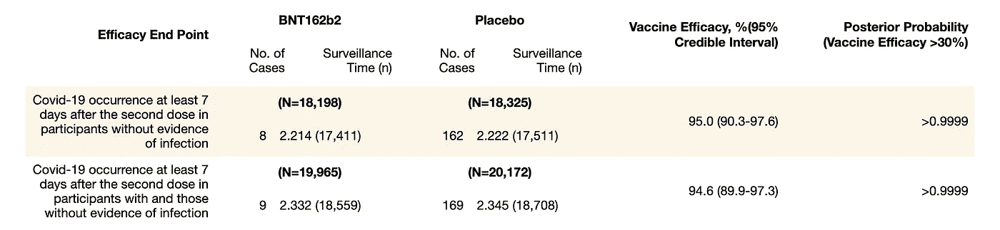
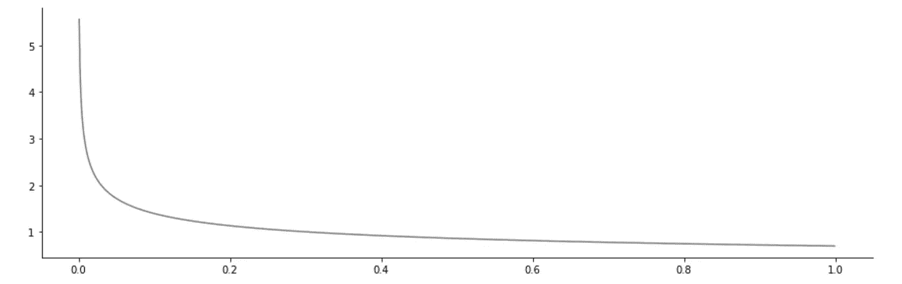
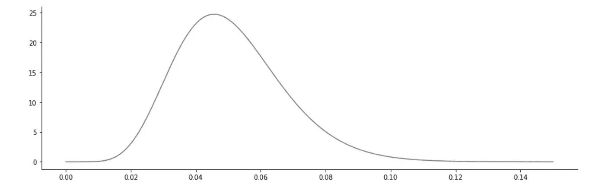
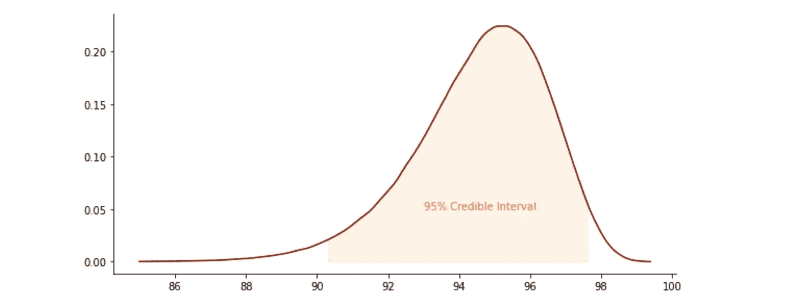

# 辉瑞-生物泰克新冠肺炎疫苗有效性的贝叶斯统计—第二部分

> 原文：<https://towardsdatascience.com/bayesian-statistics-of-efficacy-of-pfizer-biontech-covid-19-vaccine-part-ii-7c5388489163?source=collection_archive---------17----------------------->

## [BCN 休闲 ALGO](https://towardsdatascience.com/tagged/bcn-causal-algo)

## 复制原始结果

(经玛丽亚·何塞·佩莱斯·蒙塔尔沃许可)

本文是后[辉瑞-生物科技新冠肺炎疫苗功效贝叶斯统计的第二部分——第一部分](https://bartekskorulski.medium.com/bayesian-statistics-of-efficacy-of-pfizer-biontech-covid-19-vaccine-part-i-efac8d4e0539)。在**第一部分**中，我给了你一个贝叶斯推断的简单总结，这是理解如何计算疫苗效力的统计数据所需要的。然后，我向您展示了一个简单的方法，它可以让您获得接近于来自[原始文章](https://www.nejm.org/doi/full/10.1056/NEJMoa2034577)的结果。如果这些对你来说还不够，你还应该看看这一部分。这稍微有点困难，但是我将向您展示如何以一位数的精度重现可信区间的计算。然后，我们将使用文章中可以找到的另一个可信区间来验证该方法。

# 目录

*第一部分(* [*上一篇*](https://bartekskorulski.medium.com/bayesian-statistics-of-efficacy-of-pfizer-biontech-covid-19-vaccine-part-i-efac8d4e0539) *)* **简介
什么是疫苗效力
结果可信度** 贝叶斯推断
β-二项式模型
**使用模拟法统计疫苗效力** 疫苗和安慰剂发生率
蒙特卡罗方法
后验概率和 95%可信区间

*第二部分(本帖)*
**从文章中复制统计数据** 附加参数θ
θ的先验分布和发生率的调整
后验疫苗效力的可信区间
新冠肺炎在有和无先前感染证据的参与者中的发生率
**最终注释
参考文献**

# 从文章中复制统计数据

如果我们想了解文章中的统计数据是如何计算的，我们需要查看研究方案。该协议的重要之处在于，它应该在实验开始前注册，以避免事后挑选最方便的计算。

然而，正如 Sebastian Kranz 在这篇博客文章中所写的那样，我们需要“做一个有根据的猜测”，因为我们并不知道所有的细节。除了他有根据的猜测之外，我还需要增加一个，即*对新冠肺炎*出现次数的调整。加上这个额外的“猜测”，数字与下表完全相同。

表 1:针对 Covid 的疫苗效力(转载自 https://www.nejm.org/doi/full/10.1056/NEJMoa2034577)

在本节的最后，我们通过再现有感染迹象的参与者和没有感染迹象的参与者中的*新冠肺炎发生率来验证我们的计算，这是表 1 的第二行。*

## 附加参数θ

让我们来看看第 102-103 页的[协议](https://pfe-pfizercom-d8-prod.s3.amazonaws.com/2020-09/C4591001_Clinical_Protocol.pdf)。他们决定借助一个额外的参数来估计疫苗效力的不确定性。该参数θ由以下公式给出:

该公式将θ与疫苗效力联系起来。乍一看，这个额外的参数似乎是一个额外的复杂因素，有什么好处呢？原因是，正如我们将在下面展示的，我们可以用一个贝塔-伯努利模型来模拟θ，这样就不需要使用蒙特卡罗方法。让我展示一下。

首先，请注意，我们可以将公式改写为

然后，如果我们假设每组(疫苗组和安慰剂组)有相同数量的参与者，那么公式就变成了

我们在这里。我们可以用贝塔-伯努利模型来模拟θ。一旦我们知道了θ，我们就可以用公式计算出疫苗效力

## θ的先验分布

在[协议](https://pfe-pfizercom-d8-prod.s3.amazonaws.com/2020-09/C4591001_Clinical_Protocol.pdf)第 102-103 页，假设θ的先验分布遵循贝塔分布*贝塔(* 0.700102，1)。现在让我试着按照协议，找出这些α=0.700102，β=1 是从哪里来的。

首先，他们假设疫苗效力的先验值为 30%。那么，θ的先验值应等于:

由于θ遵循β分布，那么，正如我们之前所做的，其参数的自然选择，β=1 且α≤1 应该是这样的

然后设β=1，我们得到

就像协议里说的那样。

θ的先验分布:*β(*0.700102，1)

## θ的后验分布和事件的调整

现在让我们得到θ的后验分布。由于疫苗组有 8 例新冠肺炎，安慰剂组有 162 例，因此后验分布为*β(0.700102+8，1 + 162)* 。然而，由于疫苗组的规模不等于安慰剂组的规模，我们需要调整这些数字。让我解释一下我们需要怎样做。

调整监测时间后，疫苗组有 17411 人，安慰剂组有 17511 人。总计 34922。因此，如果各组相等，那么每组应该有 17461 个。因为在疫苗组中，我们在相应的组中分别出现了 8 次和 162 次新冠肺炎，使用比例我们得到

那么θ的后验分布就是β(0.700102+8.02297，1+161.53743)。

θ的后验分布:β(0.700102+8.02297，1+161.53743)

## 疫苗后验效力的可信区间

知道了θ的分布，我们就可以最终计算出疫苗效力的可信区间。使用 python 可以做到如下。

四舍五入我们得到 95%可信区间是(90.3，97.6)，和文章中的完全一样。

95%可信区间下疫苗效力的后验分布

## 先前有感染迹象和没有感染迹象的受试者中的新冠肺炎发生率

最后，让我将上述所有内容应用于重现疫苗效力，以及在有感染迹象和无感染迹象的受试者中，在第二剂疫苗后至少 7 天出现新冠肺炎的
95%可信区间(见表 1 第二行)。这将证实我们有根据的猜测。

首先，我们再次需要调整两组中新冠肺炎的出现次数:

因此，在这种情况下，θ的后验分布为β(0.700102+9.03613，1 + 168.327)，我们可以使用 python 计算 95%可信区间，如下所示。

舍入后，我们得到它等于(89.9–97.3)，与文章中的完全一样。

# 最后一个音符

如果你已经到了这一步，并且没有迷失太多，那么恭喜你。我们设法以一位数的精度复制了表 1。我花了相当长的时间才弄清楚所有的细节。尽管如此，我不能 100%肯定地说这些就是研究人员采取的确切步骤。

我不得不承认，我不仅在试图弄清楚统计是如何进行的过程中获得了乐趣，而且学到了很多东西。我希望你也是。我还希望，如果你对贝叶斯统计相对陌生，我能够展示这种推理方式是非常强大的。它给我一种感觉，我很清楚自己在做什么。

我只是触及了贝叶斯推理的表面。让我在这里给你一个参考文献列表，你可以在那里找到关于这个主题的更多信息。

# **参考文献**

对于不熟悉贝叶斯统计的读者，我推荐以下两本书中的一本。两个都很棒，虽然第一个在数学上肯定要轻一些。

然后，我会建议看一看原始文章和预注册协议和 Sebastian Kanz 注意。

**【1】**Richard McElreath:[*统计学再思考*](https://xcelab.net/rm/statistical-rethinking/)*第二版。*

***【2】**[*【贝叶斯统计概论】*](https://www.york.ac.uk/depts/maths/histstat/pml1/bayes/book.htm)*第四版**

****【3】**Polack FP，Thomas SJ，Kitchin N，等[bnt 162 b 2 mRNA 新冠肺炎疫苗的安全性和有效性。](https://www.nejm.org/doi/full/10.1056/NEJMoa2034577)N Engl J Med 2020；383:2603–2615.**

****【4】**BioNTech-Pfizer:方案:[一项 1/2/3 期研究，旨在评估针对健康个体的新冠肺炎候选 RNA 疫苗的安全性、耐受性、免疫原性和有效性](https://www.nejm.org/doi/suppl/10.1056/NEJMoa2034577/suppl_file/nejmoa2034577_protocol.pdf)(从 326 页开始)**

**Sebastian Kranz: [看看 BioNTech/Pfizer 对他们的新冠肺炎疫苗试验的贝叶斯分析。](http://skranz.github.io//r/2020/11/11/CovidVaccineBayesian.html)**

***所有可视化，除非另有说明，都是作者的。***