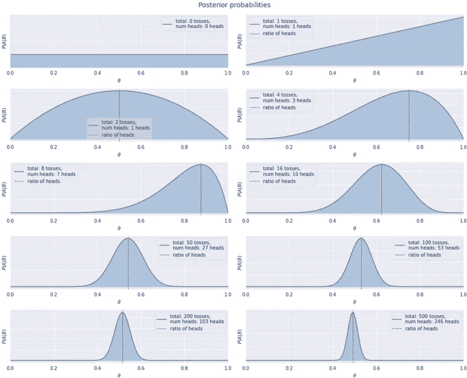
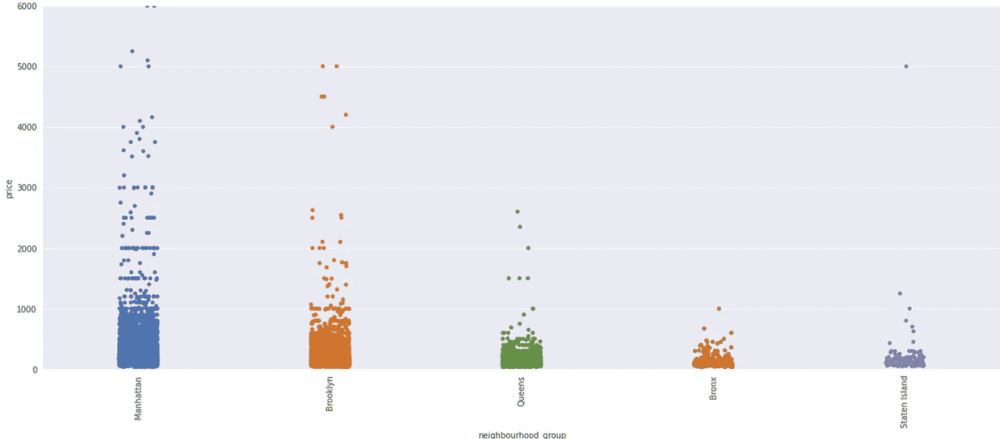
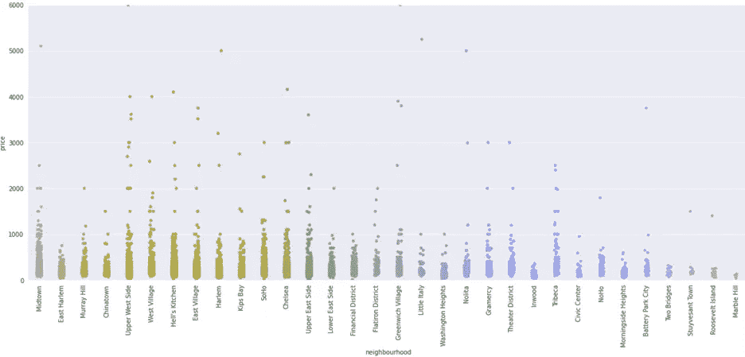
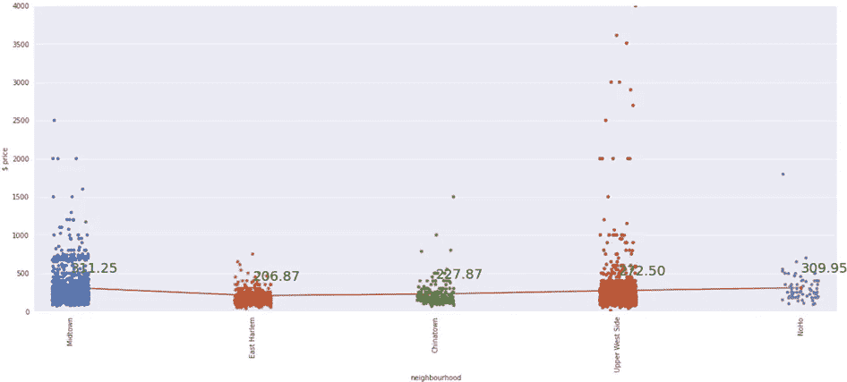
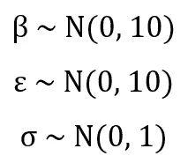
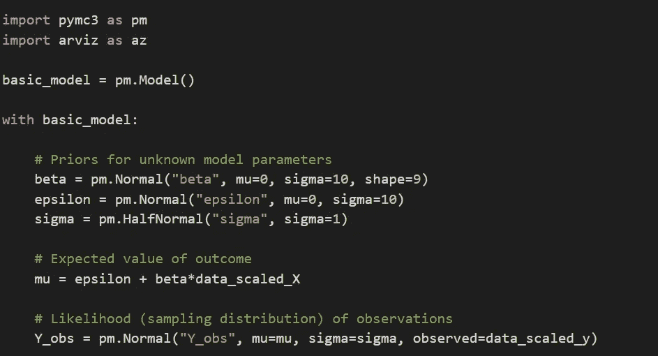
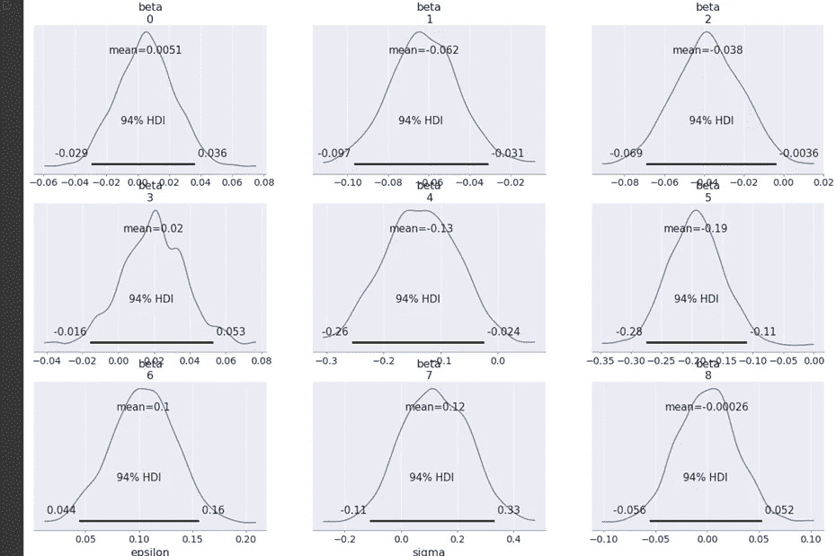
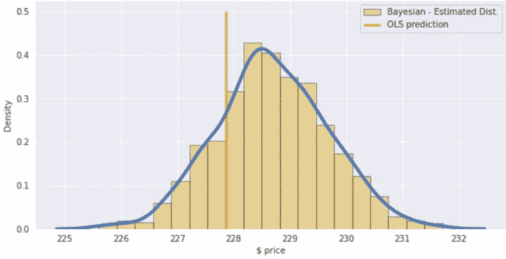

# 贝叶斯统计概述和你的第一个贝叶斯线性回归模型

> 原文：<https://towardsdatascience.com/bayesian-statistics-overview-and-your-first-bayesian-linear-regression-model-ba566676c5a7?source=collection_archive---------0----------------------->

## 简要回顾贝叶斯学习，然后在 NYC Airbnb 开放数据集上实现贝叶斯线性回归模型

你好。欢迎阅读我的第一篇文章，在这篇文章中，我将简要介绍贝叶斯统计，然后带您浏览一个简单的贝叶斯线性回归模型。

目前，我们研究的大多数机器学习问题都是通过频繁模式解决的，而贝叶斯学习的应用相对较少。因此，在这篇文章中，我想讨论 ML 中一个非常普遍的话题——线性回归——并展示如何使用贝叶斯方法实现它。

当我第一次开始研究这个问题时，我有很多问题，比如，什么时候使用贝叶斯是有益的，输出与它的非贝叶斯对应物(Frequentist)有什么不同，如何定义先验分布，python 中是否有用于估计后验分布的现有库，等等。我试图在这篇文章中回答所有这些问题，同时保持简短。

# **1。贝叶斯总结**

## **1.1** **什么是贝叶斯学习，与频率主义者统计有什么不同**

**Frequentist 和 Bayesian** 是统计学的两个不同版本。Frequentist 是一个更经典的版本，顾名思义，它依靠事件的长期运行频率(数据点)来计算感兴趣的变量。另一方面，贝叶斯也可以在没有大量事件的情况下工作(事实上，它甚至可以在一个数据点上工作！).两者的主要区别在于:frequentist 会给你一个点估计，而 Bayesian 会给你一个分布。

**有一个点估计值**意味着—“我们确定这是这个感兴趣变量的输出”。**然而，有一个分布**可以解释为——“我们相信分布的平均值是这个感兴趣的变量的很好的估计，但是也有不确定性，以标准偏差的形式”。

**那么，什么时候使用贝叶斯有用呢？如果您对既关心估计又关心确定性方面的 ML 任务感兴趣，贝叶斯方法将非常有用。举个例子:如果你想知道今天是否会下雨，有一个类似“有 60%的概率可能会下雨”的输出，会比只说“会下雨”更直观的反应。后者的回答不包括该模型对其预测有多有信心。**

## **1.2 贝叶斯哲学:**

贝叶斯方法背后的主要潜在公式是 [**贝叶斯定理**](https://betterexplained.com/articles/an-intuitive-and-short-explanation-of-bayes-theorem/) **。**这是一个简单的公式，帮助我们计算一个事件 A 给定事件 B 的条件概率:

作者图片

## **1.2.1 术语:**

***P(A|B)*** 称为**后验概率**:我们希望计算的分布

***P(B|A)*** 称为**可能性**:假设事件 A 已经发生，事件 B 发生的可能性有多大？

***P(A)*** 被称为**先验**:我们最初对感兴趣的变量的猜测

***P(B)*** 称为**证据**:事件 B 发生的可能性。注意:这通常很难计算，并且在估计后验概率时通常不计算

## 应用程序

贝叶斯定理的一些常见应用是:

*   假设今天是阴天(事件 B)，那么今天下雨(事件 A)的概率是多少
*   在 c 罗不上场的情况下(事件 B)，曼联今天获胜的概率有多大(事件 A)
*   假设我们在 4 次投掷中看到 3 个正面和 1 个反面(事件 B)，硬币有偏差的概率是多少(事件 A)。

## **1.3 频率主义者 vs 贝叶斯:一个简单的例子:**

考虑以下，频率主义者与贝叶斯的最常见的例子:在掷硬币中评估偏差:

在贝叶斯公式中，这将转化为:

**事件 A** =硬币是否倾斜(比如朝向正面)

**事件 B** =样本硬币投掷(经验数据)

**P(A|B)** =待计算！

**P(A)** =先验概率(这里假设先验假设硬币没有偏差，在 0 和 1 之间是均匀的)

使用上述术语和先验假设，让我们计算多达 500 次掷硬币的后验概率。后验概率是在每次抛硬币后计算的，输出可以在下图中看到。每次迭代计算的后验概率成为下一次迭代的先验概率。红色虚线是每次试验后 frequentist 的输出。

作者图片

从上面的图中，您可以看到分布迅速从均匀转变为高斯分布，平均值约为 0.5。另一点需要注意的是，在每次迭代后，钟形曲线只会变细，表明方差减少。这意味着，它仍然编码了少量的不确定性，而频率主义者只给出一个值。

# 2.**贝叶斯线性回归:**

当我在探索用贝叶斯学习代替常见的 ML 解决方案来完成回归任务时，给我印象最深的一个应用是贝叶斯线性回归。我已经在一些 ML 问题中应用了它，并想在这里分享它的一瞥。在深入研究之前，下面是普通线性回归的简短回顾。

## **2.1 线性回归概述:**

线性回归试图在响应变量和输入变量之间建立线性关系。使用以下公式对此进行了最佳描述:

在上式中，所有 x_i 都是输入特征，β_i 是相关系数。ε对应于等式中的统计噪声(x 和β的线性关系没有考虑到这一点)。上面表示的方程是回归的最一般形式。通过最小化损失函数(通常是 [L2 损失函数](http://www.chioka.in/differences-between-l1-and-l2-as-loss-function-and-regularization/))来计算系数。因此也被称为[普通最小二乘(OLS)算法](https://setosa.io/ev/ordinary-least-squares-regression/)。由于我们只有一个系数的估计值，所以我们最终只有一个响应变量(y)的值

## **2.2 贝叶斯线性回归:**

从贝叶斯的角度来看，线性回归方程会以稍微不同的方式书写，这样就没有对系数的单一估计。这主要包括两个步骤:

*   计算β(即 P(β|X，y))的后验分布
*   使用后验分布计算响应变量

## **2.2.1** **计算β的后验分布**

受贝叶斯定理的启发，我们有

由于证据项难以计算，因此可以写成:

看上面的等式，我们可以看到我们需要在等式中输入两个东西——可能性**和先验**。这不是很直接。

## **2.2.1.1 预选:**

通常，先验分布的选择基于[领域知识](https://stats.stackexchange.com/questions/78606/how-to-choose-prior-in-bayesian-parameter-estimation)。从字面上看，先验意味着我们对未知事物的信念。在大多数情况下，我们会有一些关于先验的知识，这可以更容易地为它分配一个特定的分布。在最坏的情况下，我们可以从文献调查中提取一些知识，或者使用均匀分布。以掷硬币为例，我们使用了统一的先验假设，假设我们对硬币的偏差一无所知。该先验将被给定为:

类似地，我们也会为其他未知量(ε，σ)分配先验。

## 【2.2.1.2 可能性:

似然项由 **P(X，y|β)给出。**由于 X 是常数，不依赖于β **，**似然项可以改写为 **P(y|β)** 。最常见的方法是假设“y”遵循正态分布，以 OLS 预测作为平均值。因此，可能性项将由下式给出:

现在，如果我们在贝叶斯方程中加入先验和似然项，事情会变得非常复杂。在多个概率密度函数的帮助下计算后验概率可能看起来非常令人生畏。虽然，研究人员已经提出了各种技术来解决这个问题。一个非常流行和成功的方法是[马尔可夫链蒙特卡罗算法(MCMC)](https://machinelearningmastery.com/markov-chain-monte-carlo-for-probability/) 。它计算实际后验分布的近似值**。**因此，当您从这个近似分布中抽取样本时，您基本上是从未知量的真实(或接近真实)分布中抽取样本(在我们的例子中，是β、ε、σ)。我们可以使用这些抽取的样本来计算其他感兴趣的指标，如平均值、标准差等。我不会深入研究这个算法，但是如果您有兴趣了解更多，我在参考资料中提供了一些链接。

## **2.2.2** **使用后验分布计算响应变量**

如前所述，贝叶斯线性回归模型的输出将是一个分布，而不是一个单一的估计。因此，如前所述，考虑它的一种方法是使用均值为(β)的高斯分布。T * X) + ε，带有一些方差σ。同样，这将表示为:

[注意，我们将使用上一步中所有未知数的计算后验分布的平均值]

现在，为了对给定的数据点(x_i)进行预测，我们可以用 x_i 代替 X，从上述正态分布中抽取样本。

# **3。在 NYC Airbnb 数据集上实现贝叶斯线性回归:**

> [注意:这一整节的代码可以在这里找到[github](https://github.com/AKASHKADEL/Bayesian-Learning)**/**[colab](https://colab.research.google.com/drive/1tRA6B15VkD6VpLE6JGqdyR13GpjXasBm?usp=sharing)

让我们尝试在一个公共数据集上实现我们所学的所有内容— [NYC Airbnb 数据](https://www.kaggle.com/dgomonov/new-york-city-airbnb-open-data)。该数据集包含在纽约不同行政区出租整个公寓的价格信息。数据集的一个小预览是:

不同行政区的价格分布如下:

作者图片

你可以看到每个区的价格都有很大的不同。不出所料，曼哈顿似乎有更高的方差。这是因为一些社区，如上西区、西村等。，可以看到一个非常不同(更贵)的公寓价格(如下所示):

作者图片

现在，比方说，你在曼哈顿唐人街拥有一套公寓，你想把它放在 Airbnb 上。你会给它报价多少？(假设 Airbnb 没有报价)。

对此可能有许多解决方案，但其中之一将是贝叶斯线性回归，因为它将为我们提供一系列值。而且，拥有这个范围将帮助你很好地理解价格的分布，做出明智的选择。

## **3.1 OLS 预测:**

使用 [scikit learn 实现 OLS](https://scikit-learn.org/stable/modules/generated/sklearn.linear_model.LinearRegression.html) 给出曼哈顿唐人街这套公寓的估价为 227 美元。让我们也包括它与其他社区的比较:

[为了简单起见，我们只关注几个街区:中城、东哈莱姆区、唐人街、上西区、NoHo]

作者图片

看上面的图表，我们可以看到唐人街的价格差异很大(在 65 美元到 1500 美元之间)。上西区和中城等其他街区的差异要比唐人街大得多。**因此，仅仅依靠一个单一的估计似乎并不完全正确。**

## **2.4 编码贝叶斯线性回归:**

为了编写贝叶斯线性回归，我会使用 [pymc3 包](https://docs.pymc.io/en/v3/api/inference.html)。

再次回忆一下，响应变量定义为:

现在，开始吧，我们首先要指定三个未知数的先验分布:β，ε，σ

由于我已经对数据进行了标准化，我将对这些参数使用均值为 0 且标准差稍高的标准正态分布。

使用 pymc3 的代码将是:

现在，要利用 pymc3 中的内置算法来估计后验分布，请运行以下代码:

“ ***样本*** ”功能负责自动分配合适的算法。例如:连续输出的 NUTS(一种哈密顿蒙特卡罗方法)，离散输出的 Metropolis，二进制输出的 Binary Metropolis 等。你可以在这里找到更多关于推理步骤[的细节。](https://docs.pymc.io/en/v3/api/inference.html)

现在，您可以使用以下代码绘制参数的后验分布:

作者图片

β参数有多个图，对应每个维度的边际分布。(要详细查看所有特性，请参考代码**[**[github](https://github.com/AKASHKADEL/Bayesian-Learning)**][**[colab](https://colab.research.google.com/drive/1tRA6B15VkD6VpLE6JGqdyR13GpjXasBm?usp=sharing)**])**

接下来，可以使用计算出的β、ε和σ的分布来绘制特定数据点 x_i 的正态分布。

使用上面的公式，列出曼哈顿唐人街附近公寓的价格分布如下:

作者图片

对于不同的社区，这种分布会有所不同。此外，方差将根据我们拥有的数据量减少/增加。上面的分布是仅用 3K 数据点计算的。

拥有如上的分布将帮助我们更好地理解价格市场，并帮助我们做出明智的决定。

## **2.5 当‘N’很大时会发生什么:**

让𝑁表示我们拥有的证据的实例数量。随着我们收集越来越多的证据，即当𝑁→∞，我们的贝叶斯结果(经常)与频率主义者的结果一致。因此，对于一个无限大的 N，贝叶斯或频率主义者的统计推断是相似的。然而，对于小𝑁，推断是不稳定的:频率主义者的结果有较高的方差。这就是贝叶斯结果有优势的地方。

对于 3000 个数据点，频率主义者和贝叶斯的均值之间的比较没有很大不同:

# **结论:**

这篇文章只是对贝叶斯线性回归的介绍，以及一些贝叶斯概念的回顾。作为一名数据科学家，了解解决同一个问题的不同方法以及它们之间的比较是非常有益的。当我开始探索贝叶斯方法来解决我们工作中的一些常见的 ML 任务时，我个人感到非常激动，并被迫在这里分享一些。

其次，这篇文章不应该被认为是贝叶斯主义者。两者都是不同的方法，声称一种比另一种好是不正确的。主要看你的用例是什么。Cassie Kozyrkov 深入研究了这一比较，如果你感兴趣，我强烈推荐这篇[文章](/statistics-are-you-bayesian-or-frequentist-4943f953f21b)。

# **感谢阅读！**

我非常感谢你通读整篇文章。如果您有任何问题/想法或想要分享任何建设性的批评，非常欢迎您通过 [@Akashkadel](https://medium.com/@akashkadel94) 联系我。这是我的第一篇文章，我真的希望提高。

# **参考资料了解详情:**

1.  贝叶斯先验:[https://fukamilab . github . io/bio 202/05-B-Bayesian-priors . html](https://fukamilab.github.io/BIO202/05-B-Bayesian-priors.html)
2.  基于不同先验选择的后验输出比较:[https://OCW . MIT . edu/courses/mathematics/18-05-introduction-to-probability-and-statistics-spring-2014/readings/MIT 18 _ 05s 14 _ reading 15b . pdf](https://ocw.mit.edu/courses/mathematics/18-05-introduction-to-probability-and-statistics-spring-2014/readings/MIT18_05S14_Reading15b.pdf)
3.  马尔可夫链蒙特卡罗方法介绍:[https://towards data science . com/a-zero-math-introduction-to-Markov-Chain-Monte-Carlo-methods-dcba 889 e0c 50](/a-zero-math-introduction-to-markov-chain-monte-carlo-methods-dcba889e0c50)
4.  马尔可夫链蒙特卡罗视频讲解:[https://www.youtube.com/watch?v=yApmR-c_hKU&t = 612s](https://www.youtube.com/watch?v=yApmR-c_hKU&t=612s)
5.  另一篇关于贝叶斯线性回归的好文章:[https://towards data science . com/introduction-to-Bayesian-Linear-Regression-e66e 60791 ea 7](/introduction-to-bayesian-linear-regression-e66e60791ea7)
6.  Pymc3 指南:[https://docs . pymc . io/en/v3/pymc-examples/examples/getting _ started . html](https://docs.pymc.io/en/v3/pymc-examples/examples/getting_started.html)