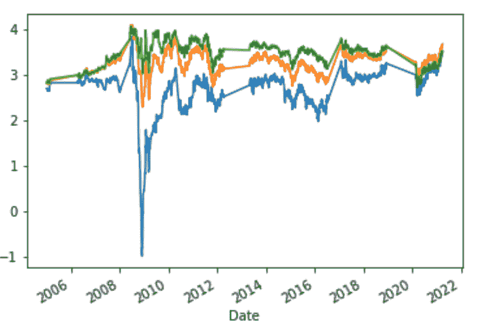
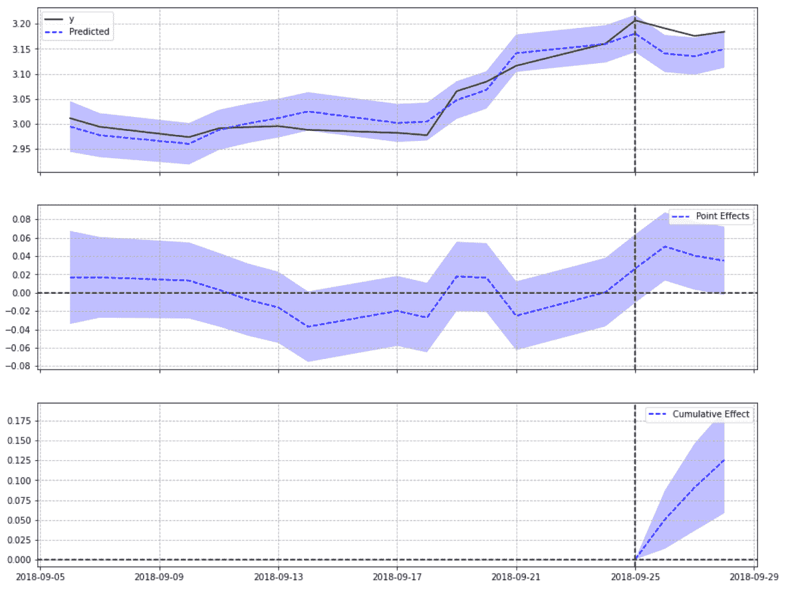

# 贝叶斯结构时间序列中断方法

> 原文：<https://towardsdatascience.com/bayesian-structural-time-series-interruption-method-5018761db92b?source=collection_archive---------28----------------------->

## 差异中的差异的贝叶斯方法

克里斯·利维拉尼在 [Unsplash](https://unsplash.com?utm_source=medium&utm_medium=referral) 上的照片

W 在处理真实世界的数据时，很难找到干净、孤立、可控的实验室数据集。我们经常发现，我们都学习的更经典的统计方法根本不起作用——它们的假设太不现实或太死板，数据集在各方面都让它们失望。例如，一个常见的假设是独立同分布随机变量。这通常是不现实的:你怎么能保证同一个板块中两家公司的股价是独立同分布的呢？他们是竞争者，因此他们的价格不是独立的。它们没有理由分布相同(一个可能是成长型公司，另一个可能是蓝筹股价值公司，因此具有不同的股价函数)。有时，假设 i.i.d .可能不是获得相关结果所必需的，但可能会妨碍推断([参见此处的讨论](https://stats.stackexchange.com/questions/213464/on-the-importance-of-the-i-i-d-assumption-in-statistical-learning))。

线性回归增加了更多的假设，例如线性(两个变量共享一个线性关系)、同方差(残差的方差是常数)、独立性(这意味着没有自相关)和正态分布。[差异中的差异法假定](https://www.publichealth.columbia.edu/research/population-health-methods/difference-difference-estimation)治疗组与对照组的分配是随机的，两组在结果方面具有平行趋势(组间差异随时间保持不变)，并且没有溢出效应。对于真实世界的数据，这可能是一个问题。首先，分配可能不是随机的。对于经济学数据，当一个政府宣布一个 *X* 规则时，它通常对所有人都有效(不仅仅是一个治疗组)。其次，对照组和治疗组之间的关系通常会随着时间而变化(我稍后将称之为时变)。第三，很难说没有溢出效应。一个买家可能会因为一个有趣的广告而对产品 *X* 感兴趣，但是在公司的网站上也会对产品 *Y、*甚至两种产品感兴趣。也可能是这样的情况，你没有一个控制组(你只有一个产品或一个法律变化)，但仍然想确定一个事件 *E* 是否改变了一个时间序列变量的过程。一种方法是使用贝叶斯结构时间序列。

## 例如:政府公告和盈亏平衡汇率

我的理学学士论文使用 BSTS 方法来评估政府公告是否会影响盈亏平衡率(的时间序列路径)。盈亏平衡利率就是政府债券的名义收益率和实际收益率之差。因此，这里感兴趣的变量( *y* )是具有非常高的自相关性的时间序列变量。不仅如此，它还受到遗漏变量偏差的影响——这意味着有一个未知(或换句话说，未观察到的)变量 *Z* 影响*y。*这就是流动性溢价，它很难测量，并且可能是时变的。因为我们处理的是政府公告，所以没有控制组。政府公告是面向所有人的，我们无法观察如果它没有发生会是什么结果(我们无法回到过去改变过去来看)。还有趋势和季节性效应也需要分解。

python 包 [causalimpact](https://github.com/google/CausalImpact) 可以帮助我们实现这个模型。我们没有反事实(来自对照组的观察结果)，但是我们有关于盈亏平衡率的多年数据，以及一些与盈亏平衡率相关的其他变量。**这些被称为协变量。**它们与响应变量 *y* 的关系可以假设为静态的(随时间恒定)或时变的(随时间变化)。通常选择与响应变量关系大致相同的变量更简单。

对于盈亏平衡率，我将使用富时 100 指数的收盘价、英镑的交易指数(因为我们正在测试英国政府债券)和 25 年的盈亏平衡率。将使用 25 年的盈亏平衡率，因为它与响应变量 *y* 非常相关，但不受独立变量 *X.* 的影响。这可以在下图中看到，其中蓝线是 5 年的盈亏平衡率，绿线是 25 年的盈亏平衡率。这些年来，他们的关系似乎非常稳定。

资料来源:Brunna Torino

**此外，您需要选择与干预日期相关的前期和后期。** 前期需要足够长，以便模型能够充分学习时间序列的路径及其与协变量的关系；后期需要反映效果需要多长时间才能完全“显示”在数据中(例如，一个活动需要多长时间才能开始工作？新信息需要多长时间才能在股票市场上定价？).然而，后期应该是前期的一小部分，因为随着该比率的上升，模型对其预测越来越不自信。

## 实施

一旦我决定了感兴趣的变量、协变量和干预前/后参数，下面是我如何在我的模型中实现它们:

首先，我分别使用 20 天和 5 天创建前期和后期日期。接下来，我确保所有的日期都是工作日。所有日期都被传递到不同的列表(干预日期、前期日期、后期日期和干预日期+ 1 算法格式)。

接下来，我们需要将 *y* 时间序列的索引设置为 DateTimeIndex 类型。我正在处理多种到期日(3 年和 15 年之间的多种盈亏平衡利率)，所以我需要做两个循环:一个针对每个到期日，一个针对每个干预日。我提取模型的 p 值、平均效应和累积效应。下面是实现的主要部分:

最后，我将输出附加到原始数据集。现在，我有了干预日期、协变量值、债券公告的意外规模(这是我的独立变量)，以及该公告对相关时间序列 *y* 的影响，以及表明影响是否显著的 p 值。你可以在这里停下来，逐个分析影响，或者使用 logit 回归来建立因果关系。这将为您提供以下模型:

*显著性[0，1] = alpha *意外* *债券公告规模*

其中 alpha 是要测量的系数， *y* 变量是一个二进制[0，1],表示 BSTS 方法发现的干预是否显著，以及绑定公告的意外大小，简单如下:

还可以查询模型的单个地块以了解其准确性。以下是 2018 年 9 月 25 日政府公告的情节:

资料来源:Brunna Torino

黑线显示盈亏平衡率，蓝线显示模型的预测。该模型能够在干预前保持在实际 *y* 的 0.05 点之内，但在干预后却不能，这表明时间序列可能在干预日期后发生了突然变化。

## 结论

据估计，债券公告对盈亏平衡利率的影响即使有，也是很小的。然而，如果没有一些严肃的数据平滑，这种影响不可能被线性回归准确地捕捉到:这个特定练习的 r 低至 2–7%。差异中的差异做出了一系列假设，即数据没有通过，并且合成控制的构建将更加困难，即使可能或准确。

这种方法对于这样的情况是一个非常有用的选择:数据并不像实验室那样完美，真实的影响可能很小并且在发展，没有什么可以被假设为线性和简单的。世界是一个复杂的地方，能够捕捉这种复杂性的灵活模型应该更受那些寻求真正理解它的人的欢迎。