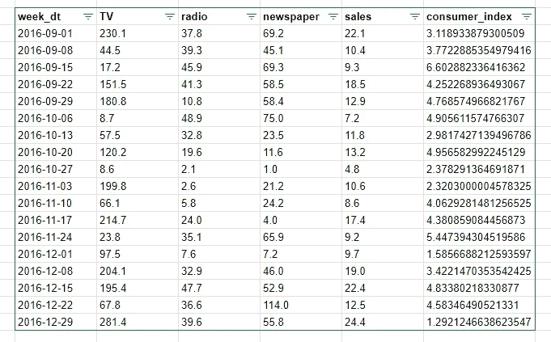
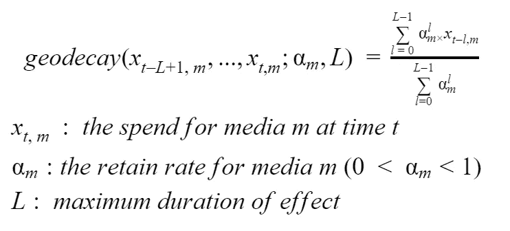
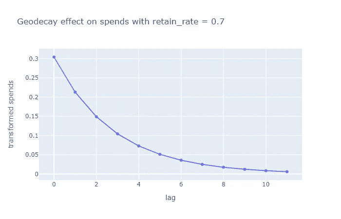
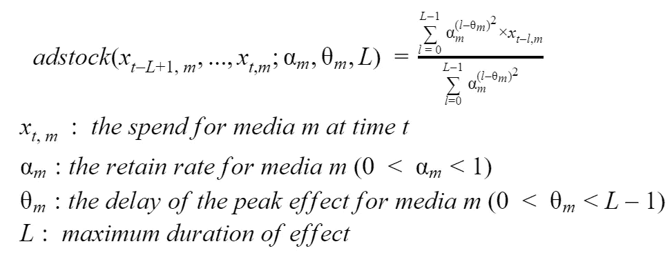
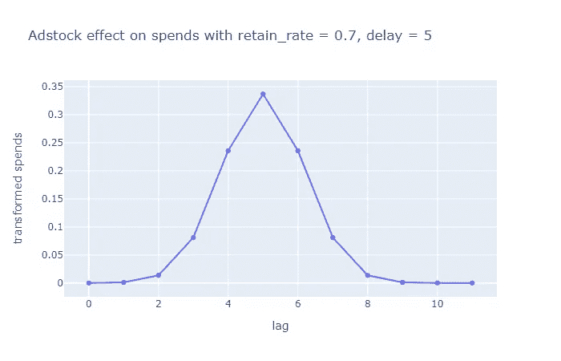
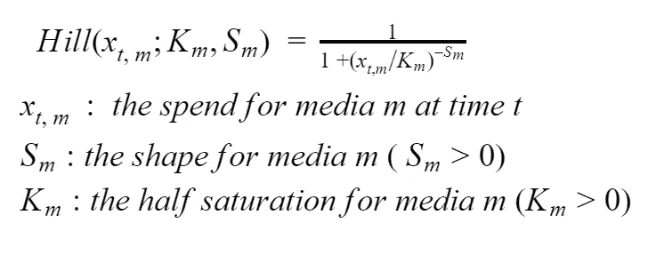
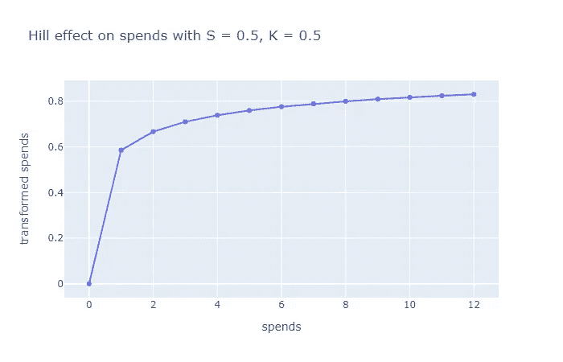
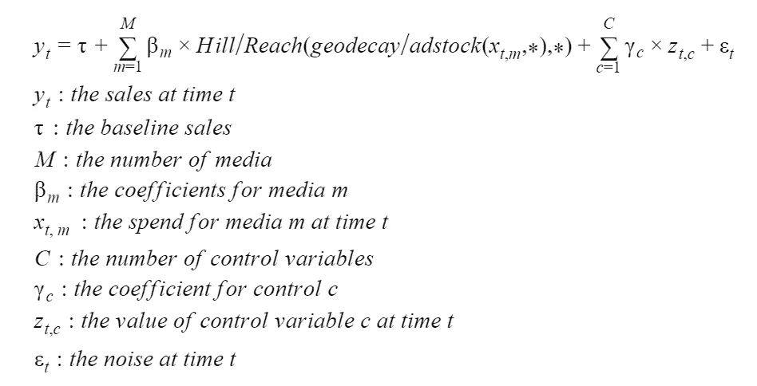
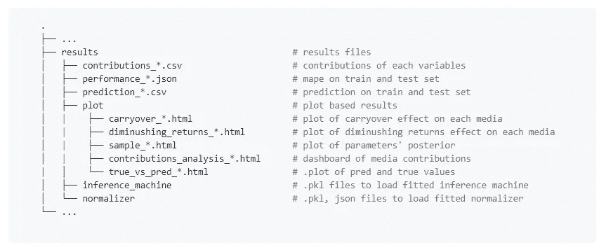
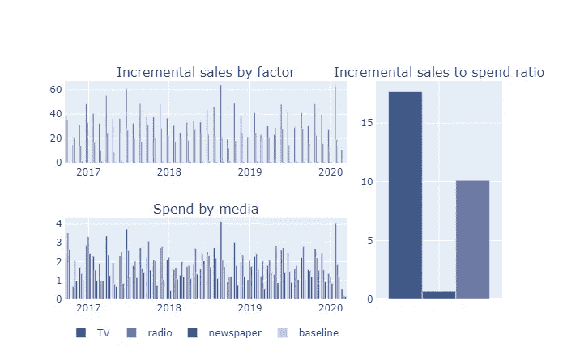

# Bayesian mmm——最先进的媒体混合模型

> 原文：<https://towardsdatascience.com/bayesianmmm-state-of-the-art-media-mix-modelling-9207c4445757?source=collection_archive---------5----------------------->

罗伯特·卡茨基在 [Unsplash](https://unsplash.com?utm_source=medium&utm_medium=referral) 上的照片

## 轻松测试你的媒体组合的贝叶斯模型

测试一个新的营销组合模式是非常耗时的。这就是开发 BayesianMMM(一个无需编写代码就能适应 MMM 的脚本)的原因。

几个小时之内，你就可以看到艺术模型的结果。

 [## GitHub-leopoldavezac/BayesianMMM:(ml)-贝叶斯媒体混合建模的 python 实现…

### 多年来，科学家们一直试图找到最佳方式来模拟媒体支出和收入之间的关系。曾经…

github.com](https://github.com/leopoldavezac/BayesianMMM) 

# 观众

*   营销数据科学家
*   营销机器学习工程
*   营销数据分析师
*   活动经理/所有者

# 介绍

媒体组合模型是营销科学的圣杯。一个准确的媒体组合模型可以给我们提供最佳的媒体组合，即在增加收入的同时减少媒体支出的组合。

*一个媒体组合模型揭示了媒体支出和收入之间的因果关系***。**

*用于训练这种模型的数据集通常是每周一次的，看起来像这样，*

**

*作者图片*

# *模型*

*BayesianMMM 中使用的模型是由谷歌的一组研究人员在[Bayesian Methods for Media Mix Modeling with carry out and Shape Effects](https://static.googleusercontent.com/media/research.google.com/en//pubs/archive/46001.pdf)中提出的。*

*就像经典的 MMM 一样，它旨在根据媒体支出和其他控制变量(季节、天气等)来预测销售。然而，经典回归模型有三个关键的更新。*

## ***遗留效应***

*媒体支出对销售有持久的影响，在某一周花费的一美元将有助于几周的销售。我们称这种效应为**遗留效应**，它被明确纳入模型中。*

*两个数学函数可用于模拟遗留效应。*

***地理预测***

***地理数据转换** *仅*模拟媒体支出的持久影响。*

*该函数将 L 周期间给定媒体的媒体花费 L 和保留率作为输入。l 是花费的最大持续时间效果。L 可以被视为超参数，使用商业知识定义或设置为 13(在模拟设置中，已经发现 L 是无穷大的良好近似值)，如研究论文中所建议的。留存率是一个系数，它使用当前期间(t)的支出得出下一期间(t+1)的留存支出。*

**

*作者图片*

*这里，我们在 lag = 0 时将开销设置为 1，否则设置为 0。在保留率为 0.7 的情况下，我们获得了以下结转支出。*

**

*作者图片*

***Adstock 改造***

*有时，我们预计媒体支出效应会在一段时间后达到顶峰。**广告转型**模拟了媒体支出的持久和延迟影响。*

*该函数将 L 周期间给定媒体的媒体花费 L、峰值的保留率和延迟作为输入。延迟是峰值效应之前的周期数。*

**

*作者图片*

*这里，我们再次在 lag = 0 时将开销设置为 1，否则设置为 0。在保留率为 0.7，延迟为 5 的情况下，我们获得了以下 adstock 开销。*

**

*作者图片*

## *形状效应*

*媒体支出越大，回报越少。我们称之为形状效应，它明确地包含在模型中。*

***希尔***

*该函数将周期 t 的花费、形状和半饱和度作为输入。这些参数不像遗留转换的参数那样容易解释。如果你不理解他们，你就必须和他们一起玩。*

**

*作者图片*

*这里我们设置花费为 1，形状为 0.5，半饱和度为 0.5。*

**

*作者图片*

*综上所述，我们的模型可以表述如下:*

**

*作者图片*

## *拟合方法*

*通过 pystan API 使用 MCMC 估计模型参数。*

*我们在参数分布上设置了与[研究论文](https://static.googleusercontent.com/media/research.google.com/en//pubs/archive/46001.pdf)中相同的先验。*

*在用户定义的迭代次数之后，我们获得了参数后验分布的样本。我们使用这些样本来估计参数的真实值。*

# *挑战*

*要适应一个媒体组合模型有很大的挑战，这里有一个不完整的列表。*

*   *有限的可用数据*

*与参数的数量相比，可用的数据量很小。这可能导致准确性问题，并在测试和评估准确性中引入一些偏差。*

*   *输入变量之间的相关性*

*媒体支出之间通常有很高的相关性。这可能导致不良的销售归因于销售渠道。*

*   *有限的数据范围*

*有限的数据范围也可能是一个问题，因为营销利益相关者总是想推断结果。*

*您可以在[媒体混合建模的挑战和机遇](https://storage.googleapis.com/pub-tools-public-publication-data/pdf/2d0395bc7d4d13ddedef54d744ba7748e8ba8dd1.pdf)中了解更多关于这些挑战以及如何应对的信息。*

# *结果*

*运行脚本后，我们得到以下结果，*

**

*作者图片*

*在这里，您可以看到使用演示数据集生成的贡献分析图。*

**

*作者图片*

# *使用*

*要了解如何使用 BayesianMMM，请参考 Github repo。*

* [## GitHub-leopoldavezac/BayesianMMM:(ml)-贝叶斯媒体混合建模的 python 实现…

### 多年来，科学家们一直试图找到最佳方式来模拟媒体支出和收入之间的关系。曾经…

github.com](https://github.com/leopoldavezac/BayesianMMM) 

# 结论

虽然 BayesianMMM 脚本将大大减少测试最先进的媒体混合模型所需的时间，但它并没有处理所有的挑战。你还是要自己处理这些事情！

感谢阅读，您可以在 LinkedIn 上与我联系。*