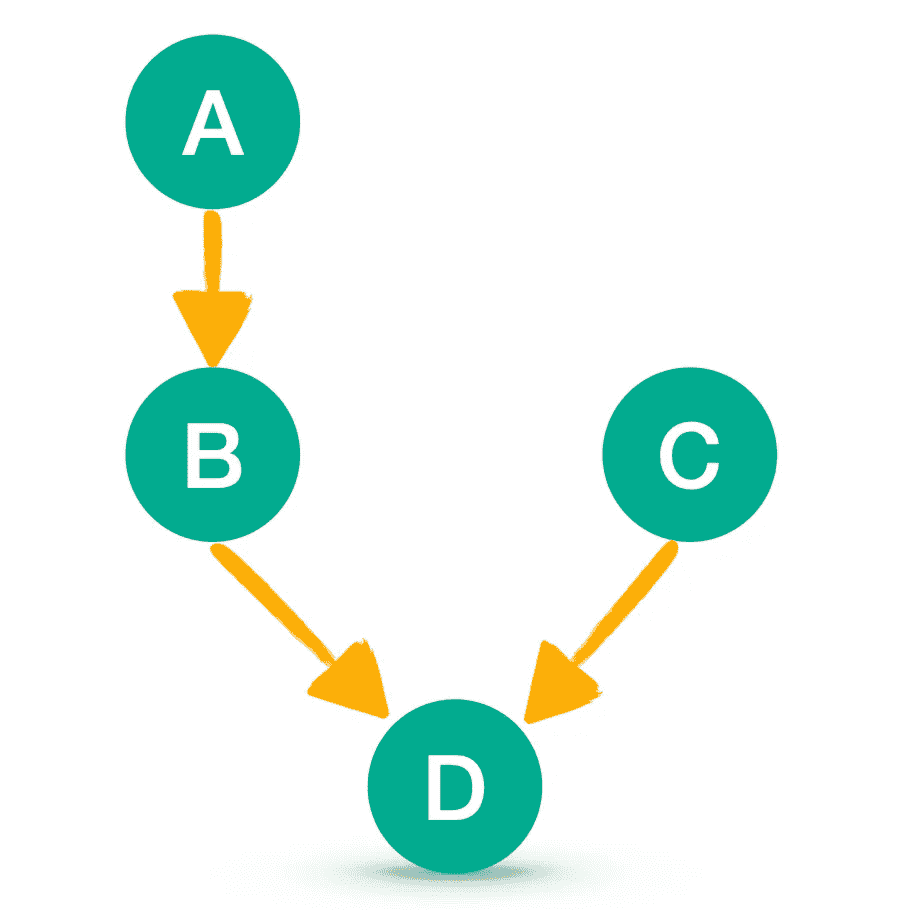
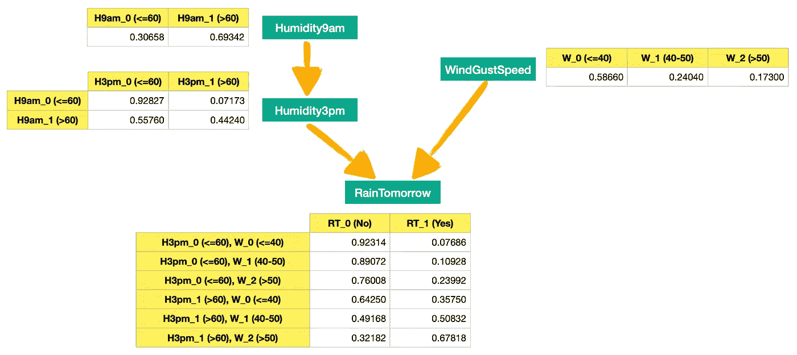
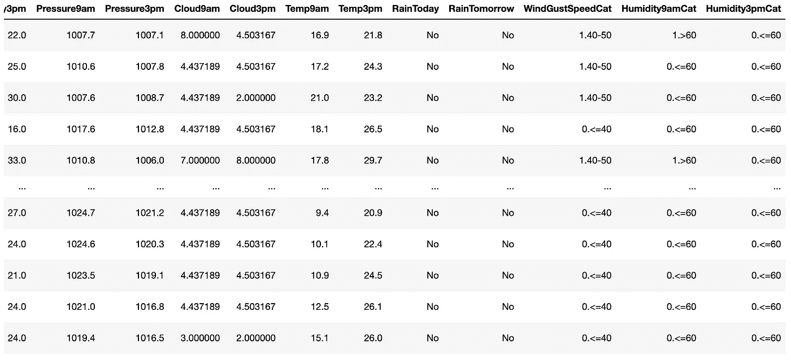
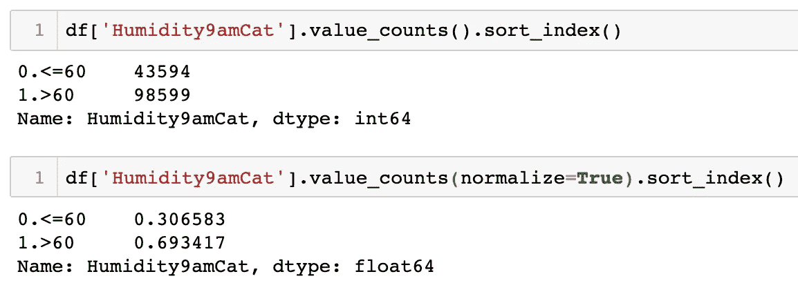
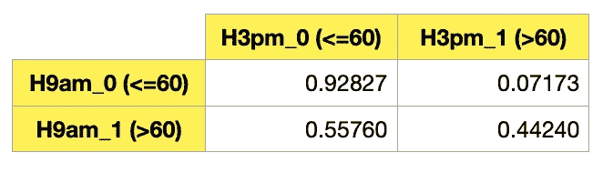
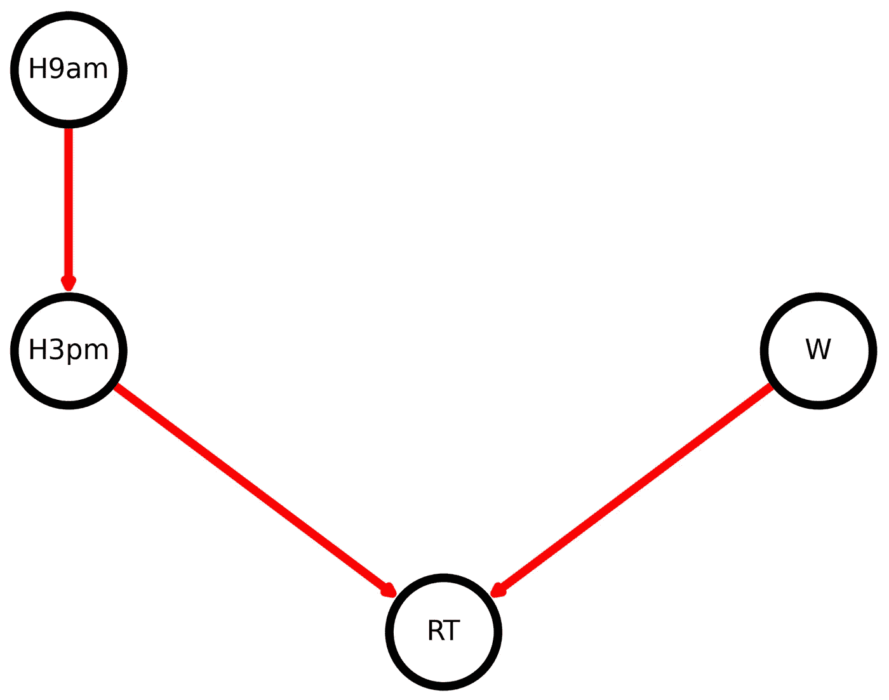
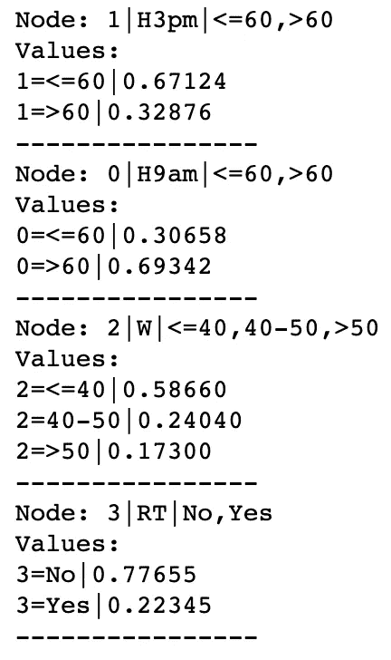
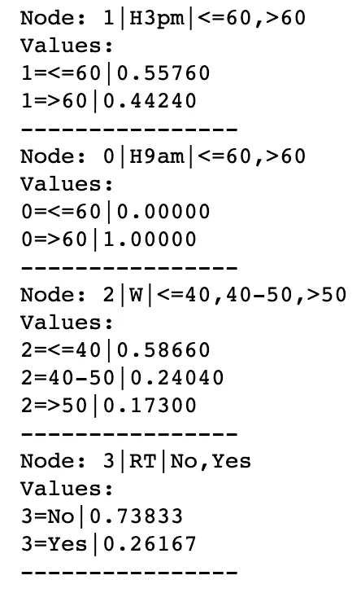
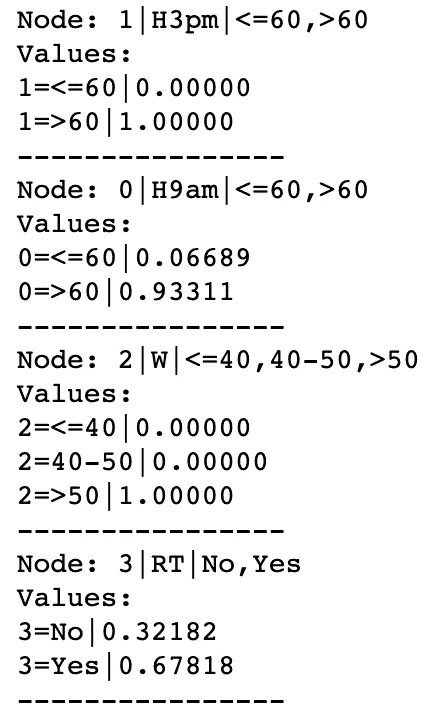

# BBN:贝叶斯信念网络——如何用 Python 有效地构建它们

> 原文：<https://towardsdatascience.com/bbn-bayesian-belief-networks-how-to-build-them-effectively-in-python-6b7f93435bba?source=collection_archive---------0----------------------->

## 机器学习

## 使用真实生活数据在 Python 中构建模型的贝叶斯信念网络的详细解释

图片由[皮克斯拜](https://pixabay.com/?utm_source=link-attribution&utm_medium=referral&utm_campaign=image&utm_content=4776910)的 Gerd Altmann 提供

# **简介**

大多数人可能已经熟悉朴素贝叶斯算法，这是一种用于分类问题的快速而简单的建模技术。虽然朴素贝叶斯由于其速度和相对较好的性能而被广泛使用，但它是建立在所有变量(模型特征)都是独立的假设之上的，而这在现实中往往是不正确的。

在某些情况下，您可能想要构建一个模型，在其中您可以指定哪些变量是从属的、独立的或者**条件独立的**(这将在下一节中解释)。您可能还希望实时跟踪事件概率随着新证据引入模型而发生的变化。

这就是**贝叶斯信念网络**派上用场的地方，因为它们允许你通过清晰地勾勒变量之间的关系来构建一个带有节点和有向边的模型。

# **内容**

*   贝叶斯信念网络(BBN)属于哪一类算法
*   贝叶斯信念网络(BBN)和有向无环图(DAG)简介
*   使用真实生活数据的贝叶斯信念网络 Python 示例
    -用于天气预测的有向无环图
    -数据和 Python 库设置
    - BBN 设置
    -使用 BBN 进行预测
*   结论

# 贝叶斯信念网络(BBN)属于哪一类算法？

从技术上讲，BBN 国内没有培训。我们简单地定义了网络中不同的节点是如何连接在一起的。然后，我们观察在将一些证据传递到特定节点后，概率如何变化。因此，我将概率图形模型归入它们自己的类别(见下文)。

> 旁注，由于神经网络独特的机器学习方法，我已经将它们归为一类。然而，它们可以用于解决广泛的问题，包括但不限于分类和回归。下图是**交互式**，请务必点击👇在不同的类别上对**进行放大并展示更多的**。

机器学习算法分类。互动图表由[作者](https://solclover.com/)创作。

***如果你也热爱数据科学和机器学习*** *，请* [*订阅*](https://bit.ly/3uZqsQA) *每当我发布新故事时，你都会收到一封电子邮件。*

# 贝叶斯信念网络(BBN)和有向无环图(DAG)

贝叶斯信念网络(BBN)是一种概率图形模型(PGM)，它通过有向无环图(DAG)表示一组变量及其条件依赖关系。

为了理解这意味着什么，让我们画一个 DAG 并分析不同节点之间的关系。

有向无环图。图片由[作者](https://solclover.com/)提供。

利用上述内容，我们可以陈述变量(节点)之间的关系:

*   **独立性:** A 和 C 相互独立。B 和 C 也是如此。这是因为知道 C 是否发生并不会改变我们对 A 或 B 的认识，反之亦然。
*   **依赖:** B 依赖 A，因为 A 是 B 的父，这个关系可以写成条件概率:`P(B|A)`。d 还依赖于其他变量，在这种情况下，它依赖于其中的两个——B 和 c，同样，这可以写成一个条件概率:`P(D|B,C)`。
*   **条件独立:** D 被认为是条件独立于 A 的，这是因为一旦我们知道事件 B 是否发生了，A 从 D 的角度来看就变得无关紧要了，换句话说，下面是真的:`P(D|B,A) = P(D|B)`。

# 使用真实数据的贝叶斯信任网络 Python 示例

## 用于天气预报的有向无环图

让我们用澳大利亚的天气数据来建造一个 BBN。这将使我们能够根据今天的一些天气观测来预测明天是否会下雨。

首先，在详细介绍如何构建 DAG 之前，让我们先来看看它。注意，我已经显示了所有不同事件组合的概率。在接下来的几节中，你会看到我们是如何使用天气数据来计算这些数据的。

贝叶斯信念网络(BBN)预测明天是否下雨的有向无环图(DAG)。图片由[作者](https://solclover.com/)提供。

## 数据和 Python 库设置

我们将使用以下数据和库:

*   [来自 Kaggle 的澳大利亚天气数据](https://www.kaggle.com/jsphyg/weather-dataset-rattle-package)
*   [PyBBN](https://py-bbn.readthedocs.io/index.html) 用于创建贝叶斯信念网络
*   [熊猫](https://pandas.pydata.org/docs/)进行数据操作
*   用于绘制图形的 [NetworkX](https://networkx.org/documentation/stable/) 和 [Matplotlib](https://matplotlib.org/stable/contents.html)

让我们导入所有的库:

然后我们从 Kaggle 获取澳大利亚的天气数据，你可以按照这个链接下载:[https://www . ka ggle . com/jsphyg/weather-dataset-rattle-package](https://www.kaggle.com/jsphyg/weather-dataset-rattle-package)。

我们接收数据并推导出一些新的变量用于模型中。

以下是数据的快照:

经过一些修改的 [Kaggle 的澳大利亚天气数据](https://www.kaggle.com/jsphyg/weather-dataset-rattle-package)片段。图片由[作者](https://solclover.medium.com/)提供。

## 建立贝叶斯信念网络

现在我们已经准备好了所有的库和数据，是时候建立一个 BBN 了。第一阶段要求我们定义节点。

需要注意一些事情:

*   这里的概率是数据中变量类别的归一化频率。例如,“H9am”变量在值≤60 时有 43，594 个观察值，在值> 60 时有 98，599 个观察值。

变量值计数。图片由[作者](https://solclover.com/)提供。

*   虽然我使用了归一化频率(概率)，但如果你使用实际频率，它也是有效的。在这种情况下，您的代码应该是这样的:`H9am = BbnNode(Variable(0, 'H9am',['<=60', '>60']), [43594, 98599])`。
*   对于子节点，如“Humidity3pmCat”，它有一个父节点“Humidity9amCat”，我们需要为每个组合提供概率(或频率)，如 DAG 中所示(注意每行加起来为 1):

“湿度 3pmCat”标准化频率(概率)。图片由[作者](https://solclover.com/)提供。

*   您可以通过两次计算“H3pm”的概率/频率来实现这一点，第一次通过获取“H9am”≤60 的数据子集，第二次通过获取“H9am”> 60 的数据子集。
*   因为一次计算一个频率很费时间，所以我写了一个简短的函数来给出我们所需要的。

因此，让我们使用上面的函数，而不是手动输入所有的概率。同时，我们将创建一个实际的网络:

> 请注意，如果您正在处理一个小的数据样本，则存在某些事件组合不存在的风险。在这种情况下，您会得到一个“列表索引超出范围”的错误。一个解决方案是扩展您的数据以包含所有可能的事件组合，或者识别缺失的组合并添加它们。

现在，我们要绘制图表来检查我们是否按照预期进行了设置:

下面是结果图，它符合我们的预期设计:

BBN 天气预报的有向无环图。图片由[作者](https://solclover.com/)提供。

## 利用 BBN 进行预测

我们的模型准备好了，我们可以用它来预测明天是否会下雨。

首先，让我们画出每个节点的概率，而不向图中传递任何附加信息。注意，我已经设置了一个简单的函数，这样我们就不必在以后重新输入相同的代码，因为我们需要多次重新生成结果。

上面的代码打印了以下内容:

原始 BBN 概率。图片由[作者](https://solclover.com/)提供。

如你所见，这给了我们每个事件发生的可能性，即“明天下雨(RT)”的概率为 22%。虽然这很酷，但我们可以通过查看原始数据集中“RainTomorrow”变量的频率来获得同样的 22%的概率。

说接下来的步骤是我们从 BBN 中获得大量价值的地方。**我们可以将证据传入 BBN，看看这如何影响网络中每个节点的概率。**

假设现在是上午 9 点，我们已经测量了室外的湿度。上面写着 72，显然属于“> 60”的波段。因此，让我们把这个证据传递到 BBN，看看会发生什么。注意，我创建了另一个小函数来帮助我们。

这给了我们以下结果:

BBN 概率与“H9am”证据。图片由[作者](https://solclover.com/)提供。

大家可以看到，“湿度 9am>60”现在等于 100%，“湿度 3pm>60”的可能性从 32.8%上升到了 44.2%。与此同时，“明天下雨”的几率上升到了 26.1%。

此外，请注意“风速”的概率没有变化，因为**“W”和“H9am”相互独立**。

您可以再次运行相同的证据代码，以从网络中移除证据。之后再来传“H3pm”和“w”的两个证据。

结果如下:

具有“H3pm”和“W”证据的 BBN 概率。图片由[作者](https://solclover.com/)提供。

不出所料，这告诉我们明天下雨的可能性上升到了 67.8%。请注意“H9am”的概率也发生了变化，这告诉我们，尽管我们只测量了下午 3 点的湿度，但我们 93%确定今天上午 9 点的湿度也在 60 以上。

# 结论

贝叶斯信念网络有许多用例，从帮助诊断疾病到实时预测比赛结果。

你也可以建立 bbn 来帮助你做营销决策。说，我可能想知道这篇文章有多大可能达到 10K 的观点。因此，我可以构建一个 BBN 来告诉我某些事件发生的概率，例如在 Twitter 上发布这篇文章的链接，然后评估当我获得十次转发时这一概率如何变化。

最终，可能性几乎是无限的，有能力生成实时预测，一旦引入新的证据，就会自动更新整个网络。

我希望你和我一样发现了贝叶斯信念网络。如果您有任何问题或建议，请随时联系我们。感谢阅读！

干杯！👏
**索尔·多比拉斯**

***如果你已经花光了这个月的学习预算，下次请记得我。*** *我的个性化链接加入媒介是:*

<https://solclover.com/membership>  

如果你想继续学习贝叶斯主题，你可以看看下面这篇关于朴素贝叶斯分类器的文章。

</naive-bayes-classifier-how-to-successfully-use-it-in-python-ecf76a995069> 