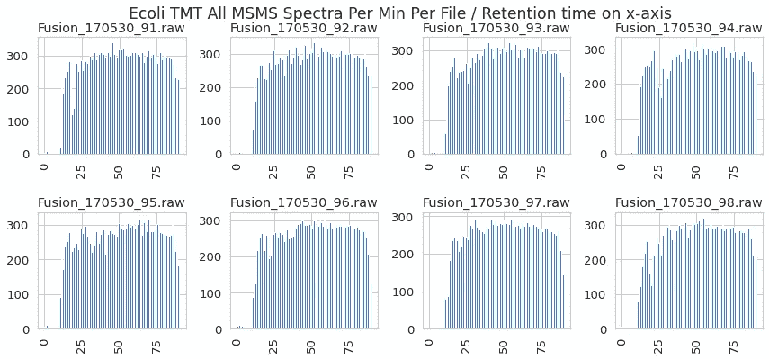
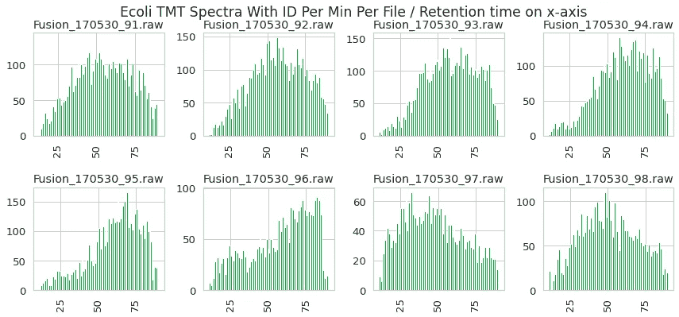
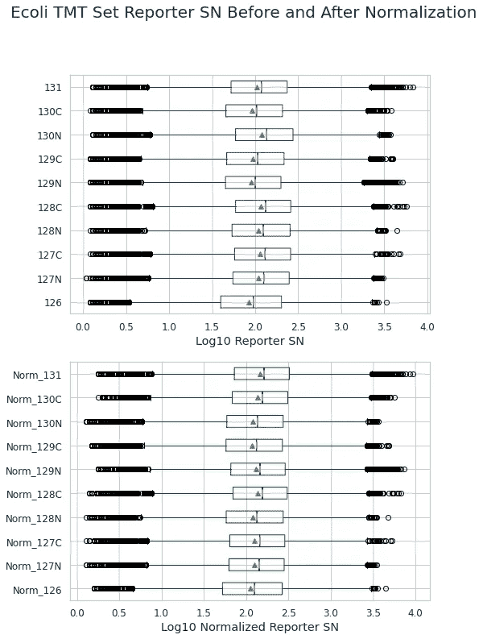
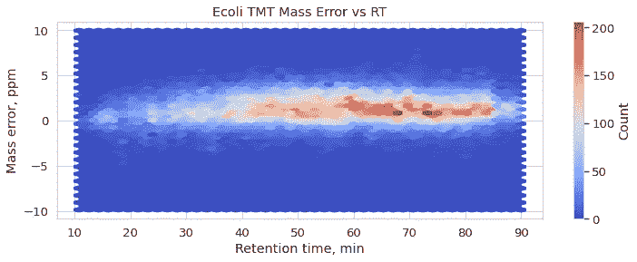
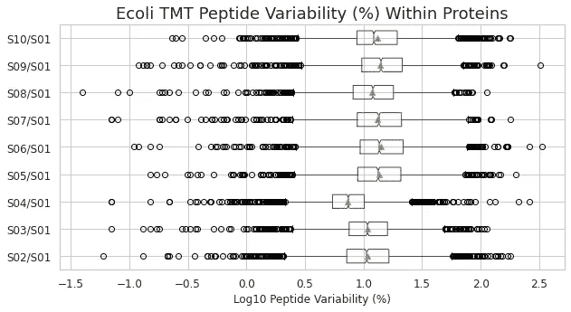
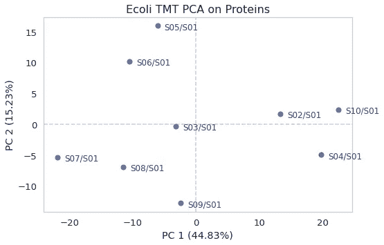

# 用 Python 做蛋白质组学侦探

> 原文：<https://towardsdatascience.com/be-a-proteomic-detective-with-python-6ea18ef3f8f3?source=collection_archive---------28----------------------->

## 在 Jupyter 笔记本中检查同量异位标记蛋白质组学结果的质量


我们应该用我们的质谱数据跟随福尔摩斯和华生的脚步。西德尼·佩吉特的《海滨杂志》(1892)插图，目前[在公共领域](https://en.wikipedia.org/wiki/File:Strand_paget.jpg)

[同量异位标记](https://en.wikipedia.org/wiki/Isobaric_labeling)定量蛋白质组学很复杂，需要大量的样品制备、质谱(MS)采集和数据分析。样品被溶解和增溶，半胱氨酸残基通常被还原和烷基化，蛋白质被消化成肽，肽被同位素标记的试剂标记，通常被分馏和脱盐[1]。而这只是从样品瓶到质谱仪的路径！很多事情都可能出错，因此仔细检查数据的质量非常重要，这些数据将成为生物学和医学结论的基础。

今天，我想分享一个 Jupyter 笔记本，其中包含一系列处理和可视化步骤的 Python 代码，我发现在检查[蛋白质组发现者](https://www.thermofisher.com/se/en/home/industrial/mass-spectrometry/liquid-chromatography-mass-spectrometry-lc-ms/lc-ms-software/multi-omics-data-analysis/proteome-discoverer-software.html) (PD)套件的输出时，这些代码非常方便。它是 PD，因为我们在实验室中使用它，当然，如果输出足够全面，也可以使用其他数据处理管道。完整的笔记本已经上传到 Github 库，这里我将展示一些我认为对了解数据集质量特别有用的图。

本示例数据由 10 份标有[串联质谱标签(TMT)](https://www.thermofisher.com/se/en/home/life-science/protein-biology/protein-mass-spectrometry-analysis/protein-quantitation-mass-spectrometry/tandem-mass-tag-systems.html) 试剂的*大肠杆菌*样本组成，是图林和安德森【2】最近一项[研究的一部分。MS 文件在项目](https://journals.asm.org/doi/full/10.1128/AAC.00612-19) [PXD007647](https://www.ebi.ac.uk/pride/archive/projects/PXD007647) 中公开，可从 PRIDE 档案中获得；我已经下载了原始文件，并使用 PD 2.4 和工作流中的频谱导出器节点对其进行了重新处理。激活所述节点后，输出由一堆制表符分隔的文本文件组成:

```
/PD_Out/PXD007647_Reproc_TMT-set-2_8fracs_QuanSpectra.txt
/PD_Out/PXD007647_Reproc_TMT-set-2_8fracs_SpecializedTraces.txt
/PD_Out/PXD007647_Reproc_TMT-set-2_8fracs_Proteins.txt
/PD_Out/PXD007647_Reproc_TMT-set-2_8fracs_PeptideGroups.txt
/PD_Out/PXD007647_Reproc_TMT-set-2_8fracs_MSMSSpectrumInfo.txt
/PD_Out/PXD007647_Reproc_TMT-set-2_8fracs_PSMs.txt
/PD_Out/PXD007647_Reproc_TMT-set-2_8fracs_ResultStatistics.txt
/PD_Out/PXD007647_Reproc_TMT-set-2_8fracs_ProteinGroups.txt
/PD_Out/PXD007647_Reproc_TMT-set-2_8fracs_InputFiles.txt
/PD_Out/PXD007647_Reproc_TMT-set-2_8fracs_PrSMs.txt
```

让我们看看所选的收藏夹，按照在笔记本中出现的顺序(即任意顺序)。

## 文件 MSMSSpectrumInfo

研究中的标记批次已被分成几个部分，在 MS 上对每个部分进行分析，形成一个单独的文件。有趣的是检查分数是否正常，例如，查看每分钟采集多少碎片光谱:



作者形象

但可能更重要的是每分钟的识别数量。不规则的分布和缺乏标识可能表明，除其他选择外，需要修改分馏方案。在这个项目中，情况相当不错，没有一个文件在很大程度上没有标识，尽管对于某些人来说，配置文件看起来有点扭曲:



作者形象

## 文件全光谱

由于这是一项定量研究，我肯定想检查正常化前后 quan 通道中的值分布(在 PD 中进行)。我们希望看到标准化的通道排列在一个好看且统一的范围内:



作者形象

使用 SN 值的平方根而不是 log 值有助于保持零值，从而更全面地了解强度分布。该数据集没有太多零强度光谱，中位强度似乎在 100 左右，这是很高的。同时，在 *y-* 轴上的刻度显示许多高强度光谱没有指定的肽 id(可以选择“sharey=True”来同等地缩放子图并强调这一点)。


作者形象

## 文件 PSm

由于通常有成千上万的肽谱匹配(PSM ),当试图表示点的密度时，使用六邻体蛋白图可能是一个好主意，参见下面的质量误差图示例。我们可以用非常小且高度透明的单个点来绘制散点图，但是六边形的面元非常清楚地代表了分布。在这个项目中，质量准确度符合要求，集中在百万分之五(ppm)以内:



作者图片

## 文件肽组

在研究同量异位数据集时，我经常检查每种蛋白质中肽定量值的相对标准偏差(RSD ):

在最简单的情况下，我们期望来自蛋白质的肽重复该蛋白质的定量特征。数据集中大多数蛋白质内肽的高变异系数可能是低信号强度(因此，高相对噪声水平)的证据。在我们的例子中，不同样品的平均值和中值 RSD 在 8%和 19%之间，这是相当合理的:



作者图片

半胱氨酸衍生可以影响蛋白质的结构，并影响最终数据集中一些肽的量。如果出现问题，修饰的半胱氨酸肽的相对水平可能较低(对数比<< 0) on a global scale for the affected samples. One of the ways to express that is a clustered heatmap, which is conveniently available via *seaborn* 库。在我们的案例中，不同的肽具有不同的丰度分布，但是没有样品在整个样品的规模上具有低丰度的含半胱氨酸的肽:


作者图片

## 文件蛋白质

古老的主成分分析(PCA)也值得一看。它可以帮助发现异常样本，并检查样本组是否如预期的那样(我还没有为这个项目提取这些信息)。让我们绘制两个主要的主成分，稍微修改默认的 *matplotlib* 散点图，并将解释方差的百分比添加到轴标签:



作者图片

## 摘要

这篇文章介绍了我用来检查蛋白质组发现者的同量异位素标记质谱蛋白质组数据质量的 Jupyter 笔记本。代码和示例数据可以在[的 Github 库](https://github.com/dev-ev/isobaric-inspection-jupyter)中找到。

## 参考

[1] N .劳尼亚尔和 J. R .耶茨，三。[鸟枪法蛋白质组学中基于同量异位标记的相对定量](https://pubs.acs.org/doi/abs/10.1021/pr500880b) (2014)，蛋白质组学研究杂志，13，12，5293–5309。开放访问。

[2] E .图林和 D.I .安德森。[PBP1B 和 LpoB 在 *cysB* 突变株中的上调赋予了*大肠杆菌* (2019)，抗微生物药。化学药剂。](https://journals.asm.org/doi/full/10.1128/AAC.00612-19)，63，10，e 00612–19。开放访问。