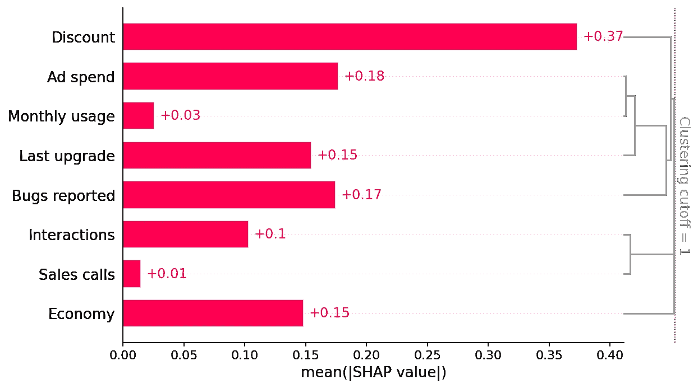
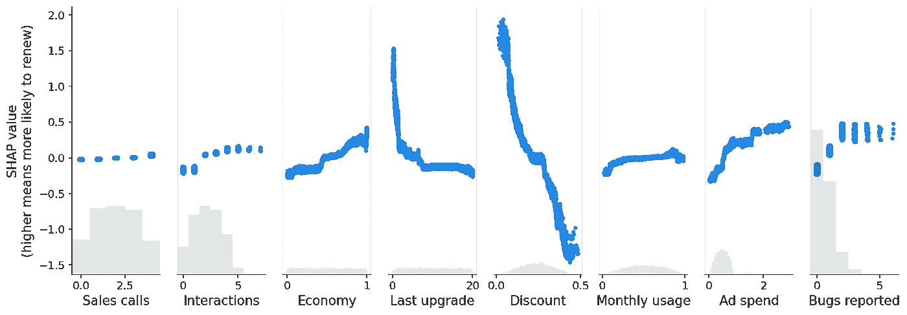
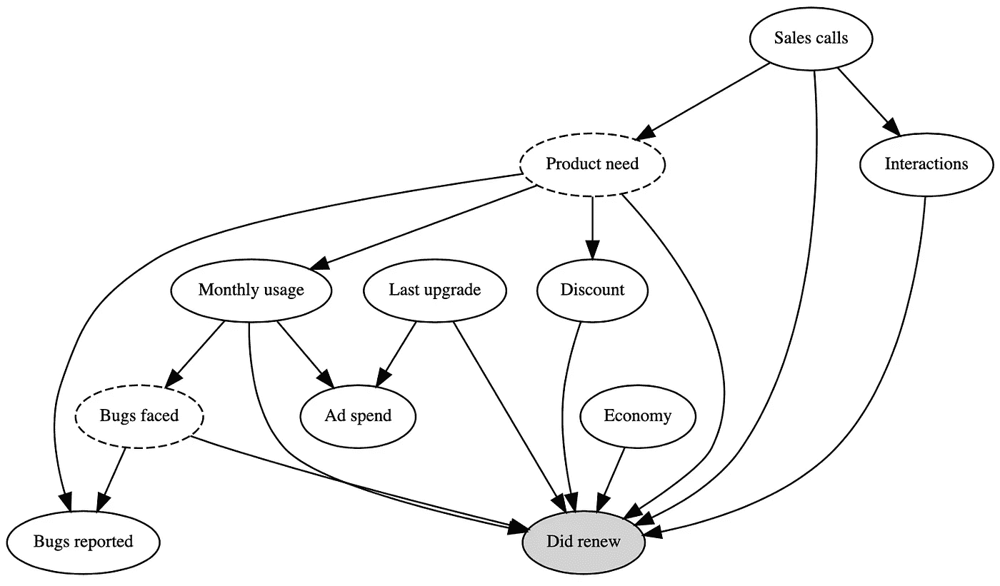
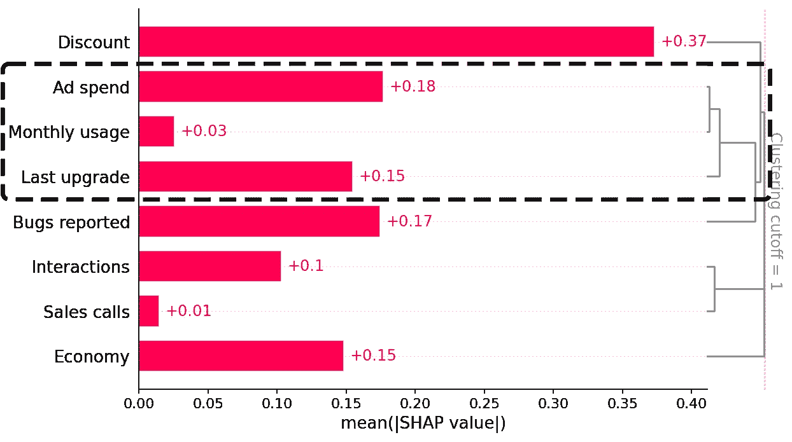
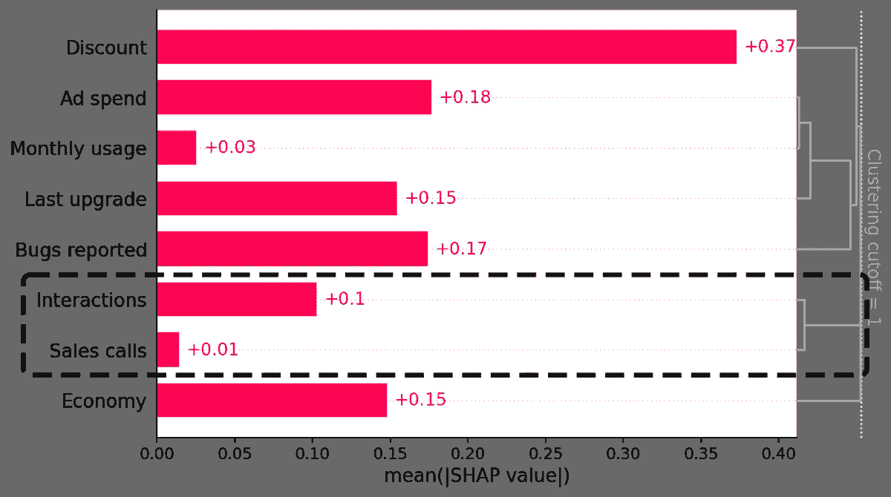
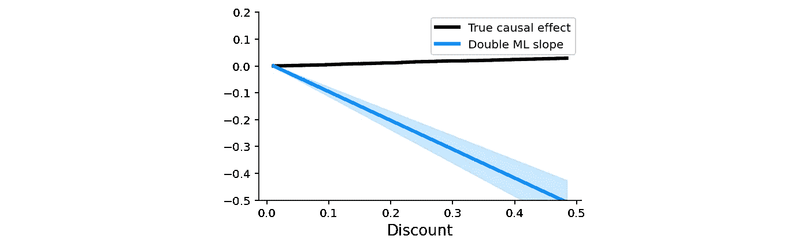

# 在解释预测模型以寻求因果洞察力时要小心

> 原文：<https://towardsdatascience.com/be-careful-when-interpreting-predictive-models-in-search-of-causal-insights-e68626e664b6?source=collection_archive---------1----------------------->

## [思想和理论](https://towardsdatascience.com/tagged/thoughts-and-theory)

## 对试图从现代预测机器学习模型中提取因果洞察力的陷阱进行了仔细的探索。


斯科特·伦德伯格/伊尔克切利克-伊斯托克

*与来自微软的 Eleanor Dillon、Jacob LaRiviere、Jonathan Roth 和 Vasilis Syrgkanis 关于因果关系和可解释机器学习的联合文章。*

像 XGBoost 这样的预测性机器学习模型在与 SHAP 这样的可解释性工具搭配时变得更加强大。这些工具可识别输入要素和预测结果之间最具信息性的关系，这对于解释模型的作用、获得利益相关方的认可以及诊断潜在问题非常有用。很容易将这种分析向前推进一步，并假设解释工具也可以识别决策者如果想要在未来改变结果应该操纵什么特征。然而，**在这篇文章中，我们讨论了使用预测模型来指导这种政策选择经常会产生误导。**

原因与*相关*和*因果*的根本区别有关。SHAP 将预测性 ML 模型获得的相关性透明化。但是，让相关性变得透明并不能让它们成为因果关系！所有的预测模型都隐含地假设每个人在未来都将保持同样的行为方式，因此相关模式将保持不变。为了理解如果有人开始表现不同会发生什么，我们需要建立因果模型，这需要做出假设并使用因果分析工具。

# 订户保留示例

假设我们的任务是构建一个模型来预测客户是否会续订产品。让我们假设，经过一番挖掘，我们设法获得了对预测客户流失很重要的八个特征:客户折扣、广告支出、客户每月使用量、上次升级、客户报告的错误、与客户的互动、与客户的销售电话以及宏观经济活动。然后，我们使用这些功能来训练一个基本的 XGBoost 模型，以预测客户是否会在订阅到期时续订:

```
X, y = user_retention_dataset()
model = fit_xgboost(X, y)
```

一旦我们有了 XGBoost 客户保持模型，我们就可以开始探索它从像 SHAP 这样的可解释性工具中学到了什么。我们从绘制模型中每个特征的全局重要性开始:

```
explainer = shap.Explainer(model)
shap_values = explainer(X)clust = shap.utils.hclust(X, y, linkage="single")
shap.plots.bar(shap_values, clustering=clust, clustering_cutoff=1)
```



该条形图显示，提供的折扣、广告支出和报告的错误数量是驱动模型预测客户保留率的三大因素(它还包括我们稍后将使用的功能冗余聚类)。这很有趣，乍看起来很合理。

然而，当我们更深入地研究改变每个特征的值如何影响模型的预测时，我们发现了一些不直观的模式。SHAP 散点图显示了更改特性值如何影响模型对更新概率的预测。如果蓝点遵循递增模式，这意味着特征越大，模型的预测更新概率越高。

```
shap.plots.scatter(shap_values)
```



# 预测任务与因果任务

散点图显示了一些令人惊讶的发现:

*   报错多的用户更有可能续费！
*   折扣较大的用户不太可能续约！

我们反复检查我们的代码和数据管道以排除错误，然后与一些业务合作伙伴交流，他们给出了直观的解释:

*   重视产品的高使用率用户更有可能报告错误并更新他们的订阅。
*   销售人员倾向于给他们认为对产品不太感兴趣的客户高折扣，这些客户的流失率更高。

模型中这些起初与直觉相反的关系是个问题吗？那取决于我们的目标是什么！

我们这个模型的最初目标是预测客户保持率，这对于像为财务规划估计未来收入这样的项目很有用。由于用户报告的错误越多，更新的可能性就越大，在模型中捕捉这种关系有助于预测。只要我们的模型具有良好的样本外拟合，我们就应该能够为金融提供良好的预测，因此不应该担心模型中这种关系的方向。

这是一类称为**预测任务**的任务的例子。在预测任务中，目标是在给定一组特征`X`的情况下预测结果`Y`(例如更新)。预测练习的一个关键组成部分是，我们只关心预测`model(X)`在类似于我们的训练集的数据分布中接近`Y`。`X`和`Y`之间的简单关联有助于这类预测。

然而，假设第二个团队选择了我们的预测模型，新的目标是确定我们公司可以采取什么行动来留住更多的客户。这个团队非常关心每个`X`特性如何与`Y`相关联，不仅仅是在我们的培训分布中，还包括世界变化时产生的*反事实*场景。在这种用例中，识别变量之间的稳定相关性已经不够了；这个团队想知道操作特征`X`是否会导致`Y`的变化。想象一下当你告诉工程主管你想让他引入新的 bug 来增加客户更新时他的表情！

这是一类叫做**因果任务**的任务的例子。在因果任务中，我们想知道改变世界的一个方面`X`(例如报告的错误)如何影响结果`Y`(更新)。在这种情况下，关键是要知道改变`X`是否会导致`Y`增加，或者数据中的关系是否仅仅是相关的。

# 估计因果效应的挑战

理解因果关系的一个有用工具是写下我们感兴趣的数据生成过程的因果图。我们的示例中的因果图说明了为什么我们的 XGBoost 客户保留模型获得的稳健预测关系不同于团队感兴趣的因果关系，该团队希望计划干预以增加保留。这个图只是真实数据生成机制的总结(可以在本文的[笔记本版本](https://shap.readthedocs.io/en/latest/example_notebooks/overviews/Be%20careful%20when%20interpreting%20predictive%20models%20in%20search%20of%20causal%C2%A0insights.html)中找到)。实心椭圆表示我们观察到的特征，而虚线椭圆表示我们不测量的隐藏特征。每一个特征都是一个带有箭头的所有特征的函数，外加一些随机效果。

在我们的例子中，我们知道因果图，因为我们模拟数据。在实践中，真正的因果图是未知的，但是我们可以使用关于世界如何工作的上下文特定的领域知识来推断哪些关系可以或不可以存在。



在这个图表中有许多关系，但是第一个重要的关注点是我们可以测量的一些特征受到**不可测量的混杂特征**的影响，比如产品需求和面临的缺陷。例如，报告更多错误的用户会遇到更多的错误，因为他们使用产品的次数越多，他们也更有可能报告这些错误，因为他们更需要产品。产品需求对更新有直接的因果影响。因为我们不能直接测量产品需求，我们最终在预测模型中捕捉到的缺陷报告和更新之间的相关性结合了所面临的缺陷的小的负面直接影响和来自产品需求的大的正面混杂影响。下图描绘了我们示例中的 SHAP 值与每个特征的真实因果关系(由于我们生成了数据，所以在此示例中是已知的)。


预测模型捕捉了报告的错误对保留的总体积极影响(如 SHAP 所示)，即使报告错误的因果影响为零，而发现错误的影响是负面的。

我们在折扣方面也看到了类似的问题，这也是由未被观察到的客户对产品的需求所驱动的。我们的预测模型发现折扣和保留率之间存在负相关关系，这是由这种与未观察到的特征(产品需求)的相关性驱动的，尽管实际上折扣对续订有很小的正面因果影响！换句话说，如果两个客户有相同的产品需求，并且在其他方面相似，那么折扣较大的客户更有可能续订。

当我们开始将预测模型解释为因果关系时，这个图还揭示了第二个更隐蔽的问题。请注意，广告支出也有类似的问题——它对保留没有因果关系(黑线是平的),但预测模型显示出积极的影响！

在这种情况下，广告支出只受上次升级和每月使用量的驱动，因此我们不存在*未观察到的*混淆问题，而是存在*观察到的*混淆问题。在广告花费和影响广告花费的特征之间存在统计冗余。当我们通过几个特征获得相同的信息时，预测模型可以使用这些特征中的任何一个进行预测，即使它们并不都是因果关系。虽然广告支出对更新本身没有因果关系，但它与推动更新的几个特征密切相关。我们的正则化模型将广告支出确定为一个有用的预测因素，因为它总结了多个因果驱动因素(因此导致了一个更稀疏的模型)，但如果我们开始将它解释为因果效应，那就变得严重误导了。

我们现在将依次处理我们例子中的每一个部分，以说明预测模型何时能够准确地测量因果关系，何时不能。我们还将介绍一些因果工具，这些工具有时可以在预测模型失败的情况下估计因果影响。

# 当预测模型可以回答因果问题时

让我们从例子中的成功开始。请注意，我们的预测模型很好地捕捉了经济特征的真实因果效应(更好的经济对保留有积极影响)。那么，我们什么时候才能期待预测模型捕捉到真正的因果效应呢？

允许 XGBoost 获得良好的经济因果效应估计的重要因素是特性的**强独立分量**(在此模拟中)；它对记忆的预测能力与任何其他可测量的特征或任何不可测量的混杂因素相比并没有很大的冗余。因此，它不受未测量的混杂因素或特征冗余的影响。


经济性与其他测量特征无关。

由于我们已经在 SHAP 条形图的右侧添加了聚类，我们可以将数据的冗余结构视为一个树状图。当特征在树状图的底部(左侧)合并在一起时，这意味着这些特征包含的关于结果(更新)的信息是非常多余的，并且模型可能已经使用了任一特征。当特征在树状图的顶部(右侧)合并在一起时，意味着它们包含的关于结果的信息是相互独立的。

通过注意到经济直到聚类树状图的最顶端才与任何其他特征合并，我们可以看到经济独立于所有其他测量的特征。这告诉我们，经济不会遭受观察混淆。但是，要相信经济效应是因果关系，我们还需要检查未观察到的混淆。检查不可测量的混杂因素更加困难，并且需要使用领域知识(在上面的例子中由业务伙伴提供)。

对于提供因果结果的经典预测 ML 模型，特征不仅需要独立于模型中的其他特征，还需要独立于未观察到的混杂因素。很难找到感兴趣的驱动因素自然表现出这种独立性的例子，但当我们的数据包含一些实验时，我们经常可以找到独立特征的例子。

# 当预测模型不能回答因果问题，但因果推断方法可以帮助

在大多数真实世界的数据集中，特征不是独立的和无根据的，因此标准预测模型将不会了解真正的因果关系。因此，用 SHAP 解释它们不会揭示因果关系。但是并不是一切都完了，有时我们可以使用观察因果推理的工具来解决或者至少最小化这个问题。

## 观察混杂

因果推理有帮助的第一种情况是观察混淆。当有另一个特征对原始特征和我们预测的结果都有因果影响时，这个特征就是“混杂的”。如果我们可以测量另一个特征，它被称为*观察混杂*。



每月使用和最后升级的广告花费是非常多余的。

我们场景中的一个例子是广告支出特性。尽管广告支出对保留没有直接的因果影响，但它与上次升级和每月使用功能相关，而这些确实会推动保留。我们的预测模型将广告支出确定为保留率的最佳单一预测指标之一，因为它通过相关性捕捉了如此多的真正因果驱动因素。XGBoost 强加了*正则化*，这是一种奇特的说法，它试图选择仍然预测良好的最简单的可能模型。如果使用一个特征而不是三个特征也能预测得一样好，它会倾向于这样做以避免过度拟合。但这意味着，如果广告支出与上次升级和每月使用量高度相关，XGBoost 可能会使用广告支出而不是因果特征！XGBoost(或任何其他具有正则化的机器学习模型)的这一属性对于生成未来保持力的鲁棒预测非常有用，但对于理解如果我们想要增加保持力，我们应该操纵哪些特征却不是很好。

这突出了为每个问题匹配正确的建模工具的重要性。与错误报告的例子不同，增加广告支出会增加用户保留率的结论在直觉上没有错。如果没有适当关注我们的预测模型是什么，而不是什么，我们可能会很容易地继续这一发现，并在增加广告支出后才知道我们的错误，没有得到我们预期的更新结果。

## 观察因果推理

对广告支出来说，好消息是我们可以衡量所有可能混淆它的特征(在上面的因果图中，这些特征带有指向广告支出的箭头)。因此，这是一个观察到混淆的例子，我们应该能够仅使用我们已经收集的数据来解开相关模式；我们只需要从观察因果推断中使用正确的工具。这些工具允许我们指定哪些特征会混淆广告支出，然后针对这些特征进行调整，以获得广告支出对产品更新的因果影响的**无根据**估计。

一个特别灵活的观察因果推理工具是双/去偏机器学习。它使用您想要的任何机器学习模型，首先去发现感兴趣的特征(即广告支出)，然后估计改变该特征的平均因果效应(即因果效应的平均斜率)。

双 ML 的工作方式如下:

1.  使用一组可能的混杂因素(即，不是由广告花费引起的任何特征)训练模型来预测感兴趣的特征(即，广告花费)。
2.  使用同一组可能的混杂因素训练一个模型来预测结果(即确实更新)。
3.  使用感兴趣的因果特征的残差变异来训练模型以预测结果的残差变异(减去我们的预测后剩余的变异)。

直觉是，如果广告支出导致更新，那么不能被其他混杂特征预测的广告支出部分应该与不能被其他混杂特征预测的更新部分相关。换句话说，double ML 假设存在影响广告花费的独立(未观察到的)噪声特征(因为广告花费并不完全由其他特征决定)，因此我们可以估算该独立噪声特征的值，然后在该独立特征上训练模型以预测输出。

虽然我们可以手动完成所有双 ML 步骤，但使用像 econML 或 causaml 这样的因果推理包更容易。这里我们用的是 econML 的 LinearDML 模型(详见[笔记本](https://shap.readthedocs.io/en/latest/example_notebooks/overviews/Be%20careful%20when%20interpreting%20predictive%20models%20in%20search%20of%20causal%C2%A0insights.html))。这将返回一个 P 值，表明该治疗是否具有非零因果效应，并且在我们的场景中运行良好，正确地识别出没有证据表明广告支出对更新有因果效应(P 值= 0.85):


请记住，双最大似然(或任何其他观察因果推断方法)只有在您可以测量和识别您想要估计因果效应的特征的所有可能混杂因素时才有效。这里我们知道因果图，可以看到每月使用量和上次升级是我们需要控制的两个直接混杂因素。但是，如果我们不知道因果图，我们仍然可以查看 SHAP 条形图中的冗余，并看到每月使用量和上次升级是最冗余的功能，因此是控制的良好候选项(折扣和报告的错误也是如此)。

## 非混淆冗余

因果推理有帮助的第二种情况是非混淆冗余。当我们想要因果效应的特征驱动模型中包含的另一个特征，或者被另一个特征驱动，但是该另一个特征不是我们感兴趣的特征的混杂因素时，就会发生这种情况。



销售拜访功能就是一个例子。销售电话会直接影响客户保持，但也会通过互动间接影响客户保持。当我们在模型中同时包含交互和销售拜访功能时，这两种功能共享的因果关系被迫在它们之间展开。我们可以在上面的 SHAP 散点图中看到这一点，它显示了 XGBoost 如何低估了销售电话的真正因果影响，因为大部分影响都放在了交互功能上。

非混杂冗余原则上可以通过去除模型中的冗余变量来固定(见[笔记本](http://localhost:9999/notebooks/shap/notebooks/overviews/Be%20careful%20when%20interpreting%20predictive%20models%20in%20search%20of%20causal%C2%A0insights.ipynb))。例如，如果我们将互动从模型中移除，那么我们将获得销售电话对续订概率的全部影响。这种移除对于双 ML 也很重要，因为如果控制由感兴趣的特征引起的下游特征，双 ML 将不能捕捉间接因果效应。在这种情况下，double ML 将只测量不通过其他特征的“直接”效果。然而，双 ML 对于控制上游非混杂冗余(冗余特征引起感兴趣特征)是稳健的，尽管这将降低您检测真实效应的统计能力。

不幸的是，我们通常不知道真正的因果图，因此很难知道另一个特征何时对我们感兴趣的特征是冗余的，因为观察到了混杂与非混杂冗余。如果是因为混淆，那么我们应该使用像 double ML 这样的方法来控制该特征，而如果是下游结果，那么如果我们想要完全的因果影响而不仅仅是直接影响，我们应该从我们的模型中删除该特征。控制一个我们不应该控制的特征往往会隐藏或分割因果关系，而未能控制一个我们应该控制的特征往往会推断出不存在的因果关系。当你不确定的时候，这通常使控制一个特性成为更安全的选择。

# 当预测模型和非发现方法都不能回答因果问题时

双最大似然法(或任何其他假设未发现的因果推断方法)仅在您可以测量和识别您想要估计因果效应的特征的所有可能混杂因素时才有效。如果你不能测量所有的混杂因素，那么你就处于最困难的情况:未被观察到的混杂因素。


折扣和 bug 报告功能都受到未观察到的混淆的影响，因为并非所有重要的变量(例如，产品需求和面临的 bug)都在数据中进行了测量。尽管这两个功能相对独立于模型中的所有其他功能，但仍有一些重要的驱动因素无法衡量。在这种情况下，需要观察混杂因素的预测模型和因果模型(如 double ML)都将失败。这就是为什么 double ML 估计了折扣特征的一个很大的负因果效应，即使在控制所有其他观察到的特征时也是如此:



除非能够测量先前未测量的特征(或与其相关的特征)，否则很难在未观察到的混杂因素中找到因果关系。在这些情况下，识别能够为政策提供信息的因果效应的唯一方法是创建或利用一些随机化，打破感兴趣的特征和不可测量的混杂因素之间的相关性。在这种情况下，随机实验仍然是寻找因果关系的黄金标准。

基于工具变量、差异中的差异或回归不连续性原理的专门因果工具有时可以利用部分随机化，即使在不可能进行完整实验的情况下。例如，在我们无法随机指定治疗方法的情况下，可以使用工具变量技术来确定因果关系，但我们可以随机推动一些客户接受治疗，如发送电子邮件鼓励他们探索新产品功能。当新的治疗方法在不同组间交错引入时，差异中的差异方法可能是有帮助的。最后，当治疗模式表现出明显的截止点时，回归不连续性方法是一个很好的选择(例如，基于特定的、可测量的特征(如每月收入超过 5000 美元)的治疗资格)。

# 摘要

像 XGBoost 或 LightGBM 这样灵活的预测模型是解决*预测*问题的强大工具。然而，它们不是固有的因果模型，因此用 SHAP 解释它们将无法准确回答许多常见情况下的*因果*问题。除非模型中的特征是实验变化的结果，否则在不考虑混杂因素的情况下将 SHAP 应用于预测模型通常不是一个合适的工具来测量用于为政策提供信息的因果影响。SHAP 和其他可解释性工具可以用于因果推理，SHAP 被集成到许多因果推理包中，但那些用例本质上是明确的因果关系。为此，使用我们将为预测问题收集的相同数据，并使用像 double ML 这样专门设计来返回因果影响的因果推断方法，通常是为政策提供信息的好方法。在其他情况下，只有实验或其他随机来源才能真正回答*如果*的问题。因果推断总是需要我们做出重要的假设。本文的主要观点是，我们通过将正常的预测模型解释为因果关系而做出的假设通常是不现实的。