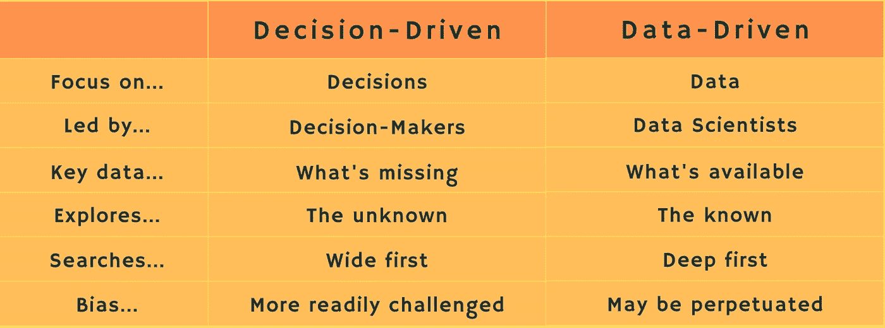

# 由决策驱动，而不是数据驱动

> 原文：<https://towardsdatascience.com/be-decision-driven-not-data-driven-d12b9b7edd8b?source=collection_archive---------24----------------------->

## 在你的合作决策过程中需要考虑的七点

[杰瑞米·帕金斯](https://unsplash.com/@jeremyperkins?utm_source=unsplash&utm_medium=referral&utm_content=creditCopyText)上[的 Unsplash](https://unsplash.com/s/photos/ponder?utm_source=unsplash&utm_medium=referral&utm_content=creditCopyText)

科技媒体痴迷于数据。但是在对企业数据素养进行了八年的测量后，只有 24%的公司[报告](https://c6abb8db-514c-4f5b-b5a1-fc710f1e464e.filesusr.com/ugd/e5361a_76709448ddc6490981f0cbea42d51508.pdf)已经达到了数据驱动的涅槃。这比去年少了*家公司。*

也许数据驱动是错误的目标。

研究者 Bart de Langhe 和 Stefano Puntoni 是这样认为的。他们[主张](https://sloanreview.mit.edu/article/leading-with-decision-driven-data-analytics/)变成*决策*驱动，而不是*数据*驱动。

这种区别似乎很小，但事实并非如此。这就像共产主义者对资本家，民主党人对共和党人，或者红袜队对扬基队球迷。

决策文化并不像说波士顿是一个比纽约更好的体育城市那样一成不变。数据科学既是创造性的，也是技术性的，就像盖房子一样——建筑师、设计师、建筑商和管道工必须一起工作。起初，架构师领导；在施工阶段，建筑商主导，在完工阶段，设计主导；房主是最终的决策者。

决策驱动的思维在七个方面不同于数据驱动的方法:

1.  **从问题**开始，**不是数据。**决策驱动思维花更多时间设计问题。测题两遍，切数据一遍！
2.  **决策者领导项目，而不是数据科学家**。房主设定基调，而不是建筑商。
3.  思考未知多于已知。在零售业，一个常见的数据驱动项目找出如何优化忠诚度计划；决策驱动型思维首先探究是什么让客户犹豫不决。
4.  **先看宽，*再*潜深**。数据驱动的团队经常一头扎进他们已经拥有的数据池。Puntoni 和 de Lange 建议决策优先团队“先宽后窄”
5.  构建新的数据盒子。当你开始提问时，你会很快发现你丢失了数据。以决策为中心的团队可以更快地确定对新调查、模拟或第三方数据的需求。
6.  **定位并减少偏差**。通过预先接纳更广泛的团队，决策导向的团队往往更加多样化。多样性有助于通过质疑假设来根除偏见。
7.  **不是后视镜。**数据驱动思维从历史数据开始，说明已经发生的事情。虽然过去可能只是序幕，但疫情之前的模式可能不再适用。

巴勃罗·毕加索说:“计算机的问题在于它们所能做的只是提供答案。”他的信息很深刻:不要让技术领先；领导你的技术。由决策驱动，而不是数据驱动。

马克·帕尔默(www.techno-sapien.com)