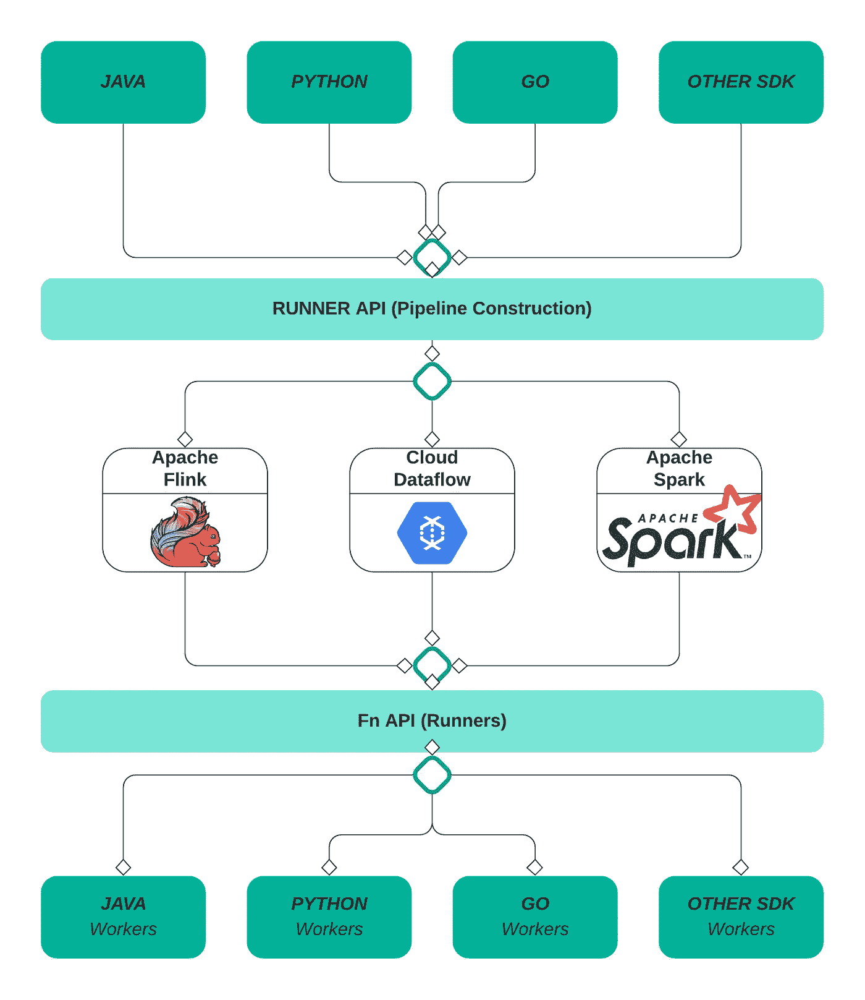
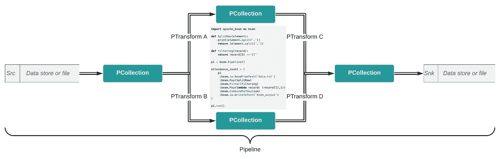
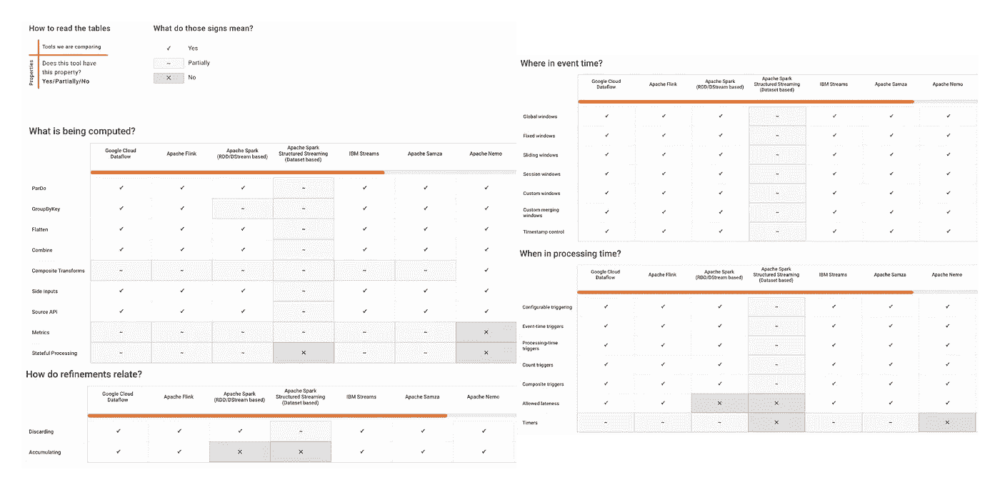
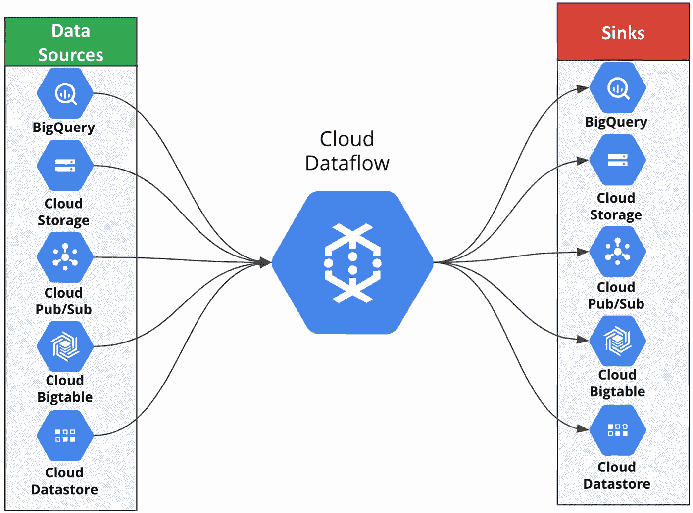

# 在谷歌数据流上传送(批量+流)你的数据管道

> 原文：<https://towardsdatascience.com/beam-batch-stream-your-data-pipelines-on-google-dataflow-2e3230bcdc21?source=collection_archive---------23----------------------->

## Apache Beam 是批处理和流处理的统一编程模型

# 为什么需要数据管道？

在 21 世纪，大多数企业依靠可扩展的平台&服务或产品的数据化来保持市场竞争力。随着来自不同来源、具有不同数量、速度和种类的数据激增，企业需要新的数据战略。因此，需要数据管道将所有不同来源的数据整合到一个共同的目的地，以进行快速分析，或者在连接的应用程序和系统之间处理和传输数据。

因此，组织开始根据其业务需求部署批处理或流式管道。

P

**批量处理:**

*   与有界数据集一起使用。
*   在一段时间内收集一组数据，然后一次性处理。
*   更关心吞吐量而不是延迟。
*   用例:寻找一家银行的忠实客户；折扣后的销售差额等。

**流处理:**

*   用于未绑定的数据集。
*   数据一生成就被馈送到处理引擎。
*   更关心延迟而不是吞吐量。
*   用例:股市情绪分析；实时检测欺诈交易、物联网设备等。

R 例如，在 Spark 中，rdd/data frame 用于批处理，而您需要为流处理编写数据流。因此，他们需要维护两个不同的流水线以及各自的执行引擎，这不仅增加了总的维护开销，而且将它们与相关的执行引擎锁定在一起。

为了缓解这些挑战，谷歌孵化了一个数据流模型，可以应用于有界和无界数据集，然后将其 SDK 捐赠给 Apache 基金会。

从那时起，贡献者社区培育了它，因此，我们有了" [Apache Beam](https://beam.apache.org/get-started/beam-overview/) "一个统一的编程模型，它易于使用，对流和批处理工作流进行数据并行处理，最重要的是平台独立性(可移植，支持多个运行程序)，以消除任何 API 锁定。

> **Apache Beam** 是批处理&流处理的统一编程模型，抽象层允许用任何语言(Java、Python、Go 等)创建。)并且可以在 Google Cloud Dataflow、Spark、Flink 等任何执行框架上执行。

# 阿帕奇波束的体系结构；

作者的 Apache Beam 架构

*   使用您选择的编程语言 SDK——Java、Python 或 Go——编写管道。
*   Beam / Runner API 将其转换为可由执行引擎使用的语言通用标准。
*   Fn API 提供了特定于语言的 SDK 工作器，这些工作器充当嵌入到管道中作为函数规范的 UDF 的 RPC 接口。
*   选定的运行器在底层资源上执行流水线，正确选择运行器是高效执行的关键。

# Apache 射束工作流程:

作者的 Apache 工作流

**:Pipeline:**封装了从开始到结束的数据处理任务，包括读取 I/P 数据、转换和写入 O/P 数据。

**PCollection:** 波束流水线操作的分布式数据集。它可以是有界的，也可以是无界的。它本质上是不可变的，因此，对 PCollection 的任何转换都会创建一个新的 PCollection。

**PTransform:** 表示应用于 PCollection 的数据处理操作或转换步骤。

**I/O Sink&Sources:**Source 和 Sink APIs 提供了将数据读入集合或从集合中写出的函数。

# 阿帕奇波束能力矩阵；

Apache Beam 的主要优势是它的可移植 API 层，可以跨多种执行引擎或运行程序执行。因为它为不同的赛跑者提供了在技术创新上竞争的公平场所，这些技术创新提供了更好的性能、可靠性、操作管理的简易性等。因此，Apache 发布了一个能力矩阵，将不同跑步者的能力按照其相应的“什么/哪里/何时&如何”问题进行分组:

**参考:** [**阿帕奇波束能力矩阵**](https://beam.apache.org/documentation/runners/capability-matrix/) **来自 Apache.org**

> 在图表中，你可以看到谷歌云数据流运行检查所有主要功能，但这不是我认为谷歌云数据流是推荐选择的唯一原因。

# 那么，为什么谷歌云数据流？

首先，谷歌对开源及其社区的承诺无与伦比。自 2016 年以来，谷歌已经为 15，000 多个开源项目做出了贡献，通过云数据流，谷歌甚至减轻了其设置、维护和扩展所需的开销，以高效执行复杂的大规模连续作业，方法是提供:

*   完全托管的无服务器服务。
*   自动优化管道，如使用的工人数量，将数据流拆分到关键空间，并并行处理它们。
*   Liquid Sharding(动态工作再平衡)可根据作业管道的需求动态调整工作人员的数量。
*   用于批处理的低价灵活资源调度(FlexRS ),保证在 6 小时的窗口内执行。
*   内置的实时人工智能功能允许构建智能解决方案，如预测分析、异常检测等。
*   开箱即用集成到谷歌云资源的其余部分，实现无缝连接。

**作者的 Google Cloud 原生数据源和数据流接收器**

# 结论

在这里，我向您概述了 Apache Beam 编程模型，以及为什么 Google Cloud Dataflow 实际上应该是它的运行者，如果您还在阅读这篇文章，我相信您对探索 Apache Beam 的下一个数据管道非常感兴趣，或者希望在一个统一的、独立于平台的模型中转变现有的管道。所以为什么停止，不久我将发布一个实际的场景及其实现，以便更好地理解。

**同时，这里有一些我提到的资源，你也应该浏览一下，以便更深入地理解:**

*   [阿帕奇光束文档](https://beam.apache.org/documentation/basics/)
*   [数据流模型](https://static.googleusercontent.com/media/research.google.com/en//pubs/archive/43864.pdf)
*   [阿帕奇波束能力矩阵](https://beam.apache.org/documentation/runners/capability-matrix/)
*   [数据流模板](https://cloud.google.com/dataflow/docs/guides/templates/provided-templates):谷歌提供数据流模板，让你从加速学习开始。