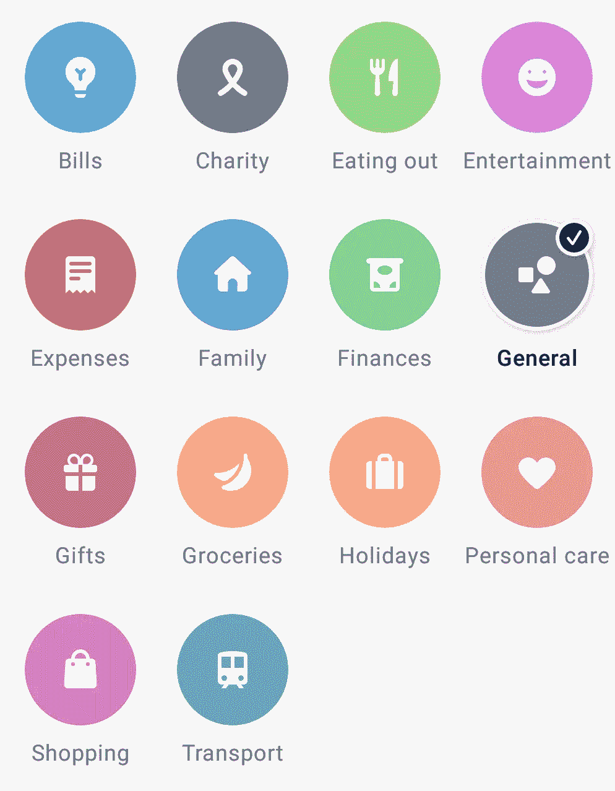
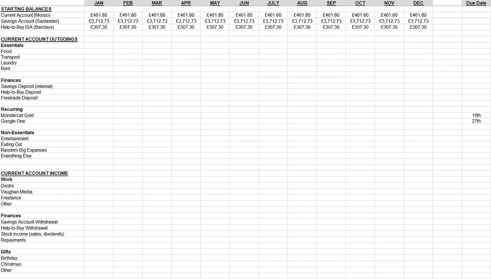

# 用 Python、熊猫和财务规划打败我的银行

> 原文：<https://towardsdatascience.com/beating-monzo-plus-with-python-and-pandas-83cb066c1b95?source=collection_archive---------43----------------------->

## 我如何用编程超越英国银行的新星

图片来自 [StockSnap](https://stocksnap.io)

大约两年前，我开始在 Monzo 银行工作，当时我发现这家完全在线的银行非常有趣——看不到任何高街位置。即使是现在，我也对这些纯数字银行取得的成就印象深刻，它们拥有储蓄罐和交易分类等有用的功能。

老实说，直到最近，我还不太在意 Monzo 根据供应商对交易进行自动分类的能力，但自从开始大学生活以来，管理财务对我来说变得重要多了。我决定仔细看看这个特性，虽然它很酷，但我对选项的缺乏感到非常失望。

作者图片

不要误会我的意思，Monzo 的类别选择是好的，但明显缺乏一些重要的选项，如“租赁”或“定期订阅”或类似的。当然，这两项实际上都可以归入“账单”项下，但其他像洗衣服这样乞讨的学生必须支付的费用呢？当然没有这个类别，而“费用”可以是任何东西。

我感到有点挫败，于是就建立了一个电子表格，每周花一个小时左右查看我的交易，填写表格，合计我每个月在不同东西上花了多少钱。我最终为我的三个主要账户——我的 Monzo 账户、我的学生银行账户和我的帮助购买 ISA——配置了电子表格，并设置了一些 Excel 公式，如果我向另一个账户转账，就会自动从一个账户中扣除，等等。

作者图片

这在一段时间内运行良好，虽然我仍然对 Monzo 没有默认提供类似的功能感到不高兴，但我还是继续使用该银行。

然而，2020 年 7 月，当 Monzo 为他们的银行账户引入一个新功能时，一切都改变了，这个功能可以同时解决我的问题并产生一个新问题，而且是一个相当大的问题。

你看，2020 年 7 月 15 日，Monzo 发布了 Monzo Plus，这是一种新型账户，提供了许多好处，包括虚拟卡、更多利息，你猜对了，还有自定义类别。

当然，Monzo Plus 的问题在于它是一项付费服务。这不是很多——一个月只有 5 英镑——但是作为一个破产的大学本科生，支付这个不是一个选择。我拒绝再保持沉默了。

在一阵绝对的愤怒中，我冲向我的电脑，设置了一个 virtualenv，打开 PyCharm，开始愤怒地敲键盘。不久后，我有了一个基本的程序，它可以处理我从 Monzo 应用程序下载的 CSV 交易，让我对它们进行分类，然后，如果我愿意，可以存储一个供应商名称分类图，这样我就不必每次都处理每笔交易。然后，我使用 openpyxl 模块将每个类别的总数插入到我已经在使用的电子表格中。

这很棒，随着时间的推移，我对它进行了更新，以存储任何成功解析的事务的事务 ID，这样，在多次使用该软件时，它就不会对同一事务进行两次计数。

实际上，该程序所做的只是将交易数据的 CSV 读入 pandas 数据帧，询问用户交易属于哪一类，将其插入数据帧，并对所有数据进行合计。自然，有很多用户输入检查和后退的废话，但这是它的一般要点。

然而，故事并没有就此结束。有一天，我和我的一个朋友谈到了这个问题，他也在 Monzo 银行工作，他提到他也会发现这样一个程序很有用，但需要它处理不同的类别，并将数据插入到电子表格的不同行中。

因此，我重写了部分内容，从 TXT 文件中提取自定义类别名称和电子表格行，并想“如果他会觉得有用，也许其他人也会觉得有用。”

我最终把这个项目上传到了 GitHub，并扩展了对所有银行的支持，增加了一些功能来改善用户体验。如果您有兴趣检查这个项目或者自己使用它，您可以在 GitHub 上找到它:

 [## isaacharrisholt/vorn-财务跟踪系统

### Vorn Finance Tracker 是一个 Python 程序，可以对你的收入和支出进行分类，并将数据写入一个…

github.com](https://github.com/isaacharrisholt/vorn-finance-tracker) 

***感谢阅读到底！如果你喜欢这篇文章或者觉得它有用，请告诉我。非常感谢任何反馈！***