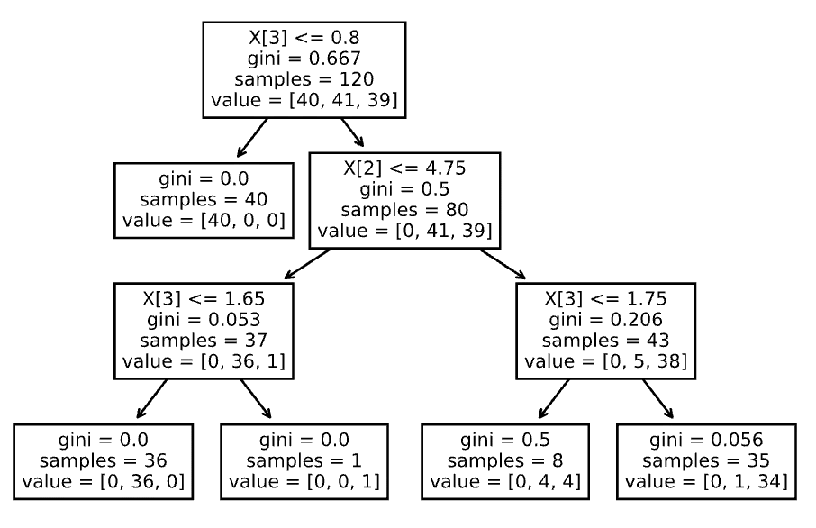
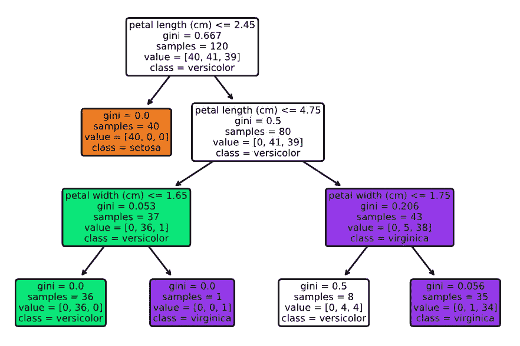
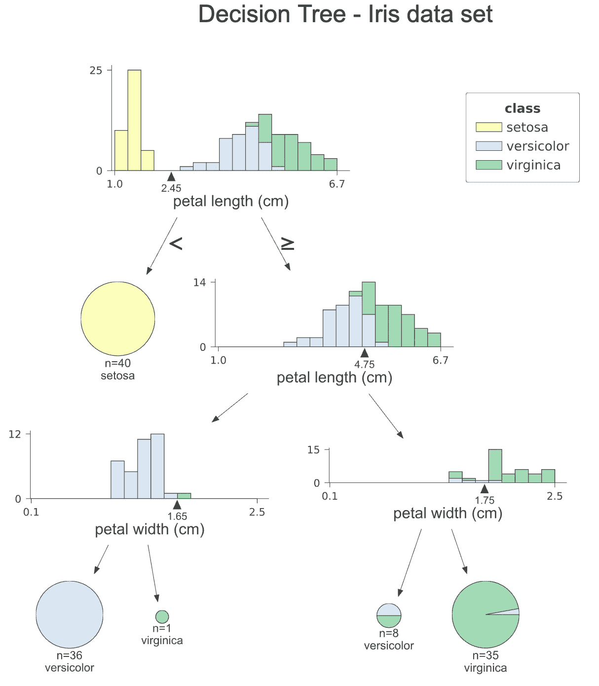
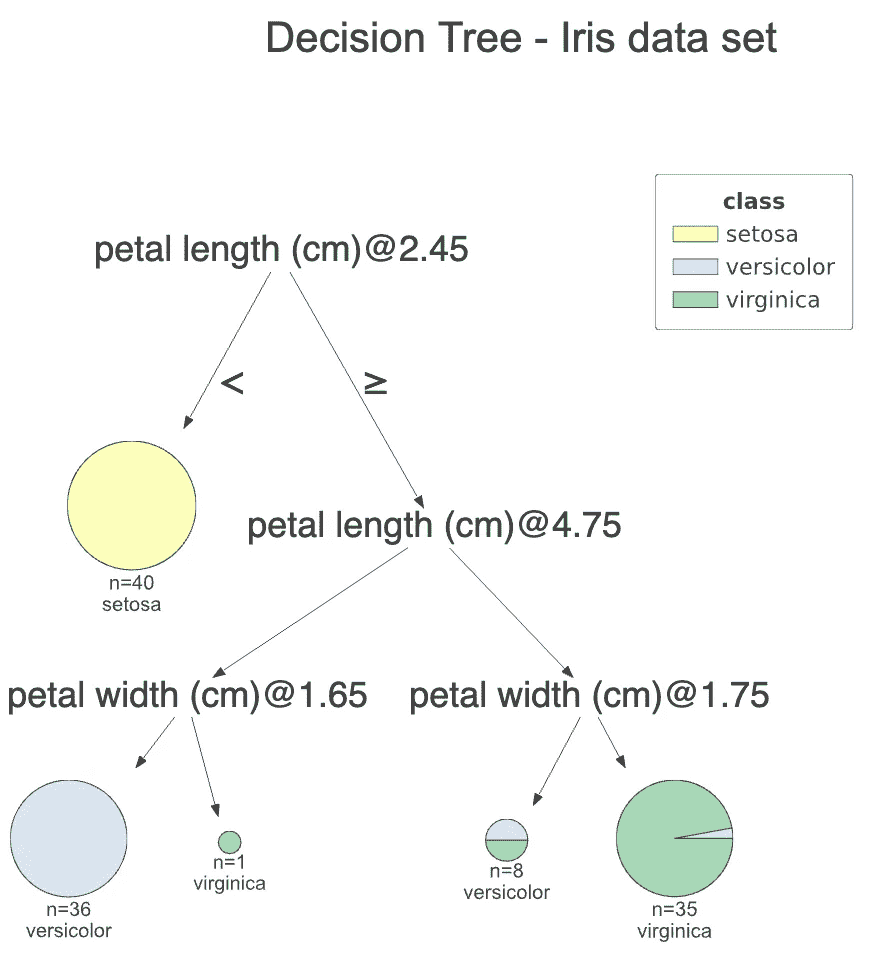
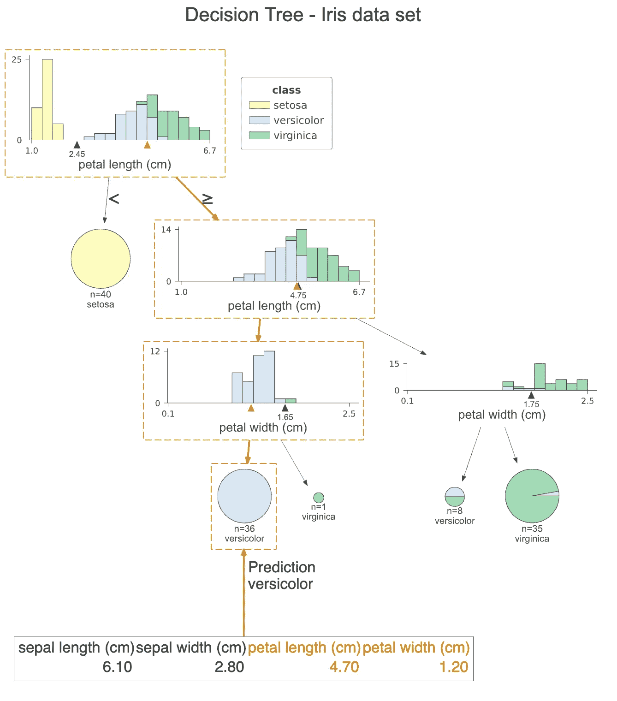
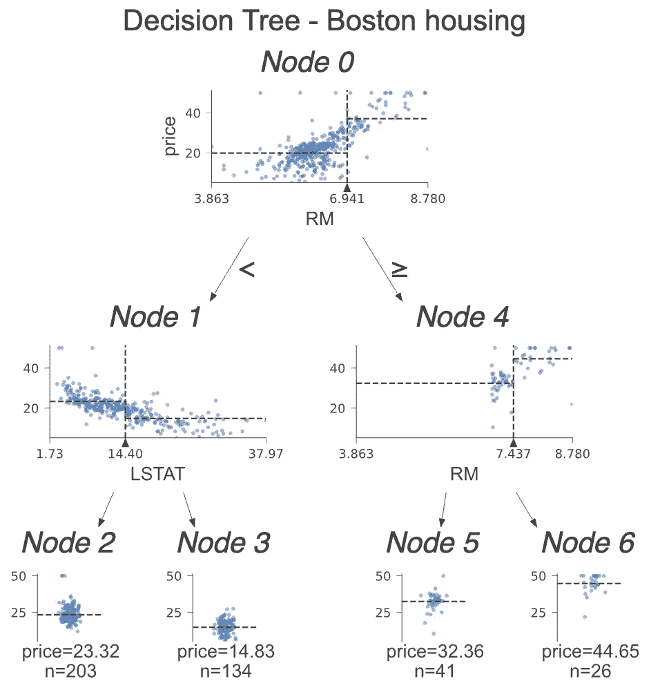
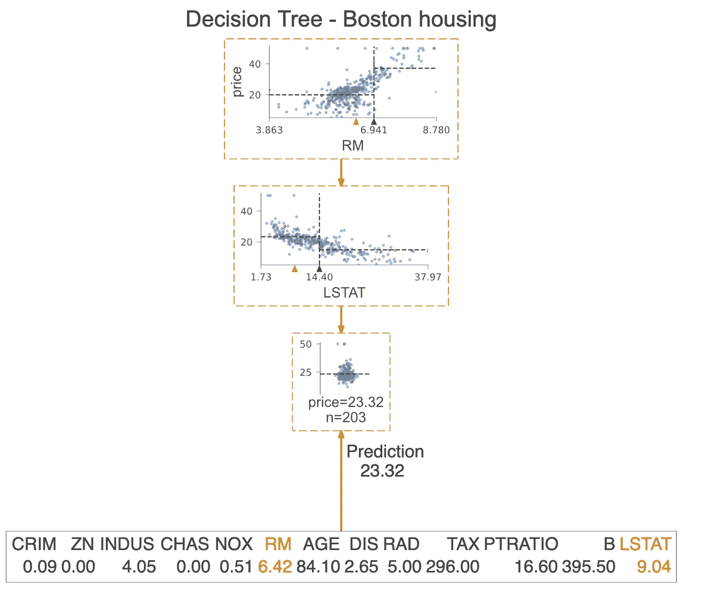

# 用 dtreeviz 实现漂亮的决策树可视化

> 原文：<https://towardsdatascience.com/beautiful-decision-tree-visualizations-with-dtreeviz-af1a66c1c180?source=collection_archive---------9----------------------->

## [入门](https://towardsdatascience.com/tagged/getting-started)

## 改进绘制决策树的旧方法，永不回头！


卢克·理查森在 [Unsplash](https://unsplash.com/s/photos/tree?utm_source=unsplash&utm_medium=referral&utm_content=creditCopyText) 上拍摄的照片

决策树是一类非常重要的机器学习模型，也是许多更高级算法的构建模块，如随机森林或著名的 XGBoost。这些树也是基线模型的良好起点，我们随后会尝试用更复杂的算法对其进行改进。

决策树的最大优势之一是其可解释性——在拟合模型后，它实际上是一组可用于预测目标变量的规则。这也是为什么绘制规则并展示给利益相关者很容易，因此他们可以很容易地理解模型的底层逻辑。当然，前提是树不要太深。

结合使用`scikit-learn`和`matplotlib`，可视化决策树会非常简单。然而，有一个叫做`dtreeviz`的不错的库，它带来了更多的东西，并且创建了不仅更漂亮而且传达了更多关于决策过程的信息的可视化。

在本文中，我将首先展示绘制决策树的“老方法”，然后介绍使用`dtreeviz`的改进方法。

# 设置

和往常一样，我们需要从导入所需的库开始。

然后，我们从`scikit-learn`加载虹膜数据集。我们还将回顾一个回归示例，但我们稍后将加载波士顿住房数据集。

# “老方法”

下一步包括创建训练/测试集，并使决策树分类器适合 Iris 数据集。在本文中，我们只关注可视化决策树。因此，我们没有注意拟合模型或找到一组好的超参数(有很多关于这些主题的文章)。我们唯一要“调整”的是树的最大深度——我们将其限制为 3，这样树仍然可以适应图像并保持可读性。

现在我们有了一个合适的决策树模型，我们可以开始可视化该树。我们从最简单的方法开始——使用`scikit-learn`中的`plot_tree`函数。

```
tree.plot_tree(clf);
```



*作者图片*

好吧，对于一句俏皮话来说还不错。但是可读性不是很好，比如没有特性名(只有它们的列索引)或者类标签。通过运行下面的代码片段，我们可以很容易地改进这一点。



*作者图片*

好多了！现在，我们可以很容易地解释决策树。也可以使用`graphviz`库来可视化决策树，但是，结果非常相似，具有与上图相同的一组元素。这就是为什么我们会在这里跳过它，但你可以在 GitHub 上的[笔记本中找到实现。](https://github.com/erykml/medium_articles/blob/master/Machine%20Learning/decision_tree_visualization.ipynb)

# dtreeviz 正在运行

看过绘制决策树的老方法后，让我们直接进入`dtreeviz`方法。

代码片段基本上是不言自明的，所以我们可以继续看结果。首先，让我们花点时间来承认这是一个多么大的改进，特别是考虑到函数调用非常相似。



*作者图片*

让我们一步一步地检查情节。在每个结点上，我们可以看到用于分割观测值的要素的堆积直方图，并按类进行着色。通过这种方式，我们可以看到各个类是如何被每次拆分所分隔的。值在 x 轴的小三角形是分割点。在第一个直方图中，我们可以清楚地看到 *setosa* 类的所有观测值的花瓣长度都小于 2.45 cm。

树的右边分支表示选择大于或等于分裂值的值，而左边分支表示选择小于分裂值的值。叶节点表示为饼图，它显示叶中的观察值属于哪个类。通过这种方式，我们很容易看出哪个类占多数，因此模型的预测也是如此。

在这张图上我们没有看到的一点是每个节点的基尼系数。在我看来，直方图提供了更多关于分割的直觉，系数的值可能与利益相关者的演示无关。

**注意:**我们也可以为测试集创建一个类似的可视化，我们只需要在调用函数时替换`x_data`和`y_data`参数。

如果您不喜欢直方图，并且想要简化图形，您可以指定`fancy=False`来接收下面的简化图形。



*作者图片*

`dtreeviz`的另一个方便的特性是提高了模型的可解释性，它突出显示了图形上特定观察的路径。这样，我们可以清楚地看到哪些特征有助于分类预测。

使用下面的片段，我们突出了测试集的第一次观察的路径。

该图与前一个非常相似，但是，橙色突出显示清楚地显示了观察遵循的路径。此外，我们可以在每个直方图上看到橙色三角形。它表示给定特征的指示观察值。在最后，我们看到该观察的所有特性的值，用于决策的特性以橙色突出显示。在这种情况下，仅使用两个特征来预测观察值属于*云芝*类。



*作者图片*

**提示:**我们还可以通过设置`orientation=”LR”`将绘图的方向从自上而下改为从左向右。我们没有在本文中展示它，因为对于屏幕较窄的设备来说，图表不会被很好地缩放。

最后，我们可以用简单的英语打印出用于该观察预测的决策。为此，我们运行以下命令。

这样，我们可以清楚地看到这个观察满足的条件。

# 回归示例

我们已经介绍了一个分类示例，它展示了这个库的大多数有趣的功能。但是为了完整起见，我们还看了一个回归问题的例子，以显示这些图是如何不同的。我们使用另一个流行的数据集——波士顿住房数据集。这是一个问题，我们使用一组不同的区域来预测波士顿特定区域内的中值房价。

代码感觉已经差不多了。唯一的变化是我们增加了`show_node_labels = True`。对于较大的决策树来说，这尤其方便。因此，在与一组人讨论情节时，很容易通过节点的编号来指出我们正在讨论的是哪一部分。



*作者图片*

让我们深入分类树和回归树之间的差异。这一次，我们不是查看直方图，而是检查用于分割的特征与目标的散点图。在这些散点图上，我们看到一些虚线。他们的解释如下:

*   水平线是决策节点中左右桶的目标平均值。
*   垂直线是分割点。这与黑色三角形所代表的信息完全相同，但是，它使得比较水平线更容易->更容易将两边分开。

在叶节点中，虚线显示叶内目标的平均值，这也是模型的预测。

我们已经展示了我们可以突出某个观察的决策路径。我们可以更进一步，只绘制用于预测的节点。我们通过指定`show_just_path=True`来做到这一点。下图仅显示了从上面的树中选择的节点。



*作者图片*

# 结论

在本文中，我展示了如何使用`dtreeviz`库来创建优雅且有洞察力的决策树可视化。在使用它一段时间后，我肯定会继续使用它作为可视化决策树的首选工具。我确实相信，使用这个库创建的图对于不每天使用 ML 的人来说更容易理解，并且可以帮助向涉众传达模型的逻辑。

另外值得一提的是，`dtreeviz`支持 XGBoost 和 Spark MLlib 树的一些可视化。

您可以在我的 [GitHub](https://github.com/erykml/medium_articles/blob/master/Machine%20Learning/decision_tree_visualization.ipynb) 上找到本文使用的代码。一如既往，我们欢迎任何建设性的反馈。你可以在推特上或者评论里联系我。

觉得这篇文章有趣？成为一个媒介成员，通过无限制的阅读继续学习。如果你使用[这个链接](https://eryk-lewinson.medium.com/membership)成为会员，你将支持我，而不需要额外的费用。提前感谢，再见！

如果您喜欢这篇文章，您可能还会对以下内容感兴趣:

[](/improve-the-train-test-split-with-the-hashing-function-f38f32b721fb) [## 用哈希函数改进训练测试分割

### 更新数据集时，确保定型集和测试集不会混淆的最佳方法是

towardsdatascience.com](/improve-the-train-test-split-with-the-hashing-function-f38f32b721fb) [](/lazy-predict-fit-and-evaluate-all-the-models-from-scikit-learn-with-a-single-line-of-code-7fe510c7281) [## 懒惰预测:拟合和评估 scikit 中的所有模型——用一行代码学习

### 查看哪些模型最适合您的数据集的最简单方法！

towardsdatascience.com](/lazy-predict-fit-and-evaluate-all-the-models-from-scikit-learn-with-a-single-line-of-code-7fe510c7281) [](/explaining-feature-importance-by-example-of-a-random-forest-d9166011959e) [## 以随机森林为例解释特征的重要性

### 了解 Python 中最流行的确定要素重要性的方法

towardsdatascience.com](/explaining-feature-importance-by-example-of-a-random-forest-d9166011959e) 

# 参考

*   [https://github.com/parrt/dtreeviz](https://github.com/parrt/dtreeviz)
*   [https://explained.ai/decision-tree-viz/index.html](https://explained.ai/decision-tree-viz/index.html#sec:1.5.1)